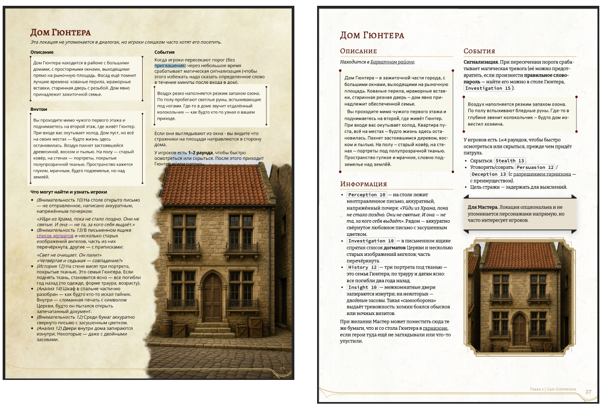
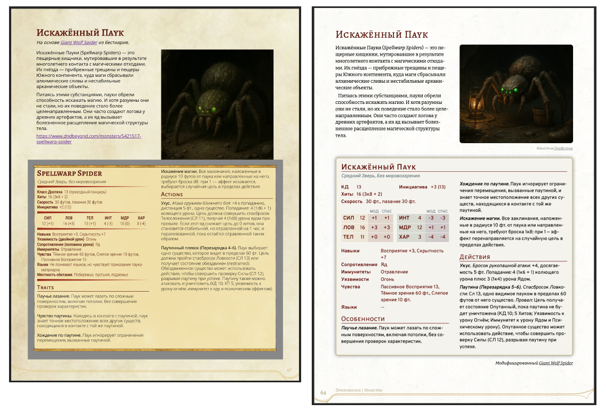

# D&D Flavored Markdown

D&D-Flavored Markdown (DFM) is an extension on top of CommonMark with a minimal set of additions aimed at typesetting
"rulebook/module"-style content for tabletop RPGs and preparing it for PDF output.

## Overview

This is an analogue of what [Homebrewery](https://homebrewery.naturalcrit.com/) does.

When I was typesetting my own adventure there, I ran into several issues:

- No simple way to replace a word across the whole document.
- Heading `id`s are unstable, which means internal links can only reliably use `#p{number}`. Because of that, even with
  extra effort, it's impossible to automatically validate the document for broken links. If you insert an extra page in
  the middle of the module, you have to update all internal links manually.
- No support for Cyrillic fonts. And once you add them, you have to adjust sizes and rework the layout of some blocks.
- There are rendering issues with `descriptive` and `monster` blocks on macOS (see examples below).
- Layout breaks when exporting to PDF in A4 (I live in Europe, and I can live with feet in the game because it's
  fantasy, but I don't want to print in Letter).
- Creating your own theme is painful. For local work you need Docker and MongoDB, and even then it's quite hard to set
  everything up so that you can write custom CSS using an IDE.
- The same applies to local images.

I also wanted to keep the text as Markdown on GitHub and be able to generate a PDF via CLI. Judging by this
[issue](https://github.com/naturalcrit/homebrewery/issues/2824), I'm not the only one.

So I built this engine with:

- page format A4 by default;
- proper Cyrillic support;
- rendering from `.md` files, so you can use linters and an IDE;
- styling roughly matching the 2024 edition of the Players Handbook — simply because I have it.

I didn't add a CLI generator or linters by default, because I don't need them right now.

## What's Next

I'm publishing the code **as is** because I don't have the time or capacity to make it production-ready. Further
improvements are possible only if:

- I keep writing my own adventures;
- or the repository gets **100 stars** on GitHub;
- or I collect **€500** on [PayPal](https://www.paypal.com/pool/9jC9seKdwL?sr=wccr).

## Examples

The adventure source files are in the `content/the-missing-merchant` folder, and you can view the generated PDF here: **[link]()**.

These are screenshots taken on macOS using **Preview**.

**Descriptive Block:** left — Homebrewery; right — D&D Flavored Markdown.

In Homebrewery the layout breaks when there is more than one such block on the page.

**Monster Block:** left — Homebrewery; right — D&D Flavored Markdown.

In Homebrewery there is an issue with the block shadows.

## License

[MIT License](./LICENSE).

This project provides tools and styles for creating tabletop RPG content. It does **not** include or distribute any
copyrighted material from Wizards of the Coast or other publishers. All adventure text, rules text, images, and other
assets rendered with this tool are supplied by the end user, who is solely responsible for having the rights to use and
publish them. “Dungeons & Dragons”, “D&D”, “Player’s Handbook” and all related terms are trademarks of Wizards of the
Coast LLC and are used here for identification and compatibility purposes only. This project is unofficial and not
endorsed, sponsored, or approved by Wizards of the Coast.

## RU

D&D-Flavored Markdown (DFM) — это надстройка над CommonMark с минимальным набором расширений, ориентированных на вёрстку
материалов в стиле «книги правил» или «модуля» для настольных ролевых игр, а также на последующую печать в PDF.

### Описание

Это аналог того, что происходит на [Homebrewery](https://homebrewery.naturalcrit.com/).

Когда я верстал там своё приключение, я столкнулся с рядом проблем:

- Нет простой возможности заменить какое-то слово во всём документе.
- Нестабильные `id` у заголовков, из-за чего для внутренних ссылок нельзя использовать ничего, кроме `#p{number}`. Из-за
  этого даже при должных усилиях невозможно автоматически проверить документ на битые ссылки. Если добавить
  дополнительную страницу в середину модуля, приходится вручную менять все внутренние ссылки.
- Нет поддержки кириллических шрифтов. А когда их добавляешь, приходится подгонять размеры и заново править вёрстку
  отдельных блоков.
- Есть проблемы с отображением блоков `descriptive` и `monster` на macOS.
- Вёрстка «плывёт» при попытке сохранить PDF в формате A4 (я живу в Европе и готов смириться с футами в самой игре,
  потому что это фэнтези, но не готов печатать в формате Letter).
- Создание своей темы оформления — мучение. Для локальной работы нужен Docker и MongoDB, и даже после этого довольно
  сложно настроить окружение так, чтобы писать кастомные CSS-стили с использованием IDE.
- То же касается и локальных изображений.

Кроме того, мне хотелось бы хранить текст в виде Markdown на GitHub и иметь возможность генерировать PDF через CLI. Судя
по [issue](https://github.com/naturalcrit/homebrewery/issues/2824), я не один такой.

Поэтому я сделал этот движок, у которого:

- формат страницы по умолчанию — A4;
- нормальная поддержка кириллицы;
- рендер из `.md`-файлов, значит можно использовать линтеры и IDE;
- стиль примерно как в новой редакции правил — просто потому что она у меня есть.

Я не добавлял сюда CLI-генератор и поддержку линтеров «из коробки», потому что сейчас мне это не нужно.

## Примеры

Исходные файлы находятся в папке `content/the-missing-merchant`, а сгенерированный PDF можно посмотреть здесь: **[ссылка]()**.

Это скриншоты, сделанные на macOS в программе **Preview**.

**Descriptive Block:** слева — Homebrewery; справа — D&D Flavored Markdown.

В Homebrewery вёрстка «плывёт», если на странице больше одного такого блока.

**Monster Block:** слева — Homebrewery; справа — D&D Flavored Markdown.

В Homebrewery есть проблема с тенями у блока.

## Что дальше

Я выкладываю код **as is**, потому что у меня нет времени и возможности довести это до production-ready состояния.
Дальнейшие доработки возможны только если:

- я продолжу писать собственные приключения;
- или репозиторий наберёт **100 звёзд** на GitHub;
- или я соберу **500 евро** на [PayPal](https://www.paypal.com/pool/9jC9seKdwL?sr=wccr) или
  [Boosty](https://boosty.to/zavoloklom/single-payment/donation/754957/target?share=target_link).

## Лицензия

[Лицензия MIT](./LICENSE).

Этот проект предоставляет инструменты и стили для создания материалов настольных ролевых игр. Он не включает и не
распространяет никакие охраняемые авторским правом материалы Wizards of the Coast или других издателей. Весь текст
приключений, правила, изображения и другие ресурсы, создаваемые с помощью этого инструмента, предоставляются конечным
пользователем, который несёт полную ответственность за наличие прав на их использование и публикацию. «Dungeons &
Dragons», «D&D», «Player’s Handbook» и все связанные термины являются товарными знаками Wizards of the Coast LLC и
используются здесь исключительно для целей идентификации и совместимости. Проект является неофициальным и не одобрен, не
спонсирован и не утверждён Wizards of the Coast.
