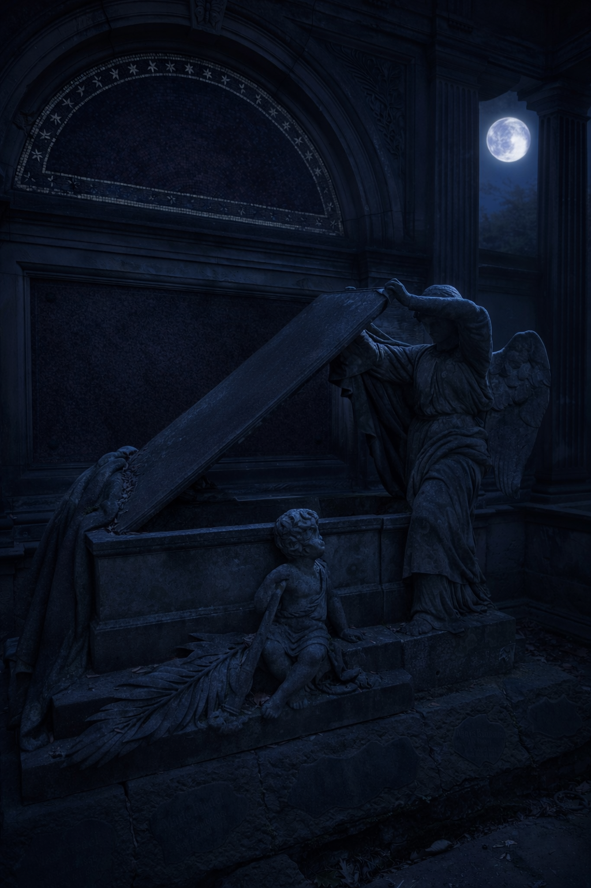

::: page {type="front-cover"}

# Прах к праху

## Полуостров Драгонвинг

{class="diamond-line"}

::: footnote

Приключение на 3-4 игроков 1-3 уровня

ver 1.0.0

:::

::: banner

Азалия

:::

{class="cover"}

::: page {layout="auto"}

# О приключении

## Аннотация

## Описание

Приключение для 3–4 персонажей 1–3 уровня, совместимое с правилами 5-й редакции (2024).

::: definition

**Средняя продолжительность:** 4-6 часов.

**Дополнительные материалы:** [на Google Drive](#) хранятся карты и иллюстрации.

:::

## Примечания

Во время чтения документа вы можете столкнуться с обозначениями, введёнными для удобства и понимания контекста:

> Текст в подобных блоках предназначен для чтения вслух или краткого пересказа игрокам — например, при прибытии в
> локацию или выполнении условий сцены.

Номера страниц в углу позволяют быстро вернуться к оглавлению.

::: column

## Лицензия

В данной работе используется материалы из документа System Reference Document 5.2.1 («SRD 5.2.1») компании Wizards of
the Coast LLC, доступного по адресу https://www.dndbeyond.com/srd. Документ SRD 5.2.1 лицензирован на условиях лицензии
Creative Commons.

В документе есть необязательные ссылки на материалы на D&D Beyond. Эти ссылки приведены только для удобства ведущих.
Содержимое D&D Beyond регулируется условиями сервиса Wizards of the Coast / D&D Beyond, не входит в состав
лицензируемого содержимого этого PDF, не перепродаётся здесь и не требуется для использования данного приключения.

Карты созданы в [Inkarnate](https://inkarnate.com/). Изображения сгенерированы с помощью ChatGPT. Данные материалы
являются авторской работой и не входят в состав содержимого SRD 5.2.

Приключение оформлено с помощью [D&D Flavored Markdown](https://github.com/zavoloklom/dnd-flavored-markdown).

© 2026 [Сергей Куплетский](mailto:s.kupletsky@gmail.com). Все права защищены.

::: page {layout="auto"}

# Ключевые моменты

Приведённая ниже информация является основой сюжета этого приключения.

Сан-Сопригаль. Герои присутствуют на похоронах и к ним обращаются за помощью.

Зловещая порча. Персонажи обнаруживают, что поразившая лес вокруг кладбища болезнь носит сверхъестественный характер.

Адская гончая. Персонажи выясняют, что виновником порчи стала адская гончая, которая застряла в этом плане. Группа
должна победить гончую.

Нежить на кладбище.

Ключевые ПМ:

- Селина Строгая (настоятельница Храма) - Клерик - Город
- Герман Элквин (библиотекарь) - Простолюдин (Средний) - Город
- Лисса Травница - полуэльф Друид - Хижина друида

Стат блоки:

- Волк Cr 1/4- https://www.dndbeyond.com/monsters/4775850-wolf
- Дикий волк Cr1 - https://www.dndbeyond.com/monsters/4775812-dire-wolf
- Адская гончая Cr3 - https://www.dndbeyond.com/monsters/5195071-hell-hound
- Мутировавший волк (надо написать)
- Зомби https://www.dndbeyond.com/monsters/4775851-zombie
- Скелет https://www.dndbeyond.com/monsters/4775841-skeleton
- Скелеты крыс [Skeletal Rats] (кастом)

::: page {layout="auto"}

# Предыстория Короткая

Около десяти лет назад в город Сан-Сопригаль переселился маг по имени Моандер. Он обладал действующей магической
лицензией и открыто жил среди горожан, выполняя заказы и иногда помогая городскому совету. Моандер не скрывал, что
является магом, однако не раскрывал свою специализацию; о том, что он практиковал некромантию, в городе не знали.

Два года назад неподалёку от городского кладбища открылся демонический разрыв. Через него в регион проникло ограниченное
число демонов, которые взяли Сан-Сопригаль в осаду. В течение нескольких дней город находился под постоянным давлением,
а защитники несли серьёзные потери. Моандер намеревался полностью запечатать разрыв, однако у него не было времени на
подготовку полноценного ритуала. Вынужденный действовать немедленно, он поднял мёртвых на кладбище.

Поднятая нежить атаковала демонов с тыла, в основном ночью и вне поля зрения защитников города. Для большинства горожан
перелом в осаде выглядел внезапным: демоны начали отступать и вскоре были уничтожены. Немногие рассказы о странных
силуэтах за пределами стен не получили подтверждения и со временем были сочтены домыслами.

Получив краткую передышку, Моандер приступил к ритуалу закрытия разрыва. Он попытался запечатать проход полностью, но
заклинание было завершено в спешке и в условиях крайнего истощения. В результате разрыв перестал функционировать, однако
его остаточный резонанс сохранился и оказался связан с демоническими сущностями, уже прошедшими через него. Центральным
якорем ритуала стал посох Моандера. Завершение заклинания полностью истощило мага, и он погиб на месте. Его скелет до
сих пор находится на кладбище, сидя на одном колене и сжимая посох, от которого продолжает исходить подавляющая энергия.

Нежить не была распущена и стала частью нестабильной защитной системы. Она не проявляет агрессии к живым существам, не
покидает кладбище и немедленно атакует всё, что имеет инфернальное происхождение. Кроме того, она охраняет посох. Если
посох будет уничтожен или вынесен за пределы кладбища, заклинание распадётся, и вся нежить немедленно погибнет.

Хотя почти все демоны были уничтожены, одна адская гончая уцелела. Она не успела вернуться через разрыв до его закрытия
и оказалась запертой на Материальном плане. Гончая медленно истощается и инстинктивно чувствует место, где когда-то
находился путь домой, но не может приблизиться к кладбищу из-за подавляющего действия ритуала. Её присутствие постепенно
отравляет окружающий лес, искажавая животных и порождая кристаллические наросты — проявления остаточного инфернального
влияния.

Жители Сан-Сопригала никогда не знали истинной роли Моандера и нежити в спасении города. Со временем в их памяти
закрепилась упрощённая версия событий: осада закончилась, маг вскоре умер, а на кладбище появилась опасная нежить. В
отсутствие ясного объяснения нежить стала восприниматься исключительно как угроза, и тела умерших начали сжигать.

Герои прибывают в регион в момент хрупкого равновесия. Пока посох остаётся на месте, защитное заклинание продолжает
подавлять инфернальный резонанс. Если же эта защита будет нарушена, остаточный фон усилится, заражение распространится
на кладбище, а адская гончая получит шанс приблизиться к месту разрыва и предпринять последнюю попытку вернуться домой.

::: page {layout="auto"}

# Предыстория Длинная

Можно перенести из прошлого приключения

- Полуостров Драгонвинг
- Сан-Сопригаль
- Вторжение демонов

## Поехали

Около десяти лет назад в город Сан-Сопригаль перебрался маг по имени **Моандер**. Он не скрывал своего ремесла: у него
была официальная лицензия, и в городе его знали как чародея, полезного и замкнутого. Моандер жил среди горожан, принимал
заказы, иногда помогал советом и никогда не афишировал свою специализацию.

Два года назад неподалёку от городского кладбища произошёл разрыв. Он открылся внезапно и не выглядел как нечто
грандиозное, но оказался достаточным, чтобы в окрестности проникли демоны, которые взяли город в осаду. В течение
нескольких дней демоны давили снаружи, не вступая в решающую атаку, будто проверяя оборону и выматывая защитников.
Стража несла потери, припасы подходили к концу, страх нарастал.

В эти дни Моандер понял, что город не выстоит и решил действовать самостоятельно. Не поставив в известность власти
города, он использовал ритуал, подняв мёртвых на городском кладбище. Ночью, со стороны кладбища, на демонов обрушилась
атака, которую почти никто не видел. Для защитников города всё выглядело как внезапный перелом. Демоны отступили, понеся
тяжёлые потери, и вскоре были добиты. Лишь немногие свидетели упоминали странные силуэты и бесшумные атаки за пределами
стен, но эти рассказы не получили распространения. Большинство же считало, что демоны дрогнули сами, не выдержав
сопротивления.

Получив краткую передышку, Моандер приступил к главному ритуалу. Он пытался полностью запечатать разрыв, однако
заклинание было завершено в спешке и в условиях крайнего истощения. В результате разрыв был закрыт лишь частично. Проход
между планами перестал функционировать, но его остаточный резонанс сохранился и оказался связан с теми демоническими
сущностями, которые уже успели пройти через него.

Центральным элементом ритуала стал посох Моандера, служащий якорем заклинания и источником подавляющей энергии.
Завершение ритуала полностью истощило мага. Моандер погиб на месте и остался в позе завершения заклинания: его скелет до
сих пор сидит на одном колене на кладбище, сжимая посох, от которого продолжает исходить магическая энергия.

Поднятая нежить не была распущена. Она стала частью аварийно работающей защитной системы, связанной с посохом и
территорией кладбища. Эти мертвецы:

- не проявляют агрессии к живым существам;
- не покидают кладбище;
- немедленно атакуют всё, что имеет инфернальное происхождение;
- защищают посох и место ритуала.

Если посох будет уничтожен или вынесен за пределы кладбища, заклинание распадётся, и вся нежить немедленно погибнет.

Хотя почти все демоны были уничтожены, одна адская гончая уцелела. Она не успела вернуться через разрыв до его закрытия
и оказалась запертой на Материальном плане. Остаточный резонанс разрыва позволяет ей чувствовать место, где когда-то
находился путь домой. Однако приблизиться к кладбищу она не может: подавляющее поле, создаваемое посохом и нежитью,
причиняет ей вред.

Гончая медленно истощается в этом мире. Чтобы выжить и сохранить остаточную связь с разрывом, её присутствие начало
отравлять окружающий лес. Звери стали агрессивными, а в почве и на их телах появились кристаллические наросты — якоря
инфернального влияния.

Со временем жители Сан-Сопригала забыли истинные причины своего спасения. Осталась лишь видимая проблема — нежить на
кладбище. Тела умерших начали сжигать, опасаясь, что мёртвые восстанут. Моандер запомнился как странный, но полезный
маг, а его истинная роль в событиях двухлетней давности была утрачена.

::: page {layout="auto"}

## Сколько куда идти

24 мили за 8-часовой день

Темп и расстояние:

- Быстрый (4 мили/час): -5 к пассивному Восприятию.
- Обычный (3 мили/час): Стандартный режим.
- Медленный (2 мили/час): Можно скрываться.

24 мили до кладбища

12 миль до друида

# Музыка

- Похороны - https://www.youtube.com/watch?v=3nsyBktjdYs
- Путешествие - https://www.youtube.com/watch?v=fIH24cYfQCw
- Бой у Хижины - https://www.youtube.com/watch?v=n8bmE76sETo
- Бой у Хижины - https://www.youtube.com/watch?v=morqY2DkGuk

::: page {layout="auto"}

# What the characters know

Город Сан-Сопригаль пережил тяжёлые времена около двух лет назад. В окрестностях города появились демоны, и в течение
нескольких дней Сан-Сопригаль находился в осаде. Демоны были в итоге отбиты, а затем уничтожены, после чего угроза
исчезла так же внезапно, как и появилась. Большинство жителей считает, что город устоял благодаря усилиям стражи и
удачному стечению обстоятельств.

После этих событий неподалёку от города, на кладбище, появилась нежить. Она не покидала его пределы и не нападала на
живых, но само её существование вызывало страх. Со временем горожане перестали хоронить умерших в земле и начали сжигать
тела, опасаясь, что мёртвые могут восстать. Кладбище считается опасным местом, куда стараются не ходить без крайней
необходимости.

Маг по имени Моандер жил в городе задолго до осады. Все знали, что он был лицензированным магом и иногда помогал городу,
однако после осады он вскоре умер. В памяти жителей Моандер остался странным, но полезным чародеем. О том, что он мог
быть связан с нежитью или событиями осады, никто достоверно не знает.

В последние месяцы в лесах вокруг Сан-Сопригала происходят тревожные изменения. Звери стали агрессивными, иногда
нападают без причины, а на их телах и в почве находят странные кристаллические наросты. Охотники и лесники говорят, что
лес «болеет». Некоторые отмечают, что животные будто бы избегают кладбища, хотя раньше такого не наблюдалось.

Жители обеспокоены, но не видят связи между этими событиями. Для них проблемы выглядят разрозненными: опасное кладбище,
больной лес и воспоминания о давней осаде. Именно поэтому они готовы заплатить тем, кто сможет разобраться хотя бы с
одной из этих бед.

::: page {layout="auto"}

# Глава 1: Похороны

Деревянные носилки выставлены в центре площади. На них лежат те, кто не пережил эту ночь. Лица скрыты белыми саванами,
но даже через ткань можно узнать очертания брата Овсянки: фигура неподвижно покоится среди павших.

Собравшиеся жители Сан-Сопригаль стоят молча, без слёз и молитв, с усталыми, тяжёлыми лицами. Кто-то стискивает в руках
погребальные символы, кто-то отводит взгляд. Вы испытываете чувство неправильности происходящего. В Империи людей
хоронят не так. Так поступают только маги.

Селина возносит молитвы, зажигает масло, и первый язык пламени облизывает высушенные доски. Запах ладана смешивается с
дымом, в небе кружат птицы. Кто-то шепчет слова прощания, кто-то утирает слёзы, но большинство просто молчат.

Юон (алкаш в храме) подходит к Бертраму.

Гюнтер стоит вместе с Марией в обнимку.

Чуть в стороне от остальных стоит Йонас. Люди обходят его по широкой дуге, словно опасаясь даже встретиться взглядом. В
его сторону не бросают обвинений и не шепчутся вслух, но это молчаливое осуждение ощущается сильнее любых слов. Он
смотрит на костёр дольше других и не делает попыток приблизиться. Лишь один горожанин подходит к нему — сухощавый
пожилой мужчина с растрёпанными седыми волосами и круглыми очками. Они обмениваются несколькими тихими фразами, слишком
короткими, чтобы разобрать слова.

Когда пламя окончательно охватывает тело, Хурган негромко произносит слова прощания, и становится ясно, что это не
исключение и не разовая мера, а установленный порядок, к которому жители так и не смогли привыкнуть.

::: page {layout="auto"}

# Глава 1: Похороны

Перед тем как покинуть Сан-Сопригаль, персонажи могут пообщаться с жителями города и собрать разрозненную информацию. Ни
один из горожан не обладает полной или достоверной картиной событий, а представления о прошлом формируются из слухов и
неполных воспоминаний.

## Горожане на похоронах

На похоронах горожане выглядят подавленными, но не напуганными. В воздухе чувствуется усталость и глухое недовольство.
Сжигание тел считается неправильным и противоестественным обычаем; многие открыто говорят, что так поступают лишь маги
или еретики. Тем не менее этот обычай стал повседневной необходимостью, так как после осады демонов кладбище стало
«нечистым местом». Даже тех, кто героически погиб при осаде пришлось сжечь. Одни утверждают, будто видели, как мертвец
преследовал кого-то у кладбища, или даже что там кто-то погиб. Ни одно из этих утверждений не подтверждается, и ни один
рассказ не совпадает с другим.

### Слухи в городе

Помимо прямых разговоров персонажи могут услышать в городе разрозненные слухи. Одни утверждают, что нежить уже убивала,
другие настаивают, что она опасна лишь если её потревожить. Время от времени всплывает и имя друидки, которую давно не
видели в городе; говорят, что она бродит по лесу и твердит о каком-то проклятии. Ни один из этих слухов не может быть
подтверждён в пределах города.

- «Говорят, нежить кого-то убила… но никто не знает кого именно».
- «Мёртвые вроде бы не трогают живых, если их не беспокоить».
- «Маг жил тут долго. После его смерти всё и началось».
- «Друидка давно не показывалась в городе. Всё время в лесу бродит».
- «Она говорит, что лес проклят. Может, с ума сошла, а может — нет».

## Селина

Селина, настоятельница местного Храма, сохраняет спокойствие и твёрдость. Она подчёркивает, что страх не охватил город,
но происходящее подрывает устои и традиции. Она рассказывает, что о нежити на кладбище узнали вскоре после демонического
вторжения, когда город попытался похоронить погибших защитников. Селина знает лишь то, что нежить не покидает кладбище и
что причины её появления никому не ясны. Она просит персонажей разобраться с этой проблемой, чтобы вернуть умершим
достойный покой, и признаёт, что сама не понимает, что именно произошло. Если разговор заходит о прошлом, Селина
советует обратиться к Герману, который собирал свидетельства очевидцев.

## Герман

Герман, библиотекарь и летописец города, говорит осторожно и взвешенно. Он ведёт черновую летопись Сан-Сопригала и
хранит в библиотеке книги, уцелевшие после пожара в доме Моандер. Герман подтверждает, что Моандер жил в городе почти
десять лет, имел действующую магическую лицензию и умер во время осады (хотя его тело так и не опознали). Его дом
сгорел, а книги которые там были Герман забрал в библиотеку. Осаде демонов предшествовали странные магические явления.
Он подчёркивает, что осада закончилась слишком резко и необычно, перелом в осаде был внезапным и плохо задокументирован:
«Есть странный разрыв в описании осады… слишком резкий перелом». Герман слышал слухи о том, что во время осады «мёртвые
вставали и атаковали демонов», но подчёркивает, что не имеет доказательств и считает это неподтверждёнными рассказами
очевидцев («Я записываю всё, но не всему верю»).

## Хурган

Если персонажи разговаривают с Хурганом, главой города, они сталкиваются с прямолинейным и прагматичным человеком. Его
не интересуют лесные странности и разговоры о проклятиях — для него существует лишь одна проблема: кладбище. Хурган
признаёт, что ранее уже нанимал людей, чтобы разобраться с нежитью, но те не вернулись, и теперь считаются пропавшими.
Он предлагает вознаграждение и поддержку властей тем, кто сумеет быстро и окончательно решить вопрос, ясно давая понять,
что его не волнуют причины происходящего, а только результат.
