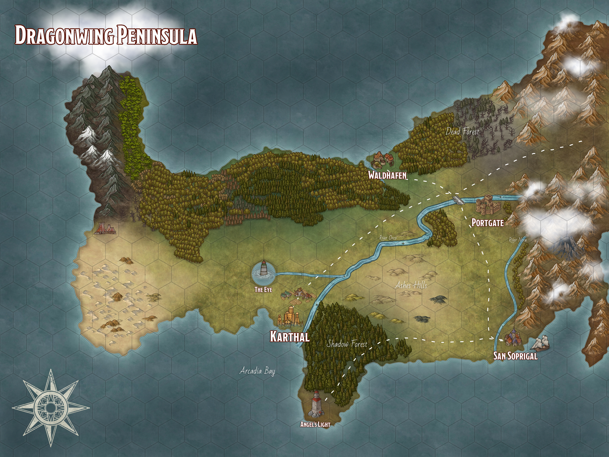
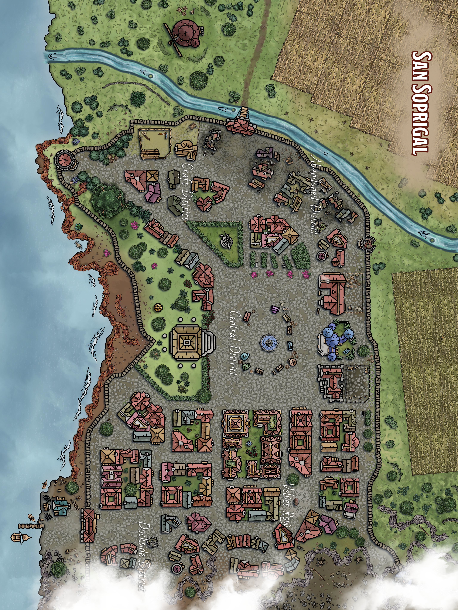

::: page {type="front-cover"}

# The Missing Merchant

## Dragonwing Peninsula

{class="line"}

::: banner

Sergey Kupletsky

:::

::: footnote

Adventure for 3–4 characters (level 1–3)

ver 4.0.0

:::

{class="cover"}

::: page {layout="auto"}

# About the Adventure

## Summary

San Soprigal is a sleepy coastal town. This morning, everything changed: a beloved merchant has vanished. The garrison
commander has locked down the gates until the truth comes out.

You didn’t come here to play detective, but the town’s knot of lies, rumors, and secrets pulls you in. Every lead can
misdirect you, and a wrong accusation could spark fresh tragedy.

## Overview

A D&D (2024) adventure for 3–4 characters of levels 1–3.

::: definition

**Estimated runtime:** 10–16 hours.

**Setting:** San Soprigal (a contained, closed-town scenario). The world Azalia takes inspiration from _Might & Magic X_
and Terry Pratchett’s _Discworld_.

**Genres:** investigation-forward, roleplay-heavy, light on combat.

**Supplemental materials:** maps and illustrations are available on
[Google Drive](https://drive.google.com/drive/folders/1M9Ycx8IsTqvq3P1-V3OpA_76lOto1ABy).

:::

## Notes

As you read, you’ll see markings used for clarity and context:

> Text in blocks like this is meant to be read aloud (or briefly paraphrased) to the players—for example, when they
> arrive at a location or when a scene’s conditions are met.

The page numbers in the corner allow you to quickly return to the table of contents.

::: column

## License

All references to Dungeons & Dragons and related materials are the property of Wizards of the Coast. This material is
not an official product and is not supported or endorsed by Wizards of the Coast. All trademarks and copyrights related
to Dungeons & Dragons belong to their respective owners.

This material is for personal use only and not for commercial distribution.

The adventure is designed using [DnD Flavored Markdown](https://github.com/zavoloklom/dnd-flavored-markdown). All images
were generated with ChatGPT.

Author — [Sergey Kupletsky](mailto:s.kupletsky@gmail.com).

<!-- prettier-ignore -->
{class="absolute-bottom-right mask mask--watercolor-03" style="height:700px; width: 400px; bottom: 60px; object-position: center -100px;"}

::: page {show-page-number="false"}

# Contents

::: toc

- [About the Adventure](#about-the-adventure)
- [Introduction](#setting-and-constraints)
  - [Setting and Constraints](#setting-and-constraints)
  - [Backstory](#backstory)
  - [Story Overview](#story-overview)
  - [Advice for the DM](#advice-for-the-dm)
  - [Dragonwing Map](#dragonwing-map)
- [Chapter 1: Arrival](#adventure-hook)
  - [Adventure Hook](#adventure-hook)
  - [Arrival in Town](#arrival-in-town)
- [Chapter 2: San Soprigal](#san-soprigal-map)
  - [San Soprigal Map](#san-soprigal-map)
- [Chapter 3: Catacombs](#)
- [Chapter 4: Conclusion](#)
- [Appendix: NPC](#)
- [Appendix: Magic Items](#)
- [Appendix: Monsters](#)
- [Appendix: States and Organizations](#appendix-states-and-organizations)
- [Appendix: Pantheon](#appendix-pantheon)
- [Appendix: Month Names](#appendix-month-names)
- [Appendix: Town Map for Players](#appendix-town-map-for-players)
- [Appendix: Music and Generators](#)

:::

::: page {footnote="Introduction"}

# Setting and Constraints

## World Overview

The world of Azalia is sealed by ancient wards that isolate it from the outer planes. There is no contact with gods,
patrons, or any other external powers.

If the wards destabilize or break, ways to other planes open—leading to demonic incursions and magical anomalies.

People in this world don’t know about wards and gods. They blindly worship angels.

## Magic

All practitioners of magic must hold a permit to reside in the Holy Empire or a **license for Magical Practice**.

Any unsanctioned magic leads to interrogation, arrest, or execution.

Attempts to use magic tied to other planes (_plane shift_, _gate_, _summon fiend_, _contact other plane_, etc.) may have
catastrophic effects, or the spell simply fails.

## Species of the Holy Empire

::: definition

**Humans** — the primary species; they hold leading positions.

**Dwarves, gnomes, and halflings** — tolerated yet considered “outsiders.” Trusted with craft and trade, but kept at
arm’s length.

**Orcs and goliaths** — seen as cheap labor and hire-swords. In any conflict, blame usually falls on them.

**Drow and half-elves** — face open hostility. Violence against them often goes unpunished.

**Elves** — feral, living in the forests (not a playable species).

**Tieflings** — the result of mages experimenting with demonic blood over the last two years. Unknown to anyone but
their creators. You may play a tiefling who somehow escaped. An unmasked tiefling will likely be taken for a demon and
attacked on sight.

**Aasimar** — humans bearing an implanted angelic soul (they don’t know this). Innate powers are restricted: in a
critical moment, they may manifest involuntarily if the character fails a DC 15 Wisdom saving throw. The more often
these powers are used, the stronger the angel’s influence grows (control passes to the DM).

**Dragonborn** — absent (not a playable species).

:::

## Class Restrictions

::: definition

**Warlocks.** Standard patrons (like Fiend, Archfey, Great Old One) are unavailable. Possible adaptations include an
internal source of power, planar anomalies, or ancient artifacts.

**Clerics & Paladins.** Their magic works through faith in an angel (see [Appendix: Pantheon](#appendix-pantheon)),
usually without a direct reply.

**Wizards & Sorcerers.** Must conceal their practice or obtain legal status.

:::

<!-- prettier-ignore -->
{class="mask mask--background-bottom-third-02" style="object-position: center 110%; object-fit: contain; bottom: -25px;"}

::: page {layout="left" footnote="Introduction"}

# Backstory

## The Dragonwing Peninsula

**Dragonwing** is a peninsular protectorate: formally subject to the **Holy Empire** (see
[Appendix: States and Organizations](#appendix-states-and-organizations)) yet effectively pushing for
independence—especially after the central authority failed to protect the peninsula’s cities from a demon incursion.

Representatives of the Holy Empire are met with suspicion here, and at times with open hostility.

## San Soprigal

**San Soprigal** is an old coastal town on the Empire’s frontier, within the Dragonwing Peninsula.

It was once a key stop on trade routes, thriving on commerce, fishing, and—if rumors are to be believed—smuggling. Wars,
economic decline, and tighter imperial control took their toll; these days, dignitaries and trade caravans rarely bother
to visit.

## The Demon Incursion

About _two years ago_, demonic forces overran the countryside around San Soprigal, cutting the town off from the outside
world and laying it under siege. Contact with other cities ceased, and no help arrived.

After a month, the demons vanished as suddenly as they had appeared. Only scattered bands remained, and the town guard
suppressed them quickly.

Many died during the siege, including the mayor, **Stor Sulim**; **Jonas’s grandfather**; and the entire **Günter**
family.

After the mayor’s death, the guard commander, the half-orc **Hurgkhan**, assumed leadership of the town. He retained
military command and stayed in the garrison, repurposing the town hall as a public library.

The siege left deep scars: faith in the angels has faltered (though few will say so aloud), fear and distrust linger,
much of the guard was lost, and trade routes grew more perilous. The town seemed destined for ruin, but Hurgkhan
restored order. San Soprigal now goes about its daily life again—though the fears and wounds of the past have not
healed.

<!-- prettier-ignore -->
{class="mask mask--background-right-half" style="object-position: 50px center;"}

<!-- prettier-ignore -->
[//]: # (Rumor holds that, in the siege’s final days, the dead rose and fought alongside the living. The Church forbids any discussion of these tales and condemns them as heresy.)

::: page {footnote="Introduction"}

# Story Overview

Below is the chronology of events. On first mention, character names link to their writeups in
**[Appendix: Characters](#appendix-characters)**.

For the names of Azalia’s months, see **[Appendix: Month Names](#appendix-month-names)**.

## Arrival of the Mage

_3 Narvail (February)_

- A necromancer, **[Abraham](#)**, arrives in town. He previously conducted forbidden experiments with spiders in the
  [United States of Magic Art](#appendix-states-and-organizations) and is now in hiding, hoping to continue his research
  in seclusion.
- He rents a house from **[Jonas](#)** (the grandson of a smuggler), pays a year in advance, and moves in. Abraham knows
  about this house—and the passage—through old contacts: a fellow necromancer once lived in the town. Jonas doesn’t know
  about the secret passage into the catacombs.
- Abraham places an order with his smuggler contacts in [Black Meduza](#appendix-states-and-organizations) for
  “goods”—his custom-bred spiders.
- He locks himself in the cellar and doesn’t show his face around town. Rumors spread that he’s a mage.

## Maria & Abraham

_Narvail (February)_

- **[Maria](#)**, an incense merchant, supplied Abraham with ingredients needed for his spider venom experiments.
- Abraham paid in advance and asked for discretion.
- In thanks, he gave Maria a [scroll with a simple spell](#) and instructions.
- The following month he didn’t place an order, and Maria didn’t find that unusual.

## Arrival of Rosa

_1 Bethalasse (March)_

- **[Rosa](#)** (a paladin of the [Church of Light](#appendix-states-and-organizations)) arrives in San Soprigal and
  keeps the purpose of her visit secret. She refuses to recognize local authority and acts under a covert mandate.
- She lodges at the [Temple](#town-map) and periodically leaves town for several days at a time.
- Her mission is to investigate recent attacks on merchants in the region and to recover a stolen church relic.

## The Delivery

_1 Bethalasse (March)_

- Smugglers **[Peter](#)** and **[Boshir](#)** bring contraband and crates of spiders to the cove beneath the town.
- That evening, posing as traders, they drink in the tavern, hit on Rosa, and start a brawl.
- At night they descend into the catacombs to unload the boat. A large crate slips and breaks. The starving spiders
  attack and kill them both.
- Their room still contains the “trader” clothing they used as a cover. When the innkeeper **[Helmut](#)** realizes the
  guests are gone, he hands the clothes to the server **[Kenki](#)**.
- The next day, with no men or cargo arriving, Abraham goes into the catacombs himself. The spiders kill him as well.
- The guard doesn’t search for Peter and Boshir: their papers mark them as ordinary merchants who often leave without
  fanfare.

## Maria & Günter

_Narvail–Lothviel (February–April)_

- Maria secretly meets **[Günter](#)**—a town guard—on the [Watchtower](#town-map) during his night shifts.
- Günter becomes obsessed with tying the disappearances to Rosa, whom he assumes is an inquisitor.
- His paranoia rubs off on Maria. She avoids Rosa and stops visiting the Temple, though she once went often.
- After Rosa’s arrival—and under Günter’s influence—Maria fears arrest for studying in magic.
- Tensions rise, and Maria and Gunther have a conflict.

::: page {footnote="Introduction"}

## Two Weeks Ago

_Early Lothviel (April)_

- The Spider-Matriarch lays eggs and primes to drag any prey below ground.
- At night, **[Bertram](#)** (a local drunk) falls into an old well in the [Abandoned District](#town-map) that opens
  into the catacombs and is killed by spiders. No one looks for him—they assume he went on another bender and left town.
- **[Children](#)** used to sneak off to play in the Abandoned District, but after they began hearing “strange sounds,”
  they stopped going there.
- Relocating their games to the [Craft District](#town-map), the children break a window in
  [Abraham’s house](#town-map). Jonas learns his lodger is gone, but he doesn’t inform the guard—he fears unwanted
  attention and prefers to assume the mage moved on.

## Maria’s Disappearance

_12 Lothviel (April), Tuesday_

- After talking with her friend **[Karra](#)**, Maria decides to end things with Günter—but puts off the conversation.
- In advance, Günter swaps shifts with a day guard, cleans the tower, and prepares to propose to Maria at sunset.
- Maria heads for the tower, but when she spots Rosa returning to town, she detours into the Abandoned District to avoid
  her.
- At [the old well](#town-map), Maria notices a strange smell. She steps closer, and the starving spiders drag her down.
  Trying to fend them off with a spell, she collapses the old masonry and the shaft caves in.
- Günter waits for Maria, grows anxious, but doesn’t abandon his post.
- Smuggler **[Gaston](#)** arrives in town, searching for a casket that Peter and Boshir were supposed to deliver. That
  night he tries to reach [the cove by the sea (label 11 on the map)](#town-map), but sailors spot him, and he retreats.

## Maria Is Reported Missing

_13 Lothviel (April), Wednesday_

- In the morning, Günter finds Maria’s shop closed and no one answering at her home. He convinces garrison commander
  **[Hurgkhan](#)** to force the door and open an investigation.
- Hurgkhan locks down the town for the duration of the investigation to maintain order and control departures. It’s a
  good chance to remind the townsfolk who’s in charge and to show he’s on top of his duties. He believes Maria will turn
  up within a few hours.
- The **adventurers** arrive in San Soprigal.

<!-- prettier-ignore -->
{class="mask mask--background-bottom-third-01" style="object-position: center bottom; object-fit: contain;"}

::: page {footnote="Introduction"}

# Advice for the DM

This is a mystery-first adventure: its core is social interaction and investigation, not combat. Don’t turn every
conversation into a die roll—the party’s success should depend on **who** they ask, **when**, and **about what**.

NPCs shift their attitude because of leverage, not eloquence: the party can present a clue, name a name, or catch a
contradiction. A Persuasion check amplifies leverage that already exists.

When searching locations, the more precise the question, the lower the DC. Grant advantage for relevant clues and sound
methods. On a failure, allow partial success at a cost (time, noise, suspicion).

Stay flexible. If the party forms a reasonable hypothesis, confirm it with a minor clue in the next location or
scene—even if it wasn’t originally there.

## Session Prep

Before play, ask players to define why their characters are willing to help with the investigation (duty, reward, a
mentor’s request, etc.), and how they met one another—or how they’re connected to their mentor, **Jared**.

## Hints & Suspects

The party’s initial suspects in the disappearances will likely be **Günter** and **Rosa**. If you notice them focusing
suspicion elsewhere (for example, on **Hurgkhan**), support their line of thinking—let the investigation move from the
players’ hypotheses.

If the party stalls, you can nudge them via members of the town guard or **Gaston**, who also wants access to the
catacombs.

## World Reaction

You determine how much in-game time scenes and travel take. Let the players know that time is passing in town, and
gently hint that delay will have consequences.

Below is an example of how events may unfold if the heroes don’t intervene.

### Day One

_13 Lothviel (April), Wednesday_

- Günter prepares and posts missing-person flyers for Maria across town.
- **Hurgkhan vs. Rosa:** Rosa tries to leave town; guards stop her at the gate.
- A volunteer search party forms to look for Maria.
- That night, Gaston breaks into Abraham’s house, spots spiders in the catacombs, and withdraws.

### Day Two

_14 Lothviel (April), Thursday_

- **Maria dies in the catacombs** if she has not been rescued.
- Gaston may approach the heroes, asking them to escort him into the catacombs.
- By evening, volunteers find signs of a struggle at the old well and inform Hurgkhan.
- On learning about the spiders, Hurgkhan musters a guard squad and descends into the catacombs. The guard assaults the
  tunnels and destroys the spiders. Of the entire squad, only Günter returns.
- The town mourns Hurgkhan; the immediate threat is removed.

## Combat Scenes

Fights in the catacombs should be tense but fair. Run them so that using the environment is profitable for the players
(fire, webs, chokepoints, etc.).

## What Comes Next

You can run this as a one-shot or as a prologue to a campaign. Hooks for longer arcs are seeded in NPC writeups and
dialogue—use them as needed, or ignore them:

- A dragon-hunt in the mountains on behalf of **Duncan**.
- Exploring ruins on the peninsula at the request of **Jassad**.
- A joint investigation with **Rosa** into the attacks on merchants.

::: page {footnote="Introduction"}

# Dragonwing Map

::: wide

{class="framed-map"}

:::

## Map Overview

This map is for orientation only: to show where **San Soprigal** sits and how it relates to other places on the
peninsula. In this adventure, the characters **do not leave the town**, so the map contains no plot hints and has no
mechanical use.

Show it once at the beginning to set scale and mood. One hex - 12 miles.

Karthal, Portgate, and other locations are for the future—as campaign directions if you continue the story beyond the
town.

The full map archive is available here:  
[Download from Google Drive](https://drive.google.com/drive/folders/1kkLD4GegIr0Q5sSph8yz1zEEGgtrtRQs).

::: column

## The Region

::: definition

**Weather.** Predominantly maritime climate: fog banks along the coast, sharp winds off the range, spring floods, and
autumn storms.

**Shadow Forest.** A dense, nearly impassable forest east of Karthal.

**Ashes Hills.** Dry, gray swell to the northwest of San Soprigal. The old town cemetery lies here.

**Portgate.** A fortress at the eastern passes; the governor’s seat and the peninsula’s main customs post. It controls
movement between the peninsula and the Empire.

**The Eye.** On a lake shaped like an eye stands an ancient structure known as the Eye.

**Connection to the Empire.** A mountain chain separates the peninsula from the rest of the Empire. The only land route
runs through the northeastern passes, which are closed in foul weather.

:::

::: page {layout="auto"}

::: chapter Chapter 1 | Arrival

# Adventure Hook

The characters are a band of adventurers bound for the city of **Kartal** to fulfill their mentor **Jared’s** last wish:
carry his ashes home and lay him to rest there.

Because of recent attacks on merchant vessels and dangers along the coast, sea travel is temporarily closed. The only
way to Karthal is overland, through the Holy Empire. The party decides to make landfall at **San Soprigal** and continue
by road.

This introduction sets the table’s tone and briefly explains the backdrop.

> Azalia. 13 Lothviel, year 567 AF—After the Fall of the Great Empire.
>
> The Church teaches that angels created the Great Empire—and the whole world. There was no hunger, no plague, no war,
> and humans lived in peace with dwarves, orcs, and—even if it’s hard to believe—elves. They say elves were different
> then, too. But one day it all ended, and only ruins and strange, majestic structures remain.

> Now things are different. Most humans live in the Holy Empire; the King-Under-the-Mountain rules dwarves and gnomes;
> and mages, having rejected the Church, founded the United States of Magic Art. Orc and goblin clans keep mostly to the
> east.

> Two years ago, creatures never seen before appeared across Azalia. People called them demons, hellspawn—any word that
> could voice their fear. Driving them back cost dearly.

> The long voyage is behind you. For weeks you kept a course for Karthal to fulfill Jared’s last wish: his ashes must
> rest in his hometown. But you learned unexpectedly that sea travel to Karthal has been cut off. You plan to put in at
> the small coastal town of San Soprigal and continue overland.

As the party nears town, memories surface. Ask the players to briefly describe how their characters met each other—and
how they met Jared.

<!-- prettier-ignore -->
{class="absolute-bottom-right mask mask--watercolor-02" style="height:710px; width: 430px; bottom: 20px; object-position: -90px -90px;"}

::: page

# Arrival in Town

The characters reach San Soprigal’s pier early in the morning.

> You arrive in the morning. The town clings to a rocky coast, and even from afar your gaze catches on a tall watchtower
> rising above the rooftops. On its summit you can make out the silhouette of a sentry scanning the horizon.
>
> The waterfront is waking: fishing boats bob at the planks, the catch is already being unloaded, and a few fishermen
> are speaking with a cloaked man at the end of the pier.
>
> You step onto a weathered pier alongside the captain. Without a backward glance, the captain heads for the gate,
> striding past a bored guard at his post.

If the characters approach the fishermen, see the location **[The Dock](#the-dock)**.

## Entering the Town

The gate guard may ask the party routine questions—“name, purpose of visit; steel in plain view; no displays of magic.”

If the characters head straight into town:

> As you pass through the gate, a troubling scene unfolds:
>
> One house looks like it’s been broken into—the door is smashed, and armed guards stand on the threshold. A handful of
> gawkers murmur among themselves. A half-orc in armor—the one in charge, by the look of it—surveys the house with a
> scowl. Beside him stands a young guard, visibly shaken.

If the party lingers at the pier, they hear the horn, and those they’re speaking with hurry to the gate, drawing the
characters along.

Locals can tell you the last time they heard that signal was during the demon onslaught.

> A horn call echoes over the town. Guards converge as the half-orc raises a hand for silence and calls out:
>
> _“Soprigal is closed! No one leaves town without my say until we get to the bottom of this!”_
>
> The crowd buzzes; people talk over one another. Your road to Karthal will have to wait—the town is sealed, and
> something strange is afoot.

After passing the gate, the characters arrive at **[Maria’s House](#marias-house)**.

<!-- prettier-ignore -->
 {style="height:515px" class="framed-image"}

::: page {layout="auto"}

::: chapter Chapter 2 | San Soprigal

# Town Overview

_Visual reference: Mediterranean towns such as Atrani (Italy)._

San Soprigal is small (about 500 residents) and built on rocky terraces. The dominant motifs are narrow stone lanes,
steep stairways, and arched passages. Mornings smell of salt, seaweed, and fish; workshops hum through the day; by
evening, a thick fog rolls in.

## Disticts

The town is divided into several districts—Dockside District, Craft District, Abandoned District, Velvet Row, and
Central District.

::: page

# Town Map

::: wide

{class="framed-map"}

:::

## Locations

The town has several key locations that may aid the players’ investigation:

1. [The Dock](#)
2. [Maria’s House](#)
3. [Market Square](#)
4. [Tavern “By the Sea”](#)
5. [Library / Old Town Hall](#)
6. [Garrison](#)
7. [Temple of Light](#)
8. [Town Gate](#)
9. [Watchtower](#)
10. [Abraham’s House](#)
11. Passage to the smugglers’ cove
12. [Abandoned Well](#)

::: column

## Some Title

You can hand the players a **[map without labels](#appendix-town-map-for-players)** after speaking with **Hurgkhan** or
**Duncan**, or if they explicitly ask to “get the lay of the town.”

The full map archive is available here:  
[Download from Google Drive](https://drive.google.com/drive/folders/1kkLD4GegIr0Q5sSph8yz1zEEGgtrtRQs).

::: page {type="inside-cover"}

 {class="cover"}

# Items

::: subtitle

Magic and Quest Items

:::

::: page {layout="wide" footnote="Appendix | Items"}

# Appendix: Items

Links in the tables lead to full item cards with descriptions, checks, and information.

#### Quest Items

| Name                                     | Location                                                   | Description                                                                                 |
| :--------------------------------------- | :--------------------------------------------------------- | :------------------------------------------------------------------------------------------ |
| [Ashes Urn](#ashes-urn)                  | With one of the characters at the start of the adventure   | A sentimental item                                                                          |
| [Garrison Permit](#garrison-permit)      | With [Hurgkhan](#) near [Maria’s House](#) / [Garrison](#) | Grants guard goodwill                                                                       |
| [Maria’s Diary](#marias-diary)           | [Maria’s House](#)                                         | Mentions Karra, an evening meeting, and a mysterious order                                  |
| [Merchants’ Clothes](#merchants-clothes) | [Tavern Cellar](#) / with [Kenki](#)                       | Fake papers and cover clothing                                                              |
| [Abraham’s Diary](#abrahams-diary)       | [Cellar of Abraham’s House](#)                             | Ties to Meduza, venom experiments, link to the mysterious order, code for the catacomb door |
| [Strange Item (“An’Tuz”)](#strange-item) | [Cellar of Abraham’s House](#)                             | Opens the passage to the catacombs                                                          |
| [Smugglers’ Cache](#smugglers-cache)     | [Smugglers’ Cove](#)                                       | Adventure reward and the casket Gaston is looking for                                       |

#### Magic Items

| Name                                        | Location                                                         | Description         |
| :------------------------------------------ | :--------------------------------------------------------------- | :------------------ |
| [Magic Lamp](#magic-lamp)                   | [Catacombs (passage from Abraham’s House)](#) / with [Gaston](#) | Wondrous item, rare |
| [Abraham’s Amulet](#abrahams-amulet-broken) | [Catacombs (passage from Abraham’s House)](#)                    | Wondrous item, rare |

::: page {footnote="Appendix | Items"}

::: panel {style="height:20%"}

:::: title

# Ashes Urn

_Quest Item_

::::

 {class="cover"}

:::: credit

<!-- prettier-ignore -->
Item on [D&D Beyond](https://www.dndbeyond.com/magic-items/9986926-ashes-urn)

::::

:::

## Description

> A small, modest ceramic urn about 6 inches tall, sealed with wax and tied with a faded linen ribbon. It has no magical
> properties, but it carries deep sentimental value—especially to those who knew Jared.
>
> The lid bears an engraving: “May his light guide us still.”

::: column

## Locations

- In the possession of one of the characters at the start of the adventure.

::: panel {style="height:20%"}

:::: title

# Garrison Permit

_Quest Item_

::::

 {class="cover"}

:::: credit

<!-- prettier-ignore -->
Item on [D&D Beyond](https://www.dndbeyond.com/magic-items/10160053-garrison-permit-of-san-soprigal)

::::

:::

## Description

> Sturdy paper worn by use and smudged with fingerprints. The text is issued in the name of the San Soprigal garrison.
> At the bottom is a red wax seal with the Empire’s emblem and the personal mark of **Hurgkhan**. The document looks
> plain, but it carries real weight in town.

## Locations

- With [Hurgkhan](#хурган) near [Maria’s House](#дом-марии).
- In Hurgkhan’s desk at the [Garrison](#гарнизон).

::: column

## Information

**Game Effect:**

- The town guard is **friendly**, willing to escort you and answer basic questions.
- Openly carrying weapons in town is permitted, and using them for self-defense is allowed.
- You may detain a suspect. Resistance is uncommon.
- The permit does **not** grant the right to search without a guard present as a witness.
- The permit does **not** grant the right to leave town.

**Without the permit:**

- NPCs more often respond, _“Did you clear that with Hurgkhan?”_ and disengage from the conversation.

::: page {footnote="Appendix | Items"}

::: panel {style="height:40%"}

:::: title

# Maria’s Diary

_Quest Item_

::::

 {class="cover"}

:::: credit

<!-- prettier-ignore -->
Item on [D&D Beyond](https://www.dndbeyond.com/magic-items/10160022-mariias-diary)

::::

:::

## Description

> A small leather-bound book with worn edges. Its pages are filled in a neat hand, though the ink has slightly faded.
> Pressed between leaves are several dried flowers.

## Locations

- In [Maria’s House](#marias-house), hidden in a drawer beneath the bed.

## Information

Maria keeps the diary irregularly: reflections on life, the town, and people; occasional notes about goods and
deliveries.

The name **[Karra](#karra)** appears often in the “life” entries—context suggests a close friend.

::: column

Fragments from the last month:

> “I thought our meetings meant something, but now I’m not sure. He’s good, but naive. We need to end this.”

> “I have to tell him, but I’m afraid how he’ll react, especially after what happened…”

The final entry was written **yesterday**, apparently in haste:

> “Meeting tonight. I’ll settle it. If he won’t understand—so be it.”

**If extra time is spent studying:**

You can spot mentions of an unusual order paid in advance: rare ingredients and a discreet method of delivery. No name
is given; in the margin, the letter “A” was written once and immediately crossed out. The entry is dated to
[mid-Narvail](#appendix-month-names).

::: page {footnote="Appendix | Items"}

::: panel {style="height:40%"}

:::: title

# Merchants’ Clothes

_Quest Item_

::::

 {class="cover"}

:::: credit

<!-- prettier-ignore -->
Item on [D&D Beyond](https://www.dndbeyond.com/magic-items/10160115-merchants-clothes)

::::

:::

## Description

> A bag neatly packed with clothing. Inside are the travel garb traders commonly wear: a pair of good hooded cloaks,
> sturdy shirts, roughspun trousers, and light leather gloves.
>
> Everything looks relatively new—the fabric holds its shape, and the seams show little wear.

## Locations

- In the [tavern cellar](#), in one of the crates.
- May be brought by [Kenki](#).

::: column

## Information

**On inspection:**

- A trade license signed by the “Guild Council of Ventorn.”
- A goods ledger.

**On study:**

- The trade license is valuable in its own right and grants the holder the right to trade with minimal duties and
  inspections; losing it is a serious matter for any merchant.
- `@Investigation 10` The clothes are barely worn and smell of salt, not road dust. One cloak carries a distinct briny
  damp, like garments stored long in a ship’s hold or on a dock. Everything feels “too new,” as if used only a couple of
  times specifically for this trip.
- `@History 15` The trade license signed by the “Guild Council of Ventorn” is a forgery—no such city exists.
- `@Deception 12` The goods ledger is a plant. All entries were written by the same hand while imitating different
  styles.

::: page {footnote="Appendix | Items"}

::: panel {style="height:40%"}

:::: title

# Abraham’s Diary

_Quest Item_

::::

 {class="cover"}

:::: credit

<!-- prettier-ignore -->
Item on [D&D Beyond](https://www.dndbeyond.com/magic-items/10163775-abrahams-diary)

::::

:::

## Description

> An old leather-bound book, scuffed and ink-stained. The pages are filled with dense notes that mix academic prose with
> personal asides. In places the ink is smeared, as if written in a fever.

## Locations

- In the [cellar of Abraham’s house](#подвал-дома-абрахама), on the worktable.

## Information

> _5 Narvail, 567 AF._ “...it isn’t easy to start over in this far-off land. Thankfully, there is none of the fanaticism
> found in other parts of the Empire. A mage’s arrival won’t raise eyebrows. Perhaps here I will finally find the peace
> I need for my research.”

**Last entry in the diary:**

> _2 Bethalasse, 567 AF._ “The ship will arrive at sunset. At last I’ll be reunited with my children. My heart broke
> when I had to leave them behind. Good thing I have friends in Meduza. I hope they are careful.”

**Further gleaned from the diary:**

- `@Arcana 10` A significant portion of the notes is devoted to necromancy. The phrase “a second life without pain”
  recurs—no formal explanation, but a clear obsession.
- `@Nature 15` Amid the magical terminology are formulas and remarks on venoms. The author is an experienced practical
  alchemist working with poisons and antidotes.
- `@Investigation 15` A sketch of a [strange object](#strange-item); in the margin, a cipher blotted with ink. Beneath
  the drawing: _“This is where it begins. Meduza vouched for it.”_

**If extra time is spent studying:**

Starting from mid-[Narvail](#appendix-month-names), the entries shift toward alchemy: Abraham attempts to substitute
familiar reagents with herbs from the local flora, logging possible equivalents and catalysts.

Ruminations on immortality are constant: _“Life is a chain of rot. Shed the flesh—and you are free of time.”_ He isn’t
seeking “eternal life” in the usual sense; he intends to let the body die while preserving will and mind. The line
_“What is dead may never die”_ is circled several times.

::: page {footnote="Appendix | Items"}

::: panel {style="height:40%"}

:::: title

# Strange Item

_Quest Item_

::::

 {class="cover"}

:::: credit

<!-- prettier-ignore -->
Item on [D&D Beyond](https://www.dndbeyond.com/magic-items/10163791-strange-item)

::::

:::

## Description

> A curious device: a wooden rod tipped with a broad, rounded “cap.” At first glance it looks like a small pot, but the
> material is unusual—black, dense, and slightly flexible. Pressing it makes the surface spring back to shape, as if
> made from something both living and not.

## Locations

- In the cellar of [Abraham’s house](#).

::: column

## Information

**On study:**

- `@Investigation 10` + [Abraham’s Diary](#) — the item is named **“Plun’gr”**. A sketch appears in the diary; a margin
  cipher is blotted with ink. Caption beneath the drawing: _“This is where it begins. Meduza vouched for it.”_
- `@Investigation 15` The cap’s material is meant to seal tightly against a smooth surface and generate pull when
  compressed.
- `@History 15` A faint mark on the rim shows a crossed wrench and hammer—the work of gnomish artificers of
  [Kaltenwald](#appendix-states-and-organizations). The piece is rare and expensive.

**Usage:**

A trigger for the secret mechanism of the hidden passage in the [cellar of Abraham’s house](#): press it firmly to the
round port and push **three times**—Plun’gr draws out a concealed handle-bar.

::: page {footnote="Appendix | Items"}

::: panel {style="height:40%"}

:::: title

# Smugglers’ Cache

_Quest items in the smugglers’ cove_

::::

 {class="cover"}

:::

## Trophies

These are items the party can find in the smugglers’ cove. Feel free to expand the list—the cache is a final reward and
can include any fitting loot.

- A barrel of **glowing dust**. `@Arcana 14`—a shimmering powder that begins to glow for several minutes on contact with
  air. Used in rituals or as temporary illumination.
- **Moonsilver**—2 ingots. `@Nature 10`—a valuable metal often used in enchantment.
- Five sets of **cloaks** bearing the Imperial Sun.

## Imperial Documents

A document sealed with the Imperial coat of arms.

> “License for Free Magical Practice within the Holy Empire.”
>
> Holder: “Magister Arcan Abraham, by right of apprenticeship, is permitted to perform magic, including for research,
> medical, and protective purposes.”

`@Investigation 10`—the papers are forged.

::: column

## The Black Casket

> A heavy palm-sized casket of dark, nearly black wood polished to a matte sheen. The corners are braced with metal
> fittings etched with fine lines. The lid bears a stamp resembling a medusa.

**On study:**

- The body material blocks magical auras.
- `@Investigation 10`—the centerpiece is a complex lock with a rotating mechanism and a thin slot for a nonstandard key.
  The mechanism is old but serviceable; opening it requires understanding its logic.
- `@History 15`—the symbol on the lid is recognized as the sign of the smugglers of
  [Black Meduza](#appendix-states-and-organizations).

**Opening (intentionally difficult):**

- Magical means do not work.
- Requires **Thieves’ Tools** and a `@Sleight-of-Hand 30` check. On a failure, the lock “snaps back,” increasing the DC
  of the next attempt by **+2**.

_The casket’s contents are a plug for the future: you can place any legendary artifact inside if you decide to spin the
campaign forward._

::: page {footnote="Appendix | Items"}

::: panel {style="height:40%"}

:::: title

# Magic Lamp

_Wondrous Item, Rare_

::::

 {class="cover"}

:::: credit

<!-- prettier-ignore -->
Item on [D&D Beyond](https://www.dndbeyond.com/magic-items/10163825-magic-lamp)

::::

:::

## Description

> An old brass lamp with an oval glass dome. Inside is no flame, but a cold bluish light that flickers without warmth.
> The lamp has no switch and no wick—yet it burns.

If you draw near:

> The light seems to wake: it shifts and pulses as if reacting to your presence.

## Locations

- In the catacombs, along the passage from [Abraham’s house](#).
- If the characters travel this way **after** **[Gaston](#)**, he has the lamp.

## Properties

- **Dim Light 10 ft.** The lamp constantly sheds dim light in a 10-foot radius.
- **Cannot Be Extinguished.** It can’t be blown out, covered, shaded, or otherwise extinguished by nonmagical or magical
  means (_darkness_ doesn’t suppress its glow).
- **Durability.** AC 30, HP 10; resistance to nonmagical bludgeoning, piercing, and slashing; immunity to fire and
  poison. At 0 HP the lamp shatters, the fey dies, and the light goes out.

::: column

## Information

On study:

> The lamp is clearly magical. If you stare at the “flame” for long enough, it changes shape. At times faint outlines
> surface—wings, outstretched arms, a slender silhouette. The moment you focus, they vanish, as if hiding from your
> gaze.

`@Arcana 12` / `@Investigation 15` (the players realize it’s an illusion):

> Behind the dim glass appears a tiny figure—a glowing creature with fine wings and sharp features. It hovers with arms
> crossed, looking displeased.

## The Fey

About two years ago, a small rift pulled the fey into this world. Later, an unknown mage **caught and sealed** her
inside the lamp with a binding spell. Abraham stole the lamp and promised to free her, but he was attacked a little over
a month ago, and she hasn’t seen him since. Now she waits for that mage to die so the spell will end.

**Traits & Demeanor.** Not evil, but caustic and tired of being treated like an object. Can “pretend to be light” and
refuse to respond if addressed rudely.

**Attitude**. Neutral.

::: page {footnote="Appendix | Items"}

::: panel {style="height:25%"}

:::: title

# Abraham’s Amulet (Broken)

_Wondrous Item, Rare_

::::

 {class="cover"}

:::: credit

<!-- prettier-ignore -->
Item on [D&D Beyond](https://www.dndbeyond.com/magic-items/10232719-abrahams-amulet-broken)

::::

:::

## Description

> A tarnished amulet of dark metal. The face bears an engraving of a skull with a spider crawling into its jaw. A long
> crack runs across the amulet, and one of the magic stones once set as the “eyes” is missing.

## Locations

- In the catacombs, on Abraham’s body, along the passage from [Abraham’s house](#проход-из-дома-абрахама).

## Information

- **Repair.** Mundane means (magic or smithing) can restore its structure, but its magic does not return.
- `@Arcana 10` The amulet radiates a faint necromancy aura, but the currents are unstable—its magical lattice is
  damaged. If the amulet is restored and a sacrifice is made, its magic can return.
- `@History 18` or `@Arcana 18` Such amulets are worn by a [necromancers’ cult](#приложение-государства-и-организации)
  in one of the magical states as a badge of belonging. They are said to study how to attain eternal life without
  becoming undead. The amulet also appears to let a body survive internal damage caused by a ritual.

**Restoring the Magic.** A rare component plus a 1-hour ritual/sacrifice (at the DM’s discretion) awakens the amulet and
unlocks the properties below.

::: panel {style="height:10%"}

:::: title

# Abraham’s Amulet

_Wondrous Item, Rare_

::::

 {class="cover"}

:::: credit

<!-- prettier-ignore -->
Item on [D&D Beyond](https://www.dndbeyond.com/magic-items/10232700-abrahams-amulet)

::::

:::

- **Requires attunement** by a creature proficient in Arcana.
- **Order’s Sign.** Anyone familiar with the cult recognizes the amulet at a glance. This can draw either loyalty or
  hostility.
- **Unnatural Grit (1/long rest).**  
  When you **are reduced to 0 hit points but not killed outright**, you instead remain standing with **1 hit point**.
  Your pupils blacken, your veins darken, and a webbed pattern crawls across your skin. _Note:_ if you have a
  trait/effect such as **Relentless Endurance** or a similar feature, only **one** such effect triggers—your choice.
- **Negative Stabilization.**  
  When you **drop to 0 hit points but aren’t killed outright**, you **immediately become stable** and fall unconscious.
  At that moment the amulet releases a pulse of necrotic energy: each creature within 10 feet must make a Constitution
  saving throw **DC = 8 + your proficiency bonus + your Constitution modifier**, taking **1d4 necrotic damage** on a
  failure (half as much on a success). This triggers **every time you drop to 0**.

::: page {footnote="Appendix | States and Organizations"}

# Appendix: States and Organizations

## States

Brief dossiers on key powers—their governance, priorities, and limits of influence.

### The Great Empire

Only myths and ruins remain of the once-mighty realm now called the **Great Empire**. Nothing is known of its nature,
its rulers, or why it fell; in the memory of nations it is something unreachable, almost mythic. All peoples date their
years from this collapse: the calendar counts **AF—After the Fall**.

### The Holy Empire

The **Holy Empire** is a major human power that unites several principalities. It maintains a common market, a single
currency, standardized measures, and imperial law. An elected **Emperor** stands at its head as arbiter and guarantor of
unity. In matters of faith, magic, and state security, the **Church of Light** has the final say.

### The United States of Magic Art

**The United States of Magic Art** (a federation of mages)—a union of states on a new continent founded by gifted
settlers. The right to freely practice magic is enshrined in the **Second Amendment** to the **USMA Constitution**.

### Kaltenwald

**Kaltenwald** (a dwarven-and-gnomish kingdom) is a closed, under-mountain state ruled by the
**King-Under-the-Mountain** under the Stone Laws. The outside world knows only scraps: the names of delvings, the
occasional diplomatic mission to the surface, and legends of mechanisms and bottomless vaults.

## Organizations

Supranational and covert groups with their own interests and methods.

### Church of Light

The **Church of Light** (cult of angels) is the only sanctioned religion. Only the upper hierarchy communes directly
with angels; everyone else blindly believes that angels exist and guide them.

The Church combines spiritual and secular power and also serves as an inquisition. Heresy, necromancy, and demonology
are punished by death or exile.

After the demon incursion, the Empire lives in fear and tightens control over magic and faith. Any magic outside the
Church’s oversight is treated as a threat.

The Ten Commandments of the Church of Light:

1. Thou shalt honor the Light and the Angels; for by them is Truth made manifest.
2. Thou shalt covet no power save that which the Angels bestow and the Church doth bless.
3. Thou shalt not defile thy soul with the sorceries of death or of darkness.
4. Thou shalt not seek knowledge beyond the Light; for the darkness enticeth the mind.
5. Thou shalt not betray thy neighbor with lying or with guile.
6. Thou shalt not utter doubt nor blasphemy; for in the tongue lieth the fall.
7. Thou shalt not yield thy body, soul, or mind to vice, idleness, or pride.
8. Thou shalt not pass over evil in silence; for silence is complicity.
9. Thou shalt not shed blood save at an Angel’s bidding; for life is holy.
10. Thou shalt keep thy faith pure and unwavering, and the Angels shall come in thine hour of need.

### Spider Cult

The secret **necromancers’ cult** within one of the states in USMA. It is said they study ways to attain eternal life
without becoming undead.

### Black Meduza

The **Black Meduza** is a transregional network of smugglers and thieves’ guilds. Specialties: “gray routes,” illicit
logistics, extortion, bespoke thefts, and financial services for the underworld and the nobility alike.

::: page {footnote="Appendix | Pantheon"}

# Appendix: Pantheon

Since there are no gods in this world, angels fulfill their functions. Cleric domains remain in use, with each overseen
by one or more angels.

A character may honor any angel—or several. This choice grants no additional mechanical benefits to any class. For
druids and paladins, it may be part of their concept. For clerics, mechanics are determined by the chosen domain, not by
the specific angel. If the domain you want isn’t listed, choose the closest angel by aspect from the table.

::: wide

#### Pantheon

| Angel        | Description                            | Primary Followers                         | Cleric Domain(s)  |
| :----------- | :------------------------------------- | :---------------------------------------- | :---------------- |
| **Azarael**  | Keeper of magic and secrets            | Mages, archivists, archaeologists         | Arcana, Knowledge |
| **Auriel**   | Embodiment of law and justice          | Judges, knights, guards                   | Order             |
| **Gabriel**  | Embodiment of war and might            | Warriors, soldiers, mercenaries           | War               |
| **Eldarael** | Patron of life and the harvest         | Farmers, healers, druids, midwives        | Life              |
| **Lunoriel** | Warden of the wilds and the life-cycle | Foresters, shamans, rangers               | Nature            |
| **Selariel** | Guide of light and the night roads     | Pilgrims, guides, bards                   | Light, Twilight   |
| **Mavriel**  | Patron of craft and creation           | Smiths, engineers, artificers             | Forge, Arcana     |
| **Tanariel** | Warden of repose and death             | Keepers of necropolises, funerary masters | Death, Grave      |
| **Samael**   | Embodiment of calm and balance         | Sages, diplomats, monks                   | Peace             |
| **Lokiel**   | Trickster of shadows and masks         | Thieves, spies, con artists, adventurers  | Trickery          |
| **Torviel**  | Embodiment of the destructive tempest  | Sailors, devotees of destruction          | Tempest           |

:::

{style="position:absolute;bottom:0;left:0;width:100%;z-index:-1"}

::: page {layout="left" footnote="Appendix | Month Names"}

# Appendix: Month Names

Month names and their translations from the ancient tongue into Common.

1. Sicthor – The Hewing/Chopping One
2. Narvail – Cruel Fire
3. Bethalasse – Birch-Month
4. Lothviel – Blooming
5. Syrvelis – Herb-Month
6. Caranthir – Red
7. Lindalas – Linden-Month
8. Serpeon – Harvest-Month
9. Brethilien – Heather-Month
10. Maltheris – Golden
11. Lassandir – Falling Leaf
12. Losserion – Snow-Month

<!-- prettier-ignore -->
{class="mask mask--background-right-half" style="object-position: 200px center;"}

::: page {footnote="Appendix | Books"}

::: panel {style="height:25%"}

:::: title

# “Chronicles of San Soprigal”

Volume I

::::

 {class="cover"}

:::

The town of San Soprigal was founded in the second century during the war for the Dragonwing Peninsula. Its name comes
from a corruption of the knight Sorpigal’s name—the first to raise a tower here, which allowed the besiegers to blockade
the free city of Karthal.

A statue of Sir Sorpigal still stands in the town center, though over time it has lost its helmet and part of its sword.
They say the knight himself lies buried beneath the stone plinth, and that the heart of a lion rests in his sarcophagus.

During the siege of Karthal, the town played a key role in supplying the besieging forces. Using his knowledge of the
shoreline, Sorpigal organized a secret transfer point in one of the coves.

Cargo was delivered by night, under cover of fog, and stored in chambers hollowed from the rock. From there—so the
chronicle says—a hidden passage led straight into the town’s lower warehouses, known only to the chosen few.

The cove’s location is not recorded—perhaps intentionally. Some believe the store still exists and that artifacts of the
old war remain within. Others say it was through this passage that Sorpigal once tried to flee the town, never to
return.

::: panel {style="height:25%"}

:::: title

# “On Certain Properties of Souls and Their Tolerances”

Anonymous Treatise

::::

 {class="cover"}

:::

The soul is not only a spark but an anchor. It is bound to the world, for it is itself a part of the Seal that holds the
world’s shape. When a soul departs, its path must be closed: either a return to the fabric of the world or a slow
dissolution. Yet sometimes a soul refuses to go—especially when death was violent or unjust.

Necromancers do not create a soul—they delay it, breaking the natural order. The vessel that holds a soul must be either
living or sacred. In all other cases distortion occurs.

What follows is a description of several methods by which a soul **must not, under any circumstances,** be kept in this
world after death.

::: page {footnote="Appendix | Books"}

::: panel {style="height:25%"}

:::: title

# Compendium “On Forbidden Doctrines and Heresies”

Imperial Edition (censored)

::::

 {class="cover"}

:::

Any magic not sanctified by law and not devoted to the service of the Empire and the Angels is heresy. A mage who dares
to work without leave is subject to purification.

“Particularly dangerous are practices that warp the soul: necromancy, summoning, augury upon the body. These deeds are
not only blasphemous but perilous to the world, for they open the way to outside influence.”

_A note in ink at the margin: “These lines ought to be read aloud in Council. Especially in light of the recent rumors
about the magister.”_

::: panel {style="height:25%"}

:::: title

# “My Days in Hell”

Draft by Herman Elkvin

::::

 {class="cover"}

:::

“It began suddenly. One witness said the sky ‘split.’ I saw that light too—it was a rift, not lightning. From it burst
creatures—true demons—with eyes of fire and batlike wings.”

“They struck at the main gate. Hurgkhan held the defense as best he could, but it could all have ended…”

“...and the dead rose. They did not attack. Who called them? Why did they protect us? I don’t know. But I saw them fight
for us until the portal began to contract.”

“...I tried to record the landmarks of the place where the rift first opened, but…” _(the ink is smeared; the entry
breaks off, as if the hand faltered or the page was drenched)._

::: page {footnote="Appendix | Map for Players"}

# Appendix: Town Map for Players

::: wide

{class="framed-map"}

_Unlabeled player map of San Soprigal._

The full map archive is available here:
[Download from Google Drive](https://drive.google.com/drive/folders/1kkLD4GegIr0Q5sSph8yz1zEEGgtrtRQs).

:::
