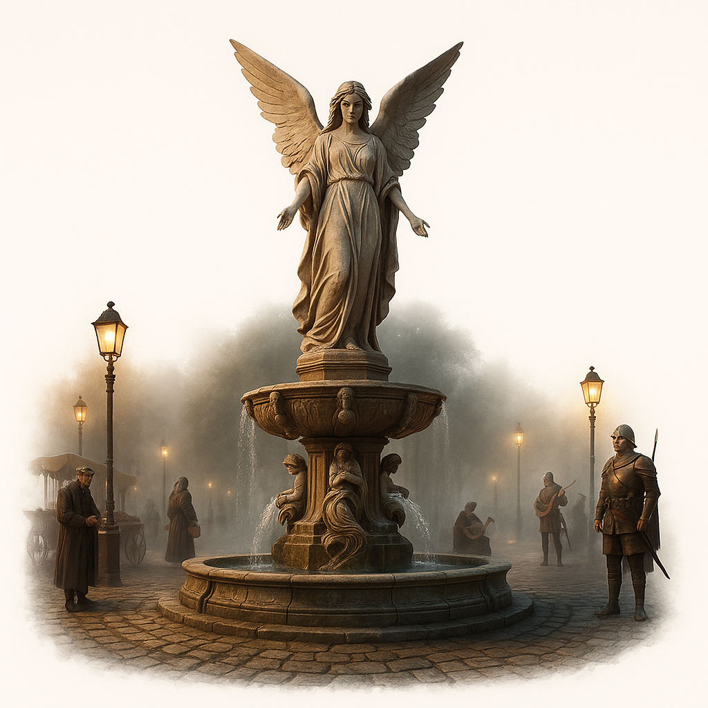

::: page {type="front-cover"}

# The Missing Merchant

## Dragonwing Peninsula

{class="line"}

::: banner

Homebrew {style="height:30px;margin-bottom: 4px;"}

:::

::: footnote

Adventure for 3–4 characters (level 1–3)

ver 4.0.0

:::

{class="cover"}

::: page {layout="auto"}

# About the Adventure

## Summary

San-Soprigal is a sleepy coastal town. This morning, everything changed: a beloved merchant has vanished. The garrison
commander has locked down the gates until the truth comes out.

You didn’t come here to play detective, but the town’s knot of lies, rumors, and secrets pulls you in. Every lead can
misdirect you, and a wrong accusation could spark fresh tragedy.

## Overview

A D&D (2024) adventure for 3–4 characters of levels 1–3.

::: definition

**Estimated runtime:** 10–16 hours.

**Setting:** San-Soprigal (a contained, closed-town scenario). The world Azalia takes inspiration from _Might & Magic X_
and Terry Pratchett’s _Discworld_.

**Genres:** investigation-forward, roleplay-heavy, light on combat.

**Supplemental materials:** maps and illustrations are available on
[Google Drive](https://drive.google.com/drive/folders/1M9Ycx8IsTqvq3P1-V3OpA_76lOto1ABy).

:::

## Notes

As you read, you’ll see markings used for clarity and context:

> Text in blocks like this is meant to be read aloud (or briefly paraphrased) to the players—for example, when they
> arrive at a location or when a scene’s conditions are met.

The page numbers in the corner allow you to quickly return to the table of contents.

## License

All references to Dungeons & Dragons and related materials are the property of Wizards of the Coast. This material is
not an official product and is not supported or endorsed by Wizards of the Coast. All trademarks and copyrights related
to Dungeons & Dragons belong to their respective owners.

This material is for personal use only and not for commercial distribution.

The adventure is designed using [DnD Flavored Markdown](https://github.com/zavoloklom/dnd-flavored-markdown). All images
were generated with ChatGPT.

Author — [Sergey Kupletsky](mailto:s.kupletsky@gmail.com).

 {style="height:895px" class="framed-image"}

::: page {show-page-number="false"}

# Contents

::: toc

- [About the Adventure](#about-the-adventure)
- [Setting and Constraints](#setting-and-constraints)
- [Backstory](#backstory)
- [Story Overview](#story-overview)
- [Advice for the DM](#advice-for-the-dm)
- [Appendix: States and Organizations](#appendix-states-and-organizations)
- [Appendix: Pantheon](#appendix-pantheon)

:::

::: page

# Setting and Constraints

## World Overview

The world of Azalia is sealed by ancient wards that isolate it from the outer planes. There is no contact with gods,
patrons, or any other external powers.

If the wards destabilize or break, ways to other planes open—leading to demonic incursions and magical anomalies.

People in this world don’t know about wards and gods. They blindly worship angels.

## Magic

All practitioners of magic must hold a permit to reside in the Holy Empire or a **license for Magical Practice**.

Any unsanctioned magic leads to interrogation, arrest, or execution.

Attempts to use magic tied to other planes (_plane shift_, _gate_, _summon fiend_, _contact other plane_, etc.) may have
catastrophic effects, or the spell simply fails.

## Species of the Holy Empire

::: definition

**Humans** — the primary species; they hold leading positions.

**Dwarves, gnomes, and halflings** — tolerated yet considered “outsiders.” Trusted with craft and trade, but kept at
arm’s length.

**Orcs and goliaths** — seen as cheap labor and hire-swords. In any conflict, blame usually falls on them.

**Drow and half-elves** — face open hostility. Violence against them often goes unpunished.

**Elves** — feral, living in the forests (not a playable species).

**Tieflings** — the result of mages experimenting with demonic blood over the last two years. Unknown to anyone but
their creators. You may play a tiefling who somehow escaped. An unmasked tiefling will likely be taken for a demon and
attacked on sight.

**Aasimar** — humans bearing an implanted angelic soul (they don’t know this). Innate powers are restricted: in a
critical moment, they may manifest involuntarily if the character fails a DC 15 Wisdom saving throw. The more often
these powers are used, the stronger the angel’s influence grows (control passes to the DM).

**Dragonborn** — absent (not a playable species).

:::

## Class Restrictions

::: definition

**Warlocks.** Standard patrons (like Fiend, Archfey, Great Old One) are unavailable. Possible adaptations include an
internal source of power, planar anomalies, or ancient artifacts.

**Clerics & Paladins.** Their magic works through faith in an angel (see [Appendix: Pantheon](#appendix-pantheon)),
usually without a direct reply.

**Wizards & Sorcerers.** Must conceal their practice or obtain legal status.

:::

{style="position:absolute;bottom:0;right:0;width:600px;z-index:-1"}

::: page {layout="left"}

# Backstory

## The Dragonwing Peninsula

**Dragonwing** is a peninsular protectorate: formally subject to the **Holy Empire** (see
[Appendix: States and Organizations](#appendix-states-and-organizations)) yet effectively pushing for
independence—especially after the central authority failed to protect the peninsula’s cities from a demon incursion.

Representatives of the Holy Empire are met with suspicion here, and at times with open hostility.

## San-Soprigal

**San-Soprigal** is an old coastal town on the Empire’s frontier, within the Dragonwing Peninsula.

It was once a key stop on trade routes, thriving on commerce, fishing, and—if rumors are to be believed—smuggling. Wars,
economic decline, and tighter imperial control took their toll; these days, dignitaries and trade caravans rarely bother
to visit.

## The Demon Incursion

About _two years ago_, demonic forces overran the countryside around San-Soprigal, cutting the town off from the outside
world and laying it under siege. Contact with other cities ceased, and no help arrived.

After a month, the demons vanished as suddenly as they had appeared. Only scattered bands remained, and the town guard
suppressed them quickly.

Many died during the siege, including the mayor, **Stor Sulim**; **Jonas’s grandfather**; and the entire **Günter**
family.

After the mayor’s death, the guard commander, the half-orc **Hurgkhan**, assumed leadership of the town. He retained
military command and stayed in the garrison, repurposing the town hall as a public library.

The siege left deep scars: faith in the angels has faltered (though few will say so aloud), fear and distrust linger,
much of the guard was lost, and trade routes grew more perilous. The town seemed destined for ruin, but Hurgkhan
restored order. San-Soprigal now goes about its daily life again—though the fears and wounds of the past have not
healed.

{class="mask"}

<!-- prettier-ignore -->
[//]: # (Rumor holds that, in the siege’s final days, the dead rose and fought alongside the living. The Church forbids any discussion of these tales and condemns them as heresy.)

::: page

# Story Overview

## Arrival of the Mage

_3 Narvail (February)_

- A necromancer, **Abraham**, arrives in town. He previously conducted forbidden experiments with spiders in the
  **United States of Magic Art** and is now in hiding, hoping to continue his research in seclusion.
- He rents a house from **Jonas** (the grandson of a smuggler), pays a year in advance, and moves in. Abraham knows
  about this house—and the passage—through old contacts: a fellow necromancer once lived in the town. Jonas doesn’t know
  about the secret passage into the catacombs.
- Abraham places an order with his smuggler contacts in **Black Meduza** for “goods”—his custom-bred spiders.
- He locks himself in the cellar and doesn’t show his face around town. Rumors spread that he’s a mage.

## Arrival of Rosa

_1 Betalasse (March)_

- **Rosa** (a paladin of the **Church of Light**) arrives in San-Soprigal and keeps the purpose of her visit secret. She
  refuses to recognize local authority and acts under a covert mandate.
- She lodges at the **Temple** and periodically leaves town for several days at a time.
- Her mission is to investigate recent attacks on merchants in the region and to recover a stolen church relic.

## The Delivery

_1 Betalasse (March)_

- Smugglers **Peter** and **Boshir** bring contraband and crates of spiders to the cove beneath the town.
- That evening, posing as traders, they drink in the tavern, hit on Rosa, and start a brawl.
- At night they descend into the catacombs to unload the boat. A large crate slips and breaks. The starving spiders
  attack and kill them both.
- Their room still contains the “trader” clothing they used as a cover. When the innkeeper **Helmut** realizes the
  guests are gone, he hands the clothes to the server **Kenki**.
- The next day, with no men or cargo arriving, Abraham goes into the catacombs himself. The spiders kill him as well.
- The guard doesn’t search for Peter and Boshir: their papers mark them as ordinary merchants who often leave without
  fanfare.

## Maria & Günter

_Narvail–Lotviel (February–April)_

- **Maria**, an incense merchant, secretly meets **Günter**—a town guard—on the watchtower during his night shifts.
- Günter becomes obsessed with tying the disappearances to Rosa, whom he assumes is an inquisitor.
- His paranoia rubs off on Maria. She avoids Rosa and stops visiting the Temple, though she once went often.
- Tensions rise, and the two quarrel.

## Maria & Abraham

_Narvail (February)_

- Maria supplied Abraham with ingredients needed for his spider venom experiments.
- Abraham paid a month in advance and asked for discretion.
- In thanks, he gave Maria a scroll with a simple spell and instructions.
- The following month he didn’t place an order, and Maria didn’t find that unusual.
- After Rosa’s arrival—and under Günter’s influence—Maria fears arrest for dabbling in magic.

::: page

## The Abandoned District

_Early Lotviel (April)_

- At night, **Bertram** (a local drunk) falls into an old well in the Abandoned District that opens into the catacombs
  and is killed by spiders. No one looks for him—they assume he went on another bender and left town.
- **Children** used to sneak off to play in the Abandoned District, but after they began hearing “strange sounds,” they
  stopped going there.
- Relocating their games to the **Artisans’ Quarter**, the children break a window in Abraham’s house. Jonas learns his
  lodger is gone, but he doesn’t inform the guard—he fears unwanted attention and prefers to assume the mage moved on.

## Maria’s Disappearance

_12 Lotviel (April), Tuesday_

- After talking with her friend **Karra**, Maria decides to end things with Günter—but puts off the conversation.
- In advance, Günter swaps shifts with a day guard, cleans the tower, and prepares to **propose** to Maria at sunset.
- Maria heads for the tower, but when she spots Rosa returning to town, she detours into the Abandoned District to avoid
  her.
- At the old well, Maria notices a strange smell. She steps closer, and the starving spiders drag her down. Trying to
  fend them off with a spell, she collapses the old masonry and the shaft caves in.
- Günter waits for Maria, grows anxious, but doesn’t abandon his post.
- **Gaston** arrives in town, searching for a casket that Peter and Boshir were supposed to deliver. That night he tries
  to reach the cove, but sailors spot him, and he retreats.

## Maria Is Reported Missing

_13 Lotviel (April), Wednesday_

- In the morning, Günter finds Maria’s shop closed and no one answering at her home. He convinces **Hurgkhan** to force
  the door and open an investigation.
- Hurgkhan locks down the town for the duration of the investigation to maintain order and control departures. It’s a
  good chance to remind the townsfolk who’s in charge and to show he’s on top of his duties. He believes Maria will turn
  up within a few hours.
- The **adventurers** arrive in San-Soprigal.

::: page

# Advice for the DM

This is a mystery-first adventure: its core is social interaction and investigation, not combat. Don’t turn every
conversation into a die roll—the party’s success should depend on **who** they ask, **when**, and **about what**.

NPCs shift their attitude because of leverage, not eloquence: the party can present a clue, name a name, or catch a
contradiction. A Persuasion check amplifies leverage that already exists.

When searching locations, the more precise the question, the lower the DC. Grant advantage for relevant clues and sound
methods. On a failure, allow partial success at a cost (time, noise, suspicion).

Stay flexible. If the party forms a reasonable hypothesis, confirm it with a minor clue in the next location or
scene—even if it wasn’t originally there.

## Session Prep

Before play, ask players to define why their characters are willing to help with the investigation (duty, reward, a
mentor’s request, etc.), and how they met one another—or how they’re connected to their mentor, **Jared**.

## Hints & Suspects

The party’s initial suspects in the disappearances will likely be **Günter** and **Rosa**. If you notice them focusing
suspicion elsewhere (for example, on **Hurgkhan**), support their line of thinking—let the investigation move from the
players’ hypotheses.

If the party stalls, you can nudge them via members of the town guard or **Gaston**, who also wants access to the
catacombs.

## World Reaction

You determine how much in-game time scenes and travel take. Let the players know that time is passing in town, and
gently hint that delay will have consequences.

Below is an example of how events may unfold if the heroes don’t intervene.

### Day One

_13 Lotviel (April), Wednesday_

- Günter prepares and posts missing-person flyers for Maria across town.
- **Hurgkhan vs. Rosa:** Rosa tries to leave town; guards stop her at the gate.
- A volunteer search party forms to look for Maria.
- That night, Gaston breaks into Abraham’s house, spots spiders in the catacombs, and withdraws.

### Day Two

_14 Lotviel (April), Thursday_

- **Maria dies in the catacombs** if she has not been rescued.
- Gaston may approach the heroes, asking them to escort him into the catacombs.
- By evening, volunteers find signs of a struggle at the old well and inform Hurgkhan.
- On learning about the spiders, Hurgkhan musters a guard squad and descends into the catacombs. The guard assaults the
  tunnels and destroys the spiders. Of the entire squad, only Günter returns.
- The town mourns Hurgkhan; the immediate threat is removed.

## Combat Scenes

Fights in the catacombs should be tense but fair. Run them so that using the environment is profitable for the players
(fire, webs, chokepoints, etc.).

## What Comes Next

You can run this as a one-shot or as a prologue to a campaign. Hooks for longer arcs are seeded in NPC writeups and
dialogue—use them as needed, or ignore them:

- A dragon-hunt in the mountains on behalf of **Duncan**.
- Exploring ruins on the peninsula at the request of **Jassad**.
- A joint investigation with **Rosa** into the attacks on merchants.

::: page

# Appendix: States and Organizations

## States

Brief dossiers on key powers—their governance, priorities, and limits of influence.

### The Great Empire

Only myths and ruins remain of the once-mighty realm now called the **Great Empire**. Nothing is known of its nature,
its rulers, or why it fell; in the memory of nations it is something unreachable, almost mythic. All peoples date their
years from this collapse: the calendar counts **AF—After the Fall**.

### The Holy Empire

The **Holy Empire** is a major human power that unites several principalities. It maintains a common market, a single
currency, standardized measures, and imperial law. An elected **Emperor** stands at its head as arbiter and guarantor of
unity. In matters of faith, magic, and state security, the **Church of Light** has the final say.

### The United States of Magic Art

**The United States of Magic Art** (a federation of mages)—a union of states on a new continent founded by gifted
settlers. The right to freely practice magic is enshrined in the **Second Amendment** to the **USMA Constitution**.

### Kaltenwald

**Kaltenwald** (a dwarven-and-gnomish kingdom) is a closed, under-mountain state ruled by the
**King-Under-the-Mountain** under the Stone Laws. The outside world knows only scraps: the names of delvings, the
occasional diplomatic mission to the surface, and legends of mechanisms and bottomless vaults.

## Organizations

Supranational and covert groups with their own interests and methods.

### Church of Light

The **Church of Light** (cult of angels) is the only sanctioned religion. Only the upper hierarchy communes directly
with angels; everyone else blindly believes that angels exist and guide them.

The Church combines spiritual and secular power and also serves as an inquisition. Heresy, necromancy, and demonology
are punished by death or exile.

After the demon incursion, the Empire lives in fear and tightens control over magic and faith. Any magic outside the
Church’s oversight is treated as a threat.

### Spider Cult

A **necromancers’ cult** within one of the states in USMA. It is said they study ways to attain eternal life without
becoming undead.

### Black Meduza

The **Black Meduza** is a transregional network of smugglers and thieves’ guilds. Specialties: “gray routes,” illicit
logistics, extortion, bespoke thefts, and financial services for the underworld and the nobility alike.

::: page {layout="wide"}

# Appendix: Pantheon

Since there are no gods in this world, angels fulfill their functions. Cleric domains remain in use, with each overseen
by one or more angels.

A character may honor any angel—or several. This choice grants no additional mechanical benefits to any class. For
druids and paladins, it may be part of their concept. For clerics, mechanics are determined by the chosen domain, not by
the specific angel. If the domain you want isn’t listed, choose the closest angel by aspect from the table.

| Angel        | Description                            | Primary Followers                         | Cleric Domain(s)  |
| :----------- | :------------------------------------- | :---------------------------------------- | :---------------- |
| **Azarael**  | Keeper of magic and secrets            | Mages, archivists, archaeologists         | Arcana, Knowledge |
| **Auriel**   | Embodiment of law and justice          | Judges, knights, guards                   | Order             |
| **Gabriel**  | Embodiment of war and might            | Warriors, soldiers, mercenaries           | War               |
| **Eldarael** | Patron of life and the harvest         | Farmers, healers, druids, midwives        | Life              |
| **Lunoriel** | Warden of the wilds and the life-cycle | Foresters, shamans, rangers               | Nature            |
| **Selariel** | Guide of light and the night roads     | Pilgrims, guides, bards                   | Light, Twilight   |
| **Mavriel**  | Patron of craft and creation           | Smiths, engineers, artificers             | Forge, Arcana     |
| **Tanariel** | Warden of repose and death             | Keepers of necropolises, funerary masters | Death, Grave      |
| **Samael**   | Embodiment of calm and balance         | Sages, diplomats, monks                   | Peace             |
| **Lokiel**   | Trickster of shadows and masks         | Thieves, spies, con artists, adventurers  | Trickery          |
| **Torviel**  | Embodiment of the destructive tempest  | Sailors, devotees of destruction          | Tempest           |

{style="position:absolute;bottom:0;left:0;width:100%;z-index:-1"}
