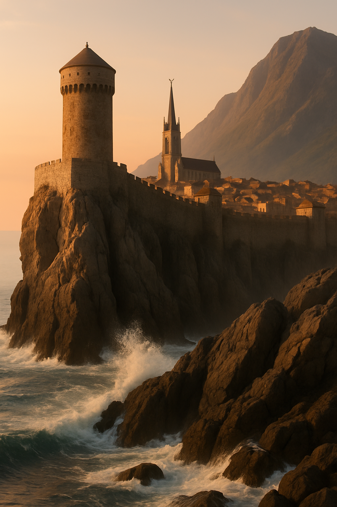
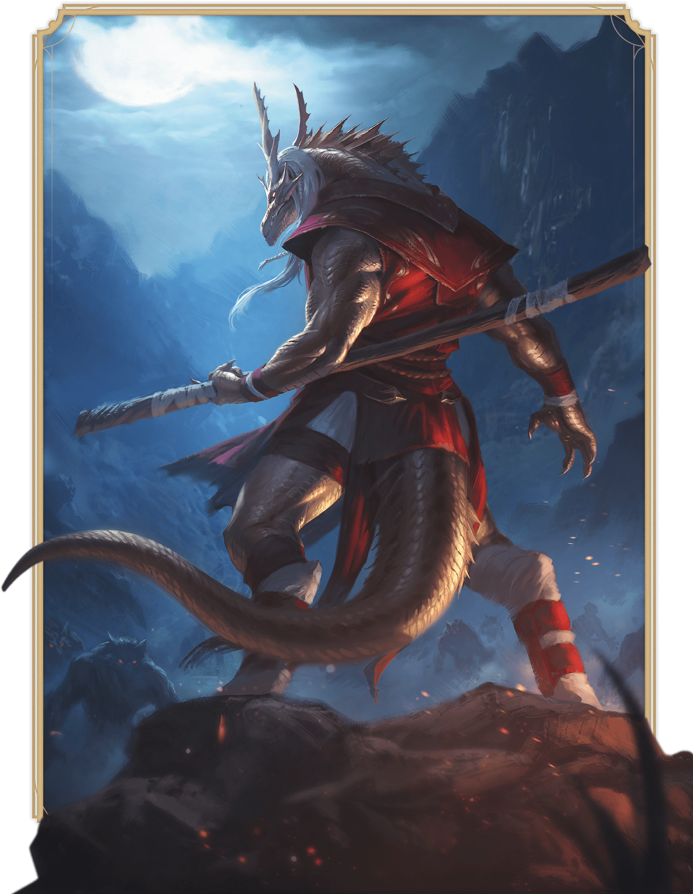
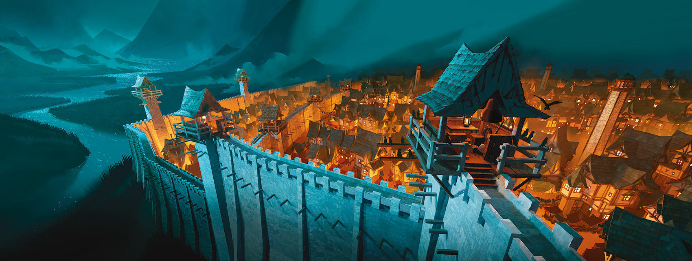
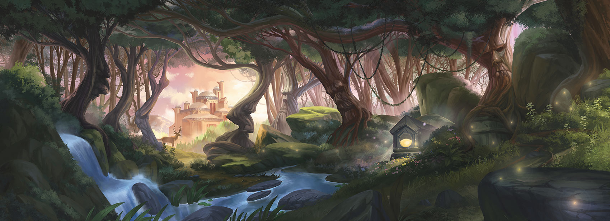

::: page {layout="auto"}

::: chapter Chapter 7 | Spells

# Warlock Subclasses

A Warlock subclass is a specialization that grants you features at certain Warlock levels, as specified in the subclass.
This section presents the Archfey Patron, Celestial Patron, Fiend Patron, and Great Old One Patron subclasses.

## Archfey Patron

_Bargain with Whimsical Fey_

Your pact draws on the power of the Feywild. When you choose this subclass, you might make a deal with an archfey, such
as the Prince of Frost; the Queen of Air and Darkness, ruler of the Gloaming Court; Titania of the Summer Court; or an
ancient hag. Or you might call on a spectrum of Fey, weaving a web of favors and debts. Whoever they are, your patron is
often inscrutable and whimsical.

### Level 3: Archfey Spells

The magic of your patron ensures you always have certain spells ready; when you reach a Warlock level specified in the
Archfey Spells table, you thereafter always have the listed spells prepared.

#### Archfey Spells

| Warlock&nbsp;Level | Spells                                                          |
|:------------------:|:----------------------------------------------------------------|
|         3          | Calm Emotions, Faerie Fire, Misty Step, Phantasmal Force, Sleep |
|         5          | Blink, Plant Growth                                             |
|         7          | Dominate Beast, Greater Invisibility                            |
|         9          | Dominate Person, Seeming                                        |

### Level 3: Steps of the Fey

Your patron grants you the ability to move between the boundaries of the planes. You can cast Misty Step without
expending a spell slot a number of times equal to your Charisma modifier (minimum of once), and you regain all expended
uses when you finish a Long Rest.

In addition, whenever you cast that spell, you can choose one of the following additional effects.

**_Refreshing Step._** Immediately after you teleport, you or one creature you can see within 10 feet of yourself gains
`1d10` Temporary Hit Points.

**_Taunting Step._** Creatures within 5 feet of the space you left must succeed on a Wisdom saving throw against your
spell
save DC or have Disadvantage on attack rolls against creatures other than you until the start of your next turn.

 {style="height:520px" class="framed-image"}

::: page {type="inside-cover"}

 {class="cover"}

# Monk

::: subtitle

A Martial Artist of Supernatural Focus

:::

::: page {layout="auto" type="class" icon="./index/monk_icon.svg"}

#### Core Monk Traits

|   |   |
|---|---|
| **Primary Ability**  | Dexterity and Wisdom  |
| **Hit Point Die**  | D8 per Monk level  |
| **Saving Throw Proficiencies**  | Strength and Dexterity  |
| **Skill Proficiencies** |  Choose 2: Acrobatics, Athletics, History, Insight, Religion, or Stealth |
| **Weapon Proficiencies**  | Simple weapons and Martial weapons that have the Light property  |
| **Tool Proficiencies**  | Choose one type of Artisan’s Tools or Musical Instrument (see chapter 6)  |
| **Armor Training**  | None  |
| **Starting Equipment**  | Choose A or B: (A) Spear, 5 Daggers, Artisan’s Tools or Musical Instrument chosen for the tool proficiency above, Explorer’s Pack, and 11 GP; or (B) 50 GP  |

Monks use rigorous combat training and mental discipline to align themselves with the multiverse and focus their internal reservoirs of power. Different Monks conceptualize this power in various ways: as breath, energy, life force, essence, or self, for example. Whether channeled as a striking display of martial prowess or as a subtler manifestation of defense and speed, this power infuses all that a Monk does.

Monks focus their internal power to create extraordinary, even supernatural, effects. They channel uncanny speed and strength into their attacks, with or without the use of weapons. In a Monk’s hands, even the most basic weapons can become sophisticated implements of combat mastery.

Many Monks find that a structured life of ascetic withdrawal helps them cultivate the physical and mental focus they need to harness their power. Other Monks believe that immersing themselves in the vibrant confusion of life helps to fuel their determination and discipline.

Monks generally view adventures as tests of their physical and mental development. They are driven by a desire to accomplish a greater mission than merely slaying monsters and plundering treasure; they strive to turn themselves into living weapons.

## Becoming a Monk...

### As a Level 1 Monk

- Gain all the traits in the Core Monk Traits table.
- Gain the Monk’s level 1 features, which are listed in the Monk Features table.

### As a Multiclass Monk

- Gain the Hit Point Die trait from the Core Monk Traits table.
- Gain the Monk’s level 1 features, which are listed in the Monk Features table.

## Monk Class Features

As a Monk, you gain the following class features when you reach the specified Monk levels. These features are listed in the Monk Features table.

### Level 1: Martial Arts

Your practice of martial arts gives you mastery of combat styles that use your Unarmed Strike and Monk weapons, which are the following:

- Simple Melee weapons
- Martial Melee weapons that have the Light property

You gain the following benefits while you are unarmed or wielding only Monk weapons and you aren’t wearing armor or wielding a Shield.

**Bonus Unarmed Strike.** You can make an Unarmed Strike as a Bonus Action.

**Martial Arts Die.** You can roll 1d6 in place of the normal damage of your Unarmed Strike or Monk weapons. This die changes as you gain Monk levels, as shown in the Martial Arts column of the Monk Features table.

**Dexterous Attacks.** You can use your Dexterity modifier instead of your Strength modifier for the attack and damage rolls of your Unarmed Strikes and Monk weapons. In addition, when you use the Grapple or Shove option of your Unarmed Strike, you can use your Dexterity modifier instead of your Strength modifier to determine the save DC.

::: page {footnote="Character Origins"}

::: panel

:::: title

# Guard

::::

 {class="cover"}

:::: credit

<!-- prettier-ignore -->
[DndBeyond Link](https://www.dndbeyond.com/sources/dnd/phb-2024/character-origins#Guard)

::::

:::

::: definition

**Ability Scores:** Strength, Intelligence, Wisdom

**Feat:** Alert (see chapter 5)

**Skill Proficiencies:** Athletics and Perception

**Tool Proficiency:** Choose one kind of Gaming Set (see chapter 6)

**Equipment:** Choose A or B: (A) Spear, Light Crossbow, 20 Bolts, Gaming Set (same as above), Hooded Lantern, Manacles, Quiver, Traveler’s Clothes, 12 GP; or (B) 50 GP

:::

Your feet ache when you remember the countless hours you spent at your post in the tower. You were trained to keep one eye looking outside the wall, watching for marauders sweeping from the nearby forest, and your other eye looking inside the wall, searching for cutpurses and troublemakers.

::: panel

:::: title

# Guide

::::

 {class="cover"}

:::: credit

<!-- prettier-ignore -->
[DndBeyond Link](https://www.dndbeyond.com/sources/dnd/phb-2024/character-origins#Guide)

::::

:::

::: definition

**Ability Scores:** Dexterity, Constitution, Wisdom

**Feat:** Magic Initiate (Druid) (see chapter 5)

**Skill Proficiencies:** Stealth and Survival

**Tool Proficiency:** Cartographer’s Tools

**Equipment:** Choose A or B: (A) Shortbow, 20 Arrows, Cartographer’s Tools, Bedroll, Quiver, Tent, Traveler’s Clothes, 3 GP; or (B) 50 GP

:::

You came of age outdoors, far from settled lands. Your home was anywhere you chose to spread your bedroll. There are wonders in the wilderness—strange monsters, pristine forests and streams, overgrown ruins of great halls once trod by giants—and you learned to fend for yourself as you explored them. From time to time, you guided friendly nature priests who instructed you in the fundamentals of channeling the magic of the wild.

::: page {type="class" layout="rtl" icon="./assets/symbols/city.svg"}

# Горожане

Разношерстная толпа — ремесленники, торговцы, рыбаки, дети, пьяницы, стражники. Одни боятся происходящего, другие
отмахиваются, как от очередной выдумки. В глазах большинства — усталость, но и привычка жить с тревогой, как с фоном.

## Локации

- [Рыночная площадь](#) — торговцы, нищие, дети.
- [Причал Сан-Сопригаля](#) — рыбаки, пьяницы.
- Ступени [Храма](#) - нищие.
- Улицы города — дети, нищие, случайные свидетели.

::: column

 {class="framed-image"}

_фоновые персонажи, отражающие атмосферу города_ {align="center"}

::: column-reset

## Информация

**Торговцы:**

- Делятся слухами (см. таблицы слухов в локации [Рыночная площадь](#)).
- Слышали, как Мария спорила с Гюнтером, или что та покупала странные травы.

**Рыбаки:**

- «Ночью кто-то шёл по пирсу. В капюшоне. Потом как волны плеснулись — и всё.»
- «Пёс мой завыл той ночью. А он у меня на бурю не воет.»

**Пьяницы:**

- Один может утверждать, что слышал голоса под землёй: «Шепчутся там, в подвале. В подземелье. Я не спал!»
- Другой утверждает, что видел Розу с мечом, весь меч в чём-то чёрном.
- Жалуются что Бертрам пропал, но его никто не ищет.

**Дети:**

- Один расскажет, что видел как кто-то ночью вылезал «из под земли» у разрушенного дома.
- Расскажут что раньше играли в заброшенном районе, но теперь там «очень страшно».

::: column

## Отыгрыш и характер

- Торговцы охотно болтают, но не переходят черту.
- Рыбаки немногословны и подозрительны к чужакам.
- Пьяницы громки и агрессивны, но могут знать то, чего не должны.
- Дети часто первыми замечают странности, но не понимают их значения.

**Отношение к героям:** неопределено

::: page

::: stat-block
name="Q Imperial Guard"
size="Средний"
type="Гуманоид"
alignment="Законопослушный Нейтральный"
ac="14 (кольчуга)"
hp="25 (4к8 + 4)"
speed="30 футов"
initiative="10"
pb=2
cr="1/4"
languages="Общий"
senses="Пассивное Восприятие 15"
skills="Восприятие +5"

:::: abilityscores
str=13 dex=12 con=12 int=10 wis=11 cha=10
saves="con"
::::

:::: traits

**Тактика стаи.** Стражник получает преимущество при броске атаки против существа, если хотя бы один из других
Стражников находится в пределах 5 футов от существа и не находится в состоянии недееспособности.

::::

:::: actions

**Длинный меч.** _Атака оружием ближнего боя:_ +4 к попаданию, дистанция 5 фт., одно существо. Попадание: 7 (1к8 + 2)
рубящего урона.

**Легкий Арбалет.** _Атака оружием дальнего боя:_ +3 к попаданию, дистанция 80/320 фт., одно существо. Попадание: 7 (
1к8 + 2) колющего урона.

::::

:::

::: page-break

::: readaloud
**Read Aloud:**  
Gears sing and the air hums with brass.
:::

Picking the arcane lock requires a successful check {@STR 15}.

---

::: sidebar title="GM Notes"
Use sidebars for guidance and variants.
:::

::: statblock
**Clockwork Guardian**  
AC 16; HP 45; Spd 30 ft; ATK +5 (1d8+3)  
Traits: Immutable Form; Magic Resistance
:::

::: abilityscores title="Bear Form" pb=3
str=19 dex=10 con=16 int=2 wis=13 cha=7
saves="dex"
mod_dex=-1
:::

::: page-break

# Текст на русском

