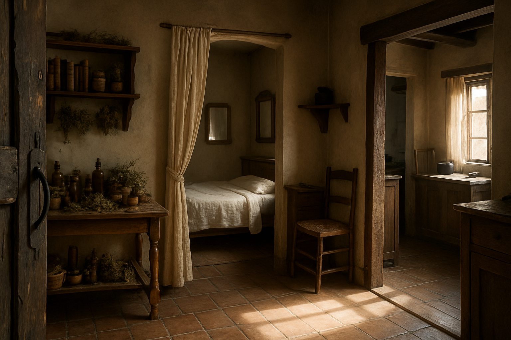

::: page {type="front-cover"}

# Пропавшая торговка

## Полуостров Драгонвинг

{class="line"}

::: footnote

Приключение на 3-4 игроков 1-3 уровня

ver 4.0.0

:::

::: banner

Homebrew {style="height:30px;margin-bottom: 4px;"}

:::

{class="cover"}

::: page {layout="auto"}

# О приключении

## Аннотация

Сан-Сопригаль — небольшой прибрежный город, где жизнь обычно течёт размеренно. Но сегодняшнее утро принесло тревожные
вести: пропала местная торговка. Начальник гарнизона объявляет тревогу и запрещает покидать город до окончания
расследования.

Вы — отряд искателей приключений, оказавшийся здесь по совершенно другому делу, но именно вам предстоит распутать сеть
лжи, слухов и тайн, чтобы понять, что произошло на самом деле. Каждый шаг может сбить со следа, а неверное обвинение —
привести к новой трагедии.

## Описание

Приключение по системе D&D (2024) для 3–4 персонажей 1–3 уровня.

::: definition

**Средняя продолжительность:** 10–16 часов.

**Место действия:** Азалия, город Сан-Сопригаль (закрытая локация). Мир вдохновлён игрой Might & Magic X и циклом
«Плоский мир» Терри Пратчетта.

**Жанры:** детектив, социальное взаимодействие, мало боевых сцен.

**Дополнительные материалы:**
[на Google Drive](https://drive.google.com/drive/folders/1M9Ycx8IsTqvq3P1-V3OpA_76lOto1ABy) хранятся карты и
иллюстрации.

:::

## Примечания

Во время чтения документа вы можете столкнуться с обозначениями, введёнными для удобства и понимания контекста:

> Текст в подобных блоках предназначен для чтения вслух или краткого пересказа игрокам — например, при прибытии в
> локацию или выполнении условий сцены.

Номера страниц в углу позволяют быстро вернуться к оглавлению.

::: column

## Лицензия

Все упоминания «Подземелий и Драконов» и связанные материалы принадлежат Wizards of the Coast. Данный материал не
является официальным продуктом и не поддерживается или одобряется Wizards of the Coast. Все торговые марки и авторские
права, связанные с «Подземельями и Драконами», принадлежат их владельцам.

Материал предназначен исключительно для личного использования и не для коммерческого распространения.

Приключение оформлено с помощью [DnD Flavored Markdown](https://github.com/zavoloklom/dnd-flavored-markdown). Все
изображения сгенерированы с помощью ChatGPT.

Автор — [Сергей Куплетский](mailto:s.kupletsky@gmail.com).

<!-- prettier-ignore -->
{class="absolute-bottom-right mask mask--watercolor-03" style="height:700px; width: 400px; bottom: 0px; object-position: center -100px;"}

::: page {show-page-number="false"}

# Содержание

::: toc

- [О приключении](#о-приключении)
- [Введение](#сеттинг-и-ограничения)
  - [Сеттинг и ограничения](#сеттинг-и-ограничения)
  - [Предыстория](#предыстория)
  - [История происшествия](#история-происшествия)
  - [Советы Мастеру](#советы-мастеру)
- [Глава 1: Прибытие](#завязка)
  - [Завязка](#завязка)
  - [Карта полуострова](#карта-полуострова)
  - [Прибытие в город](#прибытие-в-город)
- [Глава 2: Сан-Сопригаль](#карта-города)
  - [Карта города](#карта-города)
  - [Дом Марии](#p13)
  - [Рыночная площадь](#p14)
  - [Таверна «У Моря»](#p16)
  - [Храм Света](#p18)
  - [Гарнизон](#p19)
  - [Дозорная башня](#p20)
  - [Городские ворота (западные)](#p21)
  - [Дом Абрахама](#p23)
  - [Библиотека (бывшая ратуша)](#p24)
  - [Дом Гюнтера](#p25)
  - [Заброшенный район](#p26)
- [Глава 3: Катакомбы](#p27)
  - [Проход из старого колодца](#p27)
  - [Проход из дома Абрахама](#p28)
  - [Бухта контрабандистов](#p29)
  - [Большой зал (Логово пауков)](#p30)
- [Глава 4: Последствия](#p31)
  - [Судьба катакомб](#p31)
  - [Обвинение](#p31)
  - [Похроны](#p32)
- [Приложение: NPC](#p33)
  - [Краткий перечень NPC](#p33)
  - [Хурган](#p34)
  - [Гюнтер](#p35)
  - [Роза](#p36)
  - [Гастон](#p37)
  - [Йонас](#p38)
  - [Дункан](#p39)
  - [Хельмут](#p40)
  - [Кенки](#p41)
  - [Ясад](#p42)
  - [Селина](#p43)
  - [Герман Элквин](#p44)
  - [Карра](#p45)
  - [Стража](#p46)
  - [Горожане](#p47)
  - [Пропавшие люди](#p48)
- [Приложение: Предметы](#p49)
- [Приложение: Улики](#p64)
- [Приложение: Статблоки](#p66)
- [Приложение: Государства и Организации](#приложение-государства-и-организации)
- [Приложение: Пантеон](#приложение-пантеон)
- [Приложение: Названия месяцев](#приложение-названия-месяцев)
- [Приложение: Музыка и генераторы](#p73)
- [Заключение](#p76)

:::

::: page {footnote="Введение"}

# Сеттинг и ограничения

## Краткое описание мира

Мир Азалия запечатан древними печатями, изолирующими его от внешних планов существования. Из него нет связи с богами,
патронами и иными внешними силами.

Если печати становятся нестабильными или разрушаются, то открывается доступ в иные планы — вплоть до вторжений демонов и
магических аномалий.

Люди мира не знают о богах или печатях. Они слепо поклоняются ангелам, которых даже не видели.

## Магия

Все практикующие магию обязаны иметь разрешение на пребывание в Священной Империи или лицензию на использование магии.

Любая несанкционированная магия ведёт к допросам, арестам и казням.

При попытках использовать магию, связанную с иными планами (_Plane Shift_, _Gate_, _Summon Fiend_, _Contact Other Plane_
и т.п.) возможны катастрофические эффекты, либо заклинание не сработает вовсе.

## Жители Священной Империи

::: definition

**Люди** — основная раса; занимают лидирующие позиции.

**Дворфы, гномы и полурослики** — терпимы, но считаются «чужими». Им доверяют ремесло и торговлю, однако держат на
расстоянии.

**Орки и голиафы** воспринимаются как дешевая рабочая сила и наёмники. При любом конфликте вина обычно ложится на них.

::: column

**Дроу и полуэльфы** сталкиваются с открытой неприязнью. Насилие против них часто остаётся безнаказанным.

**Эльфы** одичали и живут в лесах (неиграбельная раса).

**Тифлинги** — результат экспериментов магов с демонической кровью последних двух лет. Никому, кроме создателей, они не
известны. Разрешено играть за тифлинга, который каким-то образом сбежал. Немаскирующегося тифлинга, скорее всего, примут
за демона и атакуют без раздумий.

**Аасимары** — люди с подселённой душой ангела (они об этом не знают). На использование врождённых способностей наложены
ограничения: в критической ситуации возможно самопроизвольное их проявление при провале спасброска Мудрости (СЛ 15). Чем
чаще способности применяются, тем сильнее влияние ангела (контроль переходит к Мастеру).

**Драконорождённые** отсутствуют (неиграбельная раса).

:::

## Классовые ограничения

::: definition

**Чернокнижники (Warlocks).** Стандартные патроны (Fiend, Archfey, Great Old One) недоступны. Возможны адаптации:
внутренний источник силы, аномалии, древние артефакты.

**Клирики и паладины.** Действуют через веру в ангела (_см. [Приложение: Пантеон](#приложение-пантеон)_), как правило
без прямого ответа.

**Маги (Wizards) и колдуны (Sorcerers).** Должны скрывать свою практику или получить легальный статус.

:::

<!-- prettier-ignore -->
{class="mask mask--background-bottom-third-02" style="object-position: center 105%; object-fit: contain; bottom: -75px;"}

::: page {layout="left" footnote="Введение"}

# Предыстория

## Полуостров Драгонвинг

Драгонвинг — полуостров-протекторат: формально подчинён Священной Империи (_см.
[Приложение: Государства и Организации](#приложение-государства-и-организации)_), но фактически стремится к
независимости, особенно после того, как центральная власть не смогла защитить города полуострова от демонов.

Представителей империи здесь встречают с недоверием, а порой и с открытой враждой.

## Сан-Сопригаль

Сан-Сопригаль — старый прибрежный город на окраине Священной Империи, в пределах полуострова Драгонвинг.

Когда-то он был важным узлом на торговых путях и процветал на торговле, рыболовстве и, по слухам, контрабанде. Но войны,
экономический спад и усиление имперского контроля сделали своё дело — теперь это городок, куда редко заглядывают важные
персоны и торговые караваны.

## Вторжение демонов

Примерно _два года назад_ демонические силы захватили окрестности Сан-Сопригаля и взяли город в осаду. Связь с другими
городами прервалась, помощи извне не поступало.

Спустя месяц демоны исчезли так же внезапно, как появились. Остались лишь небольшие группы, с которыми стража быстро
справилась.

Во время осады погибла значительная часть стражи и множество людей, в том числе мэр города **Стор Сулим**, **дед
Йонаса**, а также вся **семья Гюнтера**.

Осада оставила глубокие следы: вера в ангелов ослабла (хотя вслух об этом не говорят), а в обществе появились страх и
недоверие.

После гибели мэра город возглавил командир стражи полуорк **Хурган**. Он сохранил военное командование и остался в
гарнизоне, а здание ратуши передал под библиотеку.

Хурган сумел восстановить порядок. Теперь Сан-Сопригаль снова живёт обычной жизнью, хотя страхи и шрамы прошлого никуда
не делись.

{class="mask mask--background-right-half"}

<!-- prettier-ignore -->
[//]: # (По слухам, в последние дни мёртвые поднялись и сражались на стороне живых. Церковь категорически запрещает обсуждать эти рассказы, считая их ересью.)

::: page {footnote="Введение"}

# История происшествия

Далее приведена хронология событий. Названия месяцев Азалии см. в разделе
**[Приложение: Названия месяцев](#приложение-названия-месяцев)**.

При первом упоминании имена персонажей ведут ссылкой на их карточки в разделе
**[Приложение: Персонажи](#приложение-персонажи)**.

## Прибытие мага

_3 Нарваила (февраля)_

- В город прибывает некромант **[Абрахам](#)**, ранее проводивший запрещённые эксперименты с пауками в
  **[Соединённых Магических Государствах](#приложение-государства-и-организации)**. Теперь он скрывается и хочет
  продолжить исследования в уединении.
- Он арендует дом у **[Йонаса](#)** (внука контрабандиста), оплачивает на год вперёд и заселяется. Об этом доме и
  проходе Абрахам осведомлён по старым связям: раньше в городе жил знакомый некромант. Йонас о тайном ходе в катакомбы
  не знает.
- Абрахам заказывает у знакомых контрабандистов **[Чёрной Медузы](#приложение-государства-и-организации)** «товар» —
  своих особых пауков.
- Он запирается в подвале и в городе не появляется. По городу ходят слухи, что он маг.

## Прибытие Розы

_1 Беталассы (марта)_

- **[Роза](#)** (паладин **[Церкви Света](#приложение-государства-и-организации)**) прибывает в Сан-Сопригаль и не
  раскрывает цель визита. Она не признаёт местную власть и действует по тайному мандату.
- Поселяется при **[Храме](#)** и периодически покидает город на несколько дней.
- Её миссия — расследовать недавние нападения на торговцев в округе и отыскать похищенный церковный артефакт.

## Доставка

_1 Беталассы (марта)_

- Контрабандисты **[Петер](#)** и **[Бошир](#)** привозят контрабанду и ящики с пауками в бухту под городом.
- Вечером они отдыхают в таверне под видом торговцев, напиваются, лезут к Розе и ввязываются в драку.
- Ночью они спускаются в катакомбы разгружать лодку. Большой ящик падает и ломается. Голодные пауки нападают и убивают
  обоих.
- В их номере остаётся «торговая» одежда для прикрытия. Обнаружив, что постояльцев нет, хозяин таверны **[Хельмут](#)**
  передаёт вещи официанту **[Кенки](#)**.
- На следующий день Абрахам, не дождавшись людей и груза, сам спускается в катакомбы. Пауки убивают и его.
- Стража не ищет Петера и Бошира: по бумагам это обычные торговцы, которые нередко уезжают без лишнего шума.

## Мария и Гюнтер

_Нарваил–Лотвиэль (февраль–апрель)_

- Торговка благовониями **[Мария](#)** тайно встречается со стражником **[Гюнтером](#)** на [сторожевой башне](#) во
  время его ночных дежурств.
- Гюнтер одержимо пытается увязать исчезновения с Розой, считая её инквизитором.
- Его паранойя передаётся Марии. Она избегает Розы и больше не посещает [Храм](#), хотя раньше ходила туда часто.
- На этом фоне у них происходит конфликт и ссора.

## Мария и Абрахам

_Нарваил (февраль)_

- Мария поставляла Абрахаму ингредиенты, нужные для экспериментов с ядом пауков.
- Абрахам заплатил за месяц вперёд и просил сохранять тайну.
- В благодарность он передал Марии [свиток с простым заклинанием](#) и инструкциями.
- В следующем месяце Абрахам за ингредиентами не обращался, и Мария не посчитала это странным.
- После приезда Розы и под влиянием теорий Гюнтера Мария боится ареста за изучение магии.

::: page {footnote="Введение"}

## Заброшенный Район

_Начало Лотвиэля (апреля)_

- Ночью **[Бертрам](#)** (местный пьяница) проваливается в старый колодец в **[Заброшенном Районе](#)**, ведущий в
  катакомбы, и погибает от пауков. Его никто не ищет: решают, что он снова запил и ушёл из города.
- Обычно **[дети](#)** тайком играли в Заброшенном Районе, но после того как начали слышать «странные звуки», перестали
  туда ходить.
- Перебравшись для игр в **[Квартал Ремесленников](#карта-города)**, дети разбивают окно в [доме Абрахама](#). Йонас
  узнаёт, что постоялец исчез, но в стражу не обращается: он боится лишнего внимания и предпочитает считать, что маг
  уехал.

## Исчезновение Марии

_12 Лотвиэля (апреля), вторник_

- После разговора с подругой **[Каррой](#)** Мария решает прекратить отношения с Гюнтером, но тянет с разговором.
- Гюнтер заранее меняется сменами с дневным стражником, убирает башню и готовится сделать предложение Марии на закате.
- Мария идёт к башне, но замечает, как Роза возвращается в город, и сворачивает в Заброшенный Район, чтобы не попадаться
  ей на глаза.
- У [старого колодца](#) Мария чувствует странный запах. Подходит ближе, и голодные пауки утаскивают её вниз. Пытаясь
  отбиться заклинанием, она обрушивает старую кладку, и шахта заваливается.
- Гюнтер не дожидается Марии, нервничает, но пост не покидает.
- В город прибывает **[Гастон](#)** в поисках шкатулки, которую должны были доставить Петер и Бошир. Ночью он пытается
  пробраться [в бухту с моря (номер 11 на карте)](#карта-города), но его замечают моряки, и он отступает.

## Обнаружение пропажи Марии

_13 Лотвиэля (апреля), среда_

- Утром Гюнтер видит, что лавка Марии закрыта, а [дома](#) никто не открывает. Он уговаривает **[Хургана](#)** взломать
  дверь и начать расследование.
- Хурган закрывает город на время расследования, чтобы удержать порядок и контролировать выезды. Для него это хорошая
  возможность напомнить горожанам, кто в городе главный, и показать, что он справляется со своими обязанностями. Он
  считает, что Мария сама найдётся через несколько часов.
- **Герои** прибывают в Сан-Сопригаль.

<!-- prettier-ignore -->
{class="mask mask--background-bottom-third-01" style="object-position: center bottom; object-fit: contain;"}

::: page {layout="auto" footnote="Введение"}

# Советы Мастеру

Это детективное приключение: его ядро — социальные взаимодействия и расследование, а не бои. Не превращайте каждый
разговор в бросок кубиков — успех должен зависеть от того, **кого**, **когда** и **о чём** спрашивают игроки.

НПС меняют отношение не от красноречия, а от рычагов: игроки могут показать улику, назвать имя, поймать на несостыковке.
Бросок убеждения усиливает уже созданный рычаг.

При осмотре помещений, чем точнее сформулирован запрос, тем ниже сложность. Давайте преимущество за улики и правильные
методы. На провале возможен частичный успех с ценой (время, шум, подозрения).

Помните о гибкости. Если партия пришла к разумной гипотезе, подтвердите её мелкой уликой в ближайшей локации или
разговоре, даже если изначально её там не было.

## Подготовка к сессии

Перед игрой попросите игроков продумать мотивацию, почему их персонажи готовы помочь в расследовании (по зову сердца,
ради награды, из уважения к наставнику и т. п.), а также как они познакомились друг с другом или с их наставником
**Джаредом**.

## Подсказки и подозреваемые

Основными подозреваемыми в пропаже людей игроки могут считать **Гюнтера** и **Розу**. Если заметите, что партия начинает
подозревать кого-то ещё (например, **Хургана**), поддержите их сомнения — пусть следствие движется от гипотез игроков.

Если игроки застрянут, вы можете помочь им через персонажей стражи или **Гастона**, которые также заинтересованы попасть
в катакомбы.

## Реакция окружения

Вы сами определяете, сколько внутриигрового времени занимают сцены и переходы между локациями. Сообщите игрокам, что
время в городе идёт, и мягко намекните, что промедление повлечёт последствия.

Далее приведён пример развития событий, если герои не будут вмешиваться.

### День первый

_13 Лотвиэля (апреля), среда_

- Гюнтер готовит и развешивает по городу плакаты о пропаже Марии.
- **Конфликт Хургана и Розы**: Роза пытается покинуть город, стражники останавливают её у ворот.
- Формируется группа волонтёров, которая отправляется искать Марию.
- Гастон ночью проникает в дом Абрахама, замечает пауков в катакомбах и возвращается.

### День второй

_14 Лотвиэля (апреля), четверг_

- **Мария умирает в катакомбах**, если её не спасли.
- Гастон может обратиться к героям с просьбой сопроводить его в катакомбы.
- К вечеру волонтёры находят следы борьбы у старого колодца и сообщают Хургану.
- Узнав о пауках, Хурган собирает отряд стражи и спускается в катакомбы. Стража штурмует катакомбы и уничтожает пауков.
  Из всего отряда возвращается только Гюнтер.
- Город скорбит по Хургану, непосредственная угроза устранена.

## Боевые сцены

Бой в катакомбах должен быть напряжённым, но честным. Ведите бой так, чтобы игрокам выгодно было задействовать местность
(огонь, паутина, узкие проходы и т. д.).

## Что дальше

Приключение можно провести как ваншот или сделать прологом кампании. Зацепки к этим линиям спрятаны в описаниях
персонажей и их репликах — используйте их по необходимости или исключите из своей игры:

- Поход на дракона в горах по заданию **Дункана**.
- Исследование руин на полуострове по поручению **Ясада**.
- Совместное с **Розой** расследование нападений на торговцев.

::: page {layout="auto"}

::: chapter Глава 1 | Прибытие

## Завязка

Герои — группа искателей приключений, направляющаяся в город **Карталь** исполнить последнюю волю наставника
**Джареда**: доставить его прах в родной город и похоронить там.

Из-за недавних нападений на торговые корабли и опасностей в прибрежных водах путь по морю временно закрыт. Единственный
путь в Карталь — сухопутный, через земли **Священной Империи**. Герои решают причалить в городе **Сан-Сопригаль**, чтобы
продолжить путь по суше.

Это вступление погружает игроков в атмосферу мира и коротко поясняет фон событий.

> Азалия. 13 Лотвиэля, 567 год ПП. То есть После Падения Великой Империи.
>
> Церковь учит, что Великую Империю, как и весь мир, создали ангелы. Там не было голода, болезней и войн, а люди мирно
> жили вместе с дворфами, орками и — хоть и верится с трудом — эльфами. Говорят, тогда и эльфы были другими. Но однажды
> всё кончилось, и от Великой Империи остались лишь руины и странные, величественные строения.

> Теперь всё иначе. Люди в основном живут в Священной Империи; Король-Под-Горой правит дворфами и гномами, а маги,
> отвергнув Церковь, основали Соединённые Магические Государства. Племена орков и гоблинов же держатся на востоке.

> Два года назад по всей Азалии появились невиданные прежде твари. Их прозвали демонами, исчадьями — любыми словами, что
> могли выразить страх. Отбиться от них удалось только ценой больших потерь.

> Долгий путь позади. Несколько недель вы держали курс на Карталь, чтобы исполнить последнюю волю Джареда: его прах
> должен покоиться в родном городе. Но неожиданно выяснилось, что морское сообщение с Карталем прервано. Вы собираетесь
> причалить в небольшой прибрежный город Сан-Сопригаль, чтобы продолжить путешествие по суше.

Герои уже близко к городу — это наводит на воспоминания о прошлом. Попросите игроков коротко рассказать, как их
персонажи познакомились друг с другом и с **Джаредом**.

<!-- prettier-ignore -->
{class="absolute-bottom-right mask mask--watercolor-02" style="height:710px; width: 430px; bottom: 0; object-position: -90px -90px;"}

::: page

::: wide

{class="framed-map"}

:::

## Карта полуострова

Эта карта нужна только для ориентира: показать, где находится **Сан-Сопригаль** и как он соотносится с остальными
местами полуострова. В рамках текущего приключения герои **не покидают город**, поэтому карта не даёт подсказок по
сюжету и не используется механически.

Покажите её один раз в начале, чтобы задать масштаб и атмосферу. Один гекс - 12 миль.

Карталь, Портгейт и другие локации остаются на будущее — как направления кампании, если вы решите продолжить историю за
пределами города.

Полный архив всех карт доступен по ссылке:
[Скачать с Google Диска](https://drive.google.com/drive/folders/1kkLD4GegIr0Q5sSph8yz1zEEGgtrtRQs)

::: column

## Местность

::: definition

**Погода.** Преимущественно морской климат: туманы у побережья, резкий ветер с хребта, весенние паводки и осенние
штормы.

**Теневой лес.** Густой и почти непроходимый лес восточнее Карталя.

**Пепельные холмы.** Сухие, серые увалы к северо-западу от Сан-Сопригаля. Здесь находится старое городское кладбище
Сан-Сопригаля.

**Портгейт.** Крепость у восточных перевалов; резиденция губернатора полуострова и главный таможенный пост. Контролирует
движение между полуостровом и Империей.

**Око.** На озере в форме глаза стоит древняя постройка, известная как Око.

**Связь с Империей.** Горная гряда отделяет полуостров от остальной Империи. Единственный сухопутный путь проходит через
горные перевалы на северо-востоке; в непогоду перевалы закрывают.

:::

::: page {layout="auto"}

# Прибытие в город

Герои прибывают на причал Сан-Сопригаля ранним утром.

> Вы прибываете в город утром. Город расположен на скалистом побережье, и уже издалека ваш взгляд приковывает высокая
> дозорная башня, возвышающаяся над городом. На её вершине можно заметить силуэт часового, вглядывающегося в горизонт.
>
> Вы сходите на обветшалый пирс вместе с капитаном. Капитан, не оглядываясь, проходит в город мимо скучающего на посту
> стражника.
>
> Вы задерживаетесь у воды и наблюдаете, как рыбаки выгружают улов и переговариваются с человеком в плаще на краю
> причала.

Если герои захотят осмотреться или подойти к рыбакам – смотри локацию «[Причал](#причал)».

## Вход в город

Стражник у ворот может спросить у героев формальные вопросы - «имя, цель визита, сталь на виду; магию — не
демонстрировать».

Если герои сразу идут в город:

> При входе в город вы замечаете тревожную картину:
>
> Один из домов выглядит взломанным: дверь выбита, а на пороге стоят вооружённые стражники. Несколько зевак собралось
> вокруг и шёпотом обсуждает происходящее. Полуорк в доспехах — судя по всему, главный — хмуро осматривает дом. Рядом с
> ним стоит молодой стражник, заметно обеспокоенный.

Если герои долго задерживаются на причале, они услышат звук горна, и собеседники сами поспешат к воротам, увлекая их за
собой.

Местные могут рассказать, что такой сигнал подавали в последний раз во время нашествия демонов.

> В этот момент над городом разносится звук горна, на который сбегаются стражники. Полуорк поднимает руку, призывая к
> тишине, и громко объявляет:
>
> _«Сопригаль закрыт! Никто не покидает город без моего разрешения, пока мы не разберёмся!»_
>
> Толпа гудит, люди переговариваются. Ваш путь в Карталь теперь откладывается – город заперт, и, похоже, здесь творится
> нечто странное.

После прохода через ворота герои попадают в локацию [Дом Марии](#дом-марии).

<!-- prettier-ignore -->
 {style="height:500px" class="framed-image"}

::: page

::: chapter Глава 2 | Сан-Сопригаль

::: wide

{class="framed-map"}

:::

## Карта города

В городе есть несколько ключевых мест, которые могут быть полезны игрокам:

1. [Причал](#причал)
2. [Дом Марии](#)
3. [Рыночная площадь](#)
4. [Таверна «У Моря»](#)
5. [Библиотека / Старая ратуша](#)
6. [Гарнизон](#)
7. [Храм Света](#)
8. [Городские ворота](#)
9. [Дозорная башня](#)
10. [Дом Абрахама](#)
11. Проход в бухту контрабандистов
12. [Заброшенный колодец](#)

::: column

Город небольшой (около 500 жителей) и стоит на скальных террасах. Основные мотивы — узкие каменные улочки, крутые
лестницы и арочные проходы. По утрам пахнет солью, водорослями и рыбой; днём — гул мастерских; к вечеру спускается
густой туман.

Референс — средиземноморские города вроде Атрани (Италия).

Город разделён на несколько районов — Портовый, Ремесленный, Заброшенный, Бархатный и Центральный.

Игрокам можно выдать карту **без обозначений** после разговора с Хурганом или Дунканом или по их явному запросу
«разобраться в устройстве города».

::: page

# Причал Сан-Сопригаля

_Доступен только в среду утром, перед входом в город_

## Описание

> У пристани стоит невысокое деревянное здание – склад и место отдыха для моряков. Воздух здесь пропитан солью, запахом
> водорослей и свежей рыбы. Доски настила кое-где потрескались от времени, но в целом место ещё держится.

## Персонажи

- [Дункан](#p39) – бывший приключенец, стоит здесь и разговаривает с рыбаками.
- Местные [рыбаки](#p47) – знают последние слухи, но не любят влезать в дела стражи.

## Информация

- {@dc 10} Рыбаки боятся говорить. Но могут сказать что видели этой ночью кого-то на пирсе.
- Убеждение 10 Рыбаки боятся говорить. Но могут сказать что
  видели этой ночью кого-то на пирсе.
- `Убеждение 10` Рыбаки боятся говорить. Но могут сказать что видели этой ночью кого-то на пирсе.

{style="position:absolute;bottom:0px;left:0;height:750px"}

::: page {layout="auto" footnote="Глава 2 | Локации Сан-Сопригаля"}

# Дом Марии

## Описание

> Небольшой одноэтажный домик с выбитой дверью. Внутри всё выглядит аккуратно – скромная, но уютная обстановка.

Внутри:

> Вы переступаете порог небольшого, но уютного дома. Запах благовоний всё ещё витает в воздухе. В углу комнаты стоит
> низкий деревянный стол, заваленный флаконами с маслами и ароматными травами. Над ним – полка с книгами о травах и
> ароматерапии. В доме так же есть небольшая кухня и спальня за лёгкой занавеской.

## Персонажи

- [Хурган](#p34) (в среду утром).
- [Гюнтер](#p35) (в среду утром). Испуганный и раздражённый, его лицо бледное, он сильно нервничает.
- [Стража](#p46) (после ухода Хургана и Гюнтера) – стражник поставленный Хурганом пока не починят дверь.

## Предметы

- [Дневник Марии](#p52) (см. Приложение: Предметы)
- Вложенные в книгу засушенные цветы (подарок от Гюнтера)
- Свиток с заклинанием [Mold Earth](https://dnd.su/spells/389-mold-earth/).

## Осмотр

- Осмотр дома в целом:
  - Всё выглядит аккуратным, вещи на своих местах — это явно не ограбление.
  - В доме нет следов борьбы или крови — значит, Мария ушла добровольно или её забрали без сопротивления.
- Кухня:
  - Небольшой беспорядок: на столе стоит недопитая чашка с настоем и пустая тарелка.
  - `Природа 12` Настой это успокоительное, его часто пьют при тревоге или волнении.
- Рабочий стол:
  - Множество флаконов и банок с маслами и травами для ароматерапии.
  - Выживание 16 Среди обычных трав можно найти ядовитые -
    болиголов, крушина.
- Спальня:
  - `@Perception 10` Кровать с аккуратно застеленной простынёй, небольшой комод и зеркало в деревянной раме.
  - _(Внимательность 10)_ Под кроватью спрятан дневник Марии.
  - _(Внимательность 12)_ Одна книга в шкафу стоит неровно, из неё выпадают засушенные цветы (подарок от Гюнтера).
  - _(Внимательность 18)_ В одной из книг спрятан простой свиток с заклинанием Mold Earth и краткой инструкцией по
    использованию.
  - `@str 16`

## События

Хурган предлагает героям обследовать дом под присмотром Гюнтера (Хурган дом уже осмотрел), и если они подтвердят его
выводы (что Марию не похищали из дома), то он может выдать героям свое [письменное разрешение](#p51) на помощь страже.

Пока герои осматривают дом Гюнтер внимательно за ними следить, торопить и если они попробуют что-то унести, то будет их
останавливать.

Если герои не станут осматривать дом, то чтобы осмотреть его позже им потребуется [письменное разрешение](#p51) Хургана
или обман/отвлечение стражника.

{style="position:absolute;bottom:0;right:0;width:450px"}

::: page

# Рыночная площадь

## Описание

> Узкая мощёная улица выводит вас на широкую рыночную площадь, главный центр жизни Сан-Сопригаля. Здесь слышны громкие
> голоса торговцев, перекрикивающих друг друга и приглушённый гул разговоров. Воздух наполнен смешанными запахами
> жареной рыбы, свежеиспечённого хлеба. Люди снуют между рядами, кто-то спешит по делам, а кто-то обсуждает последние
> новости и слухи.

> В центре площади возвышается каменный фонтан, украшенный резными изображениями ангелов и волн. Вода мягко журчит,
> стекая в выдолбленный резервуар, края которого заметно потемнели от времени. Вокруг фонтана можно увидеть отдыхающих
> торговцев, несколько стражников и даже уличных музыкантов.

### Храм Света

> Главной достопримечательностью площади является огромный Храм Света, расположенный на её южной стороне. Белые стены
> его фасада сияют в солнечных лучах, а высокий золотой шпиль, увенчанный фигурой ангела, виден из любой точки города. К
> храму ведут широкие каменные ступени, перед которыми можно увидеть пару прихожан и нищего. Двери приоткрыты, и оттуда
> слышится тихий голос, произносящий молитву.

### Таверна

> На противоположной стороне площади располагается таверна — массивное двухэтажное здание с каменными стенами и
> деревянными балками. Над входом висит выцветшая вывеска с изображением морской волны, а изнутри доносится гул голосов
> и запах крепкого эля.

### Ратуша

> Рядом с таверной, ближе к центру города, стоит старинное здание, напоминающее ратушу. Его стены сделаны из старого,
> потемневшего камня, а высокие узкие окна выдают его былое величие.

### Гарнизон

> Дальше стоит здание гарнизона, где располагаются стражники города и их командование. На фасаде висит знамя Империи,
> слегка потрёпанное ветрами с моря.

### Статуя Сэра Сорпигаля

> В юго-западном углу площади стоит памятник всаднику в доспехах, с мечом, поднятым к небу.

{style="position:absolute;bottom:0;left:0;width:100%"}

::: page

## Персонажи

- [Карра](#p45) – торговка безделушками.
- Разные [торговцы и горожане](#p47) – могут поделиться слухами.
- [Стража](#p46) – неохотно разговаривают, но могут рассказать последние новости.

## Торговцы

На рынке не продают никаких редких предметов. Так же тут не продают оружие/броню.

## Что могут найти и узнать игроки

- Поговорить с купцами или послушать слухи:
  - _«Ночью пёс вдруг дико залаял, сорвался с цепи и убежал кого-то преследуя. Все, ни слуху, ни духу, а такой добрый
    был пёс…»_
  - _«Я не люблю сплетни, но слышал что у Марии что-то было с кем-то из стражи.»_
- Про Бертрама:
  - _«Бертрам? Он пропал? Ну, наверное, в запой ушёл, как всегда.»_
  - _«Ха! Бертрам пропал? Я скажу, куда он пропал: в ближайший подвал, где больше всего выпивки!»_
- Если игроки сильно подозревают кого-то и им пора в катакомбы:
  - _«… думаю, я видел, как он/она шел к в заброшенную часть города, но мне-то что?»_

#### Таблица случайных слухов

_Примечание: Эти слухи передают субъективные мнения NPC. Некоторые могут быть правдой, иные — искажены или полностью
вымышлены._

| K6  | Слух                                                                                                                                  |
| :-- | :------------------------------------------------------------------------------------------------------------------------------------ |
| 1   | Хурган злится, что ему солдат не присылают. А всё потому, что Империя боится, что он здесь порядок наведёт лучше, чем герцоги!        |
| 2   | А Роза — она не просто паладин. Молчат, конечно, но слухи ходят — у неё задание. Тайное. От самого.                                   |
| 3   | Говорят, Мария уехала на лодке ночью. Вон рыбак видел — кто-то в капюшоне садился в челн у пристани. Но лодка-то потом была на месте. |
| 4   | Некоторые думают, что это дело рук Розы. Там, где она, — всегда кто-то горит, кто-то исчезает...                                      |
| 5   | Да этот Герман — колдун, говорю вам. Книги прячет, людей не пускает, бормочет что-то себе.                                            |
| 6   | А вы знали, что Гюнтер покупал у Марии ядовитые травы? Ночами. Шепотом. А теперь она пропала...                                       |

{{wide }}

## События

Когда герои выходят на площадь с ними может произойти какое-то событие, в которое они не обязаны вмешиваться.

#### Таблица случайных событий

| K6  | Событие                                                                                                                                                                        |
| :-- | :----------------------------------------------------------------------------------------------------------------------------------------------------------------------------- |
| 1   | Мальчишка карманник пытается ограбить героев.                                                                                                                                  |
| 2   | Спор горожан: стоило ли закрывать город. Один возмущен ограничением, другой считает что Хургану виднее и что он никогда не подводил.                                           |
| 3   | Уличное представление.                                                                                                                                                         |
| 4   | Продавец узнаёт одного из героев (ошибочно) и требует долг.                                                                                                                    |
| 5   | Спор горожан: могут ли маги жить рядом с обычными людьми. Один считает, что магов надо держать под контролем, другой — что магия может служить на благо, если дать им свободу. |
| 6   | Спор горожан: имеют ли эльфы право на земли в лесах полуострова. Один говорит, что эльфы были здесь всегда, другой — что если они не платят налоги, то пусть уходят.           |

{style="position:absolute;bottom:0;left:0;width:100%;z-index:-1"}

::: page

{{wide

## Таверна «У Моря»

}}

**Описание**

{{descriptive
Таверна «У Моря» – шумное и многолюдное место, где пахнет солью, дымом и жареной рыбой. Большой общий зал с массивными
деревянными столами, над стойкой висят связки сушёной рыбы и старые щиты, оставленные посетителями.
За стойкой, протирая кружку, стоит крепкий мужчина средних лет, чьё суровое лицо и тяжёлый взгляд сразу выдают в нём
хозяина заведения.
В углу у камина сидит человек в плаще, задумчиво наблюдая за толпой, кажется вы его уже видели на причале.
По залу с подносом снуёт гоблин-официант, бросая на вас оценивающий взгляд.
}}

В среду:

{{descriptive
За барной стойкой человек, лениво опирается на стойку, покачивая в руке почти пустую кружку, его взгляд расфокусирован,
а движения чуть замедленны, будто он уже перебрал.
*(Внимательность 10)* Его глаза время от времени быстро пробегают по залу, оценивая обстановку.
}}

Если игроки осматриваются:

{{descriptive
Среди посетителей выделяется еще один человек — высокий мужчина в странной мантии, который спокойно наблюдает за залом,
держа в руках кубок.
}}

**Персонажи**

- [Хельмут](#p40) – хозяин таверны.
- [Кенки](#p41) – гоблин-официант.
- [Дункан](#p39) – бывший приключенец (человек в плаще).
- [Ясад](#p42) – путешественник (мужчина в странной мантии).
- [Гастон](#p37) – контрабандист (человек за стойкой); в среду.
- [Йонас](#p38) – местный кучер; в четверг.
- [Горожане](#p47).

**События**

- Пьяный моряк пытается втянуть героев в драку, обидевшись на их взгляд. Если драка произойдет, то Хельмут будет менее
  дружелюбен.
- Хельмут просит героев разобраться с тем куда исчезают крысы.

\column

### Подвал Таверны

_Хельмут разводит крыс в подвале своей таверны — деликатес для дворфов. Примерно месяц назад крысы начали исчезать:
сначала одна-две, теперь — целые клетки опустели. Некоторые были найдены мёртвыми, другие — просто пропали. Он
подозревает в этом каких-то мелких хищников или воров, но не знает, кто именно. Хельмут обеспокоен и просит игроков
заглянуть в подвал и выяснить, что происходит._

**Описание**

{{descriptive
Узкое помещение с низкими потолками, пахнет соломой, зерном и аммиаком. Стеллажи с припасами, мешки, бочка с
водой.
}}

**Что могут найти и узнать игроки**

- _(Расследование 15)_ [Вещи торговцев (контрабандистов)](#p53). См. Приложение: Предметы.
- _(Расследование 10)_ Несколько сломанных клеток, явно взломаны снаружи — кто-то открыл их или прогрыз. Следы крыс, но
  и другие мелкие, но направленные к трещине в стене.
- _(Выживание или Природа 12)_ Следы принадлежат паукам, но их поведение странное — будто они организованно уносят
  добычу, а не просто охотятся.
- _(Внимательность 14)_ В одной из трещин запуталась шерсть крысы и тонкая паутина. В другой — едва слышный шелест, но
  пройти туда невозможно: слишком узко, проход явно ведёт дальше под землю, но не для людей.
- При осмотре трещин на них нападет 1K4 [маленьких пауков](#p66).

**Награда**

- 10 золотых
- Бесплатный обед и ночлег от Хельмута
- Доступ к его доверию — может быть информатором в дальнейшем

 {position:absolute,bottom:0,right:0,height:270px}

{{pageNumber,auto}}

::: page

{{wide

## Цены в таверне «У Моря»

### Меню

| Услуга                                  | Цена             | Примечание                      |
| :-------------------------------------- | :--------------- | :------------------------------ |
| Простой ужин (рыба, хлеб, эль)          | 5 медяков        | Сытно, но грубо                 |
| Хороший ужин (жаркое, хлеб, кружка эля) | 2 серебра        | Только вечером                  |
| Блюдо по заказу (по желанию игрока)     | 5 серебра и выше | Хельмут вздохнёт, но приготовит |
| Кувшин дешёвого эля (1 л)               | 1 серебро        | На компанию                     |
| Графин местного вина                    | 3 серебра        | Подозрительно сладкое           |

### Ночлег

| Услуга                                                                  | Цена      | Примечание                                       |
| :---------------------------------------------------------------------- | :-------- | :----------------------------------------------- |
| Место в общем зале (на сеннике)                                         | 1 серебра | В углу, рядом с мышами                           |
| Обычная комната на одного. Можно и на двоих, если готовы спать на полу. | 5 серебра | Простая, с замком                                |
| Комната «для важных гостей»                                             | 1 золотой | Только одна такая. Лучшая постель и горячая вода |

### Дополнительно

| Услуга                       | Цена      | Примечание                 |
| :--------------------------- | :-------- | :------------------------- |
| Услуги прачки                | 1 серебро | Выдача — на следующее утро |
| Задержка в комнате до вечера | +2 медяка | Если не съезжаете вовремя  |

}}

 {position:absolute,bottom:0,left:0,width:100%}

{{pageNumber,auto}}

::: page

{{wide

## Храм Света

}}

**Описание**

{{descriptive
Храм Света — величественное здание, возвышающееся над площадью. Его белые стены украшены золотыми узорами, а высокий
шпиль, венчающий крышу, завершается фигурой ангела с расправленными крыльями. Свет солнца отражается в высоких витражных
окнах, создавая игру цветов на каменной мостовой перед входом.
}}

**Описание внутри**

{{descriptive
Внутри царит приглушённая тишина, нарушаемая лишь шёпотом молящихся и потрескиванием свечей. Воздух наполнен запахом
воска и благовоний, а мозаичный пол выложен из светлого мрамора, отражая мягкие блики света. Массивные колонны
поддерживают своды, расписанные сценами из писаний Церкви Света. В центре зала находится 12 небольших алтарей, над
которыми парит статуя ангела с расправленными крыльями.
}}

**Описание нижнего яруса (если герои идут к Розе или входят со стороны сада)**

{{descriptive
Коридор выводит в низкий проход, где располагаются кельи послушников.
В конце коридора — две особые кельи, отличающиеся от остальных. Их двери заменены решётками из кованого железа, а на
стенах внутри — крепления для кандалов, аккуратно прибитые к камню. Помещения почти пусты: лишь постеленные соломой ниши
и потускневшие символы на стенах.
На одной из решёток мелом выцарапаны слова: «Свет не слепит — он обжигает».
}}

**Описание кельи Розы**

{{descriptive
Скромное помещение с деревянной кроватью, столом, молитвенной скамьей и простыми символами Света на стенах. В воздухе
ощущается смесь чистоты и строгой аскезы.
На столе карты полуострова и какие-то заметки.
}}

\column

**Персонажи**

- [Селина](#p43) – жрица.
- [Роза](#p36) (если её встретят здесь, находится у себя в келье) – паладин, ведёт свою миссию.
- [Местный пьяница](#p47) в подвале.
- [Бездомный](#p47) на ступенях Храма.

**Предметы**

- [10 заповедей](#p54) (см. Приложение: Предметы)

**Что могут найти и узнать игроки**

- В книгах храма можно найти информацию о заповедях. Копии заповедей висят на стене в молитвенной зале и рядом с
  алтарём.

**События**

В подвале храма герои могут обнаружить прикованного человека, который несвязанно что-то бормочет. Если попробовать его
освободить выяснится что он так лечится от алкоголизма и сам обратился в Храм за помощью. Это так же повлияет на
отношение Селины к героям.

 {position:absolute,bottom:0,right:0,width:400px}

{{pageNumber,auto}}

::: page

{{wide

## Гарнизон

}}

**Описание**

{{descriptive Здание гарнизона стоит рядом с городской ратушей, его каменные стены массивны и крепки, а на входе
развевается знамя Империи. Главные ворота открыты, во дворе несколько стражников тренируются с деревянными мечами,
отрабатывая удары. Рядом со зданием стоит видавшая виды доска объявлений.

Внутри запах металла и масла, стойки с оружием выстроены вдоль стен. В дальнем углу стоит дубовый стол, заваленный
картами и отчётами. Вдоль одной из стен видны решётчатые двери камер – городская тюрьма находится здесь же. Хурган,
сложив руки на груди, обсуждает что-то с одним из стражников. }}

**Персонажи**

- [Хурган](#p34) – начальник гарнизона.
- [Гюнтер](#p35) – его можно застать здесь после смены, он вешает объявление о пропаже Марии на доску объявлений.
- [Стража](#p46) – заняты тренировками или дежурством.

**События**

С героями может произойти одно из указанных событий.

| K4  | Событие                                                                                                                                                                                         |
| :-- | :---------------------------------------------------------------------------------------------------------------------------------------------------------------------------------------------- |
| 1   | Офицер устраивает допрос героям: кто они такие и зачем здесь.                                                                                                                                   |
| 2   | Стражники спорят друг с другом о нехватке людей — можно подслушать важные детали.                                                                                                               |
| 3   | Стражники спорят нужно ли Карталю стать независимым от Империи. Один говорит, что «Империя бросила нас при осаде, мы сами справились», другой — «без Империи нас просто разорвут маги и эльфы». |
| 4   | Стражники спорят о том кто пойдет на ночное дежурство.                                                                                                                                          |

:

\column

**Что могут найти и узнать игроки**

- Осмотр гарнизона:
  - На стене висит список пропавших без вести – но там только Мария.
  - [Книга дежурств](#p58).
- Осмотр тюрьмы:
  - В тюремной камере можно увидеть пьяного дебошира, который бормочет про пауков и просит убрать одного из угла камеры,
    говоря что он за ним следит.
- Осмотр стола Хургана:
  - Карта окрестностей города с [пометками патрулей](#p58). Видно что стража ищет Марию так же в море и в горах.
- Осмотр стола Гюнтера:
  - Записи о расследование исчезновений. Пропавшие соединены линиями с Розой. У торговцев стоит «7?», Абрахам «4?» (
    _номера догматов_).
  - Несколько неотправленных копий одного и того же рапорта, написанных от руки, с правками. Все касаются подозрений в
    адрес Розы — пытается убедить начальство, что она инквизитор под прикрытием.
  - Лист бумаги со списком: «Покидает город без доклада; Не участвует в службах; Появление совпадает с исчезновениями;
    Оружие — при себе даже ночью. Совпадений: 4. Достаточно.»

**Доска объявлений**

- «Скоро очистится город. Следите за знаками. Это предупреждение, не угроза.»
- «Объявляется набор в добровольческий отряд. Для поиска пропавших. Доблесть, отвага и немного храбрости.»

| K6  | Объявление                                                                                                             |
| :-- | :--------------------------------------------------------------------------------------------------------------------- |
| 1   | Пропала кошка! Чёрная, кличка «Князь». Последний раз видели у причала. Нашедшему — кружка лучшего эля!                 |
| 2   | Проклят же тот, кто свистит на закате! Уже второй раз куры дохнут после этого.                                         |
| 3   | Ищу того, кто может починить часы. Они остановились в 2:14, как и каждый год.                                          |
| 4   | Приходите на ужин. Открыт стол для всех одиноких. Дом с синим окном у старого фонтана. Никаких проповедей, просто еда. |
| 5   | Найден ключ от чего-то важного. Опишите предмет, и, возможно, верну.                                                   |
| 6   | Кто шепчет под окнами? Прекратите. У меня старое сердце и нож.                                                         |

:

 {position:absolute,bottom:0,left:0,height:280px}

{{pageNumber,auto}}

::: page

{{wide

## Дозорная башня

}}

**Описание**

{{descriptive
Перед вами возвышается массивная дозорная башня, построенная из тёмного камня. Она стоит на самом высоком утёсе города,
откуда открывается вид на море и окружающие земли. Штандарты с гербом Империи свисают с узких бойниц, а наверху
виднеется силуэт стражника, следящих за горизонтом. Внутри башни винтовая лестница ведёт на смотровую площадку, откуда
открывается панорамный вид на весь город.
}}

**Вид с башни**

{{descriptive
С вершины дозорной башни перед вами раскинулся Сан-Сопригаль, словно игрушечный городок, затерянный между морем и
скалами. Узкие мощёные улочки расходятся от рыночной площади, где копошатся люди, а в центре возвышается фонтан,
сверкающий в лучах утреннего солнца.
На севере, за городской стеной, дорога уходит в поля и рощи, а далеко впереди возвышаются тёмные силуэты гор. Где-то
там, за холмами, лежит путь в Карталь.
На юге и востоке город будто срезан краем скалы, где обрывы уходят в бушующее море. Внизу, у самого края воды стоят
рыбацкие лодки, раскачиваясь на волнах.
}}

_Внимательность 15_:

{{descriptive
Но одно место привлекает ваше внимание – бухта под утёсом, скрытая между скал. Отсюда её почти не видно, но кажется, что
там есть нечто большее, чем просто безлюдный берег…
}}

**Персонажи**

- [Стражник](#p46) – следит за морем и дорогами.

**Что могут найти и узнать игроки**

- Гюнтер вчера попросил заступить на пост по-раньше, до заката.
- Когда он пришел сегодня утром на смену в башне было убрано так, как никогда раньше.
- _(Внимательность 15)_ Если осмотреться из башни, можно заметить что определенное место в бухте отсюда не видно.
- _(Расследование 15)_ Высокое дерево своей кроной закрывает вид на один из домов недалеко от башни (_дом Абрахама_)

\column

**События**

Герои делятся мыслями о происходящем стоя на самой высокой точке города (_каждый кидает К4_).

{{descriptive

Вы осматриваете город с высоты. Он кажется спокойным — возможно, впервые за всё время. Но внутри не отпускает чувство —
что-то здесь не так. Вас тянет к ответам. Глядя вниз, на этот вид, вы ловите себя на мыслях, которые не хотите держать
внутри. Каждый из вас замирает на минуту, глядя вниз. Кто-то говорит первым — и за ним следуют другие. }}

| K4  | Мысли                                                                          |
| :-- | :----------------------------------------------------------------------------- |
| 1   | Кому из вас я доверяю больше всего… и почему?                                  |
| 2   | Что бы сделал Джаред, будь он сейчас с нами?                                   |
| 3   | Я знаю, кто виноват в исчезновении Марии. Или думаю, что знаю. И это...        |
| 4   | Я всё больше думаю не о людях, а о самом городе. Я понял про Сан-Сопригаль ... |

:

_Если кто-то делится откровенно — мастер может выдать вдохновение или позволить напомнить важную деталь, которую они
ранее упустили._

 {position:absolute,bottom:0,right:0,height:580px}

{{pageNumber,auto}}

::: page

{{wide

## Городские ворота (западные)

}}

**Описание**

{{descriptive Массивные городские ворота, окованные железом, возвышаются среди старых, но прочных стен, сложенных из
тёмного камня. Каждая выбоина и трещина на них – след времени и былых осад. Над воротами, колышась на ветру, висит знамя
Империи, его края потрёпаны, но герб ещё различим.

Рядом с воротами стоит несколько стражников и следят за приближающимися путниками.

Неподалёку толпятся несколько горожан — переглядываются, шепчутся, но не подходят ближе. В их взглядах больше тревоги,
чем любопытства. }}

**Персонажи**

- [Стража](#p46) у ворот – не пропускают никого без приказа Хургана.
- [Роза](#p36) – днём может попытаться уйти, что вызовет конфликт с [Хурганом](#p34).
- [Местный пьяница](#p47) отдыхает неподалеку.

\column

**Что могут найти и узнать игроки**

- _(Внимательность 12)_ Осмотр стены или ворот: на внутренней стороне видны глубокие зарубки, как от когтей или оружия.
- _(История 10)_ Эти ворота не закрывались вот так с демонической осады.

**События**

- [Конфликт Розы и Хургана у городских ворот](#p21)

**Фразы которые можно подслушать**

| K4  | Слухи                                                                                             |
| :-- | :------------------------------------------------------------------------------------------------ |
| 1   | Мария? Та, что с травами? Да её не видно с утра. Ушла, говорят. Или нет...                        |
| 2   | Они говорят, что ворота закрыты из-за девушки. А кто будет защищать, если не откроем?             |
| 3   | Ты видел её глаза? Розы? Там не свет — там что-то другое. Глубокое, как колодец.                  |
| 4   | Старик мой говорит, будто слышал шаги у стены прошлой ночью. Не стража, а как когти по булыжнику. |
| 5   | Пёс мой ночью завыл — а ведь всегда на ночь замолкает. Не к добру всё это.                        |
| 6   | Инквизитор? Да ну тебя. У неё плащ простой. Инквизиторы в чёрном. Хотя...                         |

 {position:absolute,bottom:0,left:0,width:100%}

{{pageNumber,auto}}

::: page

{{wide

### Конфликт Розы и Хургана у городских ворот

}}

**Завязка**

Герои слышат, как у ворот разгорается спор:

{{descriptive Роза стоит перед воротами, её поза напряжённая, рука сжата в кулак. Перед ней стоит молодой стражник,
который выглядит заметно нервным, но не отступает.

Вокруг несколько горожан замерли в ожидании, не решаясь вмешиваться. Один из стражников поспешно отправляется за
Хурганом. }}

**Разговор**

{{descriptive Хурган подходит быстрым шагом, его лицо напряжено. Он молча окидывает взглядом Розу, затем поворачивается
к стражнику.

Хурган (глухо, резко):

— Что здесь происходит?

Стражник (заметно нервничает, но держится):

— Она пыталась покинуть город, сэр. Но у неё нет вашего разрешения, сэр.

Хурган поворачивается к Розе, голос становится твёрже:

— Город закрыт. Возвращайся в Храм, паладин.

Роза хмурится, её голос звучит жёстко, с оттенком презрения:

— Меня не интересует, что у вас тут происходит. Моё дело важнее. Не гневи ангелов, орк.

В этот момент напряжение становится ощутимым. Рука Хургана ложится на топор, а несколько стражников берутся за оружие,
ожидая его приказа. }}

**Вмешательство игроков**

Игроки могут попробовать уговорить или запугать одну из сторон (попытка _Убеждения 14 / Запугивания 18_). Если первая
попытка провалена или игроки молчат, Хурган оборачивается к ним:

{{descriptive Хурган:

— Я не собираюсь слушать ангельских подпевал.

Роза сжимает челюсти, но молчит. Её рука ложится на меч. }}

\column

Игроки могут предпринять ещё одну попытку убеждения или запугивания (_сложность +2_). Если провал:

{{descriptive Роза, холодно:

— Я не буду говорить со всяким отребьем. Если мне нужно выйти отсюда силой – пусть так и будет. Ангелы всё видят. }}

{{descriptive Хурган смотрит на игроков и выдаёт последнее предупреждение:

— Уйди с дороги, если не хочешь за решётку. }}

**Развязка**

- Если игроки ничего не делают или снова проваливают попытку убеждения – начинается бой:
  - Против [Розы](#p36) выступают [Хурган](#p34) и три [стражника](#p46)
  - Задача стражников – арест.
  - Задача Розы – уехать.
- Если игроки успешно убеждают одну из сторон:
  - Хурган может разрешить Розе выйти из города, но это создаст конфликт с ним и подорвёт доверие стражи.
  - Роза может нехотя подчиниться, но будет крайне недовольной и в дальнейшем откажется взаимодействовать с героями.
- Если начался бой – город это не забудет:
  - Победа над Розой привлечёт внимание Церкви. Церковь объявит героев под наблюдением (или в розыск, если был бой с
    летальным исходом).
  - Если игроки атаковали стражу, город будет считать их преступниками и им придется скрыться (Гастон может помочь и
    отвести в дом Абрахама).
  - Если стражники «убили» героев, то через K4 часов они очнуться в тюрьме города без своих вещей.
  - Если Роза «убила» героев, то через K4 часов они очнуться в гарнизоне.

{{pageNumber,auto}}

::: page

{{wide

## Дом мага Абрахама

}}

**Описание**

{{descriptive
Дом Абрахама достаточно большой и явно рассчитан на семью. Со стороны он выглядит немного заброшенным. Окно разбито и
наспех заколочено досками. Дверь заперта, но замок уже слегка ржавеет.
}}

**Внутри**

{{descriptive
Внутри пыльно и душно, но чисто – не понятно даже живет тут кто-то или нет. Пол устелен деревянными половицами, которые
жутко скрипят при каждом шаге.
}}

**Персонажи**

- [Гастон](#p37) – контрабандист, следит за домом, делает вид, что просто отдыхает неподалёку.
- [Йонас](#p38) – кучер, владелец дома, может быть неподалеку.
- Днем [дети](#p47) играют неподалеку.

**Что могут найти и узнать игроки**

- _(Внимательность 10)_ Тайный проход в подвал в углу комнаты.

**События**

- Если игроки вскрывают дом днем - к ним подойдет Йонас.
- Если игроки вскрывают дом ночью - к ним подойдет Гастон.

{{wide

### Подвал дома Абрахама

}}

**Описание**

{{descriptive
Спускаясь вниз по узкой деревянной лестнице, вы чувствуете, как воздух становится прохладнее и влажнее. Пахнет сыростью,
старым деревом и чем-то едва уловимым – смесью трав и алхимических ингредиентов.
Подвал представляет собой просторное помещение с низким сводчатым потолком. Стены сложены из массивных каменных блоков,
а пол частично покрыт старым, потрёпанным ковром.
У одной стены стоит стол, заваленный банками, склянками и пергаментами с записями. Некоторые бутылочки перевернуты, а их
содержимое высохло, оставив на столе следы.
В дальнем углу подвала расположены алхимические инструменты и странные металлические конструкции, назначение которых не
сразу понятно. А посередине стены – старый деревянный шкаф, покрытыми тонким слоем пыли.
}}

**Предметы**

- [Дневник мага](#p55) (см. Приложение: Предметы)
- [Палка с непонятной субстанцией на другом конце](#p56). (см. Приложение: Предметы)

\column

**Что могут найти и узнать игроки**

- Стол:
  - [Дневник мага](#p55)
  - Среди разбросанных записей можно найти упоминание о «привыкании организма к яду».
  - _(Природа/Магия 15)_ Бумаги это в основном труды по алхимии и некромантии.
  - Некоторые ингредиенты кажутся неизвестными, но среди них есть бутылочки _(кол-во Игроков + 1)_ с зелёной жидкостью
    (_противоядие_).
- Инструменты в углу:
  - _(Анализ 15)_ В углу металлические конструкции образуют механизм для приготовления зелий.
  - Палка с непонятной субстанцией на другом конце _(выглядит как вантуз)_.
- Старый шкаф:
  - Один из ящиков шкафа заперт. Если взломать - внутри только выцветшая простыня и пыль.
  - _(Внимательность 10)_ Заметно что шкаф немного отодвинут и в стене есть небольшое глубокое отверстие (механизм).
  - Если у игроков есть [подходящий инструмент](#p56), то можно использовать его чтобы достать ручку механизма из
    отверстия и после этого повернуть. Но можно это сделать и как-то иначе (сложность зависит от того в какой момент
    игроки находят его). Это откроет тайный проход в катакомбы.

 {position:absolute,bottom:0,left:0,height:225px}

{{pageNumber,auto}}

::: page

{{wide

## Библиотека (бывшая ратуша)

}}

**Описание**

{{descriptive
Здание из серого камня с колоннами у входа и высоким фронтоном, украшенным барельефами времен основания города. Выглядит
величественно, но давно требует ремонта — кое-где видны трещины, заросшие плющом, а часть черепичной крыши обвалилась.
}}

**Внутри**

{{descriptive Высокие своды, скрипучие деревянные полы и запах пыли и старых пергаментов. Массивные шкафы с книгами
стоят вдоль стен и в центре главного зала. Некоторые залы до сих пор закрыты — там остались архивы старой ратуши. Стены
украшают потемневшие портреты бывших градоначальников.

За тяжёлым дубовым столом, заваленным стопками книг, заметками и неразобранными записями, сидит пожилой библиотекарь.
Его перо скрипит по бумаге, но сам он, кажется, почти не замечает вашего присутствия.

Не поднимая глаз от книги, он бросает:

— Только не шумите. История любит тишину. В отличие от живых. }}

**Персонажи**

- [Герман Элквин](#p44) – немного рассеянный, но очень любящий книги и невыносящий шума.
- Утром [дети](#p47) в пристройке на уроках.

\column

**Предметы**

- [«Хроники Сан-Сопригаля, том I»](#p59)
- [«Некоторые свойства душ и их переносимость» (анонимный трактат)](#p59)
- [Сборник «О запретных учениях и ересьмах», Имперское издание (цензуровано)](#p59)
- [Черновик Германа Элквина: «Дни в аду» (недописанный, найден среди бумаг)](#p60)

**Что могут найти и узнать игроки**

- Герман может дать доступ к книгам при условии:
  - _(История 10)_ Они покажут интерес к истории - книга «Хроники Сан-Сопригаля, том I».
  - _(Религия 10)_ Они покажут интерес к религии - книга «Некоторые свойства душ и их переносимость».
  - _(Магия 10)_ Они покажут интерес к магии - книга «О запретных учениях и ересьмах».
  - У них на руках орден с подписью Хургана / Церкви - ко всем книгам.
- Чтобы прочитать черновик «Дни в аду» необходимо отвлечь или убедить Германа.

 {position:absolute,bottom:0,right:0,width:100%}

{{pageNumber,auto}}

::: page

{{wide

## Дом Гюнтера

_Эта локация не упоминается в диалогах, но игроки слишком часто хотят его посетить._

}}

**Описание**

{{descriptive
Дом Гюнтера находится в районе с большими домами, с просторными окнами, выходящими прямо на рыночную площадь. Фасад ещё
помнит лучшие времена: кованые перила, мраморные вставки, старинная дверь с резьбой. Дом явно принадлежит зажиточной
семье.
}}

**Внутри**

{{descriptive
Вы проходите мимо чужого первого этажа и поднимаетесь на второй этаж, где живёт Гюнтер.
При входе вас окутывает холод. Дом пуст, но всё на своих местах — будто жизнь здесь остановилась. Воздух пахнет
застоявшейся древесиной, воском и пылью. На полу — старый ковёр, на стенах — портреты, покрытые полупрозрачной тканью.
Пространство кажется глухим, мрачным, будто подземелье, но над землёй.
}}

**Что могут найти и узнать игроки**

- _(Внимательность 10)_ На столе открыто письмо — не отправленное, написано аккуратным, напряжённым почерком:

  _«Уйди из Храма, пока не стало поздно. Они не святые. И она — не та, за кого себя выдаёт.»_

- _(Внимательность 13)_ В письменном ящике [список догматов](#p54) и несколько старых изображений ангелов, часть из них
  перечёркнута, другие — с приписками:

  _«Свет не очищает. Он палит»_  
  _«Четвёртая и седьмая — совпадение?»_

- _(История 12)_ На стене висят три портрета, покрытые тканью. Это семья Гюнтера. Если поднять ткань, становится ясно —
  все погибли год назад (по одежде, форме траура, возрасту).

- _(Анализ 14)_ Шкаф в спальне частично разобран — как будто кто-то искал тайник. Внутри — сломанная печать с символом
  Церкви, будто он пытался открыть запечатанный документ.

- _(Внимательность 12)_ Среди бумаг аккуратно свернуто письмо с засушенным цветком.

- _(Анализ 12)_ Двери внутри дома запираются изнутри. Некоторые — даже с двойными засовами.

\column

**События**

Когда игроки пересекают порог (без приглашения) через небольшое время срабатывает магическая сигнализация (чтобы этого
избежать надо сказать определенное слово в течение минуты после входа в дом).

{{descriptive
Воздух резко наполняется резким запахом озона. По полу пробегают светлые руны, вспыхивающие под ногами.
Где-то в доме звучит отдалённый колокольчик — как будто кто-то узнал о вашем приходе.
}}

Если они выглядывают из окна - вы видите что стражники на площади направляются в сторону дома.

У игроков есть **1–2 раунда**, чтобы быстро осмотреться или скрыться. После этого приходит Гюнтер и/или патруль.

 {position:absolute,bottom:0,right:0,width:450px}

{{pageNumber,auto}}

::: page

{{wide

## Заброшенный район

_Если игроки пришли к колодцу слишком рано, завал может выглядеть как просто часть руин, не вызывая подозрений. В этом
случае не давайте им бросков автоматически — только если они прямо заявляют, что ищут что-то необычное или обследуют
завал. Так вы сохраните интригу и чувство прогресса расследования._

}}

**Описание района**

{{descriptive
В северо-западной части города старая мостовая до сих пор покрыта золой, а полуразрушенные дома медленно рассыпаются под
ветром и дождём. Когда-то этот район был жилым, но теперь это просто руины. Здесь явно редко ходят – разве что дети
могут играть среди обвалившихся стен. Изредка слышен скрип — ветер раскачивает остатки ставни, ударяющие в камень, как
маятник.
}}

**Старый колодец (вход в катакомбы)**

{{descriptive
Среди разрушенных домов вы находите заваленный колодец — старый каменный обод, поросший мхом, едва виднеется из-под
обломков досок, земли и камней. В воздухе едва ощутимо пахнет сыростью и чем-то странным.
}}

\column

**Что могут найти и узнать игроки**

- _(Внимательность 13/Магия 13)_ Колодец завален недавно. На одном из камней слабый след заклинания Mold Earth. Энергия,
  которой пользовались при наложении заклинания, соответствует почерку начинающего мага. Почти как из учебного свитка.
- _(Выживание 12)_ В районе слишком тихо даже для заброшенной части города. Не слышно ни животных, ни птиц.
- _(Внимательность 18)_ Следы борьбы у колодца и амулет в форме луны — такой, как носила Мария (если игроки знают
  описание от Гюнтера/Карры).

**События**

Пока игроки осматривают район, неподалёку появляется мальчишка 10–12 лет. Если игроки хотят расспросить — он убежит, но
оставит за собой старую деревянную фишку, уроненную из кармана (по ней можно найти группу детей, которые раньше здесь
часто играли).

 {position:absolute,bottom:0,left:0,width:100%}

{{pageNumber,auto}}

::: page

::: chapter Глава 3 | Катакомбы

Катакомбы делятся на несколько зон:

- Проход из старого колодца
- Проход из дома Абрахама
- Бухта контрабандистов
- Большой зал (логово пауков)

В каждом из помещений есть факелы, но они не горят.

{{descriptive
Вас встречает удушливый запах сырости и гниения. В воздухе витает зловещая тишина, нарушаемая лишь звуками капель воды,
падающими с потолка где-то в далеке. Стены тоннелей сложены из древнего камня, покрытого мхом и паутиной. В некоторых
местах видны следы старых рун и выбитых символов. В глубине темноты раздаются едва слышные, прерывистые звуки…
}}

{{wide

### Проход из старого колодца

}}

**Описание**

{{descriptive Вы спускаетесь в темноту, воздух становится затхлым и влажным, пахнет плесенью и сыростью. Под ногами
шуршат мелкие камешки и клочья паутины, прилипая к одежде. Стены коридора выложены грубо отёсанным камнем, на котором
видны странные отметки – потёртые, но всё ещё различимые символы, оставленные контрабандистами давно ушедших времён.

Деревянные подпорки, вбитые в стены, выглядят ветхими, некоторые уже треснули, и кажется, что любое неосторожное
движение может привести к обрушению. Издалека доносится приглушённое эхо – звук капающей воды или… чего-то ещё.

Немного вглубине, в полумраке, на фоне стены виднеется скрученное нечто, тускло поблёскивающее в свете — большой кокон,
обвитый плотной серой паутиной. }}

**Что могут найти игроки**

- **Кокон с мёртвым [Бертрамом](#p48)** – в дальнем углу виден большой комок паутины. Если его разрезать, внутри
  обнаружится измождённое тело местного пьяницы, застывшее в гримасе ужаса.
- **Контрабандные знаки** – на стенах можно найти потускневшие символы, указывающие путь в бухту. Если расшифровать их,
  станет понятно, что тоннель когда-то использовался для перевозки нелегального груза по тайным маршрутам.
- **[Мелкий паук-разведчик](#p66)** – при осмотре тоннеля из тени быстро метнётся небольшое паукообразное существо,
  скрываясь в боковых проходах.

\column

**Опасность обрушения**

Если игроки не заявляют, что идут осторожно или не используют свет и разведку — туннель начинает разрушаться.

{{descriptive
Вы слышите глухой треск — одна из деревянных балок с хрипом трескается, с потолка осыпается пыль. Через секунду — хруст,
грохот, и часть прохода позади вас заваливается. Камни глухо ударяются о пол, воздух наполняется пылью.
}}

Все, кто не успел уйти вперёд, делают спасбросок _Ловкость 12_, чтобы не получить 1к6 дробящего урона.

Вход назад завален.

**Выход из прохода**

{{descriptive Проход заканчивается, и перед вами открывается развилка. Паутина на стенах становится гуще, местами
образуя почти сплошную завесу. Вперёд ведёт туннель, плотный от свисающих нитей — каждое движение здесь будет оставлять
след.

Справа, из глубины прохода, пробивается тусклый свет, отражаясь от влажного камня. Оттуда доносится плеск воды и слабый,
тягучий запах водорослей. }}

 {position:absolute,bottom:0,right:0,height:250px}

{{pageNumber,auto}}

::: page

{{wide

### Проход из дома Абрахама

_Если игроки пошли через этот проход после Гастона, то лампа будет у него._

}}

**Описание**

{{descriptive Холодный, спертый воздух веет из глубины, а на стенах тускло мерцает слабый свет от лампы на полу. Она
излучает мягкое голубоватое свечение, но внутри нет ни масла, ни свечи, ни кристалла. Свет мерцает, словно живой, а при
приближении он становится чуть ярче, будто лампа реагирует на ваше присутствие.

Первые несколько метров его стены аккуратно укреплены каменной кладкой, но дальше каменная отделка обрывается, оставляя
грубо выдолбленные стены из сырого грунта. Пол устлан слоем пыли, но кое-где её потревожили чьи-то шаги.

Воздух здесь пропитан затхлостью и чем-то неприятным – слабый запах гниения едва уловимо доносится с конца коридора.
Вдоль стен видны неглубокие царапины, словно кто-то в панике пытался ухватиться за камень, когда его утащили вглубь.

Паутина колышется от лёгкого сквозняка. Вдалеке слышен едва заметный шорох. }}

**Что могут найти игроки**

- [Магическая лампа](#p57).
- В конце коридора – скелет, оплетённый паутиной ([Абрахам](#48)):
  - Его руки застыли в неестественной позе, словно он пытался что-то удержать.
  - Остатки одежды выглядят как старое магическое одеяние, расшитое потускневшими символами.
  - _(Внимательность 12)_ Если осмотреть тело, можно найти [сломанный амулет](#p61) с изображением черепа и паука.
  - В кости впились тонкие, глубокие разрезы, словно его растаскивали за руки что-то с острыми когтями.

**Предметы:**

- [Магическая лампа](#p57) (см. Приложение: Предметы)
- [Амулет Абрахама](#p61) (см. Приложение: Предметы)

\column

**Опасность от пауков**

Если герои идут со светом или не пытаются двигаться скрытно, это привлекает внимание пауков, обитающих в логове. Пауки в
логове узнают об их приближении заранее и будут иметь _первый ход в бою_.

Если игроки задевают паутину, все должны совершить спасбросок Мудрости (Сл 13). При провале они слышат в голове холодный
голос, который говорит что-то нечленораздельное — и чувствуют невыносимое желание уйти.

**Выход из прохода**

{{descriptive Проход начинает расширяться — сначала едва заметно, затем шире. Потолок поднимается, воздух становится
густым, спертым. Паутина свисает тяжелыми клочьями, а впереди появляется очертание тела.

У стены лежит скелет — обвитый засохшей паутиной, с вывернутыми суставами, как будто человек умер в судорогах. Кости
скрипят под лёгким сквозняком, и кажется, будто череп глядит прямо на вас.

За скелетом темнота раздвигается — вы видите арку, за которой начинается обширное пространство. }}

 {position:absolute,bottom:0,right:0,width:480px}

{{pageNumber,auto}}

::: page

{{wide

### Бухта контрабандистов

**Описание**

{{descriptive Просторная каменная пещера с высоким сводчатым потолком, воздух здесь влажный, насыщенный запахом солёной
воды, гниющей древесины и чего-то сладковато-прогорклого. Вдоль стен растут бледно-голубые грибы, испускающие тусклый
фосфоресцирующий свет, от которого пещера окутана мерцающим полумраком.

Вдоль одной стороны валяются остатки гнилых ящиков, а ближе к воде стоит покосившийся причал с пришвартованной лодкой.
Её борта покрыты ракушками и морской слизью, но выглядит она куда лучше остальных предметов в бухте – будто её недавно
использовали.

Недалеко от лодки стоят несколько целых ящиков и бочка, которые выглядят сильно новее. Несколько «новых» ящиков сломаны,
а среди обломков что-то блестит — возможно, металл или замок. }}

}}

**Что могут найти игроки**

- _(Расследование 12)_ Лодка использовалась недавно — на досках следы влаги и чешуи, как будто с неё выгружали нечто
  крупное.
- _(Внимательность 15)_ Обрывки одежды Петера и Бошира – потёртые куски ткани, окровавленные в некоторых местах. Кровь
  на одежде высохла – это произошло несколько недель назад. Одежда разорвана чем-то острым.
- Гнилые ящики:
  - Пара флаконов с неизвестной жидкостью (на запах напоминает смесь уксуса и гари).
  - Остатки оружия – ржавые клинки, пара кинжалов (ещё пригодны к использованию).
- Ящики рядом с лодкой:
  - Один большой, у которого выбито дно. Доски разломаны как будто от падения с высоты.
  - Три средних, разрушены сильно и снаружи и изнутри. _(Внимательность 10)_ Видны следы когтей на ящиках.
    _(Природа 10)_ Следы слишком крупные для обычных пауков — скорее, для существа размером с собаку… или больше.
- Между обломками ящиков и внутри большого ящика лежат куски хитиновой оболочки – серо-зелёного цвета, с зазубренным
  краем. _(Природа 10)_ Размер и форма не оставляют сомнений: такое могла оставить только крупная паукообразная тварь
  после линьки. И если этот кусок — часть сброшенной оболочки, то нынешний размер существа ещё больше.

\column

**Контрабанда**

- _(Внимательность 10)_ Записка со списком поставок. Содержит перечень товаров, доставленных в бухту:
  - Три небольших ящика и один большой – «живой товар» для Абрахама.
  - Шкатулка для Тёмного Картографа _(История 18: это должность главы контрабандистов)_.
  - Бочка светящейся пыли _(Магия 18: мерцающий порошок, который при соприкосновении с воздухом медленно светится в
    течение нескольких минут. Применяется в ритуалах или для создания временной подсветки)_.
  - «Лунное серебро» – 2 слитка. _(Природа 10: ценный металл, используется в зачаровании)_
  - Пять комплектов плащей _(История 10: красные имперские плащи с Имперским солнцем)_.
  - [Имперские документы](#p62) _(Расследование 10: фальшивые бумаги на имя Абрахама)_.
- [Небольшая шкатулка](#p63). Сделана из тёмного дерева, с металлическими уголками и сложным механизмом замка. (_История
  13_) На крышке выгравировано клеймо контрабандистов Чёрного Клыка. **Это то, что ищет Гастон**
- Ящик с 2 слитками, плащами и документами _(то что описано выше)_.
- Бочка со светящимся порошком _(то что описано выше)_.

 {position:absolute,bottom:0,right:0,width:100%}

{{pageNumber,auto}}

::: page

{{wide

### Большой зал (Логово пауков)

}}

**Описание**

{{descriptive Вы входите в огромный пещерный зал, потолок которого теряется в темноте. Липкая паутина покрывает стены,
свисает с потолка, стелется по полу, цепляясь за обувь, как застрявшее в смоле варево. Воздух тяжёлый, сырой и
застоявшийся, с резким запахом гнили и чего-то приторно-сладкого – запаха смерти.

По краям зала возвышаются нагромождения камней, на которых в хаотичном порядке висят толстые нити паутины, сплетаясь в
три грязных серых кокона.

По стенам, в трещинах и нишах, движутся тёмные силуэты. }}

**Что могут найти игроки**

- Три больших кокона:
  - Первый – мёртвый мужчина. Лицо перекошено в страхе, а губы сжаты, как будто он пытался что-то сказать перед смертью
    ([Петер](#p48)).
  - Второй – останки человека, сухая кожа искажена в ужасе ([Бошир](#p48)).
  - _(Внимательность 10)_ Третий – шевелится.
    - Внутри [Мария](#p48), если её ещё не убили пауки.
    - _(Медицина 10)_ Она на грани смерти, но ещё дышит.
    - Если кокон разрезать неаккуратно – она может не пережить извлечение.
- _(Внимательность 10)_ Кладка крупных паучих яиц
- В самом зале:
  - Кожаный мешочек с серебряными монетами _(около 50 золотых)_.
  - Пергамент с печатью Черной Медузы _(отрывок контрабандных документов, не полный)_.

\column

**Бой: Паучья западня**

Как только игроки приближаются к центру зала или начинают освобождать коконы, из тени вырывается первый паук — крупный,
с тёмно-зелёным хитином и мерцающими глазами.

{{descriptive Вы чувствуете, как паутина под вашими ногами начинает дрожать. Откуда-то сверху доносится зловещий скрежет
когтей по камню. Тусклый свет освещает огромную тень, заполняющую проход в дальнем конце зала.

Несколько ярко-зеленых глаз вспыхивают во тьме... }}

**Ход 1**

Один [Искаженный Паук](#p67) атакует из засады.

(Если игроки не двигались скрытно — у паука преимущество на инициативу и первую атаку).

**Ход 2**

Из боковых проходов приходят ещё два [искаженных паука](#p67) — один пытается отрезать путь к выходу.

**Ход 3+**

Как только один из пауков погибает — из потолочной расщелины падает огромный тварь, главная угроза:
[Искаженный Паук-Матриарх](#p68) — массивное существо, ведущее себя более разумно, чем обычные звери.

**Дополнительно**

Случайно с потолка или из стен высыпается [рой мелких пауков](#p66).

Может атаковать игроков или мешать, ползая по ним и снижая концентрацию/видимость.

**Участие Гастона (если применимо)**

На первых ходах [Гастон](#p72) скрывается и появляется снова только в критический момент и спасает героев (если
отношение нейтральное/положительное).

 {position:absolute,bottom:0,right:0,width:100%}

{{pageNumber,auto}}

::: page

::: chapter Глава 4 | Последствия

{{wide

### Судьба катакомб

_Перед сценой похорон героям предстоит решить судьбу катакомб - рассказать о них или нет._

}}

Если герои согласились сопровождать Гастона в катакомбы, он поднимает вопрос: как сохранить катакомбы в тайне от стражи,
Церкви и простых горожан. Он предлагает удвоить плату.

Игроки должны придумать план и реализовать его.

Если игроки успешно реализуют план сокрытия, катакомбы временно останутся неизвестными.

Это может:

- дать им место для будущих тайных встреч;
- сохранить расположение Гастона.

Но если игроки не уничтожили паучьи яйца, то через месяц из глубин катакомб начнётся новая волна нападений.

Маленькие пауки начнут выползать на улицы, и слухи о тенях в подвалах вновь охватят Сан-Сопригаль.

Когда Хурган узнает о пауках, то он собирает отряд стражников и идёт в катакомбы. Сражение идёт тяжело, но они убивают
всех пауков. Хурган смертельно ранен, он умирает в катакомбах. Выживает только Гюнтер, он возвращается в город, раненый
и в шоке. Город скорбит по Хургану, но угроза окончена.

{{wide

### Обвинение

_В любой момент игры игроки могут прийти в гарнизон и выдвинуть обвинение против какого-то персонажа. Это может быть
завершением игры._

}}

Если герои представляют улики, но не связывают их логически — Хурган остаётся сомневающимся. Тогда он может согласиться
лишь на домашний арест или наблюдение.

Если герои предоставляют достаточно улик, чтобы убедить Хургана, он действует решительно:

- Хурган распоряжается об аресте.
- Подозреваемого заключают под стражу, город снимает блокаду, люди начинают возвращаться к обычной жизни.
- Роза покидает город и перемещается в замок Портгейт.

Через две недели после завершения дела нападения возобновляются. Несколько человек исчезают ночью, появляются новые
следы пауков в заброшенных кварталах. Паника растёт, стража снова начинает патрули.

Когда Хурган узнает о пауках, то он собирает отряд стражников и идёт в катакомбы. Сражение идёт тяжело, но они убивают
всех пауков. Хурган смертельно ранен, он умирает в катакомбах. Выживает только Гюнтер, он возвращается в город, раненый
и в шоке. Город скорбит по Хургану, но угроза окончена.

Если герои предоставили Хургану информацию о пауках и пошли в катакомбы вместе с ним - то исход поединка зависит от
героев.

{{pageNumber,auto}}

::: page

{{wide

### Похроны

_Игра завершается сценой похорон. То кто именно будет похоронен зависит от действий игроков. Перед похоронами или в
диалоге с Хурганом, Ясадом или Селиной — дать сцену, где игроки формулируют, что произошло. Это помогает игрокам
почувствовать, что они действительно поняли дело._

}}

**Описание**

{{descriptive

Деревянные носилки выстроены в центр площади. На них лежат те, кто не пережил эту ночь. Лица покрыты белыми саванами, но
даже через ткань видно очертания _(имя персонажа)_ — фигура неподвижно покоится среди павших.

Толпа молчит. Селина возносит молитвы, зажигая масло, а первый язык пламени лижет высушенные доски. Запах ладана
смешивается с дымом, а в небе кружат птицы. Кто-то шепчет слова прощания, кто-то утирает слёзы, но большинство просто
смотрят, осознавая цену этой трагедии.

}}

\column

После приключения герои могут получить новые задания:

- **Дункан**: «Если вы ищете настоящие вызовы — есть одно дело в горах.»
- **Ясад**: «Полагаю, вас заинтересует, что скрывают руины полуострова? Мне нужна помощь в сопровождении»
- **Слухи:** «Неправильно сжигать их прямо в городе, вот если бы нежить не повылезала на старом кладбище…»
- **Роза:** «Нападения на торговцев продолжаются и мне не помешала бы помощь.»

или намёки на продолжение:

- **Империя (если было нападение на Розу)**: _Если Церковь узнала - ждите гостей…_
- **Контрабандисты Черной Медузы (если шкатулка не у Гастона)**: _Шкатулку явно кто-то ищет и обязательно придёт за
  ней…_

 {position:absolute,bottom:0,right:0,width:100%}

{{pageNumber,auto}}

::: page

# Стражник

Имперские стражники — гражданская силовая структура, подчиняющаяся напрямую герцогам и ответственная за поддержание
порядка в городах и на подконтрольных территориях.

Это не герои, не святые и уж точно не образец чести. Это те, кто стоит на перекрёстке улиц, делают вид, что записывает
что-то в потрёпанный журнал. Они надеются, что сегодня не придётся никого ловить, особенно если этот кто-то вооружён,
зол или магически активен.

## Тактика в бою

- Стоит позади Капитана, прикрывает союзников.
- Если его отравят, он теряет ход (в панике пытается прийти в себя).
- Может испугаться и отступить, если бой идёт плохо.

::: column-break

{style="width:100%;border-radius:2mm"}

_Немного бафнутый [Guard](https://next.dnd.su/bestiary/21385-guard/) из бестиария._ {align=right}

[Link on DnDBeyond](https://www.dndbeyond.com/monsters/5566979-imperial-guard) {align=right}

::: column-reset

::: stat-block {layout="wide"}

name="Imperial Guard" size="Средний" type="Гуманоид" alignment="Законопослушный Нейтральный" ac="14 (кольчуга)" hp="25
(4к8 + 4)" speed="30 футов" initiative="10" pb=2 cr="1/4" languages="Общий" senses="Пассивное Восприятие 15"
skills="Восприятие +5"

:::: abilityscores str=13 dex=12 con=12 int=10 wis=11 cha=10 saves="con" ::::

:::: traits

**Тактика стаи.** Стражник получает преимущество при броске атаки против существа, если хотя бы один из других
Стражников находится в пределах 5 футов от существа и не находится в состоянии недееспособности.

::::

:::: actions

**Длинный меч.** _Атака оружием ближнего боя:_ +4 к попаданию, дистанция 5 фт., одно существо. Попадание: 7 (1к8 + 2)
рубящего урона.

**Легкий Арбалет.** _Атака оружием дальнего боя:_ +3 к попаданию, дистанция 80/320 фт., одно существо. Попадание: 7 (
1к8 + 2) колющего урона.

::::

:::

::: page {layout="auto" footnote="Приложение | Государства и Организации"}

# Приложение: Государства и Организации

## Государства

Краткие досье на ключевые державы: устройство власти, приоритеты и пределы влияния.

### Великая Империя

Лишь мифы и руины напоминают о некогда могущественной державе, которую теперь зовут Великой Империей. О её природе,
правителях и причинах гибели ничего не известно; в памяти народов она остаётся чем-то недосягаемым, почти мифическим. С
этого падения ведут летоисчисление все народы: годы считают ПП — «после падения».

### Священная Империя

Священная Империя — крупная держава людей, объединяющая несколько княжеств. В ней действуют общий рынок, единая монета,
стандарты мер и имперское право. Во главе — выборный Император, арбитр и гарант единства. В вопросах веры, магии и
госбезопасности решающее слово у Церкви Света.

### Соединённые Магические Государства

Соединённые Магические Государства (федерация магов) — союз штатов на новом континенте, основанный одарёнными
переселенцами. Право свободно пользоваться магией закреплено Второй поправкой к Конституции.

### Кальтенвальд

Кальтенвальд (королевство дворфов и гномов) — закрытая подгорная держава, где по Каменным Законам правит
Король-Под-Горой. Внешнему миру известны лишь крохи: названия крепей, редкие дипломатические миссии на поверхности и
легенды о механизмах и бездонных кладовых.

## Организации

Надгосударственные и теневые структуры с собственными интересами и методами.

### Церковь Света

Церковь Света (культ ангелов) — единственная разрешённая религия. Напрямую с ангелами общается лишь верхушка; остальные
лишь верят, что ангелы существуют и направляют их.

Церковь объединяет духовную и светскую власть, а также исполняет функции инквизиции. Ересь, некромантия и демонология
караются смертью или изгнанием.

После вторжения демонов Империя живёт в страхе и усиливает контроль над магией и верой. Любая магия вне контроля Церкви
воспринимается как угроза.

### Культ Паука

Культ некромантов в одном из Магических Государств. Говорят, что культ изучает способы обрести вечную жизнь, не
превращаясь в нежить.

### Чёрная Медуза

Трансрегиональная сеть контрабандистов и воровских артелей. Специализация: «серые пути», нелегальная логистика,
вымогательство, кражи под заказ, финансовые услуги для криминала и знати.

::: page {footnote="Приложение | Пантеон"}

# Приложение: Пантеон

Поскольку богов в мире нет, их функции исполняют ангелы. Домены для жрецов сохраняются; за каждый отвечает один или
несколько ангелов.

Персонаж может почитать любого ангела — или нескольких. Этот выбор не даёт дополнительных механических эффектов для
каких-либо классов. Для друидов и паладинов это может быть частью образа. Для жрецов механику определяет выбранный
домен, а не сам ангел. Если нужного домена нет в таблице, выберите ближайшего по аспектам ангела из перечисленных.

::: wide

#### Пантеон

| Ангел         | Описание                                | Основные последователи                     | Домен для жреца |
| :------------ | :-------------------------------------- | :----------------------------------------- | :-------------- |
| **Азараэль**  | Хранитель магии и тайн                  | Маги, архивариусы, археологи               | Аркана, Знание  |
| **Ауриэль**   | Воплощение закона и справедливости      | Судьи, рыцари, стражники                   | Порядок         |
| **Габриэль**  | Воплощение войны и силы                 | Воины, солдаты, наёмники                   | Война           |
| **Элдараэль** | Покровитель жизни и урожая              | Фермеры, целители, друиды, акушерки        | Жизнь           |
| **Лунориэль** | Страж дикой природы и круговорота жизни | Лесничие, шаманы, рейнджеры                | Природа         |
| **Селариэль** | Проводник света и ночных дорог          | Паломники, проводники, барды               | Свет, Сумерки   |
| **Мавриэль**  | Покровитель ремесленников и создателей  | Кузнецы, инженеры, артефакторы             | Кузня, Аркана   |
| **Танариэль** | Страж покоя и смерти                    | Хранители некрополей, погребальные мастера | Смерть, Покой   |
| **Самаэль**   | Воплощение спокойствия и баланса        | Мудрецы, дипломаты, монахи                 | Мир             |
| **Локиэль**   | Ловкач теней и масок                    | Воры, шпионы, мошенники, авантюристы       | Обман           |
| **Торвиэль**  | Воплощение разрушительной стихии        | Моряки, культисты разрушения               | Буря            |

:::

{style="position:absolute;bottom:-70px;left:0;width:100%;z-index:-1"}

::: page {layout="left" footnote="Приложение | Названия месяцев"}

# Приложение: Названия месяцев

Названия месяцев и перевод с древнего языка на всеобщий.

1. Сиктор (Sicthor) – Рубящий
2. Нарваил (Narvail) – Жестокий огонь
3. Беталассе (Bethalasse) – Берёзовый
4. Лотвиэль (Lothviel) – Цветущий
5. Сирвелис (Syrvelis) – Травяной
6. Карантир (Caranthir) – Красный
7. Линдалас (Lindalas) – Липовый
8. Серпеон (Serpeon) – Жатвенный
9. Бретилиен (Brethilien) – Вересковый
10. Мальтерис (Maltheris) – Золотистый
11. Лассандир (Lassandir) – Падающий лист
12. Лоссерион (Losserion) – Снежный

<!-- prettier-ignore -->
{class="mask mask--background-right-half" style="object-position: 200px center;"}

::: page {footnote="Приложение | Музыка и Генераторы"}

# Приложение: Музыка и Генераторы

## Музыка

Фон:

- https://www.youtube.com/watch?v=sHA_4wfQhE8
- https://www.youtube.com/watch?v=mMU-o4hKDyo
- https://www.youtube.com/watch?v=GX9J9AvoDYI

Подземелье:

- https://www.youtube.com/watch?v=fv_7EurNAss
- https://youtu.be/AlDivIaiuMU?si=s9Fbv_YL3X6Eq_ZW
- https://www.youtube.com/watch?v=zFitV1c4wR0
- https://www.youtube.com/watch?v=BWoGeXrNs_g

## Генераторы

Случайные события в городе:

- https://perchance.org/rumors-rus (слухи или объявления на доске)
- https://perchance.org/help-me-rus (люди требующие помощи)
- https://ttg.club/tools/encounters (случайные столкновения)

Товары для рынка:

- https://perchance.org/traders-5e-rus (уровень торговцев не выше плохого)

Имена:

- https://perchance.org/names-rus

Добыча для подземелья:

- https://dnd.su/loot/
