::: page {type="front-cover"}

# Пропавшая торговка

## Полуостров Драгонвинг

{class="line"}

::: footnote

Приключение на 3-4 игроков 1-3 уровня

ver 4.0.0

:::

::: banner

Азалия

:::

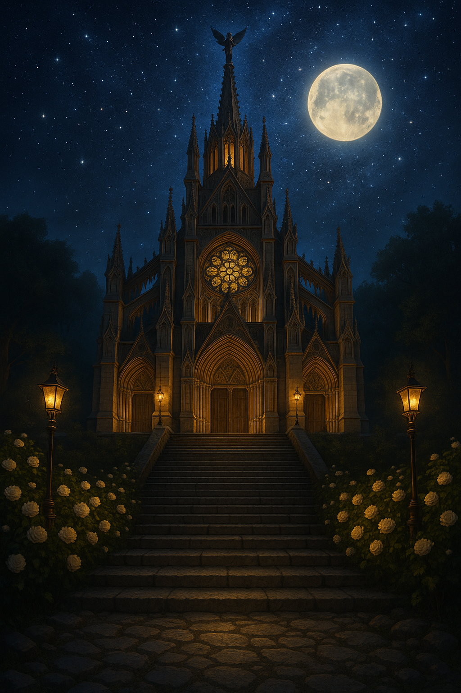{class="cover"}

::: page {layout="auto"}

# О приключении

## Аннотация

Сан-Сопригаль — небольшой прибрежный город, где жизнь обычно течёт размеренно. Но сегодняшнее утро принесло тревожные
вести: пропала местная торговка. Начальник гарнизона объявляет тревогу и запрещает покидать город до окончания
расследования.

Вы — отряд искателей приключений, оказавшийся здесь по совершенно другому делу, но именно вам предстоит распутать сеть
лжи, слухов и тайн, чтобы понять, что произошло на самом деле. Каждый шаг может сбить со следа, а неверное обвинение —
привести к новой трагедии.

## Описание

Приключение по системе D&D (2024) для 3–4 персонажей 1–3 уровня.

::: definition

**Средняя продолжительность:** 10–16 часов.

**Место действия:** Азалия, город Сан-Сопригаль (закрытая локация). Мир вдохновлён игрой Might & Magic X и циклом
«Плоский мир» Терри Пратчетта.

**Жанры:** детектив, социальное взаимодействие, мало боевых сцен.

**Дополнительные материалы:**
[на Google Drive](https://drive.google.com/drive/folders/1M9Ycx8IsTqvq3P1-V3OpA_76lOto1ABy) хранятся карты и
иллюстрации.

:::

## Примечания

Во время чтения документа вы можете столкнуться с обозначениями, введёнными для удобства и понимания контекста:

> Текст в подобных блоках предназначен для чтения вслух или краткого пересказа игрокам — например, при прибытии в
> локацию или выполнении условий сцены.

Номера страниц в углу позволяют быстро вернуться к оглавлению.

::: column

## Лицензия

Все упоминания «Подземелий и Драконов» и связанные материалы принадлежат Wizards of the Coast. Данный материал не
является официальным продуктом и не поддерживается или одобряется Wizards of the Coast. Все торговые марки и авторские
права, связанные с «Подземельями и Драконами», принадлежат их владельцам.

Материал предназначен исключительно для личного использования и не для коммерческого распространения.

Приключение оформлено с помощью [DnD Flavored Markdown](https://github.com/zavoloklom/dnd-flavored-markdown). Все
изображения сгенерированы с помощью ChatGPT.

Автор — [Сергей Куплетский](mailto:s.kupletsky@gmail.com).

<!-- prettier-ignore -->
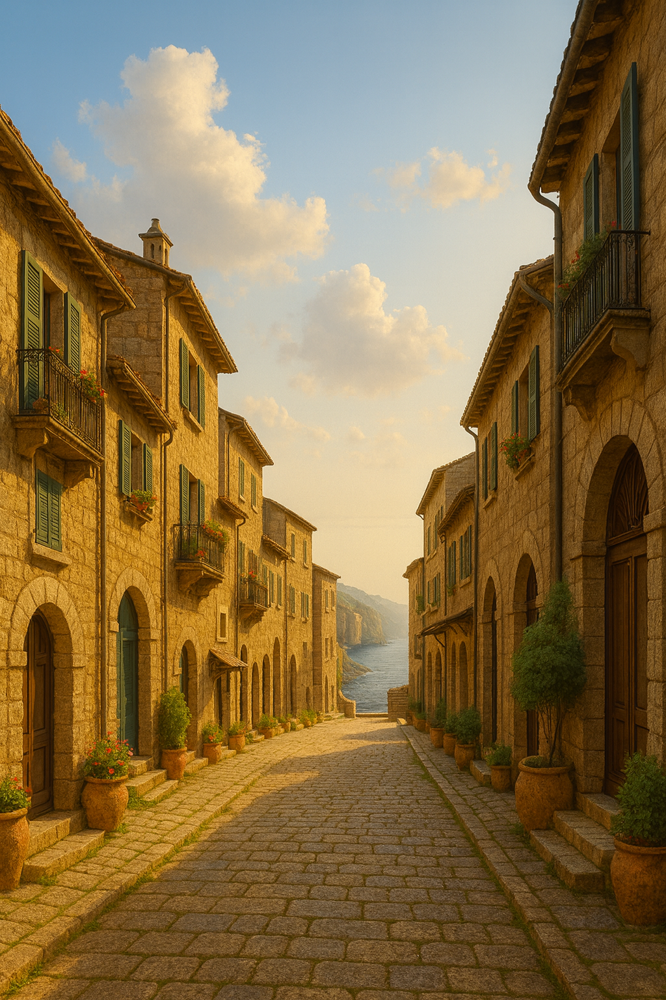{class="absolute-bottom-right mask mask--watercolor-03" style="height:700px; width: 400px; bottom: 0px; object-position: center -100px;"}

::: page {show-page-number="false"}

# Содержание

::: toc

- [О приключении](#о-приключении)
- [Введение](#сеттинг-и-ограничения)
  - [Сеттинг и ограничения](#сеттинг-и-ограничения)
  - [Предыстория](#предыстория)
  - [История происшествия](#история-происшествия)
  - [?? Улики](#улики)
  - [Советы Мастеру](#советы-мастеру)
  - [Карта полуострова](#карта-полуострова)
- [Глава 1: Прибытие](#завязка)
  - [Завязка](#завязка)
  - [Прибытие в город](#прибытие-в-город)
- [Глава 2: Сан-Сопригаль](#устройство-города)
  - [Устройство города](#устройство-города)
  - [Карта города](#карта-города)
  - [Дом Марии](#дом-марии)
  - [Рыночная площадь](#рыночная-площадь)
  - [Таверна «У Моря»](#таверна-у-моря)
    - [Подвал таверны](#подвал-таверны)
  - [Храм Света](#храм-света)
  - [Гарнизон](#гарнизон)
  - [Дозорная башня](#дозорная-башня)
  - [Городские ворота](#городские-ворота)
    - [Конфликт Розы и Хургана](#конфликт-розы-и-хургана-у-ворот)
  - [Дом Абрахама](#дом-абрахама)
    - [Подвал в доме Абрахама](#подвал-таверны)
  - [Библиотека (бывшая ратуша)](#библиотека)
  - [Дом Гюнтера](#дом-гюнтера)
  - [Заброшенный район](#заброшенный-район)
- [Глава 3: Катакомбы](#карта-катакомб)
  - [Ход из старого колодца](#ход-из-старого-колодца)
  - [Ход из дома Абрахама](#ход-из-дома-абрахама)
  - [Бухта контрабандистов](#бухта-контрабандистов)
  - [Большой зал](#большой-зал)
- [Глава 4: Последствия](#)
  - [Судьба катакомб](#судьба-катакомб)
  - [Обвинение](#обвинение)
  - [Похороны](#похороны)
- [Приложение: Персонажи](#приложение-персонажи)
  - [Краткий перечень персонажей](#приложение-персонажи)
  - [Хурган](#хурган)
  - [Гюнтер](#гюнтер)
  - [Гастон](#гастон)
  - [Дункан](#дункан)
  - [Хельмут](#хельмут)
  - [Кенки](#кенки)
  - [Роза](#роза)
  - [Селина](#селина)
  - [Карра](#карра)
  - [Йонас](#йонас)
  - [Стража](#стража)
  - [Горожане](#горожане)
- [Приложение: Слухи](#приложение-слухи)
- [Приложение: Предметы](#приложение-предметы)
- [Приложение: Улики](#)
- [Приложение: Монстры](#)
- [Приложение: Государства и Организации](#приложение-государства-и-организации)
- [Приложение: Пантеон](#приложение-пантеон)
- [Приложение: Названия месяцев](#приложение-названия-месяцев)
- [Приложение: Музыка и генераторы](#приложение-музыка-и-генераторы)
- [Заключение](#p76)

:::

::: page {footnote="Введение"}

# Сеттинг и ограничения

## Краткое описание мира

Мир Азалия запечатан древними печатями, изолирующими его от внешних планов существования. Из него нет связи с богами,
патронами и иными внешними силами.

Если печати становятся нестабильными или разрушаются, то открывается доступ в иные планы — вплоть до вторжений демонов и
магических аномалий.

Люди мира не знают о богах или печатях. Они слепо поклоняются ангелам, которых даже не видели.

## Магия

Все практикующие магию обязаны иметь разрешение на пребывание в Священной Империи или лицензию на использование магии.

Любая несанкционированная магия ведёт к допросам, арестам и казням.

При попытках использовать магию, связанную с иными планами (_Plane Shift_, _Gate_, _Summon Fiend_, _Contact Other Plane_
и т.п.) возможны катастрофические эффекты, либо заклинание не сработает вовсе.

## Жители Священной Империи

::: definition

**Люди** — основная раса; занимают лидирующие позиции.

**Дворфы, гномы и полурослики** — терпимы, но считаются «чужими». Им доверяют ремесло и торговлю, однако держат на
расстоянии.

**Орки и голиафы** воспринимаются как дешевая рабочая сила и наёмники. При любом конфликте вина обычно ложится на них.

**Дроу и полуэльфы** сталкиваются с открытой неприязнью. Насилие против них часто остаётся безнаказанным.

**Эльфы** одичали и живут в лесах (неиграбельная раса).

**Тифлинги** — результат экспериментов магов с демонической кровью последних двух лет. Никому, кроме создателей, они не
известны. Разрешено играть за тифлинга, который каким-то образом сбежал. Немаскирующегося тифлинга, скорее всего, примут
за демона и атакуют без раздумий.

**Аасимары** — люди с подселённой душой ангела (они об этом не знают). На использование врождённых способностей наложены
ограничения: в критической ситуации возможно самопроизвольное их проявление при провале спасброска Мудрости (СЛ 15). Чем
чаще способности применяются, тем сильнее влияние ангела (контроль переходит к Мастеру).

**Драконорождённые** отсутствуют (неиграбельная раса).

:::

## Классовые ограничения

::: definition

**Чернокнижники (Warlocks).** Стандартные патроны (Fiend, Archfey, Great Old One) недоступны. Возможны адаптации:
внутренний источник силы, аномалии, древние артефакты.

**Клирики и паладины.** Действуют через веру в ангела (_см. [Приложение: Пантеон](#приложение-пантеон)_), как правило
без прямого ответа.

**Маги (Wizards) и колдуны (Sorcerers).** Должны скрывать свою практику или получить легальный статус.

:::

<!-- prettier-ignore -->
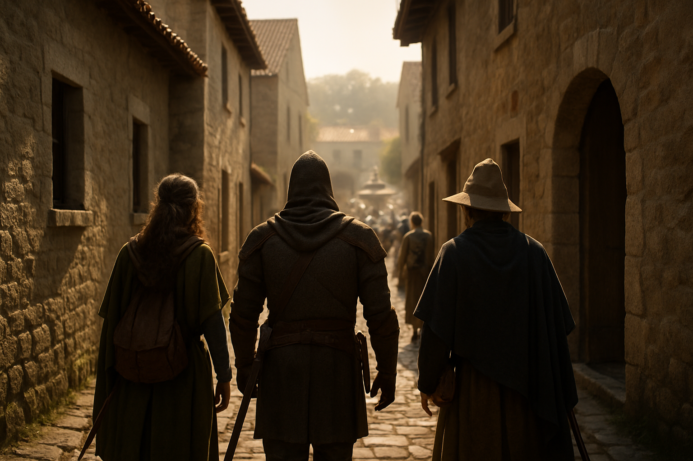{class="mask mask--background-bottom-third-02" style="object-position: center 105%; object-fit: contain; bottom: -75px;"}

::: page {layout="left" footnote="Введение"}

# Предыстория

## Полуостров Драгонвинг

Драгонвинг — полуостров-протекторат: формально подчинён Священной Империи (_см.
[Приложение: Государства и Организации](#приложение-государства-и-организации)_), но фактически стремится к
независимости, особенно после того, как центральная власть не смогла защитить города полуострова от демонов.

Представителей империи здесь встречают с недоверием, а порой и с открытой враждой.

## Сан-Сопригаль

Сан-Сопригаль — старый прибрежный город на окраине Священной Империи, в пределах полуострова Драгонвинг.

Когда-то он был важным узлом на торговых путях и процветал на торговле, рыболовстве и, по слухам, контрабанде. Но войны,
экономический спад и усиление имперского контроля сделали своё дело — теперь это городок, куда редко заглядывают важные
персоны и торговые караваны.

## Вторжение демонов

Примерно _два года назад_ демонические силы захватили окрестности Сан-Сопригаля и взяли город в осаду. Связь с другими
городами прервалась, помощи извне не поступало.

Спустя месяц демоны исчезли так же внезапно, как появились. Остались лишь небольшие группы, с которыми стража быстро
справилась.

Во время осады погибла значительная часть стражи и множество людей, в том числе мэр города **Стор Сулим**, **дед
Йонаса**, а также вся **семья Гюнтера**.

Осада оставила глубокие следы: вера в ангелов ослабла (хотя вслух об этом не говорят), а в обществе появились страх и
недоверие.

После гибели мэра город возглавил командир стражи полуорк **Хурган**. Он сохранил военное командование и остался в
гарнизоне, а здание ратуши передал под библиотеку.

Хурган сумел восстановить порядок. Теперь Сан-Сопригаль снова живёт обычной жизнью, хотя страхи и шрамы прошлого никуда
не делись.

<!-- prettier-ignore -->
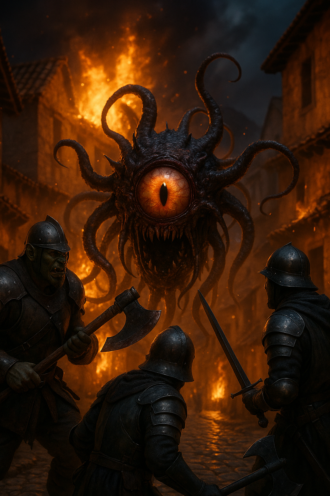{class="mask mask--background-right-half" style="object-position: 50px center;"}

<!-- prettier-ignore -->
[//]: # (По слухам, в последние дни мёртвые поднялись и сражались на стороне живых. Церковь категорически запрещает обсуждать эти рассказы, считая их ересью.)

::: page {footnote="Введение"}

# История происшествия

Далее приведена хронология событий. При первом упоминании имена персонажей ведут ссылкой на их карточки в разделе
**[Приложение: Персонажи](#приложение-персонажи)**.

Названия месяцев Азалии см. в разделе **[Приложение: Названия месяцев](#приложение-названия-месяцев)**.

## Прибытие мага

_3 Нарваила (февраля)_

- В город прибывает некромант **[Абрахам](#абрахам)**, ранее проводивший запрещённые эксперименты в
  [Соединённых Магических Государствах](#приложение-государства-и-организации). Теперь он скрывается и хочет продолжить
  исследования в уединении.
- Он арендует дом у **[Йонаса](#йонас)** (внука контрабандиста), оплачивает на год вперёд и заселяется. Об этом доме и
  проходе из него в катакомбы Абрахам осведомлён по старым связям с контрабандистами из
  [Чёрной Медузы](#приложение-государства-и-организации). Йонас о тайном ходе не знает.
- Абрахам заказывает у Чёрной Медузы доставку своих особых пауков, чтобы продолжить эксперименты с их ядом.
- Он запирается в подвале и в городе не появляется. По городу ходят слухи, что он маг, но всем все равно.

## Мария и Абрахам

_Нарваил (февраль)_

- Торговка травами и благовониями **[Мария](#мария)** поставила Абрахаму ингредиенты, нужные для экспериментов.
- Абрахам заплатил больше обычного и просил сохранять тайну.
- В благодарность он передал Марии свиток с простым заклинанием и инструкциями.
- Более Абрахам за ингредиентами не обращался, и Мария не посчитала это странным.

## Прибытие Розы

_1 Беталассы (марта)_

- **[Роза](#роза)** (паладин [Церкви Света](#приложение-государства-и-организации)) прибывает в Сан-Сопригаль и не
  раскрывает цель визита. Она не признаёт местную власть и действует по тайному мандату.
- Поселяется при [Храме](#храм-света) и периодически покидает город на несколько дней.
- Её миссия — расследовать недавние нападения на торговцев в округе и отыскать похищенный церковный артефакт.

## Доставка

_1 Беталассы (марта)_

- Контрабандисты **Петер** и **Бошир** привозят контрабанду и ящики с пауками в бухту под городом.
- Вечером они отдыхают в таверне под видом торговцев, напиваются, лезут к Розе и ввязываются в драку.
- Ночью они спускаются в катакомбы разгружать лодку. Большой ящик падает и ломается. Голодные пауки нападают и убивают
  обоих.
- В их номере остаётся «торговая» одежда для прикрытия. Обнаружив, что постояльцев нет, хозяин таверны
  **[Хельмут](#хельмут)** передаёт вещи официанту **[Кенки](#кенки)**.
- На следующий день Абрахам, не дождавшись людей и груза, сам спускается в катакомбы. Пауки убивают и его.
- Стража не ищет Петера и Бошира: по бумагам это обычные торговцы, которые нередко уезжают без лишнего шума.

## Мария и Гюнтер

_Нарваил–Лотвиэль (февраль–апрель)_

- Мария тайно встречается со стражником **[Гюнтером](#гюнтер)** на [дозорной башне](#дозорная-башня) во время его ночных
  дежурств.
- Гюнтер одержимо пытается увязать исчезновения людей с Розой, считая её инквизитором.
- Его паранойя передаётся Марии. Она избегает Розы и больше не посещает [Храм](#храм-света), хотя раньше ходила туда
  часто.
- После приезда Розы и под влиянием теорий Гюнтера Мария боится ареста за изучение магии.
- На этом фоне у Марии и Гюнтера происходит конфликт и ссора.

::: page {footnote="Введение"}

## Две недели назад

_Начало Лотвиэля (апреля)_

- Паук-матриарх откладывает яйца и «настраивает» всех пауков на перенос добычи под землю.
- Ночью **Бертрам** (местный пьяница) проваливается в старый колодец в **[Заброшенном районе](#карта-города)**, ведущий
  в катакомбы, и погибает от пауков. Его никто не ищет: решают, что он снова запил.
- Пауки обнаружили выход на поверхность через колодец и начинают охоту по ночам.
- Обычно **[дети](#горожане)** тайком играли в Заброшенном районе, но после того как начали слышать «странные звуки»,
  перестали туда ходить.
- Перебравшись для игр в **[квартал Ремесленников](#карта-города)**, дети разбивают окно в
  [доме Абрахама](#дом-абрахама). Йонас узнаёт, что постоялец исчез, но в стражу не обращается: он боится лишнего
  внимания и предпочитает считать, что маг просто уехал.

## Исчезновение Марии

_12 Лотвиэля (апреля), вторник_

- После разговора с подругой **[Каррой](#карра)** Мария решает прекратить отношения с Гюнтером, но тянет с разговором.
- Гюнтер заранее меняется сменами с дневным стражником, убирает башню и готовится сделать предложение Марии на закате.
- Мария идёт к башне, но замечает, как Роза возвращается в город. Мария сворачивает в Заброшенный Район, чтобы не
  попадаться ей на глаза.
- У [старого колодца](#) Мария чувствует странный запах. Подходит ближе, и голодные пауки утаскивают её вниз. Пытаясь
  отбиться заклинанием, она обрушивает старую кладку, и шахта заваливается.
- Гюнтер не дожидается Марии, нервничает, но пост не покидает.
- В город прибывает контрабандист **[Гастон](#гастон)** в поисках шкатулки, которую должны были доставить Петер и Бошир.
  Ночью он пытается пробраться [в бухту с моря (отметка 11 на карте)](#карта-города), но его замечают моряки, и он
  отступает.

## Обнаружение пропажи Марии

_13 Лотвиэля (апреля), среда_

- Утром Гюнтер видит, что лавка Марии пуста, а [дома](#дом-марии) никто не открывает. Он уговаривает командира
  **[Хургана](#хурган)** взломать дверь и начать расследование.
- Хурган закрывает город на время расследования, чтобы удержать порядок и контролировать выезды. Для него это хорошая
  возможность напомнить горожанам, кто в городе главный, и показать, что он справляется со своими обязанностями. Он
  считает, что Мария сама найдётся через несколько часов.
- **Герои** прибывают в Сан-Сопригаль.

<!-- prettier-ignore -->
{class="mask mask--background-bottom-third-01" style="object-position: center bottom; object-fit: contain;"}

::: page {layout="auto" footnote="Введение"}

# Улики

Для того чтобы "раскрыть дело" герои должны прийти к выводам перечисленным далее. На каждый из выводов должно вести не
менее [трех](<(https://thealexandrian.net/wordpress/1118/roleplaying-games/three-clue-rule)>) независимых улик либо
источников. Ограничиваться только перечисленным необязательно, вы лучше знаете своих игроков и на что они способны.

::: box

#### Причина пропажи Марии

**Кто:** искажённые пауки.

**Зачем:** голод.

**Как:** нашли выход через колодец из катакомб.

:::

## Вывод 1

**Вывод:** Мария не покидала город.

- ! Марию видели на [рынке](#рыночная-площадь) с 10:00 до 18:00.
- ! + Осмотр [дома Марии](#дом-марии) показывает, что она явно собиралась вернуться.
- [Стражники](#стража) у ворот не видели, чтобы она покидала город.

## Вывод 2

**Вывод:** Мария шла к башне вечером на встречу с Гюнтером.

- ! + [Дневник Марии](#дневник-марии): запись о встрече вечером.
- ! + [Карра](#карра): Мария встречалась с парнем-стражником на сторожевой башне.
- [Гюнтер](#гюнтер): они собирались встретиться на закате, но Мария не пришла.

## Вывод 3

**Вывод:** Мария пропала в Заброшенном районе.

- [Карра](#)/[Селина](#)/[Гюнтер](#): Мария избегает Розу и ходит так, чтобы ни в коем случае не пересечься.
- [Гюнтер](#)/[горожане](#): видели, как Мария идёт в сторону площади на закате.
- [Гюнтер](#)/[Селина](#)/[горожане](#): видели, как Роза в это время возвращалась в город на закате.
- ! Следы [у колодца](#заброшенный-район): амулет Марии.
- [Роза](#)/[дети](#): видели, как Мария начала прятаться и пошла в Заброшенный район.

::: page

## Причина появления пауков

::: box

**Кто:** контрабандисты Петер и Бошир.

**Зачем:** Абрахам заказал «своих» пауков.

**Как:** под видом торговцев завезли «товар» в катакомбы и случайно их выпустили.

:::

## Вывод 1

**Вывод:** В городе действует сеть контрабанды.

- Хельмут/Кенки: история про загадочных «торговцев», которые приехали под странным предлогом и обсуждали «медуз».
- ! Осмотр [оставленных вещей](#вещи-торговцев): очевидное прикрытие + фальшивые бумаги.
- [Йонас](#) рассказывает о своём деде так, что похоже — дед был контрабандистом.
- ! Замок в [доме Абрахама](#дом-абрахама) особенный, редкий; такие просто так не получают и не вешают.
- ! [Дневник Абрахама](#дневник-абрахама): «товар доставят друзья из Медузы».
- ! [Следы у колодца](#заброшенный-район): метка «Медузы» на одном из камней.

Гастон знает про контрабанду и укрытие, но не будет просто так говорить.

## Вывод 2

**Вывод:** В городе есть укрытие котрабандистов

- ! [Книга в библиотеке](#библиотека): в городе может быть сеть подземелий.
- ! + [Дозорная башня](#дозорная-башня): участок побережья не просматривается со сторожевой башни.
- ! [Подвал Дома Абрахама](#подвал-дома-абрахама) и [Дневник Абрахама](#дневник-абрахама): скрытый механизм за стеной.
- ! [Следы у колодца](#заброшенный-район): метка «Медузы» на одном из камней.

Гастон знает про контрабанду и укрытие, но не будет просто так говорить.

## Вывод 3

**Вывод:** Петер, Бошир и Абрахам пропали

- [Гюнтер](#): расскажет, что пропали «торговцы», которые подрались с Розой (он их искал, чтобы узнать, не знакомы ли
  они с Розой).
- [Гюнтер](#) сообщит, что пропал и Абрахам; утром он спрашивал про купцов.
- ! Осмотр [вещей торговцев](#вещи-торговцев): (фальшивые) бумаги очень ценные — такое не бросают.
- !? В [Доме Абрахама](#дом-абрахама) выбито окно, самого его нет.
- [Йонас](#) скажет, что тот оплатил дом на год, но давно не показывался.
- [Гастон](#): сообщит, что знакомые торговцы везли заказ кому-то в городе, но затем пропали.

## Вывод 4

**Вывод:** Нарастающая активность пауков.

- Первые люди пропали полтора месяца назад.
- Стражники/горожане замечают, что последние месяц-полтора ночами меньше слышно пьяных гуляк – как будто не только люди
  избегают выходить после заката, но и животные.
- ! Месяц назад начали пропадать крысы из [подвала Таверны](#подвал-таверны).
- Дети перестали ходить в Заброшенный район (~2 недели).
- Пропажа собак/кошек в последние две недели.

## Вывод 5

**Вывод:** В подземелье пауки

- Кенки: У контрабандистов при себе был противоядный состав от нейротоксина.
- ! [Подвал таверны](#подвал-таверны): Небольшие пауки в подвале таверны ведут себя так, как будто им кто-то приказывает
  (бросают добычу и тянутся в щели вниз).
- [Дневник Абрахама](#дневник-абрахама): упоминания об экспериментах с паучьим ядом, формула нейтрализации (в подвале
  также есть пузырьки с противоядием и алхимический набор).
- ! + Селина/Слухи: Некоторым горожанам снятся сны, в которых они превращаются в пауков. (Атмосферная улика.)

## Вывод 6

**Вывод:** Это все случайность

- ! Разбитые ящики в бухте и следы борьбы — явно что-то вылезло из ящиков при разгрузке.
- ! Останки мага: в катакомбах — тело в чёрной мантии, рядом сумка со свитками и сломанный жезл; вокруг — растоптанная
  паутина и трупики пауков (пытался отбиться).
- ! Больше нет свежих следов спускающихся сюда людей до прихода героев. Фея в лампе говорит, что сидит тут уже полтора
  месяца.

::: page {layout="auto" footnote="Введение"}

# Советы Мастеру

Это детективное приключение: его ядро — социальные взаимодействия и расследование, а не бои. Не превращайте каждый
разговор в бросок кубиков — успех должен зависеть от того, **кого**, **когда** и **о чём** спрашивают игроки.

НПС меняют отношение не от красноречия, а от рычагов: игроки могут показать улику, назвать имя, поймать на несостыковке.
Бросок убеждения усиливает уже созданный рычаг.

При осмотре помещений, чем точнее сформулирован запрос, тем ниже сложность. Давайте преимущество за улики и правильные
методы. На провале возможен частичный успех с ценой (время, шум, подозрения).

Помните о гибкости. Если партия пришла к разумной гипотезе, подтвердите её мелкой уликой в ближайшей локации или
разговоре, даже если изначально её там не было.

## Подготовка к сессии

Перед игрой попросите игроков продумать мотивацию, почему их персонажи готовы помочь в расследовании (по зову сердца,
ради награды, из уважения к наставнику и т. п.), а также как они познакомились друг с другом или с их наставником
**Джаредом**.

## Подозреваемые и подсказки

Скорее всего в начале игроки будут подозревать **Гюнтера** или **Розу**. Поддержите их версию или мягко направьте на
верный след.

Если игроки застрянут, вы можете помочь им через персонажей стражи или **Гастона**, которые также заинтересованы попасть
в катакомбы.

## Реакция окружения

Вы сами определяете, сколько внутриигрового времени занимают сцены и переходы между локациями. Сообщите игрокам, что
время в городе идёт, и мягко намекните, что промедление повлечёт последствия.

Далее приведён пример развития событий, если герои не будут вмешиваться.

::: column

### День первый

_13 Лотвиэля (апреля), среда_

- Гюнтер готовит и развешивает по городу плакаты о пропаже Марии.
- **Конфликт Хургана и Розы**: Роза пытается покинуть город, стражники останавливают её у ворот.
- Формируется группа волонтёров, которая отправляется искать Марию.
- Гастон ночью проникает в дом Абрахама, замечает пауков в катакомбах и возвращается.

### День второй

_14 Лотвиэля (апреля), четверг_

- **Мария умирает в катакомбах**, если её не спасли.
- Гастон может обратиться к героям с просьбой сопроводить его в катакомбы.
- К вечеру волонтёры находят следы борьбы у старого колодца и сообщают Хургану.
- Узнав о пауках, Хурган собирает отряд стражи и спускается в катакомбы. Стража штурмует катакомбы и уничтожает пауков.
  Из всего отряда возвращается только Гюнтер.
- Город скорбит по Хургану, непосредственная угроза устранена.

## Боевые сцены

Бой в катакомбах должен быть напряжённым, но честным. Ведите бой так, чтобы игрокам выгодно было задействовать местность
(огонь, паутина, узкие проходы и т. д.).

## Что дальше

Приключение можно провести как ваншот или сделать прологом кампании. Зацепки к этим линиям спрятаны в описаниях
персонажей и их репликах — используйте их по необходимости или исключите из своей игры:

- Проблемы с нежитью на старом кладбище.
- Поход на дракона в горах по заданию **Дункана**.
- Совместное с **Розой** расследование нападений на торговцев.

::: page {footnote="Введение"}

# Карта полуострова

::: wide

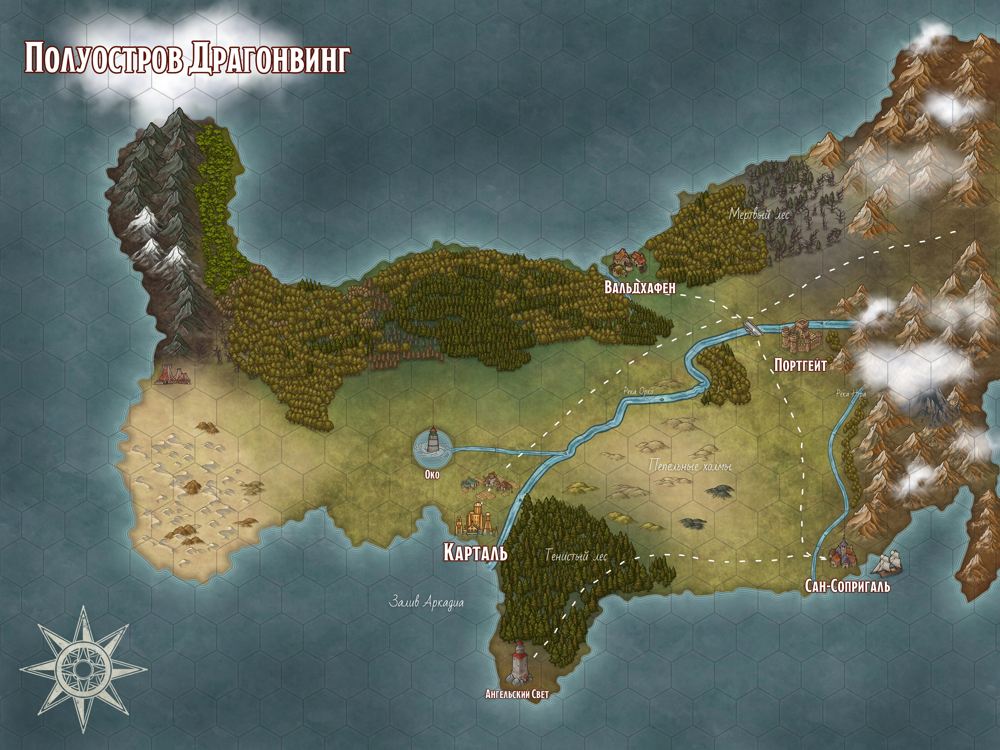{class="framed-map"}

:::

## Описание карты

Эта карта нужна только для ориентира: показать, где находится **Сан-Сопригаль** и как он соотносится с остальными
местами полуострова. В рамках текущего приключения герои **не покидают город**, поэтому карта не даёт подсказок по
сюжету и не используется механически.

Покажите её один раз в начале, чтобы задать масштаб и атмосферу. Один гекс - 12 миль.

Карталь, Портгейт и другие локации остаются на будущее — как направления кампании, если вы решите продолжить историю за
пределами города.

Полный архив всех карт доступен по ссылке:
[Скачать с Google Диска](https://drive.google.com/drive/folders/1kkLD4GegIr0Q5sSph8yz1zEEGgtrtRQs).

::: column

## Местность

::: definition

**Погода.** Преимущественно морской климат: туманы у побережья, резкий ветер с хребта, весенние паводки и осенние
штормы.

**Теневой лес.** Густой и почти непроходимый лес восточнее Карталя.

**Пепельные холмы.** Сухие, серые увалы к северо-западу от Сан-Сопригаля. Здесь находится старое городское кладбище
Сан-Сопригаля.

**Портгейт.** Крепость у восточных перевалов; резиденция губернатора полуострова и главный таможенный пост. Контролирует
движение между полуостровом и Империей.

**Око.** На озере в форме глаза стоит древняя постройка, известная как Око.

**Связь с Империей.** Горная гряда отделяет полуостров от остальной Империи. Единственный сухопутный путь проходит через
горные перевалы на северо-востоке; в непогоду перевалы закрывают.

:::

::: page {layout="auto"}

::: chapter Глава 1 | Прибытие

Вы можете позволить игрокам самим придумать причины для посещения Сан-Сопригаля, а можете воспользоваться следующим
сюжетным крючком.

# Завязка

Герои — группа искателей приключений, направляющаяся в город **Карталь** исполнить последнюю волю наставника
**Джареда**: доставить его прах в родной город и похоронить там.

Из-за недавних нападений на торговые корабли и опасностей в прибрежных водах путь по морю временно закрыт. Единственный
путь в Карталь — сухопутный, через земли **Священной Империи**. Герои решают причалить в городе **Сан-Сопригаль**, чтобы
продолжить путь по суше.

Это вступление погружает игроков в атмосферу мира и коротко поясняет фон событий.

> Азалия. 13 Лотвиэля, 567 год ПП. То есть После Падения Великой Империи.
>
> Церковь учит, что Великую Империю, как и весь мир, создали ангелы. Там не было голода, болезней и войн, а люди мирно
> жили вместе с дворфами, орками и — хоть и верится с трудом — эльфами. Говорят, тогда и эльфы были другими. Но однажды
> всё кончилось, и от Великой Империи остались лишь руины и странные, величественные строения.

> Теперь всё иначе. Люди в основном живут в Священной Империи; Король-Под-Горой правит дворфами и гномами, а маги,
> отвергнув Церковь, основали Соединённые Магические Государства. Племена орков и гоблинов же держатся на востоке.

> Два года назад по всей Азалии появились невиданные прежде твари. Их прозвали демонами, исчадьями — любыми словами, что
> могли выразить страх. Отбиться от них удалось только ценой больших потерь.

> Долгий путь позади. Несколько недель вы держали курс на Карталь, чтобы исполнить последнюю волю Джареда: его прах
> должен покоиться в родном городе. Но неожиданно выяснилось, что морское сообщение с Карталем прервано. Вы собираетесь
> причалить в небольшой прибрежный город Сан-Сопригаль, чтобы продолжить путешествие по суше.

Герои уже близко к городу — это наводит на воспоминания о прошлом. Попросите игроков коротко рассказать, как их
персонажи познакомились друг с другом и с **Джаредом**.

<!-- prettier-ignore -->
{class="absolute-bottom-right mask mask--watercolor-02" style="height:550px; width: 385px; bottom: 0; object-position: -50px -90px;"}

::: page {layout="auto"}

# Прибытие в город

Герои прибывают на причал Сан-Сопригаля утром.

> Вы прибываете в город утром. Город расположен на скалистом побережье, и уже издалека ваш взгляд приковывает высокая
> дозорная башня, возвышающаяся над городом. На её вершине можно заметить силуэт часового, вглядывающегося в горизонт.
>
> Вы сходите на обветшалый пирс вместе с капитаном. Капитан, не оглядываясь, проходит в город мимо скучающего на посту
> стражника.
>
> Вы стоите у воды и наблюдаете, как рыбаки выгружают улов и переговариваются с человеком в плаще на краю причала.

Если герои сразу идут в город переходите к [входу в город](#вход-в-город).

Если герои захотят осмотреться или подойти к рыбакам – переходите в локацию «[Причал](#причал)».

## Вход в город

Стражник у ворот может спросить у героев формальные вопросы - «имя, цель визита, сталь на виду; магию — не
демонстрировать».

После прохода через ворота:

> При входе в город вы замечаете тревожную картину:
>
> Один из домов выглядит взломанным: дверь выбита, а на пороге стоят вооружённые стражники. Несколько зевак собралось
> вокруг и шёпотом обсуждает происходящее. Полуорк в доспехах — судя по всему, главный — хмуро осматривается по
> сторонам. Рядом с ним стоит молодой стражник, заметно обеспокоенный.

Местные могут рассказать, что такой сигнал подавали в последний раз во время нашествия демонов.

> Полуорк подносит к губам горн и трубит так, что звук раскатывается по скалам и бухте — его слышит весь город. Он
> поднимает руку, призывая к тишине, и громко объявляет:
>
> _«Сопригаль закрыт! Никто не покидает город без моего разрешения, пока мы не разберёмся!»_
>
> Толпа гудит, люди переговариваются. Ваш путь в Карталь теперь откладывается – город заперт, и, похоже, здесь творится
> нечто странное.

Сцена переносится в локацию [Дом Марии](#дом-марии).

<!-- prettier-ignore -->
 {style="height:500px" class="framed-image"}

::: page

::: chapter Глава 2 | Сан-Сопригаль

Город — основная локация этого приключения и небольшая «песочница», по которой герои могут перемещаться в любом порядке.
Если игроки направятся в неописанную городскую локацию, импровизируйте, опираясь на общую атмосферу и устройство города.

# Устройство города

Город небольшой (около 500 жителей), который стоит на скальных террасах. Основные мотивы — узкие каменные улочки, крутые
лестницы и арочные проходы. По утрам пахнет солью, водорослями и рыбой; днём — гул мастерских; к вечеру спускается
густой туман.

_Референс — средиземноморские города вроде Атрани (Италия)._

## Районы

Город разделён на несколько районов:

::: definition

**Портовый.** Пристань со складами и лавками снастей. Рядом теснятся дома бедняков. Здесь шумно и пахнет солью и дымом.

**Бархатный.** Дома зажиточных горожан и чистые улочки. Стража патрулирует чаще. В некоторых домах стоят простые
сигнализации.

**Центральный.** Городская площадь, главные здания и рынок. Здесь вывешивают объявления и собирается народ.

**Квартал Ремесленников.** Конюшня, кузни и мастерские работают весь день. В этом районе живут в основном те, кто здесь
работает.

**Заброшенный.** Полуразрушенные дома и пустыри, оставшиеся после вторжения демонов. Местные обходят район стороной.

**Горный.** Небольшие дома у склона и крутые лестницы. Дует сильный ветер, осыпаются камни. Встречаются входы в старые,
чаще всего заброшенные шахты.

:::

::: column

## Описание локаций

В этой главе описаны ключевые локации Сан-Сопригаля. Каждая локация описана по шаблону: описание, персонажи, предметы,
информация, события.

Информация в локациях — это то, что можно узнать только на месте (осмотр, следы, контекст окружения), тогда как
информация в карточках персонажей (см. "[Приложение: Персонажи](#приложение-персонажи)") — это то, что они могут
рассказать в любой точке города.

## Стража

В городе запрещено открытое применение оружия и магии. Порядок поддерживает немногочисленная стража. Если игроки
затевают сомнительное дело, они могут раздобыть расписание патрулей, чтобы спланировать маршрут и время действий и не
попасться.

#### Расписание работы стражи

| Роль             | День        | Ночь        |
| :--------------- | :---------- | :---------- |
| Городские ворота | 2 стражника | 1 стражник  |
| Портовые ворота  | 1 стражник  | —           |
| Дозорная башня   | 1 стражник  | 1 стражник  |
| Старая башня     | 1 стражник  | —           |
| Патруль города   | 2 стражника | 2 стражника |
| **Всего:**       | **8**       | **4**       |

::: page

# Карта города

::: wide

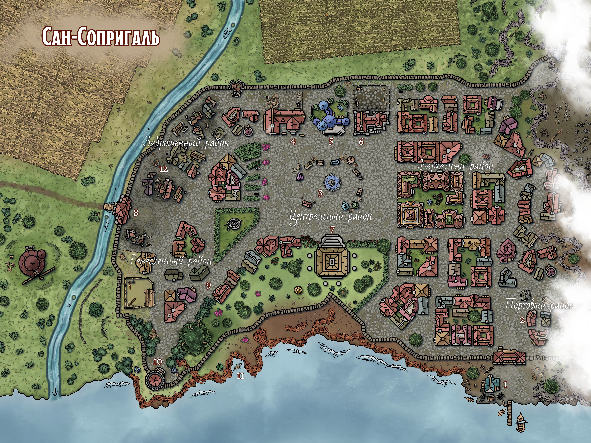{class="framed-map"}

:::

## Локации

В городе есть несколько ключевых мест, которые могут быть полезны игрокам:

1. [Причал](#причал)
2. [Дом Марии](#дом-марии)
3. [Рыночная площадь](#рыночная-площадь)
4. [Таверна «У Моря»](#таверна-у-моря)
5. [Библиотека / Старая ратуша](#библиотека)
6. [Гарнизон](#гарнизон)
7. [Храм Света](#храм-света)
8. [Городские ворота](#городские-ворота)
9. [Дом Абрахама](#дом-абрахама)
10. [Дозорная башня](#дозорная-башня)
11. Проход в бухту контрабандистов
12. [Заброшенный колодец](#заброшенный-район)

::: column

## Для игроков

Игрокам можно выдать **[карту без обозначений](#приложение-карты-для-игроков)** после разговора с Хурганом или Дунканом
или по их явному запросу «разобраться в устройстве города».

Полный архив всех карт доступен по ссылке:
[Скачать с Google Диска](https://drive.google.com/drive/folders/1kkLD4GegIr0Q5sSph8yz1zEEGgtrtRQs).

::: page

# Причал

## Описание

_Номер на [карте](#карта-города) — **1**. Доступен только утром первого дня, перед входом в город._

> Вы решаете задержаться на причале.
>
> Лодки покачиваются у помоста, солёный ветер тянет запах водорослей и свежей рыбы. Доски под ногами поскрипывают.
>
> На берегу, рядом с невысоким деревянным зданием — складом и местом отдыха моряков, переговариваются рыбаки.
>
> Заметив вас, человек в плаще оборачивается и внимательно наблюдает.

## Персонажи

- [Дункан](#дункан) — бывший приключенец; разговаривает с рыбаками.
- Местные [рыбаки](#горожане).

::: column

## Информация

- `@Intimidation 10` или `@Persuasion 15` Рыбаки нехотя признаются: ночью кто-то был на причале.
- Дункан охотно рассказывает краткую историю города и уверяет, что это отличное место для спокойной пенсии. После беседы
  можно выдать игрокам [карту города без обозначений](#приложение-карты-для-игроков).

## События

**Сигнал тревоги.** Через несколько минут звучит горн — народ тянется к воротам увлекая героев за собой. Сцена переходит
к [входу в город](#вход-в-город).

<!-- prettier-ignore -->
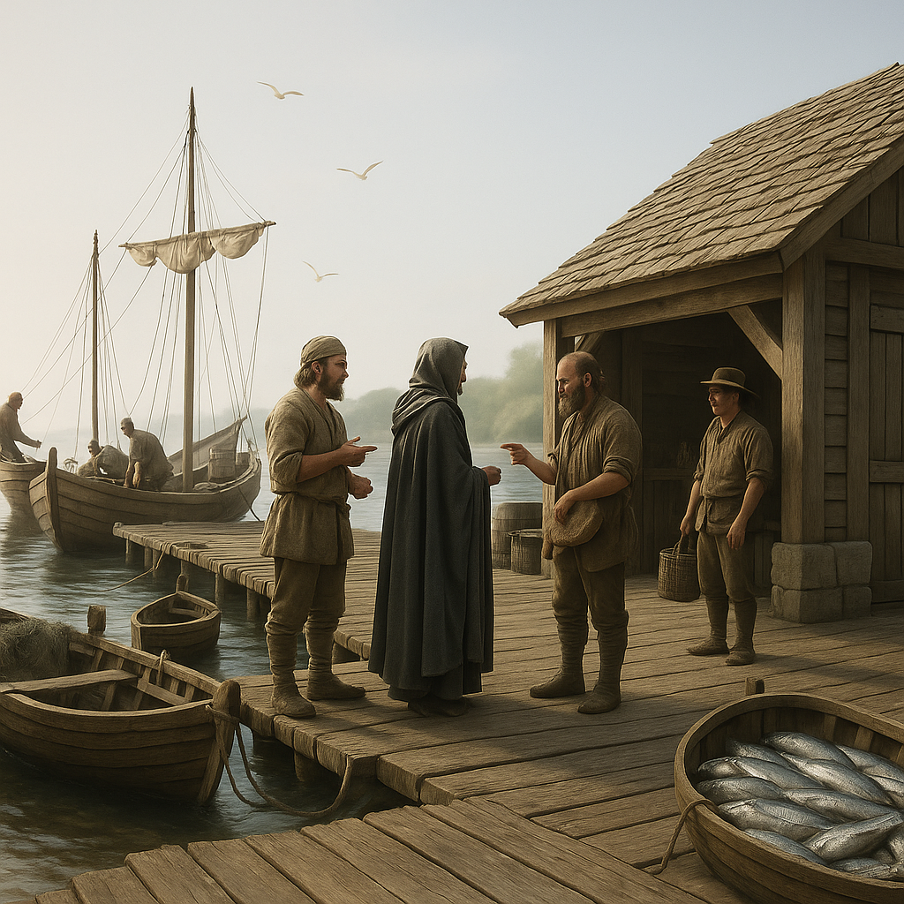{class="mask mask--background-bottom-half" style="object-position: center bottom; object-fit: contain;"}

::: page

# Дом Марии

## Описание

_Номер на [карте](#карта-города) — **2**._

Небольшой одноэтажный дом с выбитой дверью.

> Вы переступаете порог небольшого, но уютного дома. Внутри тихо и чисто. Пахнет благовониями и сушёными травами. На
> низком столе — флаконы масел и связки душицы с лавандой. Над столом — полка с книгами.
>
> За лёгкой занавеской видны крошечная кухня и спальня.

## Персонажи

- [Хурган](#хурган) — утром первого дня. Спокоен, деловит.
- [Гюнтер](#гюнтер) — утром первого дня. Бледен, напряжён, сильно нервничает.
- [Стража](#стража) — после ухода Хургана и Гюнтера дежурит у входа, пока не починят дверь.

## Предметы

- [Дневник Марии](#дневник-марии).
- Свиток с заклинанием [Mold Earth](https://www.dndbeyond.com/magic-items/10761966-spell-scroll-of-mold-earth).  
  **Домашнее правило:** при успехе `@Arcana 10` свиток можно читать как ритуал (10 минут), не расходуя его.
- [Разрешение гарнизона](#разрешение-гарнизона) на помощь страже.

<!-- prettier-ignore -->
 {style="width:320px;height:280px;" class="framed-image"}

::: column

## Информация

**Осмотр дома в целом:**

- Это не похоже на ограбление: вещи на местах, полки целы, следов борьбы или крови нет.
- На кухне — недопитая чашка и пустая тарелка. Всё выглядит так, будто хозяйка просто отошла.

**При внимательном осмотре:**

- **Кухня.** На настое появилась тонкая плёнка — чашка стоит здесь со вчерашнего вечера.
- **Кухня.** `@Nature 12` — настой это успокоительное от тревоги.
- **Стол с маслами.** `@Survival 14` — среди привычного встречаются ядовитые (болиголов, крушина).
- **Книги.** `@Perception 13` — из одной книги выпадают засушенные цветы и небольшая любовная записка.
- **Спальня.** `@Perception 10` — под кроватью спрятан [дневник Марии](#дневник-марии).
- **Тайник в книгах.** `@Investigation 14` или `@Arcana 10` — между страниц спрятан свиток заклинания с краткой
  инструкцией.

## События

**Осмотр дома.** Если герои спрашивают про закрытие города: _«Ничем не помогу — приказ уже отдан. Но можете помочь в
расследовании: найдём Марию быстрее — быстрее уедете»_. Если герои стоят в стороне и не вмешиваются, Хурган сам замечает
их, прикидывает, что они искатели приключений, и обращается: _«Вы — не местные. Поможете? Людей не хватает. Скромная
награда будет»._

Хурган **отправляет Гюнтера в гарнизон** и предлагает героям осмотреть дом под своим присмотром. Попытку унести вещи
пресекает: останавливает и предупреждает об аресте. Если герои подтверждают вывод «похищения из дома не было», он выдаёт
им [письменное разрешение](#разрешение-гарнизона) помогать страже.

Если герои ушли и вернулись позже, доступ в дом закрыт: потребуется разрешение Хургана или отвлечение дежурного.

::: page

# Рыночная площадь

## Описание

_Номер на [карте](#карта-города) — **3**._

> Узкая мощёная улица выводит вас на широкую площадь — сердце Сан-Сопригаля. Торговцы перекрикиваются, вперемешку слышны
> смех, шаги и звон монет. Воздух пахнет жареной рыбой и свежим хлебом.
>
> В центре возвышается каменный фонтан с фигурой ангела и резными волнами. Вода мягко журчит по потемневшим от времени
> краям чаши. Вокруг под полотняными навесами тесно стоят ряды торговых палаток. Люди снуют между рядами: кто-то спешит
> по делам, кто-то обсуждает последние новости и слухи.

Если герои осматриваются:

> На южной стороне площади возвышается **Храм Света**. Белые стены сияют на солнце, а золотой шпиль с фигурой ангела
> тянется в небо и виден почти из любой точки города. У подножья широких ступеней сидит нищий и просит милостыню.
>
> Напротив — **таверна**, массивный двухэтажный дом из камня и тёмных балок. На кронштейне покачивается выцветшая
> вывеска с волной. Над трубой лениво тянется дым.
>
> Ближе к центру — старинное здание из потемневшего камня с узкими высокими окнами — похоже на **ратушу**.
>
> Чуть дальше — здание **гарнизона** со знаменем Империи на фасаде. У ворот стоит несколько стражников.
>
> В юго-западном углу площади — памятник всаднику в доспехах с мечом, поднятым к небу.
>
> Также вы замечаете, что **одна из торговых палаток пустует**: прилавок затянут брезентом, продавца не видно.

Если у героев ещё не было карты города — можно выдать её после этого описания.

## Персонажи

- [Карра](#карра) — торговка безделушками. Её прилавок стоит рядом с прилавком Марии (тот сейчас пустует). Если герои
  начнут осматривать пустой прилавок, Карра заговорит с ними.
- Разные [торговцы и горожане](#горожане) — делятся слухами. На рынке не продают редкие или магические предметы; оружия
  и брони тоже нет.

## Информация

- Торговцы видели Марию вчера: как обычно, она была на рынке до шести вечера, но сегодня не появлялась.
- Можно собрать [слухи](#приложение-слухи) и базовую информацию о пропавших жителях.

## События

Когда герои выходят на площадь, с ними может случиться одно из событий; вмешиваться необязательно.

#### Таблица случайных событий (к6)

| к6  | Событие                                                                                                                                                     |
| :-: | :---------------------------------------------------------------------------------------------------------------------------------------------------------- |
|  1  | Мальчишка-карманник пытается обчистить героев. `@Perception 15` — заметить вовремя.                                                                         |
|  2  | Спор горожан: стоило ли закрывать город. Один возмущён, другой твердит, что Хургану виднее.                                                                 |
|  3  | Уличное представление (фокусник, шарманщик или шут).                                                                                                        |
|  4  | Продавец узнаёт одного из героев (ошибка) и требует долг.                                                                                                   |
|  5  | Спор: можно ли магам жить рядом с «обычными». Один за контроль Церкви, другой — за свободу ради пользы. Могут вспомнить про мага, который жил здесь раньше. |
|  6  | Спор: имеют ли эльфы право на лесные земли полуострова. Один — «эльфы жили всегда», другой — «не платят налоги — уходите».                                  |

::: page

# Таверна «У Моря»

## Описание

_Номер на [карте](#карта-города) — **4**._

> Таверна «У Моря» — шумное и многолюдное место. Здесь пахнет солью, дымом и жареной рыбой. В общем зале стоят массивные
> деревянные столы. За барной стойкой, протирая кружку, стоит крепкий мужчина средних лет: суровое лицо и тяжёлый взгляд
> сразу выдают хозяина. Над стойкой висят связки сушёной рыбы и старые щиты, оставленные посетителями.
>
> В углу у камина сидит человек в плаще, задумчиво наблюдая за толпой — кажется, вы видели его на причале.
>
> По залу с подносом снуёт гоблин-официант, бросая на вас оценивающий взгляд.

Если в таверне сидит Гастон:

> У стойки мужчина лениво облокотился на край, покачивая почти пустую кружку. Взгляд расфокусирован, движения замедленны
> — похоже, перебрал.
>
> `@Perception 10` Его глаза время от времени быстро пробегают по залу, оценивая обстановку.

<!-- prettier-ignore -->
 {style="width:320px;height:320px;" class="framed-image"}

::: column

## Персонажи

- [Хельмут](#хельмут) — хозяин таверны. Приветствует героев и предлагает обед и ночлег.
- [Кенки](#кенки) — гоблин-официант. Если герои прислушиваются или оглядываются, предлагает купить информацию.
- [Дункан](#дункан) — бывший приключенец, человек в плаще.
- [Гастон](#гастон) — контрабандист, человек за стойкой. Выходит на контакт, если в партии есть плут или если герои
  говорят про контрабанду.
- [Ясад](#ясад) — путешественник. Даёт сайд-квест на исследование руин полуострова (невыполнимо, пока город закрыт).
- [Горожане](#горожане). Если наладить контакт — делятся слухами (`@Persuasion 10`); подслушать разговоры —
  `@Perception 12`.

## Предметы

- [Вещи торговцев](#вещи-торговцев) в подвале.
- Пузырёк с противоядием от [Кенки](#кенки).

## Информация

- [Хельмут](#хельмут) и [Кенки](#кенки) могут рассказать про «торговцев» (контрабандистов) и их вещи.
- Можно собрать [слухи](#приложение-слухи) и сведения о пропавших жителях.

## События

**Заказ Хельмута.** Просит разобраться, куда исчезают крысы; награда — **10 золотых**, а также бесплатный обед и ночлег.

> Хельмут разводит крыс в подвале — жареные жирные речные крысы считаются деликатесом у дворфов. Две недели назад они
> стали пропадать: сначала по одной-две, теперь пустеют целые клетки. Он подозревает воров, но не понимает, кому это
> нужно, и просит заглянуть в подвал.

**Стычка.** Пьяный моряк пытается спровоцировать драку, обидевшись на взгляд одного из героев. Если драка случится,
отношение Хельмута станет **враждебным**.

::: page

# Подвал Таверны

## Описание

> Подвал низкий и сырой. Пахнет соломой, зерном и аммиаком. У стен — стеллажи с припасами, мешки, бочка с водой. Вдоль
> дальней стены тянутся ряды клеток с железными решётчатыми дверцами. В клетках — поилки и деревянные беговые колёса. В
> одной клетке шуршат две крысы; в остальных пусто, подстилка сбита в комки.

## Предметы

- [Вещи торговцев (контрабандистов)](#вещи-торговцев) — спрятаны в одном из ящиков.

## Информация

- Если герои целенаправленно ищут вещи торговцев, требуется `@Investigation 10`.

## События

**Шум привлёк тварей.** При неудачной проверке на поиск вещей герои всё равно находят тайник, но шум привлекает `1K4`
[маленьких пауков](#).

::: column

## Крысиная ферма

- `@Investigation 10` В пустых клетках, помимо крыс, видны и другие, более мелкие, следы; они тянутся к трещине в стене.
- `@Nature 10` Следы — паучьи; поведение нетипичное: добычу уносили организованно.
- `@Perception 14` В трещине застряла крысиная шерсть и тонкая паутина, из глубины — едва уловимый шорох. Ход уходит
  глубже под землю, но пролезть нельзя: он слишком узкий.
- При осмотре трещины на героев нападает `1K4` [маленьких пауков](#).

::: box

**Для Мастера.** Этот квест ведет к линии катакомб и контрабанды. Паук-матриарх телепатически направляет пауков — они
стягивают добычу в катакомбы. Трещина указывает направление, но пройти по этому проходу невозможно.

:::

<!-- prettier-ignore -->
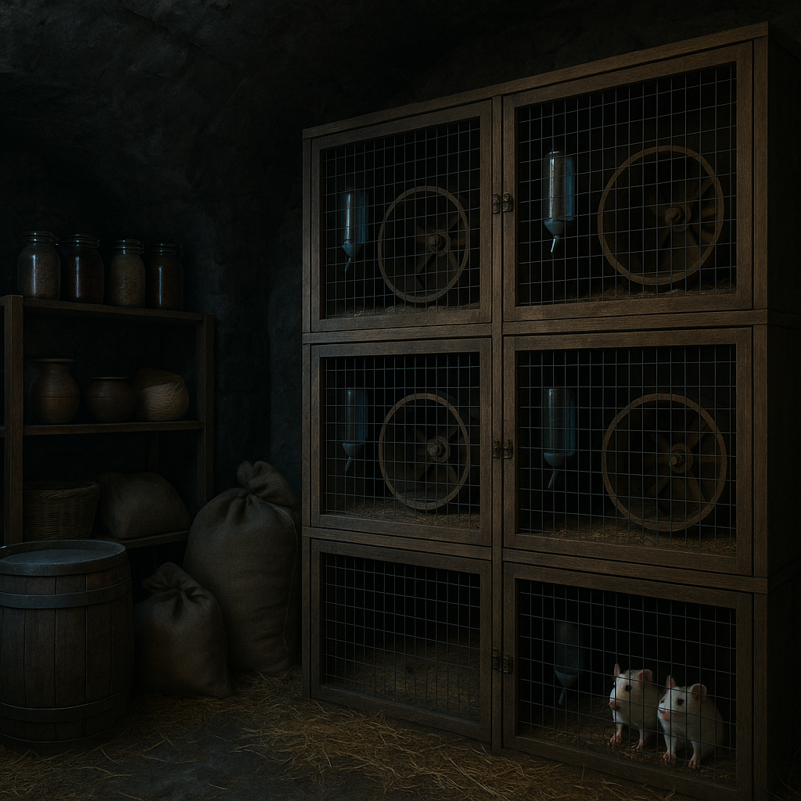{class="mask mask--background-bottom-third-01" style="object-position: center bottom; object-fit: contain;"}

::: page

# Храм Света

## Описание

_Номер на [карте](#карта-города) — **7**._

> Вы поднимаетесь по массивным каменным ступеням, ведущим ко входу на уровне второго этажа.
>
> Внутри — приглушённая тишина. Её нарушают лишь шёпот нескольких молящихся и потрескивание свечей. Воздух пахнет воском
> и благовониями. Мозаичный пол из светлого мрамора ловит мягкие блики света.
>
> Массивные колонны поддерживают своды, расписанные сценами из писаний Церкви Света. В центре зала расположены 11
> небольших алтарей, над ними парит статуя ангела с расправленными крыльями.
>
> К вам навстречу идёт женщина в одеянии жрицы Света — около сорока лет, со светлыми волосами и спокойным взглядом.

Если герои идут к Розе или входят со стороны сада, то они попадают на нижний ярус:

> Коридор выводит в низкий сводчатый проход: по левой стороне тянутся кельи послушников. В конце — дверь с кованой
> решёткой. Оттуда доносится едва слышный хрип, будто кто-то дышит с трудом.

Келья Розы:

> Скромное помещение: деревянная кровать, стол, молитвенная скамья. На столе — карты полуострова и несколько заметок.

## Персонажи

- [Селина](#селина) – жрица. Приветствует героев и приглашает внутрь.
- [Роза](#роза) – паладин. Находится у себя в келье.
- [Местный пьяница](#горожане) в подвале.
- [Нищий](#горожане) на ступенях Храма.

::: column

## Информация

- В храмовых книгах можно найти сведения о заповедях; их копии висят на стенах молитвенного зала и рядом с алтарём.
- Прихожанам стали сниться сны, в которых они превращаются в пауков; многие считают это наказанием.
- Прихожане видели, как Роза вернулась в город на закате, во время вечерней молитвы, и относятся к ней с опаской.

## События

На нижнем ярусе герои могут обнаружить прикованного человека.

> Подойдя ближе, вы видите человека, прикованного к кандалам на руках и ногах. Кандалы аккуратно закреплены в камне. На
> полу стоит миска с водой. На одной из стен мелом выведено: «Свет не слепит — он обжигает». Похоже, надпись пытались
> стереть. Человек хрипит и будто пытается вам что-то сказать.

Если попытаться его освободить, выяснится, что это добровольная терапия и срывать её нельзя. Если об этом узнает Селина,
её отношение к героям станет **враждебным**.

Он может рассказать, что раньше они выпивали с **Бертрамом**. По настоянию семьи он согласился на лечение в храме
(«сухая келья»).

<!-- prettier-ignore -->
 {style="width:320px;height:235px;" class="framed-image"}

::: page

# Гарнизон

## Описание

_Номер на [карте](#карта-города) — **6**._

> Главные ворота открыты. Во дворе несколько стражников тренируются деревянными мечами, отрабатывая удары. Рядом со
> зданием — видавшая виды доска объявлений.

> Внутри пахнет металлом и маслом. Вдоль стен выстроены стойки с оружием. В дальнем углу — дубовый стол, заваленный
> картами и бумагами. По одной из стен тянутся решётчатые двери камер — городская тюрьма находится здесь же. Хурган,
> сложив руки на груди, о чём-то говорит с одним из стражников.

Без [разрешения гарнизона](#разрешение-гарнизона) стражник внутри потребует сдать оружие на входе.

## Персонажи

- [Хурган](#хурган) – начальник гарнизона.
- [Гюнтер](#гюнтер) – стражник, вешает объявление о пропаже Марии на доску объявлений.
- [Стража](#стража) — заняты тренировками. Могут поделиться информацией о Гюнтере, если их расположить.

## Преметы

- [Разрешение гарнизона](#разрешение-гарнизона) лежит в столе Хургана.

## События

**Спор о независимости.** Герои замечают двух оживлённо спорящих стражников. Один: «Империя бросила нас при осаде, мы
сами справились». Другой: «Без Империи нас разорвут маги и эльфы». Если вступить в спор, стражник, чью позицию
поддержали, станет **доброжелателен**.

**Осмотр тюрьмы.** В одной камере — пьяный дебошир. Бормочет про пауков и просит «убрать того из угла», уверяя, что он
за ним следит.

::: column

## Информация

**Бумаги на столе:**

- Самый свежий рапорт: _«1 Беталассы. Драка в таверне. 2 торговца-мужчины и 1 паладин-женщина. Опросить не удалось.»_

**Стол Гюнтера:**

- Записи по расследованию исчезновений. Имена соединены линиями с Розой. У «торговцев» стоит «7?», у «Абрахама» — «4?»
  (_номера догматов_).
- Несколько черновиков рапорта с правками — все о подозрениях в адрес Розы; пытается убедить Хургана, что она инквизитор
  под прикрытием: _«Покидает город; не участвует в службах; появление совпадает с исчезновениями; оружие — при себе даже
  ночью. Совпадений: 4. Достаточно.»_

## Доска объявлений

Гюнтер прикрепляет объявление о пропаже Марии с её описанием и обещанной наградой — **100 золотых**.

На доске висит объявление: _«Объявляется набор в добровольческий отряд для поиска пропавших. Доблесть, отвага и немного
храбрости.»_. Рядом можно увидеть несколько сомнительных записок.

#### Сомнительные записки

| K6  | Объявление                                                                                             |
| :-- | :----------------------------------------------------------------------------------------------------- |
| 1   | Пропала кошка! Чёрная, кличка «Князь». Последний раз видели у причала. Нашедшему — кружка лучшего эля! |
| 2   | Проклят же тот, кто свистит на закате! Уже второй раз куры дохнут после этого.                         |
| 3   | Ищу того, кто может починить часы. Они остановились в 2:14, как и каждый год.                          |
| 4   | Приходите на ужин. Дом с синим окном у старого фонтана. Никаких проповедей, просто еда.                |
| 5   | Найден ключ от чего-то важного. Опишите предмет, и, возможно, верну.                                   |
| 6   | Кто шепчет под окнами? Прекратите. У меня старое сердце и нож.                                         |

::: page

# Дозорная башня

## Описание

_Номер на [карте](#карта-города) — **10**._

> На самом высоком утёсе стоит массивная дозорная башня из тёмного камня. Над узкими бойницами висят штандарты с гербом
> Империи. На вершине — силуэт часового, вглядевшегося в горизонт. Внутри — винтовая лестница, ведущая на смотровую
> площадку.

**Вид с башни**

> С вершины Сан-Сопригаль лежит у ваших ног, словно игрушечный. На западе за стеной дорога уходит в поля и рощи. Где-то
> там, за холмами, лежит путь в Карталь.

`@Perception 15`:

> Но одно место привлекает ваше внимание – небольшая часть береговой линии уходит за скалы. Похоже, что отсюда видно не
> весь берег, там прячется небольшая бухта.

## Персонажи

- [Стражник](#стража) — часовой на площадке. Недоволен посторонними; без [разрешения гарнизона](#разрешение-гарнизона)
  просит покинуть башню. `@Persuasion 12` — разрешит короткий осмотр.

## Информация

- Часовой говорит, что **Гюнтер** вчера попросил заступить пораньше, «до заката».
- Когда часовой пришел сегодня утром на смену в башне было убрано так, как никогда раньше.
- `@Perception 15` из башни не просматривается участок с бухтой под утёсом.

::: column

## События

Если хотите, дайте героям минуту на личные мысли. Каждый бросает `к4` и делится одной репликой.

> Вы осматриваете город с высоты. Он кажется спокойным — возможно, впервые за всё время. Но внутри не отпускает чувство
> — что-то здесь не так. Вас тянет к ответам. Глядя вниз, на этот вид, вы ловите себя на мыслях, которые не хотите
> держать внутри. Каждый из вас замирает на минуту, глядя вниз. Кто-то говорит первым — и за ним следуют другие.

| K4  | Мысли                                                                            |
| :-- | :------------------------------------------------------------------------------- |
| 1   | Кому из вас я доверяю больше всего — и почему?                                   |
| 2   | Что бы сделал Джаред, будь он сейчас с нами?                                     |
| 3   | Я знаю, кто виноват в исчезновении Марии. Или думаю, что знаю. И это…            |
| 4   | Я всё больше думаю не о людях, а о самом городе. Про Сан-Сопригаль я понял, что… |

_За искреннее откровение можно выдать **вдохновение** или напомнить важную деталь, на которую они не обратили внимания._

<!-- prettier-ignore -->
 {style="width:320px;height:340px;" class="framed-image"}

::: page

# Городские ворота

## Описание

_Номер на [карте](#карта-города) — **8**._

> Массивные городские ворота, окованные железом, возвышаются среди старых, но прочных стен из тёмного камня. Каждая
> выбоина и трещина — след времени и былых осад. Над воротами на ветру колышется знамя Империи: края потрёпаны, но герб
> ещё различим.
>
> Рядом с воротами стоят несколько стражников и следят за порядком.
>
> Неподалёку толпятся горожане — переглядываются, шепчутся, но не подходят ближе. В их взглядах больше тревоги, чем
> любопытства.

::: column

## Персонажи

- [Стража](#стража). Суровые и немногословные: не пропускают никого без приказа [Хургана](#хурган).
  [Разрешение гарнизона](#разрешение-гарнизона) не действует.
- [Роза](#роза) — паладин. Может попытаться уйти, что спровоцирует конфликт с Хурганом.
- [Горожане](#горожане) у ворот; рядом играют дети.

## Информация

- Про **Марию**: стражники не видели, чтобы она покидала город.
- Про **Розу**: приехала полтора месяца назад, часто уезжает на несколько дней. Вчера вернулась на закате.
- Можно [подслушать](#приложение-слухи), о чём говорят горожане.

## События

- [Конфликт Розы и Хургана у городских ворот](#конфликт-розы-и-хургана-у-ворот)

<!-- prettier-ignore -->
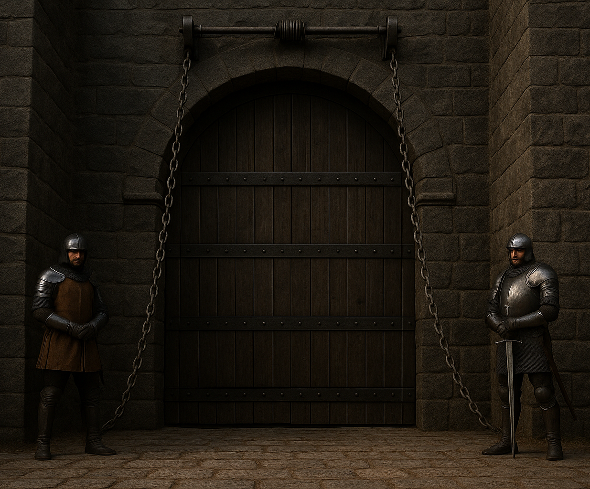{class="mask mask--background-bottom-half" style="object-position: center bottom; object-fit: contain;"}

::: page

# Конфликт Розы и Хургана у ворот

## Завязка

Герои слышат, как у ворот разгорается спор:

> Роза стоит перед воротами, поза напряжённая, кулак сжат. Молодой стражник заметно нервничает, но не отступает.
>
> Вокруг горожане замерли в ожидании. Один из стражников спешит за Хурганом.

## Разговор

> Хурган вместе с двумя стражниками подходит быстрым шагом, лицо жёсткое. Коротко осматривает Розу, затем поворачивается
> к стражнику.
>
> **Хурган (глухо):** Что здесь?
>
> **Стражник (собранно):** Пытается покинуть город, сэр. Разрешения нет.
>
> **Хурган (Розе):** Город закрыт. Возвращайся в храм, паладин.
>
> **Роза (хмуро):** Моё дело важнее ваших запретов. Не гневи ангелов, орк.
>
> Рука Хургана ложится на топор. Несколько стражников берутся за оружие.

::: box

**Для Мастера.** Эта сцена призвана «встряхнуть» партию коротким боем. По её исходу может определиться сопровождение в
катакомбы. Если герои встали на сторону стражи — Хурган может появиться в самый подходящий момент. Если поддержали Розу
— проводником точно станет Гастон. Если не вмешались, помощи они могут не получить вовсе.

:::

::: column

## Вмешательство игроков

Игроки могут уговорить, запугать или предложить компромисс.

- `@Persuasion 14` / `@Deception 14` — успокоить любую сторону.
- `@Intimidation 16` — осадить оппонента (повышает накал, но даёт паузу).
- `@Insight 12` — понять, что обе стороны стоят на принципах, нужен **компромисс**.

Если первая попытка провалена или герои молчат:

> Хурган говорит, что ему не до проповедей. А Роза стискивает челюсть и кладёт руку на меч.

Вторая попытка возможна с **+2 к сложности**. На повторном провале — эскалация.

## Развязка

**Провал / бездействие → бой:**

- Против [Розы](#) выступают [Хурган](#) и три [стражника](#).
- Задача стражи — **арест**, урона по минимуму.
- Задача Розы — **прорваться**.

**Успех → деэскалация:**

- Если убедили Хургана — он даёт Розе выйти из города. Отношение стражи к героям становится на один уровень ниже.
- Если убедили Розу — она нехотя отступает в храм. Отношение Розы и Селины к героям становится **враждебным**.

**Последствия боя:**

- Атака на стражу — герои считаются **преступниками**; Гастон может помочь и вывести героев из города через бухту.
- Если героев «убили» стражники — через `к4` часа очнутся в **тюрьме без вещей**. Гастон может помочь и ночью вывести
  героев из города через бухту.
- Если героев «убила» Роза — через `к4` часа очнутся в **гарнизоне**.

::: page

# Дом Абрахама

## Описание

_Номер на [карте](#карта-города) — **9**._

> Одноэтажный дом, достаточно большой и явно рассчитанный на семью. Снаружи выглядит немного заброшенным. Одно из окон
> разбито и наспех заколочено досками.

> Внутри сухо и душно. Пыль на деревянном полу лежит ровным слоем; в лучах света из окна пляшут пылинки. Мебель цела и
> аккуратно расставлена, но создаётся впечатление, что здесь давно не живут.

## Персонажи

- [Йонас](#йонас) — кучер, владелец дома. Подойдёт, если герои долго стоят у дома и предложит снять дом.
- [Гастон](#гастон) — контрабандист. Присматривает за домом и подойдёт, если герои вскрывают дом **вечером**.
- [Дети](#горожане) — играют неподалёку; могут поднять шум.

::: column

## Информация

**Перед домом:**

- `@History 10` или если в партии есть **плут** — замок редкий и дорогой; такие ставят очень состоятельные люди или там,
  где нужен повышенный уровень защиты.
- `@Insight 12` — по оговоркам **Йонаса** создаётся впечатление, что его дед был контрабандистом.
- `@Persuasion 10` с **детьми** или разговор с **Йонасом** — дети раньше играли в Заброшенном районе, но, услышав
  странные звуки, перебрались сюда и полторы недели назад разбили окно.

**Осмотр дома:**

_Чтобы двигаться тихо, требуется успешное `@Stealth 13`, иначе половицы скрипят и могут привлечь внимание._

- По слою пыли видно, что здесь **никто не жил больше месяца**.
- `@Perception 10` / `@Investigation 12` — в углу комнаты половицы **не скрипят**. Между этими половицами нащупывается
  **железное кольцо**. Потянуть — откроется **люк в подвал** (тайный проход).

**Частичный успех.** Если герои проваливают проверку на поиск люка, они всё равно его находят, но с шумом — это может
привлечь внимание.

<!-- prettier-ignore -->
{class="mask mask--background-bottom-third-02" style="object-position: center bottom; object-fit: contain;"}

::: page

# Подвал дома Абрахама

## Описание

> Узкая деревянная лестница уводит вниз; воздух становится прохладнее и влажнее. Пахнет сыростью, старым деревом и
> чем-то едва уловимым — смесью трав и алхимических ингредиентов. Стены сложены из массивных каменных блоков, часть пола
> закрыта потёртым ковром. У одной стены — стол, заваленный банками, склянками и пергаментами с записями. В дальнем углу
> видна конструкция из металлических рам и труб. Посередине стены стоит старый деревянный шкаф.

## Предметы

- [Дневник Абрахама](#дневник-абрахама) — на столе.
- [Странный предмет «Ан’Туз»](#странный-предмет) — у алхимических инструментов.
- [Противоядие](https://www.dndbeyond.com/equipment/520-antitoxin) (_количество игроков + 1_).

## Информация

**Стол:**

- [Дневник Абрахама](#дневник-абрахама).
- Флаконы с зелёной жидкостью.

**Исследование содержимого флаконов:**

- Жидкость напоминает ту, что мог дать [Кенки](#кенки).
- С набором алхимика: 10 минут — определить как **противоядие**.
- Без набора: `@Medicine 14`, 10 минут — определить как **противоядие**.

**Конструкция в углу:**

- `@Investigation 10` — металлические конструкции образуют самодельный стенд для варки зелий.
- Среди инструментов — [странный предмет](#странный-предмет): рукоять с плотно сидящей резиновой чашей.

**Старый шкаф:**

- Один из ящиков заперт. Если взломать — внутри только выцветшая простыня и пыль.
- `@Perception 10` — шкаф чуть отодвинут, в кладке за ним заметно небольшое круглое углубление (механизм).

::: column

## Потайной ход

- `@Perception 10` или `@Investigation 10` — обнаружить механизм в стене за шкафом.
- Приложить «Ан’Туз» плотно к отверстию и **нажать трижды**.
- Из отверстия выдвигается ручка с четырьмя числовыми кольцами (0–9). Нужна верная комбинация: **0451** _(намёк можно
  найти в дневнике)_.
- Успех открывает секретную дверь в катакомбы: шкаф отъезжает, открывая [узкий проход](#проход-из-дома-абрахама).

**Ошибочный код.** Из глубины слышен отдалённый щелчок, и помещение начинает заполнять парализующий газ. Требуется
спасбросок `@Constitution 13`. При провале — состояние
[парализованный](https://www.dndbeyond.com/sources/dnd/br-2024/rules-glossary#ParalyzedCondition) на `1к4` часа).

::: box

**Для Мастера:** вместо «броска на код» дайте игрокам реальную мини-головоломку за столом для имитации подбора кода.
Либо пропустите их в подземелье, если они предложили разумное решение, используя подсказки из дневника.

:::

<!-- prettier-ignore -->
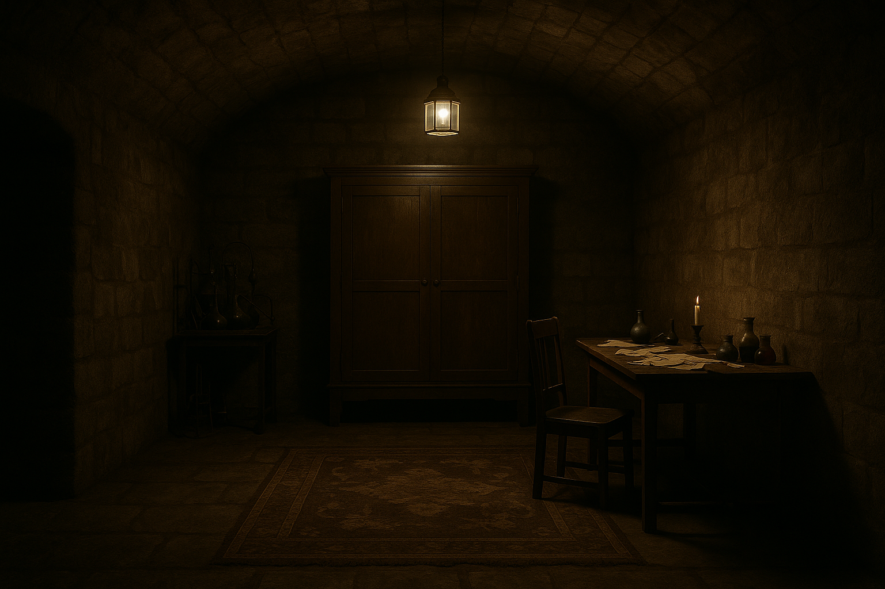 {style="width:320px;height:350px;" class="framed-image"}

::: page

# Библиотека

## Описание

_Номер на [карте](#карта-города) — **5**._

> Здание из серого камня с колоннами у входа и высоким фронтоном, украшенным барельефами времён основания города.
> Выглядит величественно, но давно требует ремонта: на стенах трещины, поросшие плющом, часть черепичной крыши обрушена.

> Внутри — высокие своды, скрипучие деревянные полы и запах пыли и старых пергаментов. Массивные шкафы с книгами стоят
> вдоль стен и в центре зала. Стены украшают потемневшие портреты бывших градоначальников.
>
> За столом, заваленным книгами, заметками и неразобранными записями, сидит пожилой библиотекарь. Перо скрипит по
> бумаге; похоже, он едва замечает ваше присутствие. Не поднимая глаз от книги, он бросает: «Только не шумите. История
> любит тишину. Как и я».

## Персонажи

**Герман** — пожилой библиотекарь с растрёпанными седыми волосами и круглыми очками, вечно сползающими на кончик носа.
Носит старомодный жилет и потёртый плащ с заплатами. Любит книги больше людей, но благоволит к тем, кто уважает знания.

 {class="framed-image" style="width:320px;height:295px"}

::: column

## Книги

Содержимое см. в разделе **[Приложение: Книги](#хроники-сан-сопригаля)**.

- Доступ к фонду:
  - `@History 10` — интерес к истории → [«Хроники Сан-Сопригаля, том I»](#хроники-сан-сопригаля).
  - `@Arcana 10` — интерес к магии →
    [«Некоторые свойства душ и их переносимость»](#некоторые-свойства-душ-и-их-переносимость).
  - `@Religion 10` — интерес к вере → [«О запретных учениях и ересьмах»](#сборник-о-запретных-учениях-и-ересьмах).
  - [Разрешение гарнизона](#разрешение-гарнизона) → доступ ко всем перечисленным.
- `@Persuasion 12` — чтобы прочитать черновик [«Дни в аду»](#дни-в-аду).

## Информация

- Из книги «Хроники Сан-Сопригаля, том I» можно узнать про **катакомбы под городом** и затеряную бухту.
- Герман рассказывает, что часть книг, в том числе «Некоторые свойства душ и их переносимость», привезли из дома мага
  **Моандера**, пропавшего во время осады; его дом тогда почти полностью сгорел.
- **Абрахам** интересовался книгами, доставшимися от Моандера, делал пометки и переписывал фрагменты.
- Герман может рассказать [об осаде города](#вторжение-демонов), о том, как Хурган стал мэром, и поделиться другими
  историями из прошлого Сан-Сопригаля.

::: box

**Для Мастера.** Локация опциональна и служит для передачи лора. Можно держать её закрытой, если нужно ускорить темп и
сдвинуть партию дальше по сюжету.

:::

::: page

# Дом Гюнтера

## Описание

_Находится в [Бархатном районе](#карта-города)._

> Дом Гюнтера — в зажиточной части города, с большими окнами, выходящими на рыночную площадь. Кованые перила, мраморные
> вставки, старинная резная дверь — дом явно принадлежит обеспеченной семье.
>
> Вы проходите мимо чужого первого этажа и поднимаетесь на второй, где живёт Гюнтер. При входе вас окутывает холод.
> Квартира пуста, всё на местах — будто жизнь здесь остановилась. Пахнет застоявшимся деревом, воском и пылью. На полу —
> старый ковёр, на стенах — портреты под полупрозрачной тканью. Пространство гулкое и мрачное, словно подземелье над
> землёй.

## Информация

- `@Perception 10` — на столе лежит неотправленное письмо, аккуратный, напряжённый почерк: _«Уйди из Храма, пока не
  стало поздно. Они не святые. И она — не та, за кого себя выдаёт»_. Рядом — аккуратно свёрнутое любовное письмо с
  засушенным цветком.
- `@Investigation 10` — в письменном ящике спрятан список **догматов** Церкви и несколько старых изображений ангелов;
  часть перечёркнута.
- `@History 12` — три портрета под тканью — это семья Гюнтера; по трауру и датам ясно: все погибли два года назад.
- `@Insight 10` — межкомнатные двери запираются изнутри; на некоторых — двойные засовы. Такая «самооборона» выдаёт
  тревожность: хозяин боялся обысков или ночных визитов.

При желании Мастер может поместить сюда те же бумаги, что и со стола Гюнтера в [гарнизоне](#гарнизон), если герои туда
ещё не заглядывали или что-то упустили.

::: column

## События

**Сигнализация.** При пересечении порога срабатывает магическая тревога (её можно предотвратить, если произнести
**правильное слово-пароль** — найти его можно в столе Гюнтера, `@Investigation 15`).

> Воздух наполняется резким запахом озона. По полу вспыхивают бледные руны. Где-то в глубине звенит колокольчик — будто
> дом известил хозяина.

У игроков есть `1к4` раундов, чтобы быстро осмотреться или скрыться, прежде чем придёт патруль.

- Скрыться: `@Stealth 13`.
- Уговорить/соврать: `@Persuasion 12` / `@Deception 13` (с [разрешением гарнизона](#разрешение-гарнизона) — с
  преимуществом).
- Цель стражи — задержать для выяснений.

::: box

**Для Мастера.** Локация опциональна и не упоминается персонажами напрямую, но часто интересует игроков.

:::

<!-- prettier-ignore -->
 {style="width:320px;height:310px;" class="framed-image"}

::: page

# Заброшенный район

## Описание района

_Номер на [карте](#карта-города) — **12**._

> В северо-западной части города старая мостовая всё ещё припорошена золой. Полуразрушенные дома медленно осыпаются под
> ветром и дождём. Когда-то здесь жили люди, теперь остались одни руины. Изредка слышен скрип: ветер раскачивает остатки
> ставен, стучащих о камень.

**Старый колодец:**

> Среди разрушенных домов виден заваленный колодец: каменный обод, поросший мхом, едва проглядывает из-под обломков
> досок, земли и камней.

::: column

## Информация

**Район:**

- `@Survival 12` — слишком тихо даже для заброшенного места: не слышно птиц и мелких зверьков.
- `@Insight 10` — в такие места редко заглядывают: разве что дети приходят играть или забредают пьяницы.

**Колодец:**

- `@Perception 10` — у колодца видны свежие следы одного человека; в пыли лежит амулет в форме луны (_принадлежит
  Марии_).
- `@Arcana 10` — завал свежий. На одном из камней ощущается слабый след заклинания **Mold Earth**: неровный «почерк»
  новичка, будто по учебному свитку.
- `@Investigation 14` — картину можно восстановить: человека повалили и волокли к колодцу.
- При осмотре кладки колодца заметна едва различимая метка в виде медузы.

Чтобы раскопать завал, потребуется **не менее суток** (даже с учётом заклинаний). Если партия пропустила остальные пути
в катакомбы, можно сократить время до `1к4` часов, чтобы продвинуть сюжет.

<!-- prettier-ignore -->
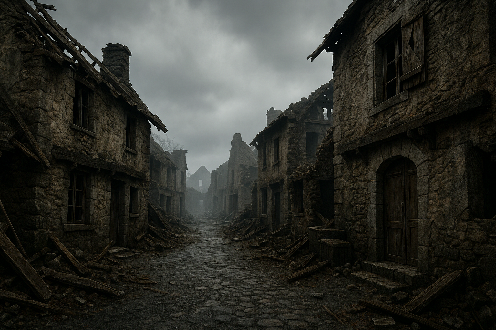{class="mask mask--background-bottom-third-02" style="object-position: center bottom; object-fit: contain;"}

::: page

::: chapter Глава 3 | Катакомбы

Под городом лежит небольшая сеть катакомб, заложенных ещё при основании Сан-Сопригаля и позднее расширенных
контрабандистами из [Чёрной Медузы](#приложение-государства-и-организации). В городе о катакомбах не знают: ходят лишь
легенды, а местные смельчаки безуспешно пытались их отыскать.

Из города попасть в катакомбы можно через **старый колодец** в Заброшенном районе (старый ход) или через **подвал дома
Абрахама** (новый ход).

Со стороны моря туда ведёт узкий вход в скрытой бухте: проход закрыт мощной **иллюзией**. Чтобы заметить аномалию —
`@Investigation 15`; распознать, что это именно иллюзия — `@Arcana 13`. Иллюзия маскирует вид, но не препятствует
проходу.

::: column

## Карта катакомб

Катакомбы делятся на несколько зон:

1. [Ход из старого колодца](#ход-из-старого-колодца) — оригинальный тоннель времён основания города.
2. [Ход из дома Абрахама](#ход-из-дома-абрахама) — тоннель, прорытый контрабандистами около 50 лет назад.
3. [Бухта контрабандистов](#бухта-контрабандистов) — внутренняя бухта с небольшим причалом для разгрузки.
4. [Большой зал](#большой-зал) — основной складской зал; сейчас это логово пауков.

Если у героев нет **тёмного зрения**, им понадобится источник света. Если герои идут со светом или не скрываются, пауки
в логове узнают об их приближении и устроят _засаду_.

::: wide

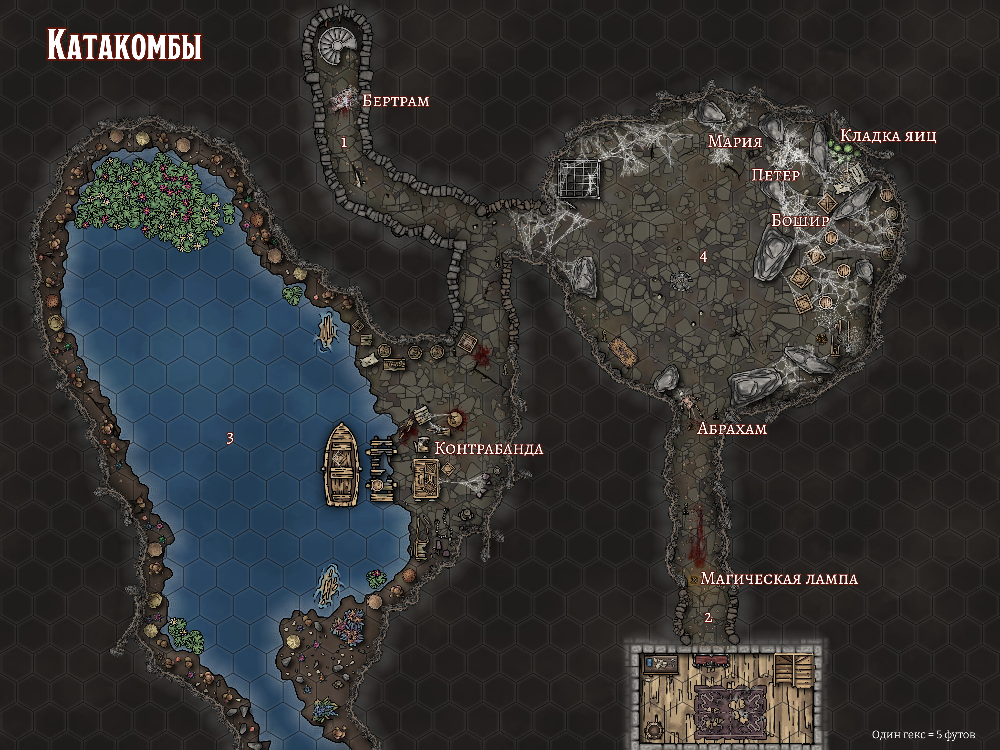{class="framed-map" style="height:100%"}

_Полный архив всех карт доступен по ссылке:
[Скачать с Google Диска](https://drive.google.com/drive/folders/1kkLD4GegIr0Q5sSph8yz1zEEGgtrtRQs)._

:::

::: page

# Ход из старого колодца

## Описание

_Номер на [карте](#карта-катакомб) — **1**._

> Вас встречает удушливый запах сырости и гниения. Тишину нарушают лишь капли воды, падающие где-то вдали. Стены тоннеля
> сложены из древнего камня, покрытого мхом и паутиной. Местами видны стёртые руны и выбитые символы.
>
> Деревянные подпорки выглядят ветхими, некоторые треснули. Кажется, неосторожное движение может вызвать обрушение.

## Информация

- **Кокон с Бертрамом.** У стены — крупный комок паутины. Если разрезать, внутри — иссохшее тело, застывшее в гримасе
  ужаса.
- `@Investigation 10` — на стенах заметны потускневшие контрабандные знаки и символ медузы.

::: column

## Опасность обрушения

Если герои не заявляют, что идут осторожно (групповая проверка `@Survival 12`), тоннель начинает осыпаться.

> Вы слышите глухой треск — одна из деревянных балок трескается, с потолка сыплется пыль. Через мгновение — хруст и
> грохот, камни глухо ударяются о пол, воздух наполняется пылью, и часть прохода позади вас начинает заваливаться.

Все герои делают спасбросок `@Dexterity 12`. При провале получают `1к6` дробящего урона. Проход позади завален.

<!-- prettier-ignore -->
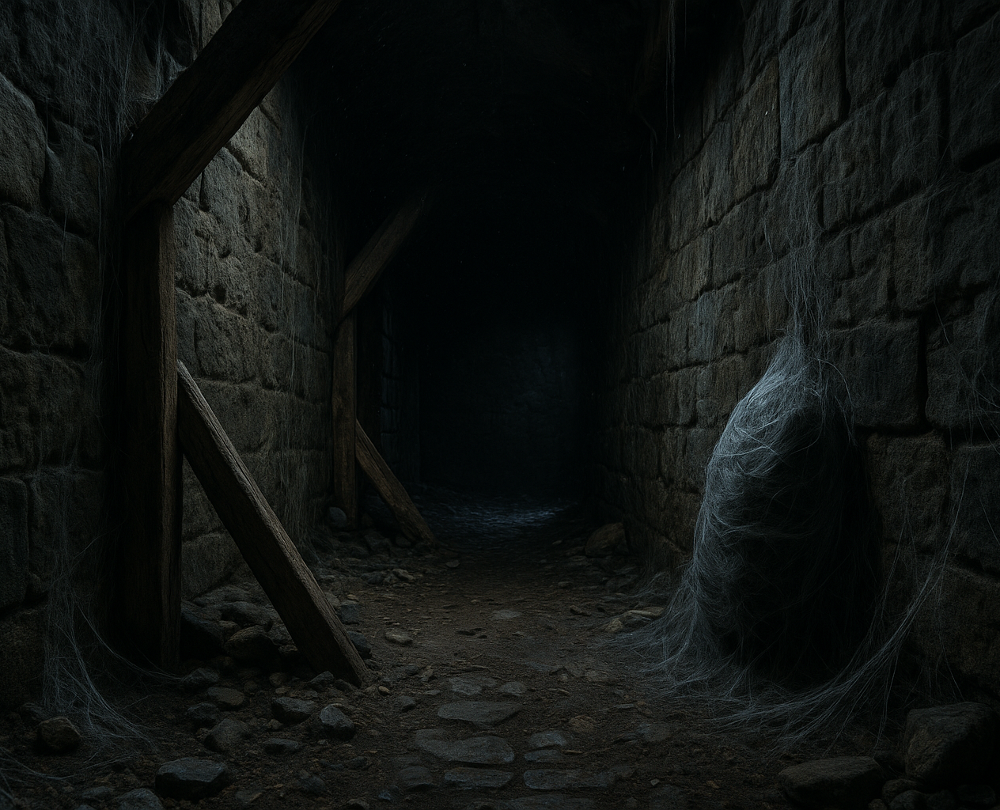{class="mask mask--background-bottom-half" style="object-position: center bottom; object-fit: contain;"}

::: page

# Ход из дома Абрахама

## Описание

_Номер на [карте](#карта-катакомб) — **2**._

> В воздухе стоит затхлость и неприятный запах. Первые несколько метров проход аккуратно укреплён каменной кладкой, но
> дальше облицовка обрывается — стены грубо выдолблены в сыром грунте. Пол покрыт пылью; местами её нарушают чьи-то
> следы и неглубокие борозды, будто кого-то тащили, а он упирался. Видны пятна засохшей крови.

Если в проходе стоит **лампа**:

> На стенах тускло мерцает голубоватый свет от лампы на полу. При вашем приближении свечение становится заметно ярче —
> будто лампа реагирует на присутствие.

**При выходе в большой зал:**

> Проход постепенно расширяется, потолок поднимается. Паутина свисает тяжёлыми клочьями. У стены лежит тело, обвитое
> засохшей паутиной, суставы вывернуты — как у человека, умершего в судорогах. Вам кажется, что череп смотрит прямо на
> вас.

::: column

## Информация

**Осмотр следов:**

- `@Investigation 10` — следы принадлежат одному человеку и оставлены не менее месяца назад. _Если герои пришли сюда
  после Гастона, они находят ещё одну, свежую дорожку следов._

**Осмотр останков Абрахама:**

- Одежда напоминает старое магическое одеяние, расшитое потускневшими символами.
- Кости рук застыли в неестественной позе. На костях — тонкие глубокие надрезы, словно его тащило нечто огромное с
  острыми когтями.
- `@Perception 10` — среди паутины находится [сломанный амулет](#амулет-абрахама-сломанный) с изображением черепа и
  паука.

## Предметы

- [Магическая лампа](#магическая-лампа). _Если герои пришли сюда после Гастона, то лампа будет у него._
- [Амулет Абрахама](#амулет-абрахама-сломанный).

<!-- prettier-ignore -->
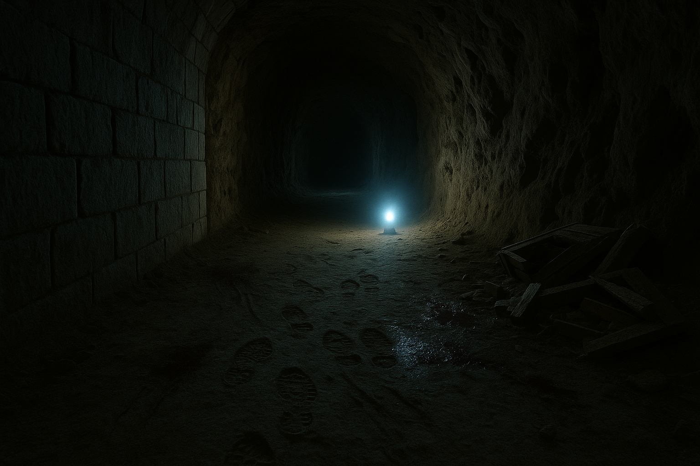{class="mask mask--background-bottom-third-02" style="object-position: center bottom; object-fit: contain;"}

::: page

# Бухта контрабандистов

## Описание

_Номер на [карте](#карта-катакомб) — **3**._

> Просторная каменная пещера с высоким сводчатым потолком. Воздух влажный, пахнет солёной водой и гниющей древесиной. По
> стенам растут бледно-голубые грибы, их тусклый фосфоресцентный свет окутывает зал мерцающим полумраком.

> У одной стены валяются гнилые ящики. Ближе к воде — покосившийся причал с пришвартованной лодкой.

> Неподалёку от лодки валяются обломки явно более новых ящиков и стоит бочка. Среди обломков что-то поблёскивает.

## Предметы

- [Контрабанда](#контрабанда).

::: column

## Информация

- **Лодка и причал.** `@Investigation 12` — лодку давно не вытаскивали, судя по налёту соли на бортах и водорослям на
  швартовах — около месяца. Обычно лодки держат на берегу, значит, что-то помешало.
- **Старые ящики.** Содержимое сгнило. Остались ржавые клинки и пара пригодных кинжалов (2 шт.).
- **Бочка.** На бочке мелом нарисован символ Медузы.
- **Ящики у лодки.** Один ящик с выбитым дном, доски разломаны как **при падении с высоты**. Два ящика разодраны снаружи
  и изнутри; на древесине следы когтей. Рядом видны следы борьбы и пятна засохшей крови.
- **Хитиновая оболочка.** `@Nature 10` — среди обломков и внутри ящика лежат куски хитина: серо-зелёные, блестящие, с
  зазубренным краем. Это сброшенная оболочка крупной паукообразной твари; нынешний размер существа, вероятно, ещё
  больше.
- **Контрабандная ведомость.** `@Perception 10` — рядом с бочкой лежит влажная записка — реестр поставок:
  - «Документы и живой груз — 3 шт. Доставить Абрахаму.»
  - «Шкатулка — 1 шт. Доставить Голове.»
  - «Светящаяся пыль — 1 бочка.»
  - «Лунное серебро — 2 слитка.»
  - «Имперские плащи — 5 комплектов.»

<!-- prettier-ignore -->
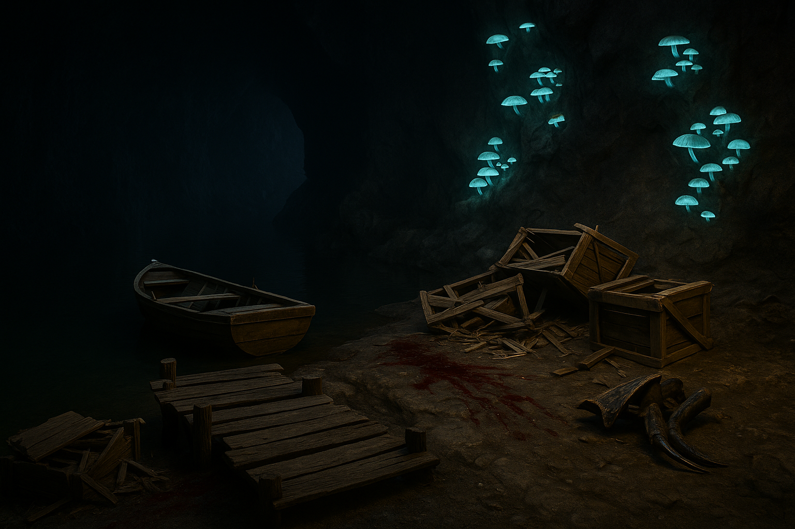{class="mask mask--background-bottom-third-01" style="object-position: center bottom; object-fit: contain;"}

::: page

# Большой зал

## Описание

_Номер на [карте](#карта-катакомб) — **4**._

> Потолок теряется в темноте. Липкая паутина покрывает стены, свисает с потолка и стелется по полу, цепляясь за обувь,
> как тягучая смола. Воздух тяжёлый, сырой, со стойким запахом гнили. Вдоль стен громоздятся камни; на них в беспорядке
> висят толстые нити, сплетаясь в три грязно-серых кокона.

## Информация

- **Петер и Бошир.** В двух коконах — иссохшие тела мужчин.
- **Мария.** В третьем коконе — Мария. Если герои пришли в первый день, она на грани смерти, но ещё дышит. Небрежное
  вскрытие может её убить; для стабилизации требуется `@Medicine 10`.
- **Паучья кладка.** `@Perception 10` — у стен видна кладка крупных паучьих яиц. Её нужно уничтожить, чтобы пауки не
  вернулись.

## Окружение

- **Паутина.**
  [Труднопроходимая местность](https://www.dndbeyond.com/sources/dnd/br-2024/rules-glossary#DifficultTerrain): скорость
  вполовину; чтобы вырваться — действие, `@Athletics 12`. Огонь сжигает участок 5 футов за действие.
- **Валуны.** Достаточно большие, чтобы использовать как
  [укрытие](https://www.dndbeyond.com/sources/dnd/br-2024/rules-glossary#Cover).
- **Огонь.** Факелы и костёр в центре зала. Если зажжены, пауки не подходят ближе чем на 10 футов.

::: column

## Бой: Паучье логово

Как только герои приближаются к центру зала или начинают осматривать коконы, из тени вырывается первый
[искажённый паук](#). Если герои не двигались скрытно — паук атакует из
[засады](https://www.dndbeyond.com/sources/dnd/br-2024/rules-glossary#Surprise).

> Вы чувствуете, как паутина под вашими ногами начинает дрожать. Откуда-то сверху доносится зловещий скрежет когтей по
> камню. Несколько ярко-зеленых глаз вспыхивают во тьме.

::: definition

**Ход 2.** Из бокового прохода врывается второй [искажённый паук](#), пытаясь отрезать путь к выходу.

**Ход 3+.** При гибели одного из пауков с потолка нападает [Искажённый Паук-Матриарх](#) — массивное существо, ведущее
себя осмысленно.

**Дополнительно.** С потолка или из стен может высыпаться [рой мелких пауков](#): мешают, ползая по героям и сбивая
концентрацию/обзор.

:::

### Участие Гастона

Если герои спустились в катакомбы с [Гастоном](#), в первый ход он уходит в тень за шкатулкой. Появится снова только при
**положительном** отношении к героям.

<!-- prettier-ignore -->
{class="mask mask--background-bottom-third-01" style="object-position: center bottom; object-fit: contain; bottom: -70px;"}

::: page

::: chapter Глава 4 | Последствия

# Судьба катакомб

_Перед сценой похорон героям предстоит решить судьбу катакомб - рассказать о них или нет._

Если герои согласились сопровождать Гастона в катакомбы, он поднимает вопрос: как сохранить катакомбы в тайне от стражи,
Церкви и простых горожан. Он предлагает удвоить плату.

Игроки должны придумать план и реализовать его.

Если игроки успешно реализуют план сокрытия, катакомбы временно останутся неизвестными.

Это может:

- дать им место для будущих тайных встреч;
- сохранить расположение Гастона.

Но если игроки не уничтожили паучьи яйца, то через месяц из глубин катакомб начнётся новая волна нападений.

Маленькие пауки начнут выползать на улицы, и слухи о тенях в подвалах вновь охватят Сан-Сопригаль.

Когда Хурган узнает о пауках, то он собирает отряд стражников и идёт в катакомбы. Сражение идёт тяжело, но они убивают
всех пауков. Хурган смертельно ранен, он умирает в катакомбах. Выживает только Гюнтер, он возвращается в город, раненый
и в шоке. Город скорбит по Хургану, но угроза окончена.

# Обвинение

_В любой момент игры игроки могут прийти в гарнизон и выдвинуть обвинение против какого-то персонажа. Это может быть
завершением игры._

Если герои представляют улики, но не связывают их логически — Хурган остаётся сомневающимся. Тогда он может согласиться
лишь на домашний арест или наблюдение.

Если герои предоставляют достаточно улик, чтобы убедить Хургана, он действует решительно:

- Хурган распоряжается об аресте.
- Подозреваемого заключают под стражу, город снимает блокаду, люди начинают возвращаться к обычной жизни.
- Роза покидает город и перемещается в замок Портгейт.

Через две недели после завершения дела нападения возобновляются. Несколько человек исчезают ночью, появляются новые
следы пауков в заброшенных кварталах. Паника растёт, стража снова начинает патрули.

Когда Хурган узнает о пауках, то он собирает отряд стражников и идёт в катакомбы. Сражение идёт тяжело, но они убивают
всех пауков. Хурган смертельно ранен, он умирает в катакомбах. Выживает только Гюнтер, он возвращается в город, раненый
и в шоке. Город скорбит по Хургану, но угроза окончена.

Если герои предоставили Хургану информацию о пауках и пошли в катакомбы вместе с ним - то исход поединка зависит от
героев.

::: page

# Похороны

Игра завершается сценой похорон. То кто именно будет похоронен зависит от действий игроков. Перед похоронами или в
диалоге с НПС — дать сцену, где игроки формулируют, что произошло. Это помогает игрокам почувствовать, что они
действительно поняли дело.

## Описание

> Деревянные носилки выстроены в центр площади. На них лежат те, кто не пережил эту ночь. Лица покрыты белыми саванами,
> но даже через ткань видно очертания _(имя персонажа)_ — фигура неподвижно покоится среди павших.

> Толпа молчит. Селина возносит молитвы, зажигая масло, а первый язык пламени лижет высушенные доски. Запах ладана
> смешивается с дымом, а в небе кружат птицы. Кто-то шепчет слова прощания, кто-то утирает слёзы, но большинство просто
> смотрят, осознавая цену этой трагедии.

Игроки могут сказать несколько слов на прощание.

## После приключения

После приключения герои могут получить новые задания:

- **Слухи:** «Неправильно сжигать их прямо в городе, вот если бы нежить не повылезала на старом кладбище…»
- **Дункан**: «Если вы ищете настоящие вызовы — есть одно дело в горах.»
- **Ясад**: «Полагаю, вас заинтересует, что скрывают руины полуострова? Мне нужна помощь в сопровождении»
- **Роза:** «Нападения на торговцев продолжаются и мне не помешала бы помощь.»

или намёки на продолжение:

В дальнейшем за героями могут прийти другие агенты Чёрной Медузы.

Если герои помогли Гастону, он может предложить им «другие деликатные задачи».

- **Империя (если было нападение на Розу)**: _Если Церковь узнала - ждите гостей…_
- **Контрабандисты Черной Медузы (если шкатулка не у Гастона)**: _Шкатулку явно кто-то ищет и обязательно придёт за
  ней…_

<!-- prettier-ignore -->
{class="mask mask--background-bottom-third-01" style="object-position: center 140%; object-fit: contain; bottom: 0;"}

::: page {type="inside-cover"}

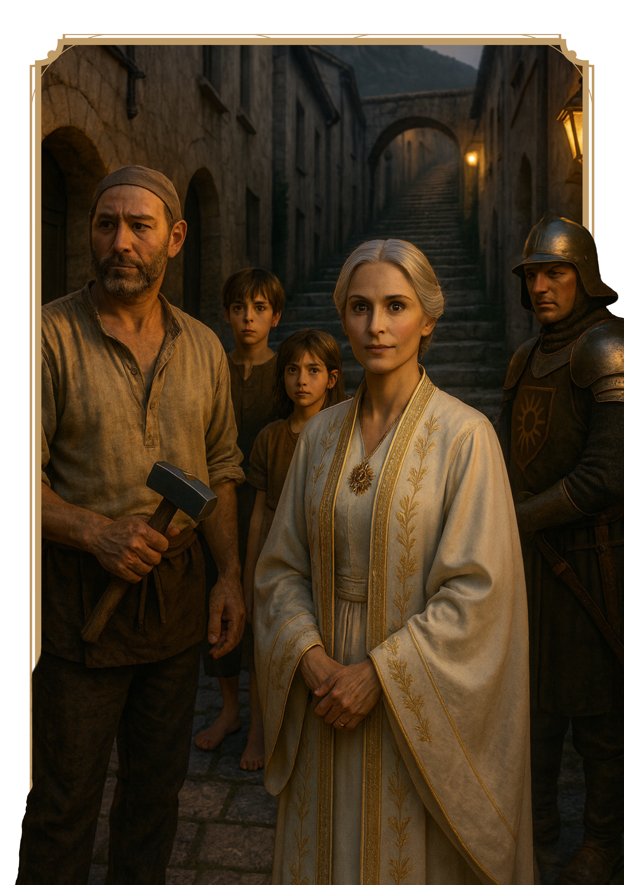 {class="cover"}

# Персонажи

::: subtitle

Приложение с описанием персонажей

:::

::: page {layout="wide" footnote="Приложение | Персонажи"}

::: page {footnote="Приложение | Персонажи"}

# Приложение: Персонажи

::: wide

#### Краткий перечень персонажей

| Имя                                 | Роль                             | Локация                                       | Мотивация                                         | Игровая функция                                                      |
| :---------------------------------- | :------------------------------- | :-------------------------------------------- | :------------------------------------------------ | :------------------------------------------------------------------- |
| **[Хурган](#хурган)**               | Начальник гарнизона              | [Дом Марии](#дом-марии), [Гарнизон](#), город | Сохранить порядок, не дать панике разрушить город | Даёт вводную информацию, может выдать разрешение                     |
| **[Гюнтер](#гюнтер)**               | Стражник, любовник Марии         | [Дом Марии](#дом-марии), [Гарнизон](#), город | Найти Марию, подозревает Розу                     | Подозреваемый, ложный след, источник информации, может запустить бой |
| **[Роза](#роза)**                   | Паладин Церкви Света             | [Храм](#), город                              | Найти артефакт, не вмешиваться в дела города      | Подозреваемая, ложный след, может запустить бой                      |
| **[Гастон](#гастон)**               | Контрабандист                    | [Таверна](#), [дом Абрахама](#)               | Найти пропавший груз (шкатулку)                   | Вводит в катакомбы, даёт задание на моральный выбор                  |
| **[Йонас](#йонас)**                 | Кучер, наследник контрабандистов | Конюшня, [дом Абрахама](#)                    | Заработать, не встревать в проблемы               | Даёт доступ к дому Абрахама                                          |
| **[Дункан](#дункан)**               | Бывший приключенец               | [Причал](#), [Таверна](#)                     | Разузнать о драконе, найти команду                | Даёт знания о городе, завязка на будущее приключение                 |
| **[Хельмут](#хельмут)**             | Владелец таверны                 | [Таверна](#)                                  | Не любит проблемы, но в курсе слухов              | Слухи, доступ в подвал с уликами на пауков                           |
| **[Кенки](#кенки)**                 | Гоблин-официант                  | [Таверна](#)                                  | Сплетни за деньги                                 | Слухи и информация про пропавших                                     |
| **[Ясад](#ясад)**                   | Загадочный путешественник        | [Таверна](#)                                  | Ищет знания, интересуется руинами                 | Слухи о катакомбах, завязка на будущее приключение                   |
| **[Селина](#селина)**               | Жрица Храма Света                | [Храм](#)                                     | Служить Свету, защищать Церковь                   | Слухи, ложный след на Церковь                                        |
| **[Герман Элквин](#герман-элквин)** | Библиотекарь                     | [Библиотека](#)                               | Написать свою книгу про вторжение демонов         | Знания об истории города, наличие катакомб                           |
| **[Карра](#карра)**                 | Торговка безделушками            | [Рыночная площадь](#)                         | Хочет внимания                                    | Знания о Марии, и про отношения с Гюнтером                           |
| **[Стража](#стража)**               | Рядовые стражники города         | [Гарнизон](#ч), [Площадь](#ч), [Башня](#)     | Следовать приказам, поддерживать порядок          | Источник официальной информации, связка с Хурганом и катакомбами     |
| **[Торговцы](#горожане)**           | Рыночные продавцы, ремесленники  | [Площадь](#)                                  | Продажа, слухи, сплетни                           | Слухи о Марии, Гюнтере, странных покупках, локальный колорит         |
| **[Рыбаки](#горожане)**             | Местные моряки и лодочники       | [Причал](#), [Таверна](#)                     | Работать и не привлекать внимание                 | Зацепки по ночным событиям, бухта, Гастон, наблюдатели               |
| **[Пьяницы](#горожане)**            | Постоянные завсегдатаи и бродяги | Улицы                                         | Пить, ругаться, знать то, что не должны знать     | Странные наблюдения, улики, абсурдные подсказки                      |
| **[Дети](#горожане)**               | Местные мальчишки и девчонки     | Улицы                                         | Играть, болтать, быть везде                       | Наблюдения за разрушенным районом, указатели на тайные места         |

:::

<!-- prettier-ignore -->
::: page {type="class" layout="rtl" icon="./assets/symbols/holy-empire.svg" footnote="Приложение | Персонажи"}

# Хурган

Служит в гарнизоне Сопригаля уже десять лет, а во время вторжения демонов возглавил оборону города. Тогда он потерял
почти всю стражу и теперь вынужден работать с новобранцами. Он не фанатик Империи, но считает, что порядок важнее всего.
Как начальник гарнизона сейчас он является главным в городе.

**Основная цель:** Поддерживать порядок в городе любой ценой.

## Локации

- [Дом Марии](#дом-марии)
- [Гарнизон](#гарнизон)
- [Городские ворота](#городские-ворота)

::: column

<!-- prettier-ignore -->
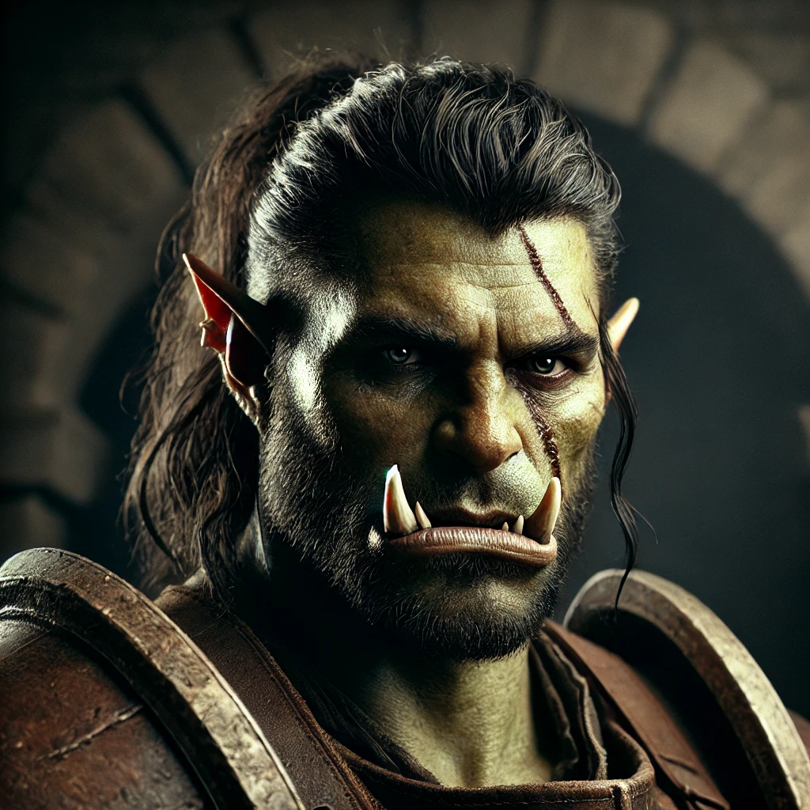 {class="framed-image"}

_полуорк, начальник гарнизона города_ {align="center"}

::: column-reset

## Описание

> Высокий, широкоплечий полуорк с серовато-зелёной кожей и тёмными волосами, собранными в хвост. Шрам через левую бровь
> делает его взгляд ещё более суровым. Доспехи поношенные, но крепкие, с эмблемой Империи. Держится уверенно, голос
> звучит резко и без лишних эмоций.

## Отыгрыш и характер

- Говорит чётко, короткими фразами, словно отдавая приказы.
- Не любит пустых разговоров, но уважает компетентных и прямых людей.
- Терпелив, но раздражается, если кто-то мешает или тратит время зря.

**Отношение к героям:** Равнодушный

::: column

## Информация

Хурган может попытаться привлечь героев к расследованию из-за нехватки стражников и выдать им
[разрешение](#разрешение-гарнизона) на помощь страже.

**О Марии:** _«Хорошая девушка. Жила спокойно, без конфликтов. Нет причин думать, что она исчезла из-за кого-то в
городе.»_

**О Гюнтере:** отмечает, что Гюнтер переживает — возможно, между ними было что-то личное, хоть он и молчит; к службе
претензий нет, но в последние дни тот нервничал — может, что-то знал или поссорились.

**Об исчезновениях:** Подозрения Гюнтера уже утомили Хургана: Гюнтер твердит, что и раньше кто-то исчезал, хотя в их
городе многие уезжают без предупреждения.

**О Розе и Церкви:** Хурган недоволен тем, что к ней прислушиваются лишь из-за принадлежности к Церкви: у них свои
порядки, а пользы от неё мало — одна суета.

**Об Империи и ситуации на полуострове:** Хурган уверен, что Империи следовало ввести войска — демонов они отбили чудом;
возню с независимостью считает глупостью и убеждён, что Карталь без Империи не выстоит.

::: page {type="class" icon="./assets/symbols/holy-empire.svg" footnote="Приложение | Персонажи"}

# Гюнтер

Во время вторжения демонов Гюнтер потерял всю свою семью, а сам чудом выжил. После этого он решил стать стражником,
надеясь сделать город безопаснее, раз Ангелы не пришли на помощь, как обещала церковь. Он встречался с Марией втайне,
мечтая уехать с ней подальше от этого места. После её исчезновения он уверен, что это не случайность. Он подозревает
Церковь и лично Розу.

**Основная цель:** Найти Марию и доказать причастность Церкви.

## Локации

- [Дом Марии](#дом-марии)
- [Гарнизон](#гарнизон)

::: column

 {class="framed-image"}

_человек, стражник-новичок_ {align="center"}

::: column-reset

## Описание

> Молодой человек лет 20, светловолосый, с голубыми глазами. Телосложение крепкое, но в движениях ещё нет уверенности
> опытного воина. Носит начищенную кирасу, которая слегка ему велика, а поверх неё — пояс с дешёвым мечом. Его взгляд
> часто мечется, а голос дрожит, если он волнуется.

## Отыгрыш и характер

- Говорит резко, но иногда запинается, особенно под давлением.
- Часто сжимает кулаки или скрещивает руки, пытаясь выглядеть увереннее.
- Вспыльчив, может резко сменить тон, если чувствует угрозу или несправедливость.

**Отношение к героям:** Равнодушный (недоверие)

::: column

## Информация

Если обвинить Гюнтера в убийстве, насилии, оскорбить Марию или просто слишком сильно запугать, то он замкнется и
перестанет говорить с героями. Отношение станет **враждебным**.

На второй день может предпринять попытку в одиночку арестовать Розу.

**О Марии (базовая информация):** Скажет что они просто знакомые. Последний раз видел её на рынке около шести вечера по
пути на дежурство. Также отмечает, что у Марии есть знакомая на рынке, [Карра](#карра), однако ей он не доверяет.

Если игроки **настойчиво расспрашивают о Марии**: Гюнтер признаётся, что встречался с Марией и просит сохранить это в
тайне; они договорились увидеться на закате у дозорной башни — он собирался сделать ей предложение. Он вспоминает, что
её что-то тревожило: накануне она хотела ему кое-что сказать, но встреча так и не состоялась.

**Если расположить к себе** (или если игроки прямо говорят, что они «против Церкви», или что «Розе нельзя доверять»):
Гюнтер сообщает о других исчезновениях — двое торговцев, Петер и Бошир, и Абрахам — и сетует, что Хурган лишь
отмахнулся. Он открыто обвиняет Розу: её приезд совпал с чередой пропаж, исчезали те, кто стоял у неё на пути и в
совпадения он не верит.

<!-- prettier-ignore -->
::: page {type="class" layout="rtl" icon="./assets/symbols/church-light.svg" footnote="Приложение | Персонажи"}

# Роза

Прибыла в город месяц назад с тайным заданием Церкви — ей поручено найти артефакт и расследовать нападения на торговцев.
Она действует в одиночку и не делится информацией даже с местными жрецами. Считает, что её миссия важнее любых местных
проблем и не позволит кому-либо стоять у неё на пути.

**Основная цель:** Завершить своё задание и уйти, не втягиваясь в местные дела.

## Локации

- [Храм Света](#храм-света)
- [Городские ворота (западные)](#городские-ворота)

::: column

<!-- prettier-ignore -->
 {class="framed-image"}

_человек, паладин Церкви Света_ {align="center"}

::: column-reset

## Описание

> Высокая, мускулистая женщина лет 30, с короткими тёмными волосами и холодным, изучающим взглядом. На ней простые, но
> добротные доспехи, без украшений, с символом Империи. Держится с достоинством, всегда начеку, словно оценивает
> обстановку.

## Отыгрыш и характер

- Говорит коротко и без эмоций, не любит лишних слов. Обращается ко всем по расе или роду занятий.
- Всегда держит дистанцию, словно проверяя, кому можно доверять.
- Не терпит глупости, но не вступает в конфликты, если в этом нет смысла.

**Отношение к героям:** Враждебный, Равнодушный к паладинам и клерикам

::: column

## Информация

При **враждебном/равнодушном отношении:**

- Если игроки попробуют поговорить с Розой, то она уклонится от ответов.
- Она будет избегать конкретных ответов стараясь не идти на открытый конфликт, но если игроки обвинят ее и попробуют
  арестовать – начнет бой и затем скроется из города.
- Может признать, что находится здесь с расследованием по заданию Церкви, но не раскроет его суть.

Если игроки **заслужили доверие** и принадлежат к Церкви/Империи:

- О текущем задании: _«Я расследую нападения на торговцев между Портгейтом и побережьем. Несколько тел были обезображены
  — не зверь и не человек. Но в ваших проблемах я замешана не была.»_
- О Марии: _«Я видела её один или два раза рядом с Храмом. Она не искала света — она чего-то боялась. Но я не следила за
  ней. Но вчера я заметила, как она шла в сторону заброшенного района. Спешила, оглядывалась. Как будто пряталась…»_

<!-- prettier-ignore -->
::: page {type="class" icon="./assets/symbols/black-meduza.svg" footnote="Приложение | Персонажи"}

# Гастон

Вчера прибыл в город по заданию [Чёрной Медузы](#приложение-государства-и-организации) — ему поручено найти
[шкатулку](#) с ценным грузом, которую должны были передать Петер и Бошир. Он выяснил что те сняли комнату в таверне и
затем бесследно исчезли. Вчера ночью он пытался пробраться в бухту с моря, но его спугнули пьяные рыбаки. Он знает, что
в доме Абрахама есть тайный проход в катакомбы. Днём следит за домом, а ночью пытается в него проникнуть.

**Основная цель:** Найти пропавшую шкатулку и сохранить секретность катакомб.

## Локации

- [Таверна «У Моря»](#таверна-у-моря)
- [Дом Абрахама](#дом-абрахама)

::: column

<!-- prettier-ignore -->
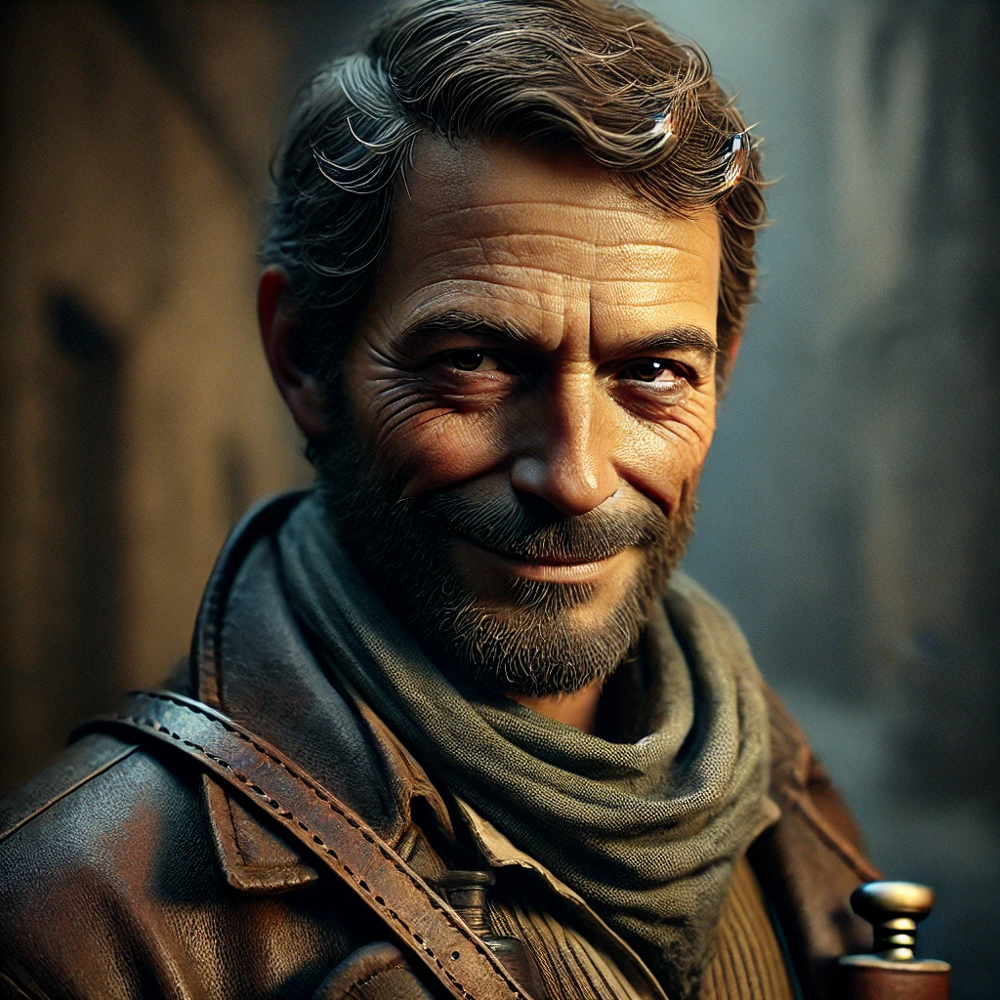 {class="framed-image"}

_человек, контрабандист_ {align="center"}

::: column-reset

## Описание

> Невысокий, жилистый мужчина средних лет с резкими чертами лица и хитрым прищуром. Его одежда простая, но удобная, на
> поясе болтается потёртая фляга. Движения быстрые, будто всегда готов исчезнуть. В глазах читается изворотливость и
> привычка к обману.

## Отыгрыш и характер

- Говорит быстро, легко меняет тему, если разговор заходит в неудобное русло.
- Никогда не отвечает прямо, любит торговаться и выставлять услуги как «взаимовыгодные».
- Постоянно держит флягу, делает вид, что пьёт больше, чем на самом деле.

**Отношение к героям:** Равнодушный (недоверие)

::: column

## Информация

В таверне при первой встрече будет делать вид что пьян и будет не заинтересован в беседе.

Если у группы есть персонаж, знающий воровской жаргон — проверяет игрока вопросом, чтобы убедиться, что перед ним
«свой»: _«Скажи мне, что громче: звон монет или шорох сена?»_ — ответ «Шорох, если монеты не твои».

Если герои идут к дому Абрахама — незаметно выходит следом.

Может рассказать что разыскивает груз пропавших торговцев, умалчивая о контрабанде.

Если видел, что игроки заходили в дом Абрахама, то может предложить сделку: **50 золотых каждому** за помощь в поиске
предмета в катакомбах, но об этом нельзя никому говорить.

Если уже побывал в доме и нашёл тело Абрахама, то Гастон скажет, что ему нужна охрана, чтобы спуститься в катакомбы (он
не знает, что там). За молчание и сопровождение предлагает по **100 золотых каждому**.

В любом из этих вариантов Гастон раскрывает героям свою миссию и предупреждает: Медуза не прощает предателей.

Если герои попытаются обмануть его - например скрыть шкатулку или сообщить о катакомбах Хургану - Гастон исчезает из
города.

<!-- prettier-ignore -->
::: page {type="class" layout="rtl" icon="./assets/symbols/city.svg" footnote="Приложение | Персонажи"}

# Йонас

Вырос на историях своего деда, который привозил диковинки из
[Магических Государств](#приложение-государства-и-организации). Сам он не занимается контрабандой (и не верит что дед
был контрабандистом), но обожает чувствовать себя важным.

Недавно он узнал, что маг Абрахам исчез, и теперь подумывает снова сдать старый дом деда кому-то другому, но боится, что
это может его втянуть в неприятности. Не знает про подвал в доме.

**Основная цель:** Почувствовать себя значимым.

## Локации

- Конюшни
- [Рыночная площадь](#рыночная-площадь)
- [Дом Абрахама](#дом-абрахама)

::: column

<!-- prettier-ignore -->
 {class="framed-image"}

_человек, кучер_ {align="center"}

::: column-reset

## Описание

> Молодой человек лет 23, худощавый, с растрёпанными светлыми волосами и взволнованным взглядом. Одет просто, но
> опрятно. Руки часто сжаты или трут друг друга — он всегда кажется либо взволнованным, либо возбуждённым от собственной
> болтовни.

## Отыгрыш и характер

- Говорит быстро, перескакивая с темы на тему, часто уходит в ненужные подробности.
- Легко пугается, но если чувствует себя в безопасности, раздувает щёки и важничает.
- Любит рассказывать байки про своего деда, часто приукрашивая их.

**Отношение к героям:** Дружелюбный

::: column

## Информация

Йонас бойко расхваливает свой просторный, крепкий дом — пыль пустяк, разбитое окно уже заколочено — и предлагает героям
поселиться, делая вид, будто жильё никем не занято.

Йонас отмечает, что в этом месяце **дети** всё чаще ошиваются у конюшни и вокруг дома, и это ему не по душе.

Йонас с гордостью рассказывает байки **про своего деда**, а так же дает информацию, которую игроки могут
интерпретировать как связь с контрабандой.

Если спросить **про Абрахама**: _«Ну да, маг пропал… А вы его знали, что ли? Да, он заплатил за год вперёд, но теперь-то
его нет. Дом пустует, пылится, а кому от этого лучше? Так что я не вижу проблемы. Хотите снять — можно обсудить!»_. Чуть
позже засомневается: _«Ну, вы уверены? Просто… Ну вдруг он вернётся? Или… кто-то за ним придёт? Не хочу ссориться ни с
магами, ни с вами, если честно.»_

Если заговорить **о контрабанде**, Йонас раздражённо открещивается: уверяет, что он «просто кучер», и добавляет, что
скажи такое его деду — тот бы быстро поставил на место, будь жив.

::: page {type="class" icon="./assets/symbols/city.svg" footnote="Приложение | Персонажи"}

# Дункан

Бывший приключенец. Последнее задание было примерно 15 лет назад — вся его группа погибла в северных горах на
полуострове. Что там произошло, он никому не рассказывает. Те, кто его знал до этого, говорят, что он сильно изменился.
Теперь живёт тихо, сторонясь прежней жизни. Однако слухи о драконе пробудили в нём прежнюю решимость — он подумывает
собрать новую группу.

Ненавидит Церковь и ангелов.

**Основная цель:** Сбор информации.

## Локации

- [Причал](#причал)
- [Таверна «У Моря»](#таверна-у-моря)

::: column

<!-- prettier-ignore -->
 {class="framed-image"}

_человек, бывший приключенец_ {align="center"}

::: column-reset

## Описание

> Высокий мужчина лет сорока, с резкими, но благородными чертами лица, короткой тёмной бородой и практически фиолетовыми
> глазами. На висках пробилась седина, но его осанка остаётся прямой, а движения — уверенными. Одет в тёмный походный
> плащ, под которым видно добротные, но потёртые доспехи. У пояса — меч старого образца, тщательно ухоженный, но явно
> видавший лучшие времена.

## Отыгрыш и характер

- Спокойный, рассудительный, сдержанный.
- Напоминает благородного воина-ветерана, слегка меланхоличен.
- В разговоре всегда подчёркнуто дружелюбен, но в глазах читается некоторая отстранённость.

**Отношение к героям:** Дружелюбный

::: column

## Информация

Может рассказать **краткую историю города**, аналогичную тому что написано в [«Хроники Сан-Сопригаля», том I](#), а так
же про вторжение демонов, Хургана и как он стал здесь главным.

Может намекнуть, что **в горах** неподалёку что-то есть: _«Это место... В горах что-то пробудилось. Вопрос лишь в том —
что с этим делать.»_

Если спрашивать **про Церковь или Розу**: _«Ангелы... Всё суются, где не просят. Как мошки на свет. Просто вечно
мешаются. Как стражник, который думает, что он тут главный, только потому что у него пряжка блестит.»_

По завершению приключения может предложить героям отправится в горы на поиски дракона.

::: page {type="class" icon="./assets/symbols/city.svg"}

# Хельмут

Убеждён, что в стенах его таверны должно хватать места всем. Нанял на работу гоблина — официанта [Кенки](#кенки) —
сперва шептались, а теперь многие приходят именно к нему.

В подвале Хельмут держит опрятную крысиную ферму: жареные жирные речные крысы — деликатес для дворфов, и пусть их в
городе немного, Хельмут хочет, чтобы и они чувствовали себя желанными гостями.

Привык решать всё сам, но если кто-то угрожает его людям или репутации таверны, без колебаний обратится за помощью к
кому угодно.

## Локации

- [Таверна «У Моря»](#)

::: column

<!-- prettier-ignore -->
 {class="framed-image"}

_человек, владелец таверны_ {align="center"}

::: column-reset

## Описание

> Коренастый человек 50+ лет с залысинами, густыми бровями и вечным выражением усталости.

## Отыгрыш и характер

- Грубоватый, но гостеприимный.
- Лишних вопросов не задаёт.

**Отношение к героям:** Дружелюбный

::: column

## Информация

Попросит помочь с крысиной фермой (см. [Подвал Таверны](#подвал-таверны)) за **10 золотых**.

**О постояльцах**, исчезнувших месяц назад:

- _«Вспомнил тоже, у нас город такой, люди приезжают и уезжают, я бы не назвал это пропажей. Вот был случай месяц назад
  – двое ребят приехали, сняли одну комнату на двоих и все говорили что хотят посмотреть на шпиль нашего Храма. А на
  утро их уже не было, вещи только остались. И что теперь – они тоже пропали что ли? Просто путники.»_
- _«Да на что они вам все сдались-то? То этот мальчишка приходил с вопросами, то вот этот хмырь (показывает на Гастона),
  теперь вот вы.»_
- За подробносями посоветует обратится к [Кенки](#кенки).

**Об Абрахаме** он говорит, что видел его всего пару раз, и шутит: должно быть, тот воздухом питался.

**О Марии** он отзывается буднично: обычная девчонка, хотя нос отменный — даже прокисшее пиво в подвале чуяла; её лавка
была рядом, поэтому иногда заглядывала.

Если расположить к себе может рассказать [правдивый слух](#).

::: page {type="class" layout="rtl" icon="./assets/symbols/city.svg"}

# Кенки

Гоблин из местного горного племени, жившего тут еще до людей. Когда основали город, гоблины приняли городской закон,
платят сборы и вступили в ремесленные артели — но чаще получали низкооплачиваемую работу и косые взгляды. Кенки знает
портовые сплетни и языки гостей.

Терпит предвзятость, но если унижают его или таверну — отвечает холодно и чётко, по закону и с парой острых слов в
запасе.

## Локации

- [Таверна «У Моря»](#таверна-у-моря)

::: column

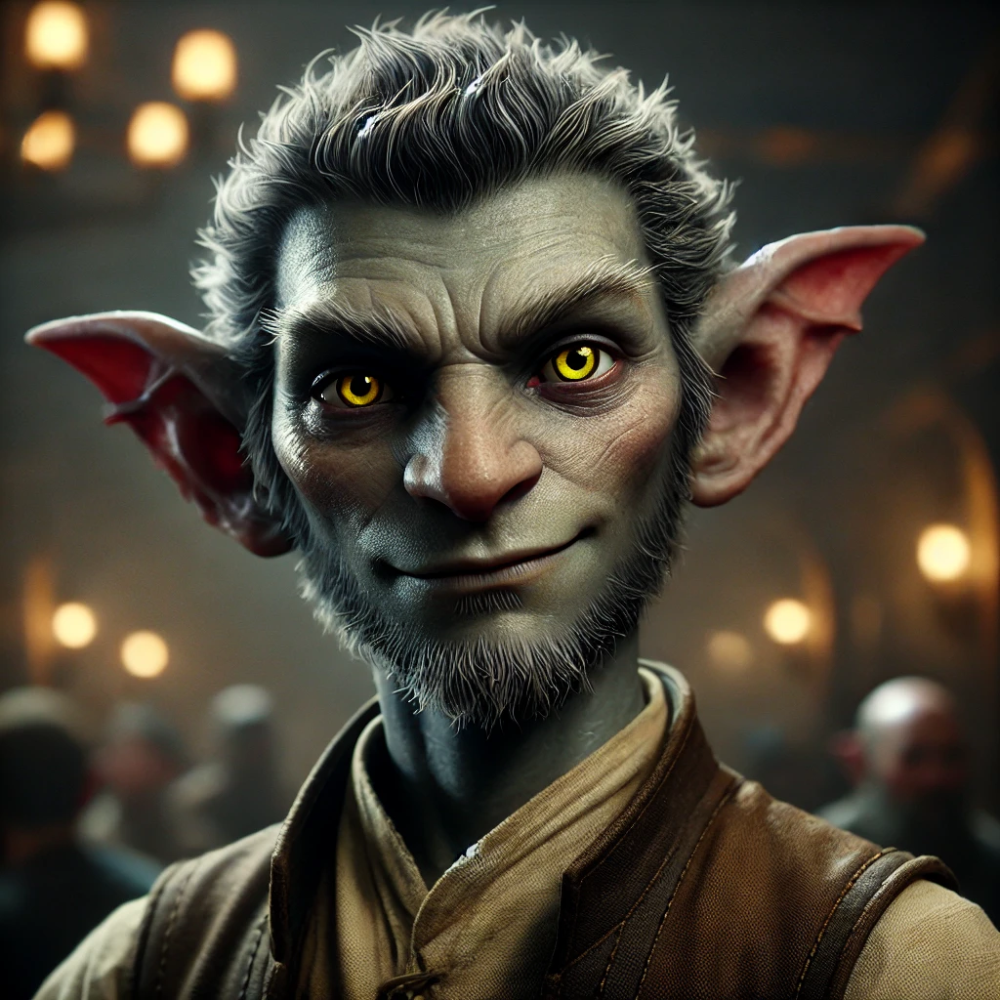 {class="framed-image"}

_гоблин, официант в таверне_ {align="center"}

::: column-reset

## Описание

> Невысокий, худощавый, с большими ушами и вечной ухмылкой.

## Отыгрыш и характер

- Писклявый голос, гордый и суетливый.
- Постоянно жалуется, что «работа тяжёлая, а клиенты грубые».
- Любит сплетничать, но за деньги.

**Отношение к героям:** Равнодушный

::: column

## Информация

**О постояльцах**, исчезнувших месяц назад: _«Да они вообще странные, сначала сидели и обсуждали каких-то «медуз». Потом
вроде и комнату одну сняли, а сами к Розе приставать пытались – ох, как она их отделала, вы бы видели.»_ Так же может
дать их описание:

- Крепкий мужчина лет 35–40, с короткими тёмными волосами, заметной лысиной и округлыми чертами лица. Носит щетину,
  взгляд жёсткий и недоверчивый.
- Худощавый, темнокожий мужчина, лет 35–40 с поникшим взглядом. Носит бородку вокруг рта. Одет в дорогую, но поношенную
  рубашку и тюрбан.

Кенки говорит, что отнёс [вещи торговцев](#вещи-торговцев) в подвал и разрешит осмотреть её, если Хельмут не против.

Нашёл и выпил **пузырек из их вещей**, и почувствовал «себя слишком бодро» и сразу протрезвел, хотя до этого выпил пару
кружек _(намек на противоядие)_.

Если расположить к себе отдаст второй такой пузырек. С инструментами алхимика за час можно понять что это противоядие.

За **1 золотой** расскажет случайный [правдивый слух](#приложение-слухи). Если заплатить меньше - расскажет
[ложный слух](#приложение-слухи).

::: page {type="class" icon="./assets/symbols/church-light.svg"}

# Селина

## Локации

- [Храм Света](#храм-света)

::: column

 {class="framed-image"}

_человек, жрица Храма Света_ {align="center"}

::: column-reset

## Описание

> Женщина около 40 лет, со светлыми волосами и спокойным взглядом. Одежда скромная, но ухоженная.

## Отыгрыш и характер

- Спокойная, благочестивая, говорит мягко, но твёрдо.
- Уверена, что любые события — часть ангельского замысла.

**Отношение к героям:** Равнодушный, Дружелюбный к паладинам и жрецам, Враждебный к магам

::: column

## Информация

- Расскажет о десяти заповедях Света и попробует проповедовать.
- Про **Марию**: _«Мария приходила часто, слушала службы. Потом вдруг перестала. Последний раз мы говорили месяц назад:
  она спрашивала про магию и почему её запрещают. Я объяснила, что магия — это гордыня, принявшая форму знания. Там, где
  она процветает, вера умирает в тишине»_.
- Про **Розу**: _«Она — паладин, и я ей доверяю. Но люди её не приняли. В первый же день в таверне какие-то пьяницы
  полезли в драку»_.
- Про **человека в подвале**: _«Это выбор души, а не тела. Без боли нет искупления»_.
- Про **сны**: _«Некоторые прихожане жалуются, что не могут уснуть. Говорят, им снится, что они стали пауками. Думаете,
  это просто так?»_

::: page {type="class" icon="./assets/symbols/city.svg"}

# Герман Элквин

## Локации

- [Библиотека (бывшая ратуша)](#библиотека)

::: column

 {class="framed-image"}

_человек, библиотекарь_ {align="center"}

::: column-reset

## Описание

> Пожилой библиотекарь с седыми, растрёпанными волосами и круглыми очками, вечно сползающими на кончик носа. Носит
> старомодный жилет и потёртый плащ с заплатами.

## Отыгрыш и характер

- Голос тихий и немного хриплый, движения неспешные.
- Любит книги больше людей, но всегда рад тем, кто проявляет уважение к знаниям.

**Отношение к героям:** Равнодушный

::: column

## Информация

- Абрахам брал книгу про души, и еще несколько книг, которые библиотека получила после того как погиб маг, который
  раньше жил в этом городе.
- Про Гюнтера: «Он не любит книги, но ту одну всё время просил. Про догматы.»
- О своём черновике: «Пишу иногда. Так… для себя. Мемуары? Нет, слишком громко сказано. Просто дни. Дни в аду. Так и
  назвал.»
- «Если ищете ответы, не ходите по городу — прочитайте книгу по истории города.»
- Герман рассказывает, что часть книг, в том числе «О запретных учениях и ересях», появилась из дома мага Моандера,
  пропавшего во время осады; его дом тогда почти полностью сгорел.
- **Абрахам** интересовался «О запретных учениях и ересях», делал пометки и переписывал фрагменты.

::: page {type="class" icon="./assets/symbols/city.svg"}

# Карра

## Локации

- [Рыночная площадь](#рыночная-площадь)

::: column

 {class="framed-image"}

_человек, торговка безделушками_ {align="center"}

::: column-reset

## Описание

> Невысокая торговка лет сорока с лукавой улыбкой, оливковой кожей и живыми зелёными глазами. Тёмные вьющиеся волосы
> убраны под платок, на ушах золотые серьги-кольца. Она носит простую светлую блузу и коричневую накидку. В её облике
> сквозит озорство и явная заинтересованность.

## Отыгрыш и характер

- Голос тёплый, с лёгкой хрипотцой, часто звучит с насмешливыми интонациями.
- Часто жестикулирует, любит поправлять волосы или серьги, когда заигрывает.
- Обожает редкие и странные товары, особенно украшения, и всегда оживляется, если разговор заходит о чём-то необычном.

**Отношение к героям:** Дружелюбный

::: column

## Информация

О Марии и Гюнтере:

- _«Я не люблю сплетни, но Мария сама мне говорила что у нее было что-то с одним стражником. Прямо на
  [дозорной башне](#дозорная-башня), ага. А он потом накрутил себе невесть что — сцены, претензии, “внимания мало” и вся
  эта муть»_.
- _«А потом, прикиньте, треснул её. Вот так взял — и руку поднял! Я ей и сказала: гнать его ссаными тряпками, чтоб следа
  не осталось»_.
- Имени стражника она не помнит.

О Марии:

- В последнее время Мария стала тише и замкнутее, избегала разговоров. По словам Карры, причина — Роза. Карра несколько
  раз видела, как Мария бледнела при её появлении и даже сворачивала в другую сторону, чтобы не сталкиваться.
- Подарила Марии амулет в форме луны «на удачу», чтобы успокоить её — обычная безделушка, без какой-либо магии.

Карра становится разговорчивее после удачного флирта с героем **или** покупки у неё.

При успешном флирте предлагает встретиться ночью в таверне, но не приходит. Наутро её прилавок пуст. Если герои разыщут
Карру дома, она признается: хочет такого же внимания и «славы», как у Марии.

::: page {type="class" icon="./assets/symbols/holy-empire.svg"}

 {class="framed-image"}

_люди, рядовые стражники города под командованием Хургана_ {align="center"}

# Стража

## Локации

- [Гарнизон](#гарнизон)
- [Городские ворота](#городские-ворота)
- [Дозорная башня](#дозорная-башня)
- Улицы города

## Описание

> Мужчины в простой броне с гербом Империи на плечах. Кто-то стоит на посту с каменным лицом, кто-то курит за углом,
> кто-то ворчит на очередной приказ. Среди них есть и новобранцы, и ветераны. На фоне тревожных событий стража кажется
> единственной стабильной силой в городе.

## Отыгрыш и характер

- Соблюдают дисциплину, иерархию, действуют по приказу.
- Стражники следят за порядком, но не всегда действуют слаженно.

**Отношение к героям:** Равнодушный, Дружелюбный при сотрудничестве, Враждебный при нарушении порядка или подозрении

## Информация

- Про исчезновения:
  - Недавние исчезновения беспокоят только Гюнтера – остальные считают, что люди просто ушли по своим делам.
  - Про Абрахама: «Тощий маг? Ну, бывает. Наверное, уехал, все равно я его всего пару раз видел.»
  - Про Бертрама: «Бертрам? Он пропал? Ну, наверное, в запой ушёл, как всегда.»
- Про Гюнтера:
  - «Гюнтер? Странный парень, вчера драил доспехи, как будто на парад собирался.»
  - Он не уверен, что происходит, но заметил, что Гюнтер нервничает уже несколько дней и как будто к чему-то готовится.
- Про Розу:
  - Роза часто покидает город, обычно на несколько дней.
- Про Хургана:
  - Они уважительно говорят о Хургане – он не позволяет беспорядкам захватить город и вообще он главный в городе, а
    сидит с ними в Гарнизоне, а в этой старой ратуше.
  - Некоторые жалуются, что Хурган слишком много требует, другие гордятся службой под его началом.
- Общее:
  - Корабли не выходят в море из-за нападений.
  - По ночам в городе стало как-то подозрительно тихо.

::: page {type="class" icon="./assets/symbols/city.svg"}

 {class="framed-image"}

_фоновые персонажи, отражающие атмосферу города_ {align="center"}

# Горожане

Разношерстная толпа — ремесленники, торговцы, рыбаки, дети, пьяницы, стражники. Одни боятся происходящего, другие
отмахиваются, как от очередной выдумки. В глазах большинства — усталость, но и привычка жить с тревогой, как с фоном.

## Локации

- [Причал](#причал) — рыбаки, пьяницы.
- [Рыночная площадь](#) — торговцы, нищие, дети.
- Ступени [Храма](#) - нищие.
- Улицы города — дети, нищие, случайные свидетели.

## Отыгрыш и характер

- Торговцы охотно болтают, но не переходят черту.
- Рыбаки немногословны и подозрительны к чужакам.
- Пьяницы громки и агрессивны, но могут знать то, чего не должны.
- Дети часто первыми замечают странности, но не понимают их значения.

**Отношение к героям:** неопределено

## Информация

**Торговцы:**

- Делятся слухами (см. таблицы слухов в локации [Рыночная площадь](#)).
- Слышали, как Мария спорила с Гюнтером, или что та покупала странные травы.

**Рыбаки:**

- _«Ночью я видел, как кто-то шёл по пирсу, в капюшоне. Потом — плеск волн, и всё.»_
- «Пёс мой завыл той ночью. А он у меня на бурю не воет.»

**Пьяницы:**

- Один может утверждать, что слышал голоса под землёй: «Шепчутся там, в подвале. В подземелье. Я не спал!»
- Другой утверждает, что видел Розу с мечом, весь меч в чём-то чёрном.
- Жалуются что Бертрам пропал, но его никто не ищет.

**Дети:**

- Один расскажет, что видел как кто-то ночью вылезал «из под земли» у разрушенного дома.
- Расскажут что раньше играли в заброшенном районе, но теперь там «очень страшно».

::: page {type="class" icon="./assets/symbols/city.svg"}

 {class="framed-image"}

_человек, торговка благовониями_ {align="center"}

# Мария

## Описание

Женщина около 30 лет, стройная, с каштановыми волосами, заплетёнными в косу, и карими глазами. Обычно носит простую, но
опрятную одежду. Свою одежду обычно украшает небольшими серебряными бусинами. Носит серебряный амулет в виде луны. От
неё всегда пахнет ароматными маслами, специями и ладаном.

::: page {type="class" icon="./assets/symbols/mages.svg"}

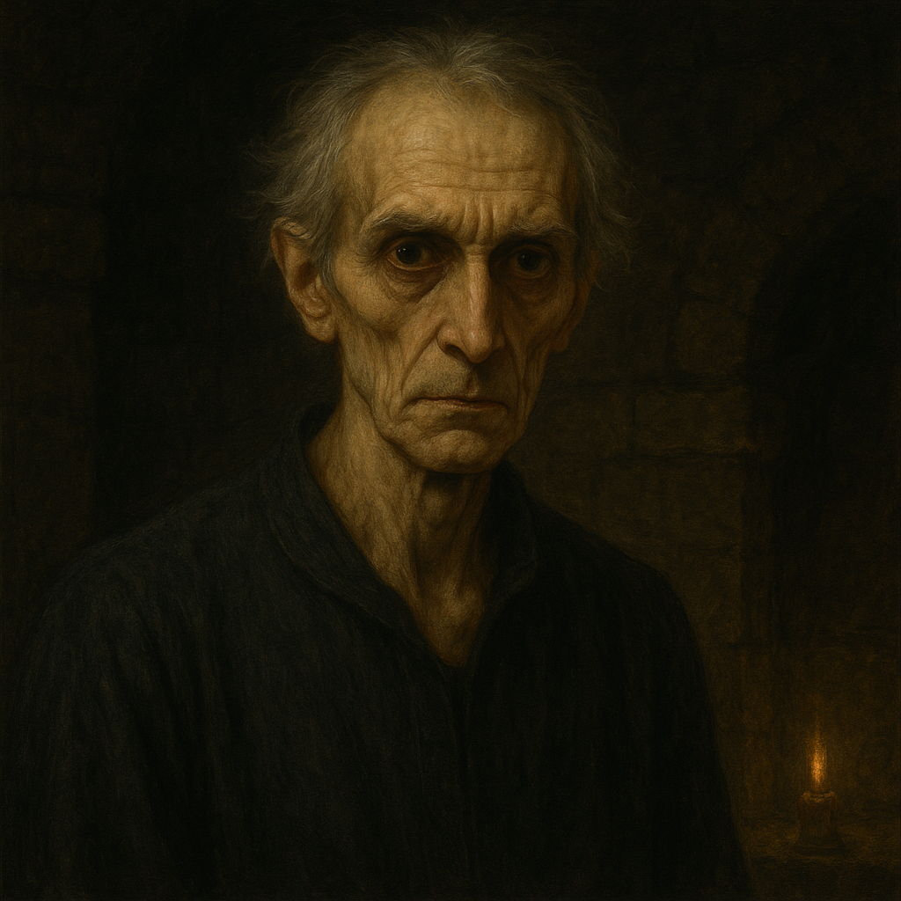 {class="framed-image"}

_человек, маг (некромант)_ {align="center"}

# Абрахам

## Описание

Высокий, худощавый, пожилой мужчина с острыми чертами лица и глубоко запавшими тёмными глазами. Его седые волосы всегда
выглядят немного растрёпанными, как будто он не заботится о внешнем виде.

::: page {type="class" icon="./assets/symbols/city.svg"}

# Ясад

Всего неделю в городе, ночует в таверне «У Моря». Интересуется магией и историей Великой Империи.

Говорит, что прибыл из Соединённых Магических Государств и хочет узнать больше о постройках времён Великой Империи на
полуострове.

Слышал, что неподалёку есть древние руины, и намерен проверить это сам. Планирует собрать группу единомышленников —
исследователей и проводников — чтобы осмотреть объекты на месте.

## Локации

- [Таверна «У Моря»](#)

::: column

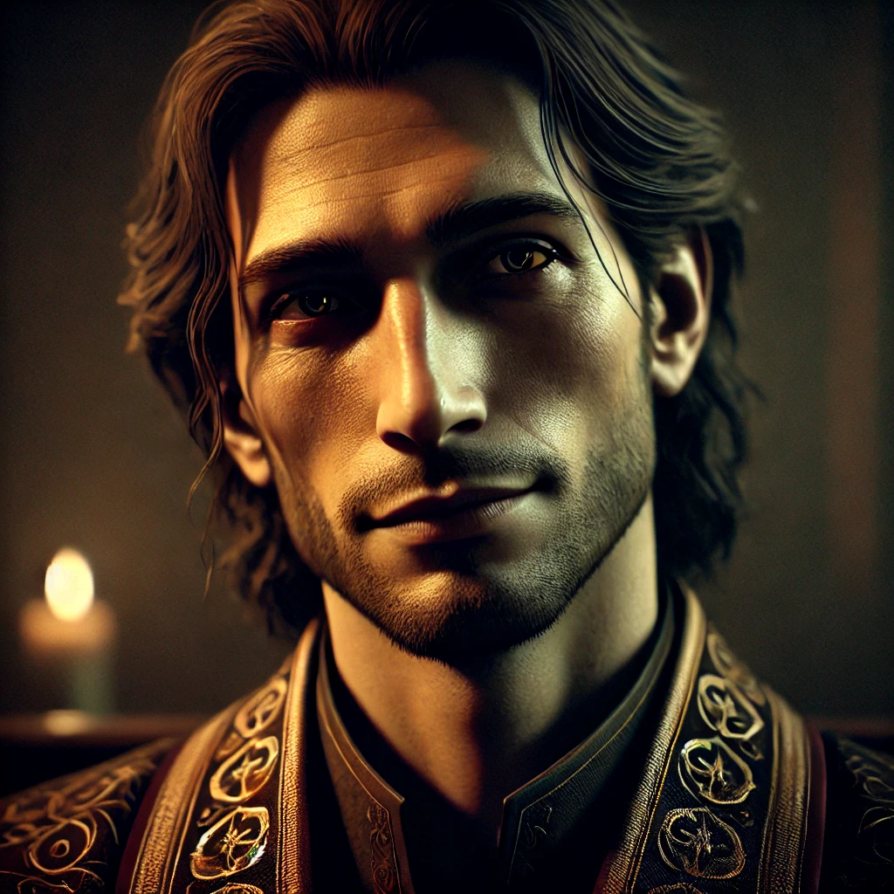 {class="framed-image"}

_человек, загадочный путешественник_ {align="center"}

::: column-reset

## Описание

> Высокий мужчина 30 лет, с тонкими чертами лица и внимательным взглядом. Одет в дорогую, но странную мантию.

## Отыгрыш и характер

- Вежливый, внимательный, с лёгкой насмешкой в голосе.
- Изъясняется изящно, словно учёный.
- Избегает разговоров о себе, но увлечённо рассказывает о магии и истории.

**Отношение к героям:** Дружелюбный

::: column

## Информация

Любит поболтать про магию и древние руины Империи. Может рассказать что собирает «знания» и что долго «гостил» в
Магических Госудаствах.

Если один из игроков является тифлингом обмолвится что _«не ожидал что и тут есть Тифлинги»_, но после откажется
отвечать на уточняющие вопросы.

После приключения может попросить героев разведать руины на полуострове и скажет где они примерно находятся.

::: page

# Пропавшие люди

## Мария

### Описание

Женщина около 30 лет, стройная, с каштановыми волосами, заплетёнными в косу, и карими глазами. Обычно носит простую, но
опрятную одежду. Свою одежду обычно украшает небольшими серебряными бусинами. Носит серебряный амулет в виде луны. От
неё всегда пахнет ароматными маслами, специями и ладаном.

### Информация

- Марию видели на [рынке](#рыночная-площадь) до 18:00.
- _«Я не люблю сплетни, но слышал что у Марии что-то было с кем-то из стражи.»_

## Абрахам

### Описание

Высокий, худощавый, пожилой мужчина с острыми чертами лица и глубоко запавшими тёмными глазами. Его седые волосы всегда
выглядят немного растрёпанными, как будто он не заботится о внешнем виде.

### Информация

- _«Приехал пару месяцев назад, хотя я его видел-то только один раз. Дом говорят пуст, не понравилось наверное.»_

## Петер и Бошир

## Бертрам

- _«Бертрам? Он пропал? Ну, наверное, в запой ушёл, как всегда.»_
- _«Ха! Бертрам пропал? Я скажу, куда он пропал: в ближайший подвал, где больше всего выпивки!»_

::: page {layout="wide"}

# Приложение: Слухи

Если игроки застряли и им пора в катакомбы: _«… думаю, я видел, как он/она шел к в заброшенную часть города, но мне-то
что?»_

#### Правдивые слухи

|     |                                                                                                                             |
| --- | --------------------------------------------------------------------------------------------------------------------------- |
| 1   | О Гюнтере: слишком молод для стражи, всё бегает кого-то ищет, корчит из себя героя.                                         |
| 2   | «Ночью пёс вдруг дико залаял, сорвался с цепи и убежал кого-то преследуя. Все, ни слуху, ни духу, а такой добрый" был пёс…» |
| 3   | ?? О Розе: приехала месяц назад; в таверне не пьёт, лишь сидит в углу и прислушивается, явно выслеживая кого-то.            |
| 4   | Мария? Та, что с травами? Да её не видно с утра. Ушла, говорят. Или нет...                                                  |
| 5   | Пёс мой ночью завыл — а ведь всегда на ночь замолкает. Не к добру всё это.                                                  |
| 6   | Розе Инквизитор? Да ну тебя. У неё плащ простой. Инквизиторы в чёрном. Хотя...                                              |
| 7   | Старик мой говорит, будто слышал шаги прошлой ночью. Не стража, а как когти по булыжнику.                                   |
| 8   | Мария встречается с Гюнтером                                                                                                |
| 9   | «Мария как-то ссорилась с Селиной. Громко.»                                                                                 |
| 10  | Об атмосфере в городе: «Я тут много лет, но такой тишины по ночам не помню. Даже собаки не лают. Странно это.»              |
| 11  | Матиас грустный, ходит без своих собутыльников Бертрама и Освальда                                                          |

Раньше жил маг но исчез во время осады, зато теперь в библиотеке его книги

#### Доска объявлений

- «Объявляется набор в добровольческий отряд для поиска пропавших. Доблесть, отвага и немного храбрости.»
- «Скоро очистится город. Следите за знаками. Это предупреждение, не угроза.»

И любое кол-во из сомнительных объявлений:

| K6  | Объявление                                                                                                             |
| :-- | :--------------------------------------------------------------------------------------------------------------------- |
| 1   | Пропала кошка! Чёрная, кличка «Князь». Последний раз видели у причала. Нашедшему — кружка лучшего эля!                 |
| 2   | Проклят же тот, кто свистит на закате! Уже второй раз куры дохнут после этого.                                         |
| 3   | Ищу того, кто может починить часы. Они остановились в 2:14, как и каждый год.                                          |
| 4   | Приходите на ужин. Открыт стол для всех одиноких. Дом с синим окном у старого фонтана. Никаких проповедей, просто еда. |
| 5   | Найден ключ от чего-то важного. Опишите предмет, и, возможно, верну.                                                   |
| 6   | Кто шепчет под окнами? Прекратите. У меня старое сердце и нож.                                                         |

::: page {layout="wide"}

#### Сомнительные слухи

_Примечание: Эти слухи передают субъективные мнения NPC. Некоторые могут быть правдой, иные — искажены или полностью
вымышлены, однако поиску Марии они не помогают._

| K20 | Слух                                                                                                                                                  |
| :-- | :---------------------------------------------------------------------------------------------------------------------------------------------------- |
| 1   | Хурган злится, что ему солдат не присылают. А всё потому, что Империя боится, что он здесь порядок наведёт лучше, чем герцоги!                        |
| 2   | А Роза — она не просто паладин. Молчат, конечно, но слухи ходят — у неё задание. Тайное. От самого.                                                   |
| 3   | Говорят, Мария уехала на лодке ночью. Вон рыбак видел — кто-то в капюшоне садился в челн у пристани. Но лодка-то потом была на месте.                 |
| 4   | Некоторые думают, что это дело рук Розы. Там, где она, — всегда кто-то горит, кто-то исчезает...                                                      |
| 5   | Да этот Герман — колдун, говорю вам. Книги прячет, людей не пускает, бормочет что-то себе.                                                            |
| 6   | А вы знали, что Гюнтер покупал у Марии ядовитые травы? Ночами. Шепотом. А теперь она пропала...                                                       |
| 7   | «Сын моей тётки служит при таможне — так он говорит, Карталь не передаёт отчёты в столицу уже второй месяц.»                                          |
| 8   | «А вы заметили, что Гюнтер всегда спрашивает про исчезнувших… даже про тех, кто, вроде бы, просто уехал. Будто он заранее знал, что они не вернутся.» |
| 9   | «У Селины в храме кто-то в подвале сидит. Все говорят — алкоголик. А я слышал, будто он звал Марию.»                                                  |
| 10  | «Хурган сказал, что демоны ушли. Но я видел, как он жёг бумаги в гарнизоне. Словно что-то прятал.»                                                    |
| 11  | «Говорят, на старом кладбище мертвецы теперь сами себе гробы ищут. Не удивлюсь, если в Храме знают, но молчат.»                                       |
| 12  | «В горах видели чешую размером с дверь. Одни говорят — дракон, другие — броненосец с заклятьем невидимости. Я ставлю на дракона!»                     |
| 13  | «Ходят слухи, что у Церкви под Портгейтом есть подземелье, полное трупов, которые они тренируют. Типа как армия… но без жалования.»                   |
| 14  | «Говорят, в Картале совет уже не слушает губернатора. Кто-то за шепотом стоит — или маги, или те, что в лесах живут.»                                 |
| 15  | «Если верить купцам, в Картале всё чаще звучит слово _вольный_. А у них, знаешь, язык — он как ветер: дует, куда деньги веют.»                        |
| 16  | «Ты видел северных эльфов? Нет? Потому что они едят всех, кто забредёт в их леса. Слышал, у них там даже язык без слов — одни щелчки и запахи.»       |

::: page

::: wide

# Цены в таверне «У Моря»

#### Меню

| Услуга                                  | Цена             | Примечание                      |
| :-------------------------------------- | :--------------- | :------------------------------ |
| Простой ужин (рыба, хлеб, эль)          | 5 медяков        | Сытно, но грубо                 |
| Хороший ужин (жаркое, хлеб, кружка эля) | 2 серебра        | Только вечером                  |
| Блюдо по заказу (по желанию игрока)     | 5 серебра и выше | Хельмут вздохнёт, но приготовит |
| Кувшин дешёвого эля (1 л)               | 1 серебро        | На компанию                     |
| Графин местного вина                    | 3 серебра        | Подозрительно сладкое           |

#### Ночлег

| Услуга                                                                  | Цена      | Примечание                                       |
| :---------------------------------------------------------------------- | :-------- | :----------------------------------------------- |
| Место в общем зале (на сеннике)                                         | 1 серебра | В углу, рядом с мышами                           |
| Обычная комната на одного. Можно и на двоих, если готовы спать на полу. | 5 серебра | Простая, с замком                                |
| Комната «для важных гостей»                                             | 1 золотой | Только одна такая. Лучшая постель и горячая вода |

#### Дополнительно

| Услуга                       | Цена      | Примечание                 |
| :--------------------------- | :-------- | :------------------------- |
| Услуги прачки                | 1 серебро | Выдача — на следующее утро |
| Задержка в комнате до вечера | +2 медяка | Если не съезжаете вовремя  |

:::

::: page {type="inside-cover"}

 {class="cover"}

# Предметы

::: subtitle

Магические и квестовые предметы

:::

::: page {layout="wide" footnote="Приложение | Предметы"}

# Приложение: Предметы

Ссылки в таблицах ведут к полным карточкам с описаниями, проверками и информацией.

#### Квестовые предметы

| Название                                            | Локация                                                                     | Описание                                                                                     |
| :-------------------------------------------------- | :-------------------------------------------------------------------------- | :------------------------------------------------------------------------------------------- |
| [Урна с прахом](#урна-с-прахом)                     | У одного из героев на старте приключения                                    | Сентиментальный предмет                                                                      |
| [Разрешение гарнизона](#разрешение-гарнизона)       | У [Хургана](#хурган) около [дома Марии](#дом-марии) / [гарнизон](#гарнизон) | Лояльность стражи                                                                            |
| [Дневник Марии](#дневник-марии)                     | [Дом Марии](#дом-марии)                                                     | Карра, встреча вечером, таинственный заказ                                                   |
| [Вещи торговцев (контрабандистов)](#вещи-торговцев) | [Подвал в таверне](#подвал-таверны) / у [Кенки](#кенки)                     | Фальшивые документы и одежда для прикрытия                                                   |
| [Дневник Абрахама](#дневник-абрахама)               | [Подвал в доме Абрахама](#подвал-дома-абрахама)                             | Связь с Медузой, эксперименты с ядом, связь с таинственным заказом, код от входа в катакомбы |
| [Странный предмет («Ан’Туз»)](#странный-предмет)    | [Подвал в доме Абрахама](#подвал-дома-абрахама)                             | Открывает проход в катакомбы                                                                 |
| [Контрабанда](#контрабанда)                         | [Бухта контрабандистов](#бухта-контрабандистов)                             | Награда за приключение и шкатулка, которую ищет Гастон                                       |

#### Магические предметы

| Название                                      | Локация                                                                                | Описание                 |
| :-------------------------------------------- | :------------------------------------------------------------------------------------- | :----------------------- |
| [Магическая лампа](#магическая-лампа)         | [Катакомбы (проход из дома Абрахама)](#проход-из-дома-абрахама) / у [Гастона](#гастон) | Чудесный предмет, редкий |
| [Амулет Абрахама](#амулет-абрахама-сломанный) | [Катакомбы (проход из дома Абрахама)](#проход-из-дома-абрахама)                        | Чудесный предмет, редкий |

::: page {footnote="Приложение | Предметы"}

::: panel {style="height:20%"}

:::: title

# Урна с прахом

_квестовый предмет_

::::

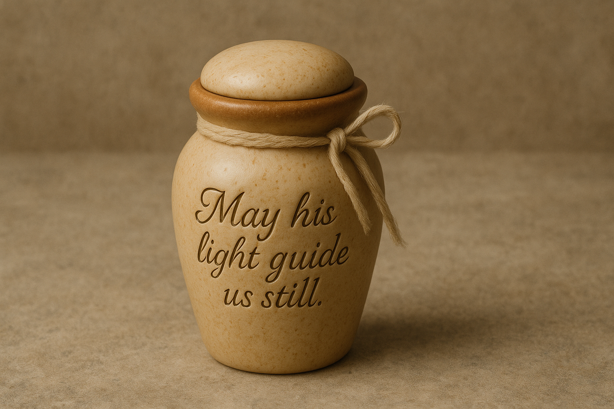 {class="cover"}

:::: credit

<!-- prettier-ignore -->
Предмет на [DndBeyond](https://www.dndbeyond.com/magic-items/9986926-ashes-urn)

::::

:::

## Описание

> Небольшая скромная керамическая урна, примерно 15 сантиметров в высоту, запечатанная воском и перевязанная выцветшей
> льняной лентой. Хотя магических свойств у неё нет, она имеет сентиментальную ценность и явно дорога тем, кто знал
> Джареда.
>
> На крышке выгравирована надпись: «Пусть его свет продолжает указывать нам путь».

::: column

## Локации

- У одного из героев на старте приключения.

::: panel {style="height:20%"}

:::: title

# Разрешение гарнизона

_квестовый предмет_

::::

 {class="cover"}

:::: credit

<!-- prettier-ignore -->
Предмет на [DndBeyond](https://www.dndbeyond.com/magic-items/10160053-garrison-permit-of-san-soprigal)

::::

:::

## Описание

> Плотная бумага со следами носки и отпечатками пальцев. Текст выведен от имени гарнизона Сан-Сопригаля. Внизу — красная
> сургучная печать с эмблемой Империи и личной отметкой Хургана. Документ выглядит просто, но его вес в городе ощутим.

## Локации

- У [Хургана](#хурган) возле [Дома Марии](#дом-марии).
- В столе Хургана в [Гарнизоне](#гарнизон).

::: column

## Информация

**Игровой эффект:**

- Стража относится **доброжелательно**, готова сопровождать и отвечать на базовые вопросы.
- Разрешено открыто носить оружие в городе и применять его для самообороны.
- Разрешено задерживать подозреваемого. Сопротивления, как правило, не будет.
- Документ не даёт права на обыск без свидетеля из стражи.
- Документ не даёт права покинуть город.

**Без разрешения:**

- НПС чаще отвечают: _«С Хурганом согласовали?»_ и уходят от разговора.

::: page {footnote="Приложение | Предметы"}

::: panel {style="height:40%"}

:::: title

# Дневник Марии

_квестовый предмет_

::::

 {class="cover"}

:::: credit

<!-- prettier-ignore -->
Предмет на [DndBeyond](https://www.dndbeyond.com/magic-items/10160022-mariias-diary)

::::

:::

## Описание

> Небольшая кожаная книжка с потёртыми краями. Страницы исписаны аккуратным почерком, чернила местами выцвели. Между
> листами — несколько засушенных цветов.

## Локации

- В [доме Марии](#дом-марии), спрятан в ящике под кроватью.

## Информация

Мария ведёт дневник нерегулярно: записывает мысли о жизни, городе и людях; попадаются заметки о товарах и поставках.

Имя «[Карра](#карра)» часто встречается в записях «о жизни» — судя по контексту, близкая подруга.

::: column

Фрагменты за последний месяц:

> «Я думала, что наши встречи что-то значат, но теперь сомневаюсь. Он хороший, но наивный. Нам надо прекратить это.»

> «Я должна ему сказать, но боюсь, как он отреагирует, особенно после того случая…»

Последняя запись сделана **вчера**, похоже, впопыхах:

> «Сегодня вечером встреча. Я всё решу. Если он не поймёт — пусть так и будет.»

**Если потратить дополнительное время на изучение:**

Можно заметить упоминания о необычном заказе с авансовой оплатой: речь о редких ингредиентах и скрытном способе
передачи. Имя не названо; на полях один раз выведена и тут же зачёркнута буква «А». Запись датирована серединой
[Нарваила](#приложение-названия-месяцев).

::: page {footnote="Приложение | Предметы"}

::: panel {style="height:40%"}

:::: title

# Вещи торговцев

_квестовый предмет_

::::

 {class="cover"}

:::: credit

<!-- prettier-ignore -->
Предмет на [DndBeyond](https://www.dndbeyond.com/magic-items/10160115-merchants-clothes)

::::

:::

## Описание

> Сумка с аккуратно сложенными вещами. Внутри — дорожная одежда, которую обычно носят торговцы: пара добротных плащей с
> капюшонами, плотные рубахи, штаны из грубой ткани и лёгкие кожаные перчатки.
>
> Всё выглядит относительно новым: ткань держит форму, швы не потёрты.

## Локации

- В [подвале таверны](#подвал-таверны), в одном из ящиков.
- Может принести [Кенки](#кенки).

::: column

## Информация

**При осмотре:**

- Торговая лицензия, подписанная «Советом гильдии Венторна».
- Книга учёта товаров.

**При изучении:**

- Торговая лицензия сама по себе дорогая и даёт право торговать без лишних пошлин и проверок; потеря — ЧП для любого
  купца.
- `@Investigation 10` Одежда почти не поношена, пахнет солью, а не пылью дороги. У одного плаща — явный запах морской
  сырости, как у вещей, долго лежавших в трюме или на причале. Всё выглядит «слишком новым», будто использовалось пару
  раз специально для этой поездки.
- `@History 15` Торговая лицензия, подписанная «Советом гильдии Венторна», поддельная: такого города не существует.
- `@Deception 12` Книга учёта — подставной журнал. Все записи сделаны одной рукой с имитацией разных стилей.

::: page {footnote="Приложение | Предметы"}

::: panel {style="height:40%"}

:::: title

# Дневник Абрахама

_квестовый предмет_

::::

 {class="cover"}

:::: credit

<!-- prettier-ignore -->
Предмет на [DndBeyond](https://www.dndbeyond.com/magic-items/10163775-abrahams-diary)

::::

:::

## Описание

> Старая книга в кожаной обложке, потёртая и испачканная чернилами. Страницы заполнены сложными записями из смеси
> академического языка и личных пометок. Местами чернила размазаны, будто писали в лихорадке.

## Локации

- В [подвале дома Абрахама](#подвал-дома-абрахама), на рабочем столе.

## Информация

> _5 Нарваила, 567 ПП._ «… непросто начинать всё заново в этой далёкой земле. К счастью, здесь нет того фанатизма, что
> встречается в других частях Империи. Приезд мага никого не удивит. Возможно, здесь я наконец обрету покой, необходимый
> для исследований.»

**Последняя запись в дневнике:**

> _2 Беталассе, 567 ПП._ «Корабль прибудет на закате. Наконец-то я воссоединюсь со своими детьми. Моё сердце было
> разбито, когда пришлось уехать и оставить их. Хорошо ещё, что у меня есть друзья в Медузе. Надеюсь, они будут
> аккуратны.»

::: column

**Также из дневника можно понять:**

- `@Arcana 10` Значительная часть записей посвящена некромантии. Часто упоминается «вторая жизнь без боли» — без
  объяснений, но с явной одержимостью темой.
- `@Nature 15` Между магическими терминами встречаются формулы и пометки по ядам. Видно, что автор опытный
  практик-алхимик и работает с ядами и противоядиями.
- `@Investigation 15` Зарисовка [странного предмета](#странный-предмет); на полях — код, залитый чернилами. Под рисунком
  приписка: _«С этого всё начинается. Медуза поручилась.»_

**Если потратить дополнительное время на изучение:**

Начиная с середины [Нарваила](#приложение-названия-месяцев) записи смещаются к алхимии: Абрахам пытается заменить
привычные реагенты травами из местной флоры, фиксируя возможные эквиваленты и катализаторы.

Постоянно встречаются размышления о бессмертии: _«Жизнь — цепь гниения. Освободись от плоти — и свободен от времени.»_
Он не ищет «вечной жизни» в обычном смысле, а намерен умертвить тело, сохранив волю и разум. Фраза _«То, что мертво,
умереть не может»_ обведена несколько раз.

::: page {footnote="Приложение | Предметы"}

::: panel {style="height:40%"}

:::: title

# Странный предмет

_квестовый предмет_

::::

 {class="cover"}

:::: credit

<!-- prettier-ignore -->
Предмет на [DndBeyond](https://www.dndbeyond.com/magic-items/10163791-strange-item)

::::

:::

## Описание

> Перед вами странный предмет: деревянный жезл, на конце которого закреплён широкий округлый «колпак». На первый взгляд
> он похож на небольшую кастрюлю, но материал необычен — чёрный, плотный и слегка гибкий. Если надавить, поверхность
> пружинит и сразу возвращается в форму, будто сделана из чего-то одновременно живого и неживого.

## Локации

- В подвале [дома Абрахама](#подвал-дома-абрахама).

::: column

## Информация

**При изучении:**

- `@Investigation 10` + [Дневник Абрахама](#дневник-абрахама) — предмет назван «Ан’Туз», рядом в дневнике есть его
  зарисовка; на полях — код, залитый чернилами. Под рисунком подпись: _«С этого всё начинается. Медуза поручилась»_.
- `@Investigation 15` Материал колпака предназначен плотно «садиться» на гладкую поверхность и создавать тягу при
  сжатии.
- `@History 15` На торце — бледное клеймо пересечённых гаечного ключа и молота: работа гномов-артефакторов
  [Кальтенвальда](#приложение-государства-и-организации). Вещь редкая и дорогая.

**Применение:**

Активатор скрытого механизма для потайного хода в [подвале дома Абрахама](#подвал-дома-абрахама): плотно приложить к
круглому отверстию и нажать **трижды** — «Ан’Туз» вытягивает наружу скрытую ручку-планку.

::: page {footnote="Приложение | Предметы"}

::: panel {style="height:40%"}

:::: title

# Контрабанда

_квестовые предметы в бухте контрабандистов_

::::

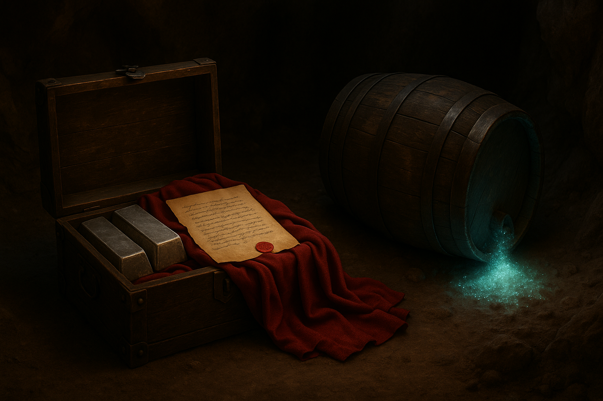 {class="cover"}

:::

## Трофеи

- Бочка **светящейся пыли**. `@Arcana 14` — мерцающий порошок. При контакте с воздухом начинает светиться. Используется
  в ритуалах или для временной подсветки.
- **Лунное серебро** — 2 слитка. `@Nature 10` — ценный металл, часто применяют в зачаровании.
- Пять комплектов **плащей** с Имперским Солнцем.

::: box

**Для Мастера.** Это предметы, которые игроки могут найти в бухте контрабандистов. При желании вы можете расширить этот
список. Содержимое тайника — финальная награда и может включать любые уместные трофеи.

:::

## Имперские документы

Документ украшен печатью с гербом Империи.

> «Лицензия на свободную магическую практику в пределах Священной Империи».
>
> Владелец: «Магистр Аркан Абрахам, по праву ученичества, допущен к практическому применению магии, в том числе в
> исследовательских, лечебных и защитных целях.»

`@Investigation 10` — бумаги поддельные.

::: column

## Черная шкатулка

> Тяжёлая шкатулка размером с ладонь, из тёмного, почти чёрного дерева, отполированного до матового блеска. Углы усилены
> металлическими накладками с тонкими насечками. На крышке — клеймо, похожее на медузу.

**При изучении:**

- Материал корпуса экранирует магические ауры.
- `@Investigation 10` — центральный элемент: сложный замок с поворотным механизмом и тонким пазом под нестандартный
  ключ. Механизм старый, но исправный; открытие требует понимания логики замка.
- `@History 15` — символ на крышке опознаётся как знак контрабандистов
  [Чёрной Медузы](#приложение-государства-и-организации).

**Вскрытие (намеренно сложно):**

- Магические способы не работают.
- Нужны **Thieves’ Tools** и проверка `@Sleight-of-Hand 30`. При провале замок «защёлкивается», повышая сложность
  следующей попытки на **+2**.

_Содержимое шкатулки — заглушка под будущее: вы можете поместить внутрь любой легендарный артефакт, если решите
развивать кампанию._

::: page {footnote="Приложение | Предметы"}

::: panel {style="height:30%"}

:::: title

# Магическая Лампа

_чудесный предмет, редкий_

::::

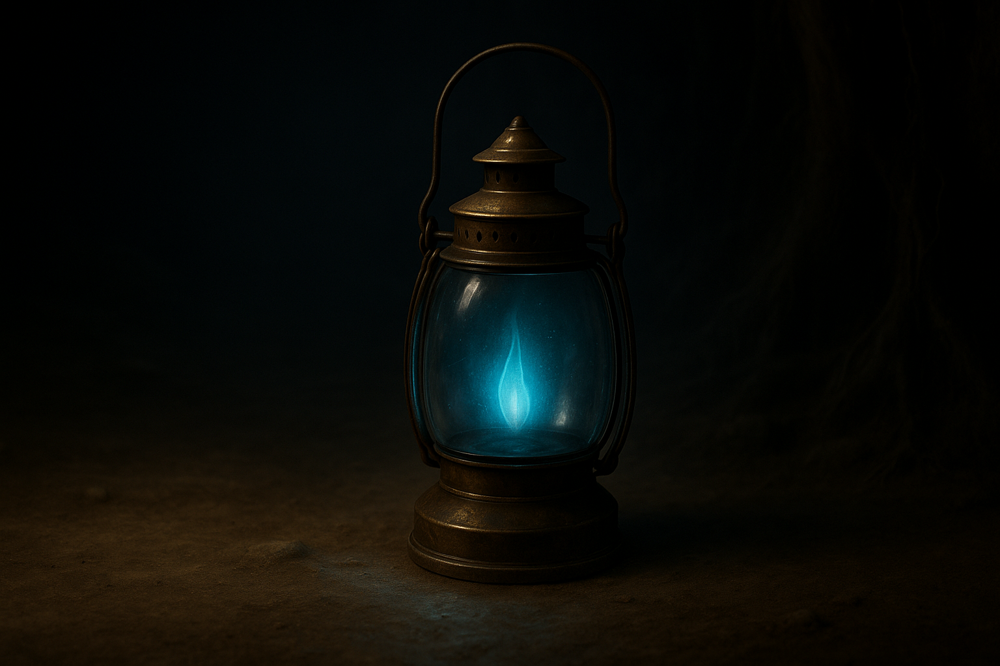 {class="cover"}

:::: credit

<!-- prettier-ignore -->
Предмет на [DndBeyond](https://www.dndbeyond.com/magic-items/10163825-magic-lamp)

::::

:::

## Описание

> Старая латунная лампа с овальным стеклянным куполом. Внутри — не пламя, а холодный синеватый свет, мерцающий без
> тепла. У лампы нет ни выключателя, ни фитиля — и всё же она горит.

Если приблизиться:

> Свет будто оживает: меняется, пульсирует, словно реагирует на присутствие.

## Локации

- В катакомбах, в проходе из [дома Абрахама](#проход-из-дома-абрахама).
- Если герои идут этим путём **после** [Гастона](#гастон), лампа у него.

## Свойства

- **Тусклый свет 10 фт.** Лампа постоянно излучает тусклый свет радиусом 10 футов.
- **Не гаснет.** Нельзя задуть, накрыть, затенить или погасить ни немагическими, ни магическими способами (**Darkness**
  не подавляет её свечение).
- **Прочность.** AC 30, HP 10; сопротивление немагическим дробящим/колющим/рубящим атакам; иммунитет к огню и яду. При 0
  HP лампа разбивается, фея погибает, свет гаснет.

::: column

## Информация

При изучении:

> Лампа явно магическая. Если долго смотреть на «огонь» внутри, он меняет форму. Иногда в глубине проступают смутные
> очертания — крылья, вытянутые руки, тонкий силуэт. Стоит сосредоточиться — они исчезают, будто прячутся от взгляда.

`@Arcana 12` / `@Investigation 15` (игроки разгадали что это иллюзия):

> За тусклым стеклом проступает крошечная фигура — светящееся существо с тонкими крыльями и острыми чертами лица. Оно
> парит в воздухе, скрестив руки, и смотрит недовольно.

## Фея

Около двух лет назад фея была затянута в малый разлом и оказалась в этом мире. Позже неизвестный маг **поймал и
запечатал** её в лампе связывающим заклинанием. Абрахам украл лампу и пообещал освободить, но на него напали чуть больше
месяца назад, и с тех пор она его не видела. Теперь она ждёт, когда умрёт тот самый маг, чтобы заклинание прекратило
действовать.

**Черты и поведение.** Не злая, но язвительная и уставшая от обращения как с предметом. Может «притвориться светом» и не
отвечать, если к ней грубы.

**Отношение к героям** — нейтральное.

::: page {footnote="Приложение | Предметы"}

::: panel {style="height:30%"}

:::: title

# Амулет Абрахама (сломанный)

_чудесный предмет, редкий_

::::

 {class="cover"}

:::: credit

<!-- prettier-ignore -->
Предмет на [DndBeyond](https://www.dndbeyond.com/magic-items/10232719-abrahams-amulet-broken)

::::

:::

## Описание

> Потускневший амулет из тёмного металла. На лицевой стороне выгравирован череп, в челюсть которого вползает паук. По
> всему амулету идёт большая трещина, а один из магических камней, некогда вставленных в «глаза», отсутствует.

## Локации

- На [теле Абрахама](#проход-из-дома-абрахама).

## Информация

- **Починка**. Обычными средствами (магия или кузнечное дело) можно вернуть структурную целостность, но магия не
  вернётся.
- `@Arcana 10` Амулет испускает слабую ауру некромантии, но потоки энергии нестабильны — его магическая структура
  нарушена. Если восстановить амулет и принести жертву, его магия вернётся.
- `@History 18` или `@Arcana 18` Такие амулеты носят в [культе некромантов](#приложение-государства-и-организации) в
  одном из магических государств как символ принадлежности. Говорят, культ изучал, как добиться вечной жизни при этом не
  превращаясь в нежить. Судя по всему, амулет также позволял телу пережить внутренние разрушения, вызванные ритуалом.

**Возврат магии.** Редкий компонент + часовой ритуал/жертва (на усмотрение Мастера) пробуждают амулет и открывают
магические свойства.

::: column

## Свойства

- **Требует сонастройки** существом с владением навыком Магия (Arcana).
- **Знак ордена.** Любой, кто осведомлён о культе, узнает амулет сразу. Это может вызвать как лояльность, так и
  враждебность.
- **Неестественная стойкость (1/долгий отдых).**  
  Когда вы **снижены до 0 хитов, но не убиты мгновенно**, вы вместо этого остаётесь на ногах с **1 хитпоинтом**. Зрачки
  чернеют, вены темнеют, на коже проступает узор паутины. _Примечание:_ если у вас есть черта/эффект вроде **Relentless
  Endurance** или аналогичная способность, срабатывает только **один** такой эффект по вашему выбору.
- **Негативная стабилизация.**  
  Когда вы **падаете до 0 хитов, но не убиты мгновенно**, вы **сразу становитесь стабилизированы** и теряете сознание. В
  этот момент из амулета исходит волна некротической энергии: все существа в радиусе 10 футов совершают спасбросок
  Телосложения **СЛ 8 + ваш бонус мастерства + мод. Телосложения** и получают **1d4 некротического урона** при провале
  (половину — при успехе). Это срабатывает **при каждом падении до 0**.

::: image-credit {style="right: 90px; height: 210px;"}

<!-- prettier-ignore -->
 {class="image"}

<!-- prettier-ignore -->
Предмет на [DndBeyond](https://www.dndbeyond.com/magic-items/10232700-abrahams-amulet) {class="credit"}

:::

::: page {layout="auto" footnote="Приложение | Государства и Организации"}

# Приложение: Государства и Организации

## Государства

Краткие досье на ключевые державы: устройство власти, приоритеты и пределы влияния.

### Великая Империя

Лишь мифы и руины напоминают о некогда могущественной державе, которую теперь зовут Великой Империей. О её природе,
правителях и причинах гибели ничего не известно; в памяти народов она остаётся чем-то недосягаемым, почти мифическим. С
этого падения ведут летоисчисление все народы: годы считают ПП — «после падения».

### Священная Империя

Священная Империя — крупная держава людей, объединяющая несколько княжеств. В ней действуют общий рынок, единая монета,
стандарты мер и имперское право. Во главе — выборный Император, арбитр и гарант единства. В вопросах веры, магии и
госбезопасности решающее слово у Церкви Света.

### Соединённые Магические Государства

Соединённые Магические Государства (федерация магов) — союз штатов на новом континенте, основанный одарёнными
переселенцами. Право свободно пользоваться магией закреплено Второй поправкой к Конституции.

### Кальтенвальд

Кальтенвальд (королевство дворфов и гномов) — закрытая подгорная держава, где по Каменным Законам правит
Король-Под-Горой. Внешнему миру известны лишь крохи: названия крепей, редкие дипломатические миссии на поверхности и
легенды о механизмах и бездонных кладовых.

## Организации

Надгосударственные и теневые структуры с собственными интересами и методами.

### Церковь Света

Церковь Света (культ ангелов) — единственная разрешённая религия. Напрямую с ангелами общается лишь верхушка; остальные
лишь верят, что ангелы существуют и направляют их.

Церковь объединяет духовную и светскую власть, а также исполняет функции инквизиции. Ересь, некромантия и демонология
караются смертью или изгнанием.

После вторжения демонов Империя живёт в страхе и усиливает контроль над магией и верой. Любая магия вне контроля Церкви
воспринимается как угроза.

10 догматов Церкви Света:

1. Почитай Свет и Ангелов, ибо через них проявляется Истина.
2. Не возжелай силы, кроме той, что дарована Ангелами и благословлена Церковью.
3. Не скверни душу магией смерти и тьмы.
4. Не взыщи знания вне Света, ибо тьма соблазняет разум.
5. Не предавай ближнего ложью и обманом.
6. Не изрекай слова сомнения и хулы, ибо в языке кроется падение.
7. Не предавай тело, душу и разум пороку, праздности и гордыне.
8. Не оставляй зло незамеченным — молчание есть соучастие.
9. Не проливай кровь без воли Ангела, ибо жизнь священна.
10. Ангелы придут в час нужды к тем, чья вера чиста и непоколебима.

### Культ Паука

Тайный культ некромантов в одном из Магических Государств. Говорят, что культ изучает способы обрести вечную жизнь, не
превращаясь в нежить.

### Чёрная Медуза

Трансрегиональная сеть контрабандистов и воровских артелей. Специализация: «серые пути», нелегальная логистика,
вымогательство, кражи под заказ, финансовые услуги для криминала и знати.

::: page {footnote="Приложение | Пантеон"}

# Приложение: Пантеон

Поскольку богов в мире нет, их функции исполняют ангелы. Домены для жрецов сохраняются; за каждый отвечает один или
несколько ангелов.

Персонаж может почитать любого ангела — или нескольких. Этот выбор не даёт дополнительных механических эффектов для
каких-либо классов. Для друидов и паладинов это может быть частью образа. Для жрецов механику определяет выбранный
домен, а не сам ангел. Если нужного домена нет в таблице, выберите ближайшего по аспектам ангела из перечисленных.

::: wide

#### Пантеон

| Ангел         | Описание                                | Основные последователи                     | Домен для жреца |
| :------------ | :-------------------------------------- | :----------------------------------------- | :-------------- |
| **Азараэль**  | Хранитель магии и тайн                  | Маги, архивариусы, археологи               | Аркана, Знание  |
| **Ауриэль**   | Воплощение закона и справедливости      | Судьи, рыцари, стражники                   | Порядок         |
| **Габриэль**  | Воплощение войны и силы                 | Воины, солдаты, наёмники                   | Война           |
| **Элдараэль** | Покровитель жизни и урожая              | Фермеры, целители, друиды, акушерки        | Жизнь           |
| **Лунориэль** | Страж дикой природы и круговорота жизни | Лесничие, шаманы, рейнджеры                | Природа         |
| **Селариэль** | Проводник света и ночных дорог          | Паломники, проводники, барды               | Свет, Сумерки   |
| **Мавриэль**  | Покровитель ремесленников и создателей  | Кузнецы, инженеры, артефакторы             | Кузня, Аркана   |
| **Танариэль** | Страж покоя и смерти                    | Хранители некрополей, погребальные мастера | Смерть, Покой   |
| **Самаэль**   | Воплощение спокойствия и баланса        | Мудрецы, дипломаты, монахи                 | Мир             |
| **Локиэль**   | Ловкач теней и масок                    | Воры, шпионы, мошенники, авантюристы       | Обман           |
| **Торвиэль**  | Воплощение разрушительной стихии        | Моряки, культисты разрушения               | Буря            |

:::

{style="position:absolute;bottom:-70px;left:0;width:100%;z-index:-1"}

::: page {layout="left" footnote="Приложение | Названия месяцев"}

# Приложение: Названия месяцев

Названия месяцев и перевод с древнего языка на всеобщий.

1. Сиктор (Sicthor) – Рубящий
2. Нарваил (Narvail) – Жестокий огонь
3. Беталассе (Bethalasse) – Берёзовый
4. Лотвиэль (Lothviel) – Цветущий
5. Сирвелис (Syrvelis) – Травяной
6. Карантир (Caranthir) – Красный
7. Линдалас (Lindalas) – Липовый
8. Серпеон (Serpeon) – Жатвенный
9. Бретилиен (Brethilien) – Вересковый
10. Мальтерис (Maltheris) – Золотистый
11. Лассандир (Lassandir) – Падающий лист
12. Лоссерион (Losserion) – Снежный

<!-- prettier-ignore -->
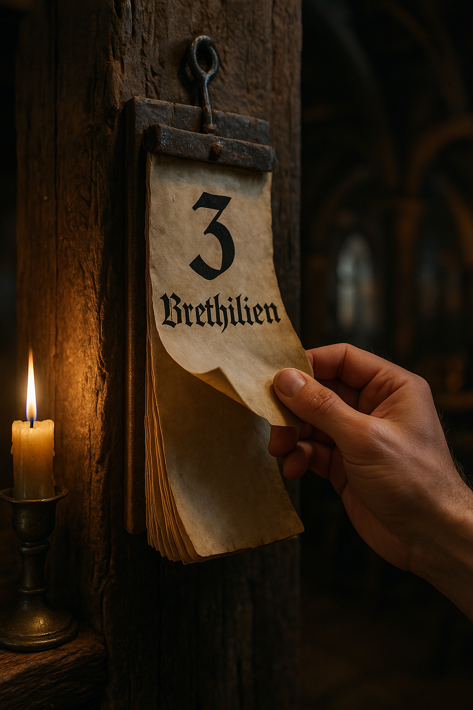{class="mask mask--background-right-half" style="object-position: 200px center;"}

::: page {footnote="Приложение | Книги"}

::: panel {style="height:25%"}

:::: title

# «Хроники Сан-Сопригаля»

Том I

::::

 {class="cover"}

:::

Город Сан-Сопригаль был основан во втором веке во время войны за полуостров Драгонвинг. Название произошло от искажения
имени рыцаря Сорпигаля — первого, кто воздвиг здесь башню, что позволило блокировать вольный город Карталь.

Статуя сэра Сорпигаля стоит поныне в центре города, хотя со временем с неё исчезли шлем и часть меча. Говорят, сам
рыцарь похоронен под каменным постаментом, а в его саркофаге покоится сердце льва.

Во времена осады Карталя город сыграл ключевую роль в снабжении осаждающих сил. Пользуясь знанием береговой линии,
Сорпигаль организовал тайную перевалочную базу в одной из бухт.

Груз доставлялся по ночам, под покровом тумана, и хранился в выдолбленных под скалами залах. Оттуда, как гласит хроника,
вёл подземный проход прямо в нижние склады города, известные лишь избранным.

Местоположение бухты в записях не указано — возможно, намеренно. Некоторые считают, что склад до сих пор существует и в
нём остались артефакты старой войны. Другие — что именно через него Сорпигаль однажды пытался покинуть город, но так и
не вернулся.

::: panel {style="height:25%"}

:::: title

# «Некоторые свойства душ и их переносимость»

Анонимный трактат

::::

 {class="cover"}

:::

Душа — не только искра, но и якорь. Она привязана к миру, ибо сама часть Печати, удерживающей его форму. Когда душа
уходит, её путь должен быть замкнутым: либо возвращение в ткань мира, либо медленное растворение. Но иногда душа
отказывается уйти — особенно если смерть была насильственной или несправедливой.

Некроманты не создают душу — они задерживают её, нарушая естественный порядок. Сосуд, в который заключена душа, должен
быть либо живым, либо священным. Во всех остальных случаях происходит искажение.

Далее идёт описание некоторых способов, которыми **ни в коем случае нельзя** удерживать душу в этом мире после смерти.

::: page {footnote="Приложение | Книги"}

::: panel {style="height:25%"}

:::: title

# Сборник «О запретных учениях и ересьмах»

Имперское издание (цензуровано)

::::

 {class="cover"}

:::

Всякая магия, не освящённая законом и не направленная на служение Империи и Ангелам, есть ересь. Маг, дерзающий творить
без дозволения подлежит очищению.

«Особенно опасны практики, искажающие душу: некромантия, призывание, ворожба над телом. Эти деяния считаются не только
кощунственными, но и опасными для мира, ибо открывают путь внешнему влиянию».

_Приписка пером на полях: «Эти строки надо бы зачитать в Совете. Особенно в свете последних слухов о магистре.»_

::: panel {style="height:25%"}

:::: title

# «Дни в аду»

Черновик книги Германа Элквина

::::

 {class="cover"}

:::

«Всё началось внезапно. Один из свидетелей сказал, что небо “разорвало”. Я тоже видел этот свет — это был разлом, не
молния. Из него вырвались твари, настоящие демоны, с огненными глазами и крыльями, как у летучих мышей.»

«Они ударили по главным воротам. Хурган держал оборону как мог, но всё могло закончиться…»

«…и мёртвые встали. Они не нападали. Кто их призвал? Почему они нас защищали? Я не знаю. Но видел, как они сражались за
нас, пока портал не начал сжиматься.»

«…я попытался записать ориентиры места, где разлом впервые открылся, но…» _(чернила размазаны, запись обрывается, словно
рука дрогнула или страницу залило водой)_.

::: page {footnote="Приложение | Карта для игроков"}

# Приложение: Карты для игроков

::: wide

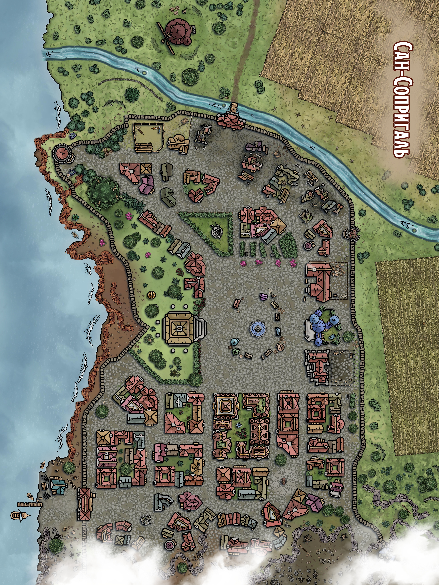{class="framed-map"}

_Карта города Сан-Сопригаль для игроков (без обозначений)._

Полный архив всех карт доступен по ссылке:
[Скачать с Google Диска](https://drive.google.com/drive/folders/1kkLD4GegIr0Q5sSph8yz1zEEGgtrtRQs).

:::

::: page {footnote="Приложение | Карта для игроков"}

::: wide

{class="framed-map"}

_Карта катакомб для игроков (с сеткой, без обозначений)._

Полный архив всех карт доступен по ссылке:
[Скачать с Google Диска](https://drive.google.com/drive/folders/1kkLD4GegIr0Q5sSph8yz1zEEGgtrtRQs).

:::

::: page {footnote="Приложение | Музыка и Генераторы"}

# Приложение: Музыка и Генераторы

## Музыка

Фон:

- https://www.youtube.com/watch?v=sHA_4wfQhE8
- https://www.youtube.com/watch?v=mMU-o4hKDyo
- https://www.youtube.com/watch?v=GX9J9AvoDYI

Подземелье:

- https://www.youtube.com/watch?v=fv_7EurNAss
- https://youtu.be/AlDivIaiuMU?si=s9Fbv_YL3X6Eq_ZW
- https://www.youtube.com/watch?v=zFitV1c4wR0
- https://www.youtube.com/watch?v=BWoGeXrNs_g

## Генераторы

Случайные события в городе:

- https://perchance.org/rumors-rus (слухи или объявления на доске)
- https://perchance.org/help-me-rus (люди требующие помощи)
- https://ttg.club/tools/encounters (случайные столкновения)

Товары для рынка:

- https://perchance.org/traders-5e-rus (уровень торговцев не выше плохого)

Имена:

- https://perchance.org/names-rus

Добыча для подземелья:

- https://dnd.su/loot/

## Случайные Имена

#### Мужские имена

| K8  | Имя       |
| :-: | :-------- |
|  1  | Матиас    |
|  2  | Освальд   |
|  3  | Джозеф    |
|  4  | Макс      |
|  5  | Вильгельм |
|  6  | Эмилио    |
|  7  | Алехандро |
|  8  | Илидир    |

#### Женские имена

| K8  | Имя        |
| :-: | :--------- |
|  1  | Сельма     |
|  2  | Лусия      |
|  3  | Атония     |
|  4  | Альбертина |
|  5  | Эмили      |
|  6  | Далия      |
|  7  | Кристен    |
|  8  | Жоа        |

#### Дворфские имена

| К4  | Имя     |
| :-: | :------ |
|  1  | Г'Хирк  |
|  2  | Г'Хольм |
|  3  | Г'Фар   |
|  4  | Г'Фаст  |

#### Эльфские имена

| К4  | Имя       |
| :-: | :-------- |
|  1  | Иролан    |
|  2  | Алуналор  |
|  3  | Арианисса |
|  4  | Фэлианна  |

::: page

# Стражник

Имперские стражники — гражданская силовая структура, подчиняющаяся напрямую герцогам и ответственная за поддержание
порядка в городах и на подконтрольных территориях.

Это не герои, не святые и уж точно не образец чести. Это те, кто стоит на перекрёстке улиц, делают вид, что записывает
что-то в потрёпанный журнал. Они надеются, что сегодня не придётся никого ловить, особенно если этот кто-то вооружён,
зол или магически активен.

## Тактика в бою

- Стоит позади Капитана, прикрывает союзников.
- Если его отравят, он теряет ход (в панике пытается прийти в себя).
- Может испугаться и отступить, если бой идёт плохо.

::: column-break

{style="width:100%;border-radius:2mm"}

_Немного бафнутый [Guard](https://next.dnd.su/bestiary/21385-guard/) из бестиария._ {align=right}

[Link on DnDBeyond](https://www.dndbeyond.com/monsters/5566979-imperial-guard) {align=right}

::: column-reset

::: stat-block {layout="wide"}

name="Imperial Guard" size="Средний" type="Гуманоид" alignment="Законопослушный Нейтральный" ac="14 (кольчуга)" hp="25
(4к8 + 4)" speed="30 футов" initiative="10" pb=2 cr="1/4" languages="Общий" senses="Пассивное Восприятие 15"
skills="Восприятие +5"

:::: abilityscores str=13 dex=12 con=12 int=10 wis=11 cha=10 saves="con" ::::

:::: traits

**Тактика стаи.** Стражник получает преимущество при броске атаки против существа, если хотя бы один из других
Стражников находится в пределах 5 футов от существа и не находится в состоянии недееспособности.

::::

:::: actions

**Длинный меч.** _Атака оружием ближнего боя:_ +4 к попаданию, дистанция 5 фт., одно существо. Попадание: 7 (1к8 + 2)
рубящего урона.

**Легкий Арбалет.** _Атака оружием дальнего боя:_ +3 к попаданию, дистанция 80/320 фт., одно существо. Попадание: 7 (
1к8 + 2) колющего урона.

::::

:::
