::: page {type="front-cover"}

# The Missing Merchant

## Dragonwing Peninsula

{class="diamond-line"}

::: banner

Sergey Kupletsky

:::

::: footnote

Adventure for 3–4 characters (level 1–3)

ver 4.0.0

:::

{class="cover"}

::: page {layout="auto"}

# About the Adventure

## Summary

San Soprigal is a sleepy coastal town. This morning, everything changed: a beloved merchant has vanished. The garrison
commander has locked down the gates until the truth comes out.

You didn’t come here to play detective, but the town’s knot of lies, rumors, and secrets pulls you in. Every lead can
misdirect you, and a wrong accusation could spark fresh tragedy.

## Overview

An adventure for 3–4 characters of levels 1–3, compatible with the 5th edition rules (2024).

::: definition

**Estimated runtime:** 10–16 hours.

**Setting:** San Soprigal (a contained, closed-town scenario). Atmosphere and tone are inspired by _Might & Magic X_ and
Terry Pratchett’s _Discworld_.

**Genres:** investigation-forward, roleplay-heavy, light on combat.

**Supplemental materials:** maps and illustrations are available on
[Google Drive](https://drive.google.com/drive/folders/1M9Ycx8IsTqvq3P1-V3OpA_76lOto1ABy).

:::

## Notes

As you read, you’ll see markings used for clarity and context:

> Text in blocks like this is meant to be read aloud (or briefly paraphrased) to the players—for example, when they
> arrive at a location or when a scene’s conditions are met.

The page numbers in the corner allow you to quickly return to the table of contents.

::: column

## License

This work includes material from the System Reference Document 5.2.1 (“SRD 5.2.1”) by Wizards of the Coast LLC,
available at https://www.dndbeyond.com/srd. The SRD 5.2.1 is licensed under the Creative Commons

This product contains optional links to content on D&D Beyond. These links are provided only for the convenience of
Dungeon Masters who run their games on D&D Beyond. All content on D&D Beyond is governed by Wizards of the Coast / D&D
Beyond terms of use and is not included in the licensed content of this PDF, is not resold here, and is not required to
use this adventure.

Maps were created by the author in [Inkarnate](https://inkarnate.com/). Images were generated with ChatGPT. These assets
are the author’s own work and are not part of the SRD 5.2 content.

The adventure is designed using [D&D Flavored Markdown](https://github.com/zavoloklom/dnd-flavored-markdown).

© 2025 [Sergey Kupletsky](mailto:s.kupletsky@gmail.com). All rights reserved.

<!-- prettier-ignore -->
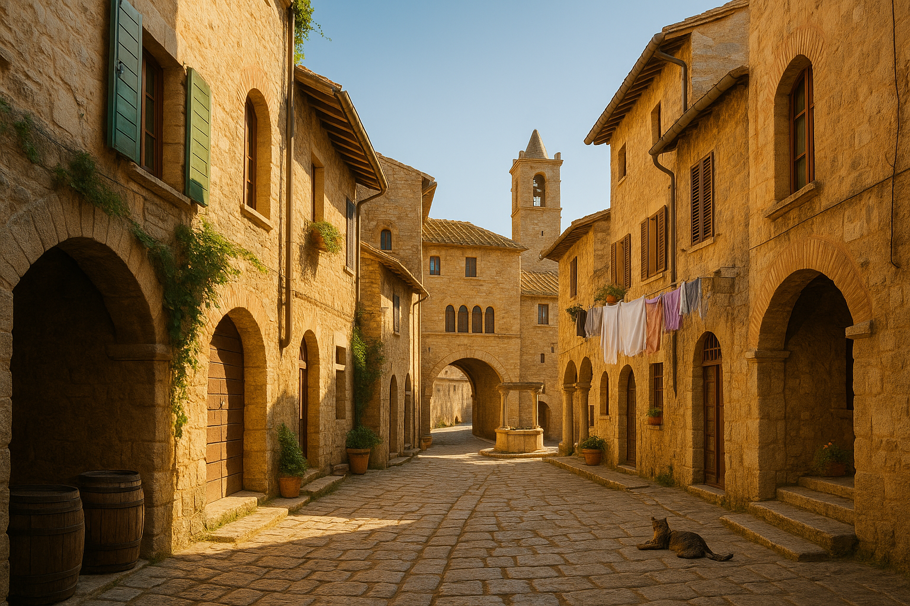{class="mask mask--watercolor-05" style="height:390px;width:320px;"}

::: page {show-page-number="false"}

# Contents

::: toc

- [About the Adventure](#about-the-adventure)
- [Introduction](#setting-and-constraints)
  - [Setting and Constraints](#setting-and-constraints)
  - [Backstory](#backstory)
  - [Dragonwing Map](#dragonwing-map)
  - [Story Overview](#story-overview)
  - [?? Clues](#)
  - [Advice for the DM](#advice-for-the-dm)
- [Chapter 1: Arrival](#adventure-hook)
  - [Adventure Hook](#adventure-hook)
  - [Arrival in Town](#arrival-in-town)
- [Chapter 2: San Soprigal](#town-overview)
  - [Town Overview](#town-overview)
  - [Town Map](#town-map)
  - [The Dock](#the-dock)
  - [Maria’s House](#marias-house)
  - [Market Square](#market-square)
  - [Tavern “By the Sea”](#tavern-by-the-sea)
    - [Tavern Cellar](#tavern-cellar)
  - [Temple of Light](#temple-of-light)
  - [Garrison](#garrison)
  - [Watchtower](#watchtower)
  - [Town Gates](#town-gates)
    - [Rosa vs. Hurgkhan at the Gate](#rosa-vs-hurgkhan-at-the-gate)
  - [Abraham’s House](#abrahams-house)
    - [Abraham’s Cellar](#abrahams-cellar)
  - [Library](#library)
  - [Günter’s House](#günters-house)
  - [Abandoned District](#abandoned-district)
- [Chapter 3: Catacombs](#catacomb-map)
  - [Passage from the Old Well](#passage-from-the-old-well)
  - [Passage from Abraham’s House](#passage-from-abrahams-house)
  - [Smuggler’s Cove](#smugglers-cove)
  - [Great Hall](#great-hall)
- [Chapter 4: Aftermath](#the-catacombs)
  - [The Catacombs](#the-catacombs)
  - [The Accusation](#the-accusation)
  - [The Funeral](#the-funeral)
- [Appendix: Characters](#appendix-characters)
  - [NPC Index](#appendix-characters)
  - [Duncan](#duncan)
  - [Hurgkhan](#hurgkhan)
  - [Günter](#günter)
  - [Helmut](#helmut)
  - [Kenki](#kenki)
  - [Gaston](#gaston)
  - [Rosa](#rosa)
  - [Selina](#selina)
  - [Karra](#karra)
  - [Jonas](#jonas)
  - [Guards](#guards)
  - [City Folk](#city-folk)
  - [Missing Persons](#missing-persons)
- [Appendix: Rumors](#appendix-rumors)
- [Appendix: Quest and Magic Items](#appendix-items)
- [Appendix: Monsters](#appendix-monsters)
- [Appendix: States and Organizations](#appendix-states-and-organizations)
- [Appendix: Pantheon](#appendix-pantheon)
- [Appendix: Month Names](#appendix-month-names)
- [Appendix: Books](#appendix-books)
- [Appendix: Maps for Players](#appendix-maps-for-players)
- [Appendix: Music and Generators](#appendix-music-and-generators)

:::

::: page {chapter="Introduction"}

# Setting and Constraints

## World Overview

The world of Azalia is sealed by ancient wards that isolate it from the outer planes. There is no contact with gods,
patrons, or any other external powers.

If the wards destabilize or break, ways to other planes open—leading to demonic incursions and magical anomalies.

People in this world don’t know about wards and gods. They blindly worship angels.

## Magic

All practitioners of magic must hold a permit to reside in the Holy Empire or a **license for Magical Practice**.

Any unsanctioned magic leads to interrogation, arrest, or execution.

Attempts to use magic tied to other planes (_plane shift_, _gate_, _contact other plane_, etc.) may have catastrophic
effects, or the spell simply fails.

## Species of the Holy Empire

::: definition

**Humans** — the primary species; they hold leading positions.

**Dwarves, gnomes, and halflings** — tolerated yet considered “outsiders.” Trusted with craft and trade, but kept at
arm’s length.

**Orcs and goliaths** — seen as cheap labor and hire-swords. In any conflict, blame usually falls on them.

**Drow and half-elves** — face open hostility. Violence against them often goes unpunished.

**Elves** — feral, living in the forests (not a playable species).

**Tieflings** — the result of mages experimenting with demonic blood over the last two years. Unknown to anyone but
their creators. You may play a tiefling who somehow escaped. An unmasked tiefling will likely be taken for a demon and
attacked on sight.

**Dragonborn** — absent (not a playable species).

:::

## Class Restrictions

::: definition

**Warlocks.** Standard patrons (like Fiend, Archfey, Great Old One) are unavailable. Possible adaptations include an
internal source of power, planar anomalies, or ancient artifacts.

**Clerics & Paladins.** Their magic works through faith in an angel (see [Appendix: Pantheon](#appendix-pantheon)),
usually without a direct reply.

**Wizards & Sorcerers.** Must conceal their practice or obtain legal status.

:::

<!-- prettier-ignore -->
{class="mask mask--background-bottom-third-02" style="object-position: center 110%; object-fit: contain; bottom: -25px;"}

::: page {layout="left"}

# Backstory

## The Dragonwing Peninsula

**Dragonwing** is a peninsular protectorate: formally subject to the **Holy Empire** (see
[Appendix: States and Organizations](#appendix-states-and-organizations)) yet effectively pushing for
independence—especially after the central authority failed to protect the peninsula’s cities from a demon incursion.

Representatives of the Holy Empire are met with suspicion here, and at times with open hostility.

## San Soprigal

**San Soprigal** is an old coastal town on the Empire’s frontier, within the Dragonwing Peninsula.

It was once a key stop on trade routes, thriving on commerce, fishing, and—if rumors are to be believed—smuggling. Wars,
economic decline, and tighter imperial control took their toll; these days, dignitaries and trade caravans rarely bother
to visit.

## The Demon Incursion

About _two years ago_, demonic forces overran the countryside around San Soprigal, cutting the town off from the outside
world and laying it under siege. Contact with other cities ceased, and no help arrived.

After a month, the demons vanished as suddenly as they had appeared. Only scattered bands remained, and the town guard
suppressed them quickly.

Many died during the siege, including the mayor, **Stor Sulim**; **Jonas’s grandfather**; and the entire **Günter**
family.

After the mayor’s death, the guard commander, the half-orc **Hurgkhan**, assumed leadership of the town. He retained
military command and stayed in the garrison, repurposing the town hall as a public library.

The siege left deep scars: faith in the angels has faltered (though few will say so aloud), fear and distrust linger,
much of the guard was lost, and trade routes grew more perilous. The town seemed destined for ruin, but Hurgkhan
restored order. San Soprigal now goes about its daily life again—though the fears and wounds of the past have not
healed.

<!-- prettier-ignore -->
{class="mask mask--background-right-half" style="object-position: 50px center;"}

<!-- prettier-ignore -->
[//]: # (Rumor holds that, in the siege’s final days, the dead rose and fought alongside the living. The Church forbids any discussion of these tales and condemns them as heresy.)

::: page

# Dragonwing Map

::: wide

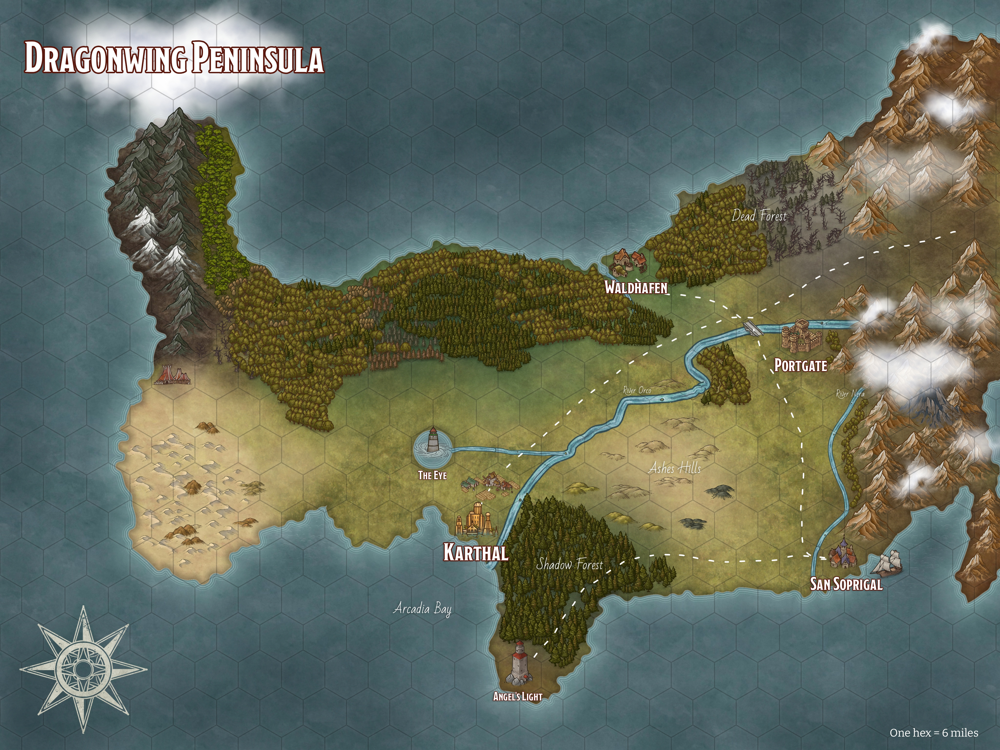{class="framed-map"}

:::

## Map Overview

This map is for orientation only: to show where **San Soprigal** sits and how it relates to other places on the
peninsula. In this adventure, the characters **do not leave the town**, so the map contains no plot hints and has no
mechanical use.

Show it once at the beginning to set scale and mood.

Karthal, Portgate, and other locations are for the future—as campaign directions if you continue the story beyond the
town.

The full map archive is available here:  
[Download from Google Drive](https://drive.google.com/drive/folders/1kkLD4GegIr0Q5sSph8yz1zEEGgtrtRQs).

::: column

## The Region

::: definition

**Weather.** Predominantly maritime climate: fog banks along the coast, sharp winds off the range, spring floods, and
autumn storms.

**Shadow Forest.** A dense, nearly impassable forest east of Karthal.

**Ashes Hills.** Dry, gray swell to the northwest of San Soprigal. The old town cemetery lies here.

**Portgate.** A fortress at the eastern passes; the governor’s seat and the peninsula’s main customs post. It controls
movement between the peninsula and the Empire.

**The Eye.** On a lake shaped like an eye stands an ancient structure known as the Eye.

**Connection to the Empire.** A mountain chain separates the peninsula from the rest of the Empire. The only land route
runs through the northeastern passes, which are closed in foul weather.

:::

::: page

# Story Overview

Below is the chronology of events. On first mention, character names link to their writeups in
**[Appendix: Characters](#appendix-characters)**.

For the names of Azalia’s months, see **[Appendix: Month Names](#appendix-month-names)**.

## Arrival of the Mage

_3 Narvail (February)_

- A necromancer, **[Abraham](#abraham)**, arrives in town. He previously conducted forbidden experiments in the
  [United States of Magic Art](#appendix-states-and-organizations) and is now in hiding, hoping to continue his research
  in seclusion.
- He rents the house from **[Jonas](#jonas)** (the grandson of a smuggler), pays a year in advance, and moves in.
  Abraham knows about the house—and the passage from it into the catacombs—through old ties with smugglers of
  [Black Meduza](#appendix-states-and-organizations). Jonas is unaware of the hidden route.
- Abraham places an order with Black Meduza to have his special spiders delivered so he can continue experiments with
  their venom.
- He locks himself in the cellar and doesn’t show his face around town. Rumors spread that he’s a mage, but no one
  cares.

## Maria & Abraham

_Narvail (February)_

- **Maria**, an incense and herbs merchant, supplied Abraham with ingredients needed for his experiments.
- Abraham paid in advance and asked for discretion.
- In thanks, he gave Maria a scroll with a simple spell and instructions.
- After that, Abraham no longer asked for ingredients—and Maria didn’t find it unusual.

## Arrival of Rosa

_1 Bethalasse (March)_

- **[Rosa](#rosa)** (a paladin of the [Church of Light](#appendix-states-and-organizations)) arrives in San Soprigal and
  keeps the purpose of her visit secret. She refuses to recognize local authority and acts under a covert mandate.
- She lodges at the [Temple](#temple-of-light) and periodically leaves town for several days at a time.
- Her mission is to investigate recent attacks on merchants in the region and to recover a stolen church relic.

## The Delivery

_1 Bethalasse (March)_

- Smugglers **Peter** and **Boshir** bring contraband and crates of spiders to the cove beneath the town.
- That evening, posing as traders, they drink in the tavern, hit on Rosa, and start a brawl.
- At night they descend into the catacombs to unload the boat. A large crate slips and breaks. The starving spiders
  attack and kill them both.
- Their room still contains the “trader” clothing they used as a cover. When the innkeeper **[Helmut](#helmut)**
  realizes the guests are gone, he hands the clothes to the server **[Kenki](#kenki)**.
- The next day, with no men or cargo arriving, Abraham goes into the catacombs himself. The spiders kill him as well.
- The guard doesn’t search for Peter and Boshir: their papers mark them as ordinary merchants who often leave without
  fanfare.

## Maria & Günter

_Narvail–Lothviel (February–April)_

- Maria secretly meets **[Günter](#günter)**—a town guard—on the [Watchtower](#town-map) during his night shifts.
- Günter becomes obsessed with tying the disappearances to Rosa, whom he assumes is an inquisitor.
- His paranoia rubs off on Maria. She avoids Rosa and stops visiting the Temple, though she once went often.
- After Rosa’s arrival—and under Günter’s influence—Maria fears arrest for studying in magic.
- Tensions rise, and Maria and Gunther have a conflict.

::: page

## Two Weeks Ago

_Early Lothviel (April)_

- The Spider-Matriarch lays eggs and primes to drag any prey below ground.
- At night, **Bertram** (a local drunk) falls into an old well in the [Abandoned District](#town-map) that opens into
  the catacombs and is killed by spiders. No one looks for him—they assume he went on another bender.
- The spiders discovered a way to the surface through the well and began hunting at night.
- **[Children](#city-folk)** used to sneak off to play in the Abandoned District, but after they began hearing “strange
  sounds,” they stopped going there.
- Relocating their games to the [Craft District](#town-map), the children break a window in
  [Abraham’s house](#town-map). Jonas learns his lodger is gone, but he doesn’t inform the guard—he fears unwanted
  attention and prefers to assume the mage moved on.

## Maria’s Disappearance

_12 Lothviel (April), Tuesday_

- After talking with her friend **[Karra](#karra)**, Maria decides to end things with Günter—but puts off the
  conversation.
- In advance, Günter swaps shifts with a day guard, cleans the tower, and prepares to propose to Maria at sunset.
- Maria heads for the tower, but when she spots Rosa returning to town. Maria detours into the Abandoned District to
  avoid her.
- At [the old well](#town-map), Maria notices a strange smell. She steps closer, and the starving spiders drag her down.
  Trying to fend them off with a spell, she collapses the old masonry and the shaft caves in.
- Günter waits for Maria, grows anxious, but doesn’t abandon his post.
- Smuggler **[Gaston](#gaston)** arrives in town, searching for a casket that Peter and Boshir were supposed to deliver.
  That night he tries to reach [the cove by the sea (label 11 on the map)](#town-map), but sailors spot him, and he
  retreats.

## Maria Is Reported Missing

_13 Lothviel (April), Wednesday_

- In the morning, Günter finds Maria’s shop closed and no one answering at her home. He convinces garrison commander
  **[Hurgkhan](#hurgkhan)** to force the door and open an investigation.
- Hurgkhan locks down the town for the duration of the investigation to maintain order and control departures. It’s a
  good chance to remind the townsfolk who’s in charge and to show he’s on top of his duties. He believes Maria will turn
  up within a few hours.
- The **adventurers** arrive in San Soprigal.

<!-- prettier-ignore -->
{class="mask mask--background-bottom-third-01" style="object-position: center bottom; object-fit: contain;"}

::: page

# Advice for the DM

This is a mystery-first adventure: its core is social interaction and investigation, not combat. Don’t turn every
conversation into a die roll—the party’s success should depend on **who** they ask, **when**, and **about what**.

NPCs shift their attitude because of leverage, not eloquence: the party can present a clue, name a name, or catch a
contradiction. A Persuasion check amplifies leverage that already exists.

When searching locations, the more precise the question, the lower the DC. Grant advantage for relevant clues and sound
methods. On a failure, allow partial success at a cost (time, noise, suspicion).

Stay flexible. If the party forms a reasonable hypothesis, confirm it with a minor clue in the next location or
scene—even if it wasn’t originally there.

## Session Prep

Before play, ask players to define why their characters are willing to help with the investigation (duty, reward, a
mentor’s request, etc.), and how they met one another—or how they’re connected to their mentor, **Jared**.

## Hints & Suspects

The party’s initial suspects in the disappearances will likely be **Günter** and **Rosa**. If you notice them focusing
suspicion elsewhere (for example, on **Hurgkhan**), support their line of thinking—let the investigation move from the
players’ hypotheses.

If the party stalls, you can nudge them via members of the town guard or **Gaston**, who also wants access to the
catacombs.

## World Reaction

You determine how much in-game time scenes and travel take. Let the players know that time is passing in town, and
gently hint that delay will have consequences.

Below is an example of how events may unfold if the party don’t intervene.

### Day One

_13 Lothviel (April), Wednesday_

- Günter prepares and posts missing-person flyers for Maria across town.
- **Hurgkhan vs. Rosa:** Rosa tries to leave town; guards stop her at the gate.
- A volunteer search party forms to look for Maria.
- That night, Gaston breaks into Abraham’s house, spots spiders in the catacombs, and withdraws.

### Day Two

_14 Lothviel (April), Thursday_

- **Maria dies in the catacombs** if she has not been rescued.
- Gaston may approach the party, asking them to escort him into the catacombs.
- By evening, volunteers find signs of a struggle at the old well and inform Hurgkhan.
- On learning about the spiders, Hurgkhan musters a guard squad and descends into the catacombs. The guard assaults the
  tunnels and destroys the spiders. Of the entire squad, only Günter returns.
- The town mourns Hurgkhan; the immediate threat is removed.

## Combat Scenes

Fights in the catacombs should be tense but fair. Run them so that using the environment is profitable for the players
(fire, webs, chokepoints, etc.).

## What Comes Next

You can run this as a one-shot or as a prologue to a campaign. Hooks for longer arcs are seeded in NPC writeups and
dialogue—use them as needed, or ignore them:

- Trouble with the undead at the old cemetery.
- A dragon hunt in the mountains with **Duncan**.
- A joint investigation with **Rosa** into the attacks on merchants.

::: page

::: chapter Chapter 1 | Arrival

You can let players invent their own reasons for visiting San Soprigal, or you can use the following adventure hook.

# Adventure Hook

The characters are a band of adventurers bound for the city of **Kartal** to fulfill their mentor **Jared’s** last wish:
carry his ashes home and lay him to rest there.

Because of recent attacks on merchant vessels and dangers along the coast, sea travel is temporarily closed. The only
way to Karthal is overland, through the Holy Empire. The party decides to make landfall at **San Soprigal** and continue
by road.

This introduction sets the table’s tone and briefly explains the backdrop.

> Azalia. 13 Lothviel, year 567 AF—After the Fall of the Great Empire.
>
> The Church teaches that angels created the Great Empire—and the whole world. There was no hunger, no plague, no war,
> and humans lived in peace with dwarves, orcs, and—even if it’s hard to believe—elves. They say elves were different
> then, too. But one day it all ended, and only ruins and strange, majestic structures remain.

> Now things are different. Most humans live in the Holy Empire; the King-Under-the-Mountain rules dwarves and gnomes;
> and mages, having rejected the Church, founded the United States of Magic Art. Orc and goblin clans keep mostly to the
> east.

> Two years ago, creatures never seen before appeared across Azalia. People called them demons, hellspawn—any word that
> could voice their fear. Driving them back cost dearly.

> The long voyage is behind you. For weeks you kept a course for Karthal to fulfill Jared’s last wish: his ashes must
> rest in his hometown. But you learned unexpectedly that sea travel to Karthal has been cut off. You plan to put in at
> the small coastal town of San Soprigal and continue overland.

As the party nears town, memories surface. Ask the players to briefly describe how their characters met each other—and
how they met Jared.

<!-- prettier-ignore -->
 {style="width:320px;height:305px" class="framed-image"}

::: page

# Arrival in Town

The characters reach San Soprigal’s pier in the morning.

> You arrive in town at first light. Built on a rocky coast, the place is dominated by a tall watchtower rising above
> the rooftops. At its peak you can make out the silhouette of a sentry scanning the horizon.
>
> You step onto a weathered pier alongside the captain. Without a backward glance, the captain heads into town, striding
> past a bored guard at his post.
>
> You stand by the water, watching fishermen unload their catch and trade words with a cloaked figure at the end of the
> pier.

If the characters go straight into town, proceed to **[Entering the Town](#entering-the-town)**.

If they want to look around or approach the fishermen, go to the location **[The Dock](#the-dock)**.

## Entering the Town

The gate guard may ask routine questions—“name, purpose of visit; steel in plain view; no displays of magic.”

After passing the gate:

> As you enter, a troubling scene unfolds:
>
> One house looks like it’s been broken into—the door is smashed, and two armed guards stand on the threshold. A handful
> of gawkers whisper among themselves. A half-orc in armor—the one in charge, by the look of it—scans the surroundings
> with a scowl. Beside him stands a young guard, visibly shaken.

> The half-orc raises a horn to his lips and blows so the sound rolls across the cliffs and the bay—the whole town hears
> it. He lifts a hand for silence and calls out:
>
> _“Soprigal is closed! No one leaves town without my say until we get to the bottom of this!”_
>
> The crowd buzzes; voices overlap. Your road to Karthal will have to wait—the town is sealed, and something strange is
> afoot.

Locals can tell that the last time they heard this signal was during the demon incursion.

The scene moves to **[Maria’s House](#marias-house)**.

<!-- prettier-ignore -->
 {style="height:520px" class="framed-image"}

::: page

::: chapter Chapter 2 | San Soprigal

The town is the primary location of this adventure—a compact sandbox the characters can explore in any order. If the
players head to an undescribed location, improvise using the town’s overall atmosphere and layout.

# Town Overview

San Soprigal is small—about 500 residents—built on rocky terraces. Dominant motifs: narrow stone lanes, steep stairways,
and arched passages. Mornings smell of salt, seaweed, and fish; during the day workshops hum; by evening a thick fog
settles.

_Visual reference—Mediterranean towns such as Atrani (Italy)._

## Districts

The town is divided into several districts, each with its own atmosphere.

::: definition

**Dockside District.** The pier with warehouses and tackle shops. Poorer homes crowd nearby. It’s noisy here and smells
of salt and smoke.

**Velvet Row.** Homes of the well-to-do and clean streets. Guard patrols are more frequent. Some houses have simple
alarm rigs.

**Central District.** The town square, main buildings, and the market. Notices are posted here and crowds gather.

**Craft District.** Stables, forge, and workshops run all day. Most residents here also work here.

**Abandoned District.** Half-ruined houses and vacant lots left after the demon incursion. Locals avoid the area.

**Mountain District.** Terrace homes along the slope and steep stone stairways. A strong wind blows, and landslides
sometimes occur. Entrances to old mines, most of them abandoned.

:::

::: column

## Public Order

Open use of weapons and magic (casting with visible effects) is prohibited in town.

Order is kept by a small guard force. If the players plan something shady, they can acquire the patrol schedule to
choose a route and timing and avoid getting caught.

The prison is located in [the garrison](#garrison) building.

#### Guard Schedule

| Post        | Day      | Night    |
| :---------- | :------- | :------- |
| City Gate   | 2 guards | 1 guard  |
| Port Gate   | 1 guard  | —        |
| Watchtower  | 1 guard  | 1 guard  |
| Old Tower   | 1 guard  | —        |
| Town Patrol | 2 guards | 2 guards |
| **Total:**  | **8**    | **4**    |

## Location Format

This chapter details San Soprigal’s key locations. Each location follows the same template: description, characters,
items, information, events.

Information in locations is what can be learned **on site** (search, tracks, environmental context), whereas information
in NPC cards (see “[Appendix: Characters](#appendix-characters)”) is what they can tell the party anywhere in town.

::: page

# Town Map

::: wide

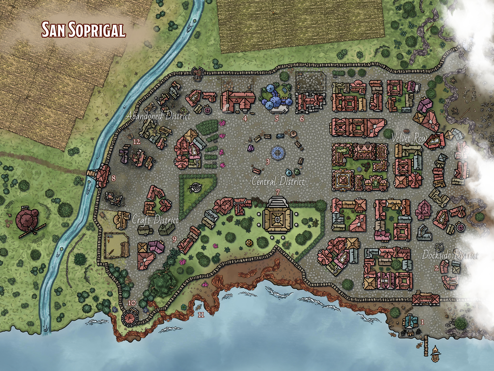{class="framed-map"}

:::

## Locations

The town has several key locations that may aid the players’ investigation:

1. [The Dock](#the-dock)
2. [Maria’s House](#marias-house)
3. [Market Square](#market-square)
4. [Tavern “By the Sea”](#tavern-by-the-sea)
5. [Library / Old Town Hall](#library)
6. [Garrison](#garrison)
7. [Temple of Light](#temple-of-light)
8. [Town Gates](#town-gates)
9. [Watchtower](#watchtower)
10. [Abraham’s House](#abrahams-house)
11. Passage to the smugglers’ cove
12. [Abandoned Well](#abandoned-district)

::: column

## For Players

You can hand the players a **[map without labels](#appendix-maps-for-players)** after speaking with **Hurgkhan** or
**Duncan**, or if players explicitly ask to “get the lay of the town.”

The full map archive is available here:  
[Download from Google Drive](https://drive.google.com/drive/folders/1kkLD4GegIr0Q5sSph8yz1zEEGgtrtRQs).

::: page

# The Dock

## Description

_Number on the [map](#town-map)—**1**. Available only on the morning of Day One, before entering the town._

> You decide to linger at the dock.
>
> Boats rock against the pier; a salty wind carries the scent of seaweed and fresh fish. The boards creak underfoot.
>
> Onshore, near a low wooden building—a warehouse and sailors’ rest—a few fishermen are talking.
>
> Noticing you, a cloaked man turns and watches intently.

## Characters

- [Duncan](#duncan)—a former adventurer; speaking with the fishermen.
- Local [fishermen](#city-folk).

::: column

## Information

- `@Intimidation 10` or `@Persuasion 15` The fishermen reluctantly admit that someone was at the dock during the night.
- Duncan gladly shares a brief history of the town and insists it’s a fine place for a quiet retirement. After the chat,
  you can hand the players a [map without labels](#appendix-maps-for-players).

## Events

**Alarm Signal.** After a few minutes a horn sounds—people drift toward the gate, sweeping the characters along. The
scene moves to **[Entering the Town](#entering-the-town)**.

<!-- prettier-ignore -->
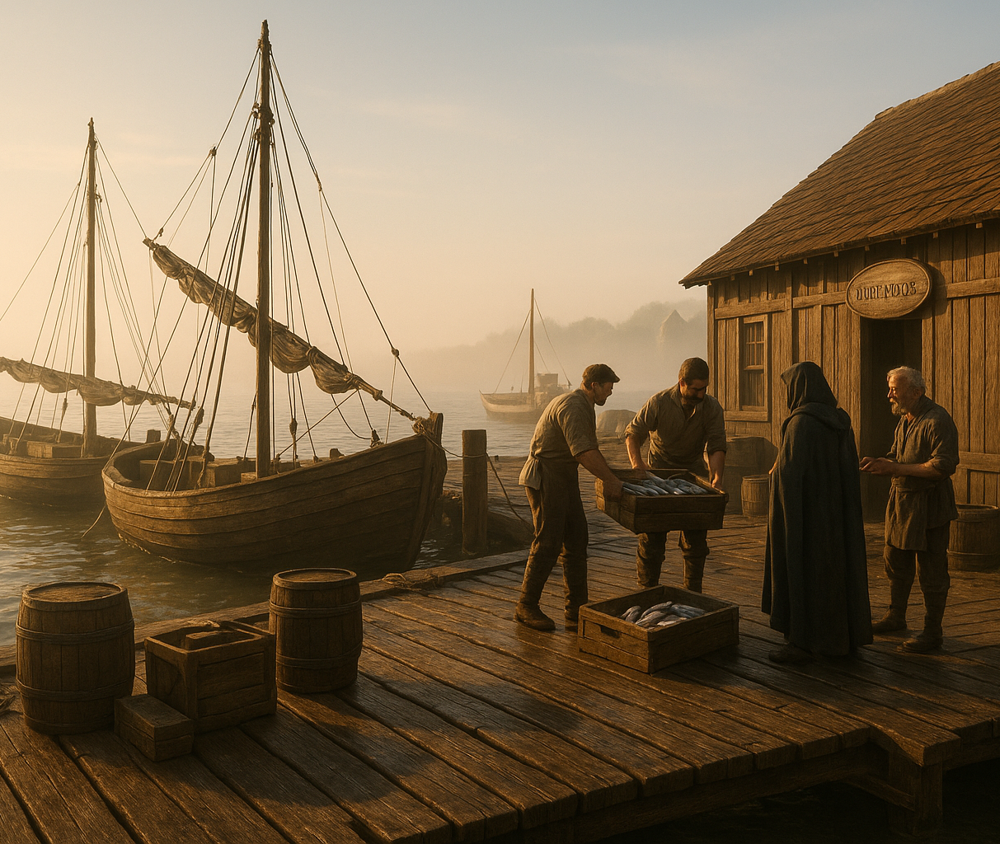{class="mask mask--background-bottom-half" style="object-position: center bottom; object-fit: contain;"}

::: page

# Maria’s House

## Description

_Number on the [map](#town-map)—**2**._

A small one-story house with a smashed-in door.

> You step over the threshold of a small but cozy home. It’s quiet and tidy inside. The air smells of incense and dried
> herbs. On a low table sit vials of oils and bundles of herbs. Above the table—a shelf of books.
>
> Beyond a light curtain you can see a tiny kitchen and bedroom.

## Characters

- [Hurgkhan](#hurgkhan)—morning of Day One. Calm, businesslike.
- [Günter](#günter)—morning of Day One. Pale, tense, clearly on edge.
- [Guards](#guards)—after Hurgkhan and Günter leave, a watch remains at the door until it’s repaired.

## Items

- [Maria’s Diary](#marias-diary).
- A scroll of _mold earth_.  
  **Homebrew:** on a success `@Arcana 10` you can cast it as a ritual (10 minutes) without expending the scroll.
- [Garrison Permit](#garrison-permit) authorizing aid to the guard.

<!-- prettier-ignore -->
 {style="width:320px;height:240px;" class="framed-image"}

::: column

## Information

**General sweep of the house:**

- This doesn’t look like a robbery: belongings are in place, shelves intact, no signs of struggle or blood.
- In the kitchen—a half-finished cup and an empty plate. It looks as though the owner simply stepped out.

**Closer inspection:**

- **Kitchen.** A thin film has formed on the infusion—the cup has sat since last evening.
- **Kitchen.** `@Nature 12`—the infusion is a calming draught.
- **Oil table.** `@Survival 14`—besides ordinary herbs, there are also poisonous ones (hemlock, buckthorn).
- **Books.** `@Perception 13`—dried flowers and a small love note slip from between the pages.
- **Bedroom.** `@Perception 10`—[Maria’s diary](#marias-diary) is hidden under the bed.
- **Book hiding place.** `@Investigation 14` or `@Arcana 10`—a spell scroll with brief instructions is tucked between
  books.

## Events

**Searching the house.** If the characters ask about the lockdown: _“Can’t help you—the order’s given. But you can help
the investigation: the sooner we find Maria, the sooner you’re on your way.”_ If the party stand aside, Khurgan
approaches them himself. He realizes they’re adventurers and says, _“You’re not locals. Will you help? We’re short on
hands. There’ll be a modest reward.”_

Hurgkhan **sends Günter to the garrison** and invites the characters to search the house under his supervision. Any
attempt to remove items is stopped; he warns that it means arrest. If the characters confirm there was **no abduction
from inside the house**, he issues them a [written permit](#garrison-permit) to assist the guard.

If the party leaves and returns later, access to the house is closed: you’ll need Hurgkhan’s permission or a distraction
for the on-duty guard.

::: page

# Market Square

## Description

_Number on the [map](#town-map)—**3**._

> A narrow cobbled street opens onto a broad square—the heart of San Soprigal. Traders call out over one another;
> laughter, conversations, and the clink of coins mingle in the air. It smells of fried fish and fresh bread.
>
> At the center stands a stone fountain with a figure of an angel above carved waves. Water murmurs over the
> time-darkened rim. Under canvas awnings, rows of stalls crowd together. People weave between them—some hurrying on
> errands, others trading the latest news and rumors.

If the characters look around:

> On the south side rises the **Temple of Light**. Its white walls shine in the sun, and a golden spire topped by an
> angel reaches skyward, visible from almost anywhere in town. A beggar sits at the foot of the wide steps, asking alms.
>
> Opposite stands **the tavern**, a solid two-story building of stone and dark timbers. A faded signboard with a wave
> creaks on its bracket, and lazy smoke trails from the chimney.
>
> Closer to the center—a venerable building of weathered stone with narrow, tall windows—looks like the **town hall**.
>
> A little farther off is the **garrison** building, the Empire’s banner on its facade. Several guards stand at the
> gate.
>
> In the southwest corner of the square—a statue of a mounted knight in armor, sword raised to the sky.
>
> You also notice that **one of the market stalls is empty**: the counter is covered with canvas, and no vendor is in
> sight.

If the party doesn’t yet have [a town map](#appendix-maps-for-players), you can hand it out after this description.

## Characters

- [Karra](#karra)—a trinket seller. Her stall stands next to Maria’s (currently empty). If the party starts examining
  the empty stall, Karra will strike up a conversation.
- Various [merchants and townsfolk](#city-folk)—share rumors. The market doesn’t sell rare or magical items; no weapon
  or armor either.

## Information

- Merchants saw Maria yesterday: as usual she was at the market until around six in the evening, but she hasn’t appeared
  today.
- The party can gather [rumors](#appendix-rumors) and basic information about the missing residents.

## Events

When the characters arrive at the square, one of the following may occur but intervention isn’t required.

#### Random Events (d6)

| d6  | Event                                                                                                                                                                  |
| :-: | :--------------------------------------------------------------------------------------------------------------------------------------------------------------------- |
|  1  | A pickpocket boy tries to lift something from the party. `@Perception 15` to notice in time.                                                                           |
|  2  | Townsfolk argue whether the lockdown was the right call—one is angry, another says Hurgkhan knows best.                                                                |
|  3  | A bit of street theater (sleight-of-hand performer, organ grinder, or jester).                                                                                         |
|  4  | A vendor “recognizes” one of the characters by mistake and demands repayment of a debt.                                                                                |
|  5  | Debate: should mages live alongside “ordinary folk”? One for Church oversight, another for freedom for the common good. They might mention a mage who lived here once. |
|  6  | Debate: do elves have a right to the peninsula’s forest lands? One says “elves have always lived there,” the other—“they don’t pay taxes—out they go.”                 |

::: page

# Tavern “By the Sea”

## Description

_Number on the [map](#town-map)—**4**._

> “By the Sea” is loud and crowded. The air smells of salt, smoke, and fried fish. Heavy wooden tables fill the common
> room. Behind the bar stands a broad-shouldered, middle-aged man polishing a mug—his stern face and hard gaze mark him
> as the owner. Above the counter hang strings of dried fish and old shields left by patrons.
>
> In the corner by the hearth, a cloaked man sits, watching the crowd in thought—you think you saw him at the dock.
>
> A goblin server darts through the room with a tray, giving you an appraising look.

If **Gaston** is in the tavern:

> At the bar, a man leans lazily on the counter, rolling an almost-empty mug. His gaze is unfocused, his movements
> slowed—looks like he’s had too much.
>
> `@Perception 10` His eyes flick across the room from time to time, sizing things up.

<!-- prettier-ignore -->
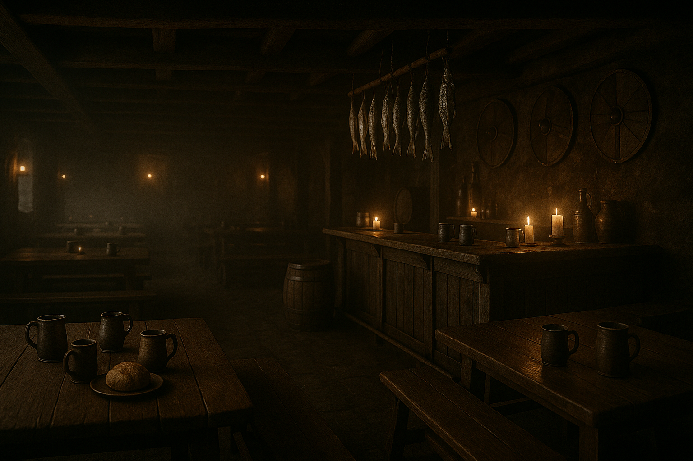 {style="width:320px;height:265px;" class="framed-image"}

::: column

## Characters

- [Helmut](#helmut)—the tavern owner. Greets the party and offers food and lodging.
- [Kenki](#kenki)—a goblin server. If the party listens in or looks around, he offers to sell information.
- [Duncan](#duncan)—a former adventurer, the cloaked man.
- [Gaston](#gaston)—a smuggler, the man at the bar. He makes contact if there’s a _rogue_ in the party or if the
  characters talk about smuggling.
- [Townsfolk](#city-folk). If you build rapport `@Persuasion 10`, they share rumors; to eavesdrop on conversations,
  `@Perception 12`.

## Items

- [Merchants’ Clothes](#merchants-clothes) in the cellar.
- A vial of antitoxin from [Kenki](#kenki)—grants immunity to Poison damage.

## Information

- [Helmut](#helmut) and [Kenki](#kenki) can talk about the “traders” (smugglers) and their belongings.
- You can gather [rumors](#appendix-rumors) and information about missing residents.

## Events

**Helmut’s Job.** He asks you to find out where the rats are disappearing to; reward—**10 gp**, plus a free meal and
lodging in the best room.

> Helmut raises rats in the cellar—plump fried river rats are a dwarven delicacy. Two weeks ago they started vanishing:
> first one or two, now whole cages are empty. He suspects theft but can’t see who’d want them, and asks you to check
> the cellar.

**Dust-Up.** A drunken sailor tries to pick a fight, offended by a look from one of the characters. If a brawl breaks
out, Helmut’s attitude becomes **hostile**.

::: page

# Tavern Cellar

## Description

> The cellar is low and damp. It smells of straw, grain, and ammonia. Shelves of provisions line the walls—sacks and a
> water cask. Along the far wall stretch rows of cages with iron grates. Each cage has a water dish and a wooden running
> wheel. Two rats rustle in one cage; the rest are empty, the bedding kicked into clumps.

## Items

- [Merchants’ Clothes](#merchants-clothes)—hidden in one of the crates.

## Information

- If the party is deliberately searching for the merchants’ clothes, a `@Investigation 10` check is required.

## Events

**The noise draws creatures.** On a failed search check, the party still finds the clothes, but the noise attracts `1d4`
[tiny spiders](#tiny-spider).

::: column

## The Rat Farm

- `@Investigation 10` In the empty cages, besides rat tracks, you can see smaller tracks leading toward a crack in the
  wall.
- `@Nature 10` The tracks are spider tracks; the behavior is atypical—the prey was removed in an organized way.
- `@Perception 14` Rat fur and fine webbing are snagged in the crack; from the depths comes a faint rustle. The passage
  descends further underground, but it’s too narrow to squeeze through.
- While inspecting the crack, `1d4` [tiny spiders](#tiny-spider) attack the party.

::: box

**For the DM.** This quest points toward the catacombs/contraband thread. The spider matriarch directs the spiders
telepathically—they haul prey down into the catacombs. The crack shows the direction, but it’s too narrow to traverse.

:::

<!-- prettier-ignore -->
{class="mask mask--background-bottom-third-01" style="object-position: center bottom; object-fit: contain;"}

::: page

# Temple of Light

## Description

_Number on the [map](#town-map)—**7**._

> You climb broad stone steps that lead to an entrance set at second-story height.
>
> Inside—muffled quiet, broken only by the whisper of a few worshippers and the crackle of candles. The air smells of
> wax and incense. A mosaic floor of pale marble catches soft glints of light.
>
> Massive columns support vaults painted with scenes from the Church of Light’s scriptures. At the center of the hall
> stand eleven small altars, and above them hovers a statue of an angel with wings outstretched.
>
> A woman in a vestment of the Light approaches—about forty, fair-haired, her gaze calm.

If the characters head for **Rosa** or enter from the garden side, they come in on the lower tier:

> A corridor opens into a low, vaulted passage: on the left runs a row of novices’ cells. At the end—a door with an iron
> grate. From beyond it comes a faint rasp, as if someone is struggling to breathe.

Rosa’s cell:

> A modest room: a wooden bed, a table, a prayer bench. On the table lie peninsula maps and a few notes.

## Characters

- [Selina](#selina)—priestess. Greets the party and invites them inside.
- [Rosa](#rosa)—paladin. In her cell.
- [Local drunk](#city-folk) in the cellar.
- [Beggar](#city-folk) on the temple steps.

::: column

## Information

- Temple books contain the commandments; copies hang on the walls of the prayer hall and beside the altar.
- Parishioners have begun dreaming they turn into spiders; many take this as punishment.
- Parishioners saw Rosa return to town at sunset during evening prayer and are wary of her.

## Events

On the lower tier the characters can discover a chained man.

> As you approach, you see a man shackled hand and foot. The irons are neatly fixed into the stone. A bowl of water sits
> on the floor. On one wall, in chalk: “The Light does not dazzle—it burns.” It looks like someone tried to scrub it
> off. The man rasps, as if trying to say something to you.

If the party tries to free him, it turns out this is voluntary treatment “the dry cell” and must not be interrupted. If
**Selina** learns of it, her attitude becomes **hostile**.

This man can tell you he used to drink with **Bertram**. At his family’s urging he agreed to temple care.

<!-- prettier-ignore -->
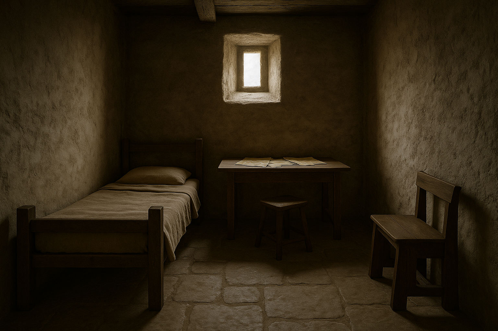 {style="width:320px;height:240px;" class="framed-image"}

::: page

# Garrison

## Description

_Number on the [map](#town-map)—**6**._

> The main gate stands open. In the yard a few guards drill with wooden swords, practicing their strikes. Beside the
> building hangs a weathered notice board.

> It smells of metal and oil. Weapon racks line the walls. In the far corner—an oak table buried in maps and papers.
> Along one wall run barred cell doors—the town jail is here as well. **Hurgkhan**, arms folded, is speaking with a
> guard.

Without a [Garrison Permit](#garrison-permit), the guard requires you to check your weapons at the entrance.

## Characters

- [Hurgkhan](#hurgkhan)—garrison commander.
- [Günter](#günter)—a guard, pinning a missing-person notice for Maria to the board.
- [Guards](#guards)—busy training. If you win them over, they’ll share info about Günter.

## Items

- The [Garrison Permit](#garrison-permit) is in Hurgkhan’s desk.

## Events

**Debate over independence.** The characters notice two guards arguing heatedly. One: _“The Empire abandoned us during
the siege—we managed on our own.”_ The other: _“Without the Empire, the mages and elves will tear us apart.”_ If the
party joins the debate, the guard whose stance they support becomes **friendly**.

**Jail inspection.** In one cell—a drunk brawler. He mutters about spiders and begs you to “get the one in the corner”
to stop watching him.

::: column

## Information

**Papers on the table:**

- The freshest report: _“1 Bethalasse. Brawl at the tavern. 2 male traders and 1 female paladin. Could not question.”_

**Günter’s desk:**

- Notes on the disappearances. Names are linked to Rosa with lines. The “traders” are marked “7?” and “Abraham” “4?”
  _(Commandments numbers)_.
- Several draft reports with edits—all accusing Rosa; he’s trying to convince Hurgkhan she’s an inquisitor undercover:
  _“Leaves town; skips services; arrival coincides with disappearances; armed—even at night. Coincidences: 4. Enough.”_

## Notice Board

Günter pins up a missing-person notice for Maria with her description and a promised reward—**100 gp**.

Another notice reads: _“Volunteers wanted for a search party to find the missing. Valor, bravery, and a touch of
courage.”_ A few dubious notes are tacked nearby.

#### Dubious Notes

| d6  | Notice                                                                                                 |
| :-: | :----------------------------------------------------------------------------------------------------- |
|  1  | Cat missing! Black, answers to “Prince.” Last seen near the dock. Mug of the finest ale to the finder! |
|  2  | Cursed be whoever whistles at sunset! Second time now the chickens drop dead after that.               |
|  3  | Seeking someone to fix a clock. It stopped at 2:14—same as every year.                                 |
|  4  | Come to supper. The house with the blue window by the old fountain. No sermons, just food.             |
|  5  | Found a key to something important. Describe the item and I might return it.                           |
|  6  | Who whispers under my windows? Stop it. I have an old heart and a knife.                               |

::: page

# Watchtower

## Description

_Number on the [map](#town-map)—**10**._

> On the highest cliff stands a massive watchtower of dark stone. Banners with the Empire’s crest hang above narrow
> arrow slits. At the summit a sentry’s silhouette stares into the horizon. Inside, a spiral staircase climbs to the
> viewing platform.

View from the tower:

> San Soprigal lies at your feet like a toy. Beyond the western wall, the road runs into fields and groves. Somewhere
> out there, past the hills, lies the way to **Karthal**.

`@Perception 15`:

> One spot catches your eye—a short stretch of shoreline vanishes behind the cliffs. It seems you can’t see the entire
> coast from here; a small cove is hidden from view.

## Characters

- [Guard](#guards)—the sentry on the platform. Displeased with visitors; without a [Garrison Permit](#garrison-permit)
  he asks you to leave the tower. `@Persuasion 12`—allows a brief lookaround.

## Information

- The sentry says **Günter** asked to take the watch early yesterday—“before sunset.”
- When the sentry arrived this morning, the tower was cleaned up better than ever before.
- `@Perception 15` the cove beneath the cliff cannot be seen from the tower (number on the [map](#town-map)—**11**).

::: column

## Events

If you like, give the characters a minute for personal thoughts. Each rolls a **d4** and shares one line.

> You look out over the town from on high. It seems peaceful—perhaps for the first time in a while. But the feeling
> won’t let go—something here is wrong. You’re drawn to answers. Staring down at the view, you catch yourself thinking
> thoughts you’d rather not keep inside. Each of you goes quiet for a moment. Someone speaks first—and the others
> follow.

| d4  | Thoughts                                                                                               |
| :-: | :----------------------------------------------------------------------------------------------------- |
|  1  | Which of you do I trust the most—and why?                                                              |
|  2  | What would **Jared** do?                                                                               |
|  3  | I know who’s behind Maria’s disappearance. Or I think I do. And it’s…                                  |
|  4  | I’m thinking less about people and more about the town itself. About San Soprigal, I’ve realized that… |

_For sincere openness, you can award **inspiration** or remind them of an important detail they missed._

<!-- prettier-ignore -->
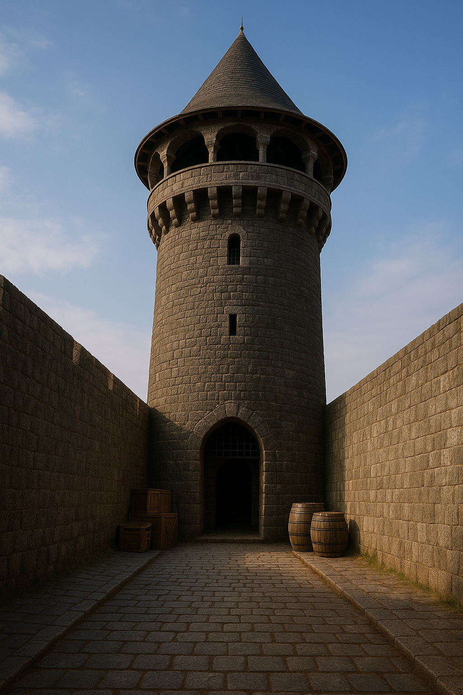 {style="width:320px;height:340px;" class="framed-image"}

::: page

# Town Gates

## Description

_Number on the [map](#town-map)—**8**._

> Massive city gates banded with iron rise from old but sturdy walls of dark stone. Every dent and crack bears the mark
> of time and past sieges. Above the gate, the Empire’s banner flutters in the wind—its edges are frayed, but the crest
> is still clear.
>
> A few guards stand by the gate, keeping order.
>
> Nearby, several teenagers—exchanging glances and whispers but not drawing closer. There’s more worry than curiosity in
> their eyes.

::: column

## Characters

- [Guards](#guards). Stern and tight-lipped: no one passes without an order from **[Hurgkhan](#hurgkhan)**. A
  [Garrison Permit](#garrison-permit) does not apply here.
- [Rosa](#rosa)—paladin. May attempt to leave, which can trigger a conflict with Hurgkhan.
- [Townsfolk](#city-folk).

## Information

- About **Maria**: the guards did not see her leave town.
- About **Rosa**: arrived a month and a half ago; often leaves for several days. Returned at sunset yesterday.
- You can [eavesdrop](#appendix-rumors) on what the townsfolk are saying.

## Events

- [Rosa vs. Hurgkhan at the Gate](#rosa-vs-hurgkhan-at-the-gate)

<!-- prettier-ignore -->
{class="mask mask--background-bottom-half" style="object-position: center bottom; object-fit: contain;"}

::: page

# Rosa vs. Hurgkhan at the Gate

## Setup

The characters hear an argument flaring at the gate:

> Rosa stands before the gate, stance taut, fists clenched. A young guard looks nervous but doesn’t yield.
>
> Townsfolk gather, holding their breath. One guard hurries off to fetch Hurgkhan.

## The Exchange

> **Hurgkhan** strides up with two guards. He gives Rosa a brief once-over, then turns to the guard near the gate.
>
> **Hurgkhan:** Report.
>
> **Guard:** Trying to leave town, sir. No permit.
>
> **Hurgkhan (to Rosa):** Town’s closed. Back to the temple, paladin.
>
> **Rosa:** My task outweighs your edicts. Do not anger the angels, orc.
>
> Hurgkhan’s hand settles on his axe. Guards reach for their weapons.

::: box

**For the DM.** This scene is a brief shake-up that can set who escorts the party into the catacombs. Side with the
guard and **Hurgkhan** may arrive at a crucial moment later. Side with Rosa—**Gaston** is certain to become the guide.
Stay out of it and the party may get no help at all.

:::

::: column

## Player Intervention

The party can persuade, intimidate, or propose a compromise.

- `@Persuasion 14` / `@Deception 14`—calm either side.
- `@Intimidation 16`—check the opponent (tensions rise, but you buy a pause).
- `@Insight 12`—recognize both sides are acting on principle; a **compromise** is needed.

If the first attempt fails or the party stays silent:

> Hurgkhan growls that he has no time for sermons. Rosa grits her teeth and sets a hand on her sword.

A second attempt is allowed with **+2 DC**. On a second failure—escalation.

## Outcomes

**Failure/inaction → fight:**

- Opponents for [Rosa](#paladin-of-the-church-of-light): [Hurgkhan](#guard-captain-hurgkhan) and three
  [guards](#imperial-guard).
- The guards’ goal is **arrest** and minimize harm.
- Rosa’s goal is to **break through**.

**Success → de-escalation:**

- If you convince Hurgkhan—he allows Rosa to leave town. The guard’s attitude toward the party drops one step.
- If you convince Rosa—she reluctantly returns to the temple. Rosa and Selina become **hostile** toward the party.

**If a fight breaks out:**

- Attacking the guard marks the party as **outlaws**; Gaston may help smuggle them out via the cove.
- If the guards “kill” the party—the characters awaken in **jail without their gear** in **d4** hours. Gaston may
  arrange a night extraction.
- If Rosa “kill” the party—they awaken in the **garrison** in **d4** hours.

::: page

# Abraham’s House

## Description

_Number on the [map](#town-map)—**9**._

> A single-story house, fairly large and clearly built for a family. From the outside it looks a bit neglected. One
> window is broken and hastily boarded over.

> Inside it’s dry and stuffy. Dust lies evenly across the wooden floor; motes dance in the light from the window. The
> furniture is intact and neatly arranged, but it feels like no one has lived here for a long time.

## Characters

- [Jonas](#jonas)—a coachman, the owner. If the party lingers outside, he comes by and offers to rent the house to them.
- [Gaston](#gaston)—a smuggler. Keeps an eye on the place and will approach if the party is breaking in **in the
  evening**.
- [Children](#city-folk)—playing nearby; they can raise an alarm.

::: column

## Information

**Out front:**

- `@History 10`, or if the party includes a **rogue**—the lock is rare and expensive; you’d see it on very wealthy homes
  or anywhere needing elevated security.
- `@Insight 12`—from **Jonas’s** slips of the tongue, it seems his grandfather was a smuggler.
- `@Persuasion 10` with the **children** or by speaking with **Jonas**—the kids used to play in the Abandoned District,
  but after hearing strange sounds they moved here and, a week and a half ago, broke the window.

**Searching the house:**

_To move quietly, a successful `@Stealth 13` is required; otherwise the floorboards creak and may draw attention._

- From the layer of dust it’s clear **no one has lived here for over a month**.
- `@Perception 10` / `@Investigation 12`—in one corner the floorboards **don’t creak**. Between those boards you can
  feel an **iron ring**. Pulling it opens a **cellar hatch** (a hidden passage).

**Partial success.** If the party fails the check to find the hatch, they still locate it—but noisily, which may attract
attention.

<!-- prettier-ignore -->
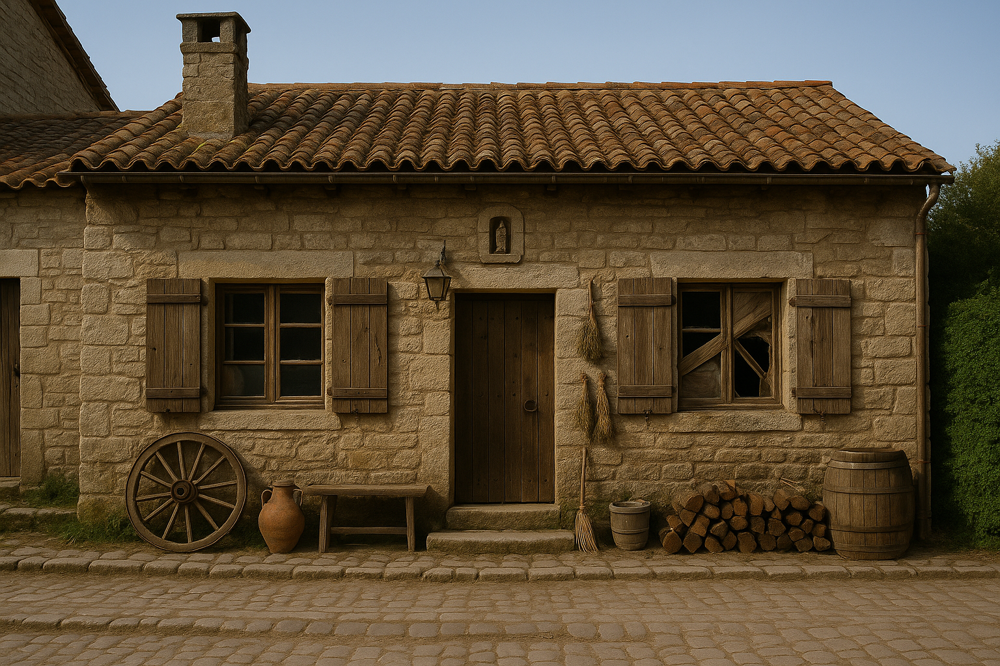{class="mask mask--background-bottom-third-02" style="object-position: center bottom; object-fit: contain;"}

::: page

# Abraham’s Cellar

## Description

> A narrow wooden staircase drops away; the air grows cooler and damp. It smells of mildew, old wood, and something
> faint—an herbal/alchemical mix. The walls are laid in massive stone blocks; part of the floor is covered by a worn
> rug. Along one wall stands a table piled with vials and parchment notes. In the far corner: a framework of metal
> struts and pipes. Against the middle of the wall sits an old wooden wardrobe.

## Items

- [Abraham’s Diary](#abrahams-diary)—on the table.
- [Strange Item “Plun’gr”](#strange-item)—among the alchemical tools.
- [Antitoxin](https://www.dndbeyond.com/equipment/520-antitoxin)—grants immunity to Poison damage (_number of
  characters + 1_).

## Information

**The table:**

- [Abraham’s Diary](#abrahams-diary).
- Vials with a green liquid.

**Identifying the vials:**

- The liquid resembles what [Kenki](#kenki) could have supplied.
- With an alchemist’s kit: 10 minutes—to identify as **antitoxin**.
- Without a kit: `@Medicine 14`, 10 minutes—to identify as **antitoxin**.

**The corner:**

- `@Investigation 10`—the metal assembly forms a makeshift potion-brewing stand.
- Among the tools is the [strange item](#strange-item): a handle with a tightly fitting rubbery cup.

**The old wardrobe:**

- One drawer is locked. If picked—inside are only a faded sheet and dust.
- `@Perception 10`—the wardrobe sits slightly pulled out; in the masonry behind it you notice a small round recess (a
  mechanism).

::: column

## Secret Passage

- `@Perception 10` or `@Investigation 10`—to discover the mechanism in the wall behind the wardrobe.
- Press **Plun’gr** firmly to the hole and **press three times**.
- A handle with four number dials (0–9) extends. The correct combination is **0451** _(a hint can be found in the
  diary)_.
- On success, a hidden door to the catacombs opens: the wardrobe slides aside, revealing a
  [narrow passage](#passage-from-abrahams-house).

**Wrong code.** From deep within comes a distant click, and the room begins to fill with a paralyzing gas. Each creature
must make a `@Constitution 13` saving throw. On a failure, it gains the
[paralyzed](https://www.dndbeyond.com/sources/dnd/br-2024/rules-glossary#ParalyzedCondition) condition for `1d4` hours.

::: box

**For the DM.** Instead of a “roll for the code,” offer the players a real mini-puzzle at the table to simulate dialing
it in.

:::

<!-- prettier-ignore -->
 {style="width:320px;height:330px;" class="framed-image"}

::: page

# Library

## Description

_Number on the [map](#town-map)—**5**._

> A gray-stone building with columns at the entrance and a high pediment carved with reliefs from the town’s founding.
> It looks imposing, but it’s long overdue for repairs: cracked walls overgrown with ivy, part of the tiled roof
> collapsed.
>
> Inside—high vaults, creaking wooden floors, and the smell of dust and old parchment. Massive bookcases line the walls
> and the hall’s center. The walls are hung with darkened portraits of former town leaders.
>
> At a desk buried in books, notes, and unsorted records sits an elderly librarian. His quill scratches on paper; he
> barely seems to notice you. Without looking up, he mutters, “No noise. History likes quiet. So do I.”

## Characters

**German**—an elderly librarian with tousled white hair and round spectacles forever sliding down his nose. He wears an
old-fashioned vest and a patched, worn cloak. He prefers books to people, but warms to anyone who respects knowledge.

 {class="framed-image" style="width:320px;height:320px"}

::: column

## Books

See **[Appendix: Books](#appendix-books)** for contents.

- Access to the stacks:
  - `@History 10`—interest in history → [“Chronicles of San Soprigal, Vol. I”](#chronicles-of-san-soprigal).
  - `@Arcana 10`—interest in magic →
    [“On Certain Properties of Souls and Their Tolerances”](#on-certain-properties-of-souls-and-their-tolerances).
  - `@Religion 10`—interest in faith →
    [“On Forbidden Doctrines and Heresies”](#compendium-on-forbidden-doctrines-and-heresies).
  - A [Garrison Permit](#garrison-permit) → access to all of the above.
- `@Persuasion 12`—to read the draft of [“Days in Hell”](#days-in-hell).

## Information

- From “Chronicles of San Soprigal, Vol. I,” one can learn about the **catacombs beneath the town** and a lost cove.
- German explains that some books—including “On Certain Properties of Souls and Their Tolerances”—were brought from the
  house of the mage **Moander**, who disappeared during the siege; his home nearly burned down.
- **Abraham** took an interest in Moander’s books, annotated them, and copied passages.
- German can tell the [story of the siege](#the-demon-incursion), how **Hurgkhan** became mayor, and share other tales
  from San Soprigal’s past.

::: box

**For the DM.** This location is optional and exists to deliver lore. You can keep it closed if you need to speed the
pace and push the party onward.

:::

::: page

# Günter’s House

## Description

_Located in **[Velvet Row](#town-map)**._

> Günter’s home sits in the well-to-do part of town, its large windows facing the market square. Wrought-iron railings,
> marble inlays, an old carved door—the house clearly belongs to a prosperous family.
>
> You pass a stranger’s first floor and climb to the second, where Günter lives. A chill meets you at the door. The flat
> is empty; everything is in its place—as if life here has stopped. The air smells of old wood, wax, and dust. An old
> carpet blankets the floor; portraits hang beneath gauzy cloth on the walls. The space is hollow and somber, like a
> dungeon above ground.

## Information

- `@Perception 10`—on the desk lies an unsent letter in tight, tense script: _“Leave the Temple before it’s too late.
  They are not saints. And she is not who she claims to be.”_ Beside it is a neatly folded love note with a pressed
  flower.
- `@Investigation 10`—a desk drawer hides a list of Church **dogmas** and several old angel images; some are crossed
  out.
- `@History 12`—three portraits under cloth are Günter’s family; the mourning marks and dates make it clear: they all
  died two years ago.
- `@Insight 10`—the interior doors lock from the inside; some have double bolts. This “self-defense” betrays anxiety:
  the owner feared searches or night visits.

If you wish, you can place here the same papers found on Günter’s desk at the **[Garrison](#garrison)** if the party
hasn’t visited yet or missed them there.

::: column

## Events

**Alarm spell.** Crossing the threshold triggers a magical alarm (it can be prevented by speaking the **correct
pass-word**—found in Günter’s desk with `@Investigation 15`).

> The air fills with a sharp ozone tang. Pale runes flare across the floor. Somewhere deeper in the house a bell
> rings—as if the home has notified its master.

The party has **1d4 rounds** to make a quick search or hide before a patrol arrives.

- Hide: `@Stealth 13`.
- Talk your way out/lie: `@Persuasion 12` / `@Deception 13` (with a **[Garrison Permit](#garrison-permit)**—with
  advantage).
- The guards’ goal is to **detain for questioning**.

::: box

**For the DM.** This location is optional and isn’t referenced directly by NPCs, but it often draws player interest.

:::

<!-- prettier-ignore -->
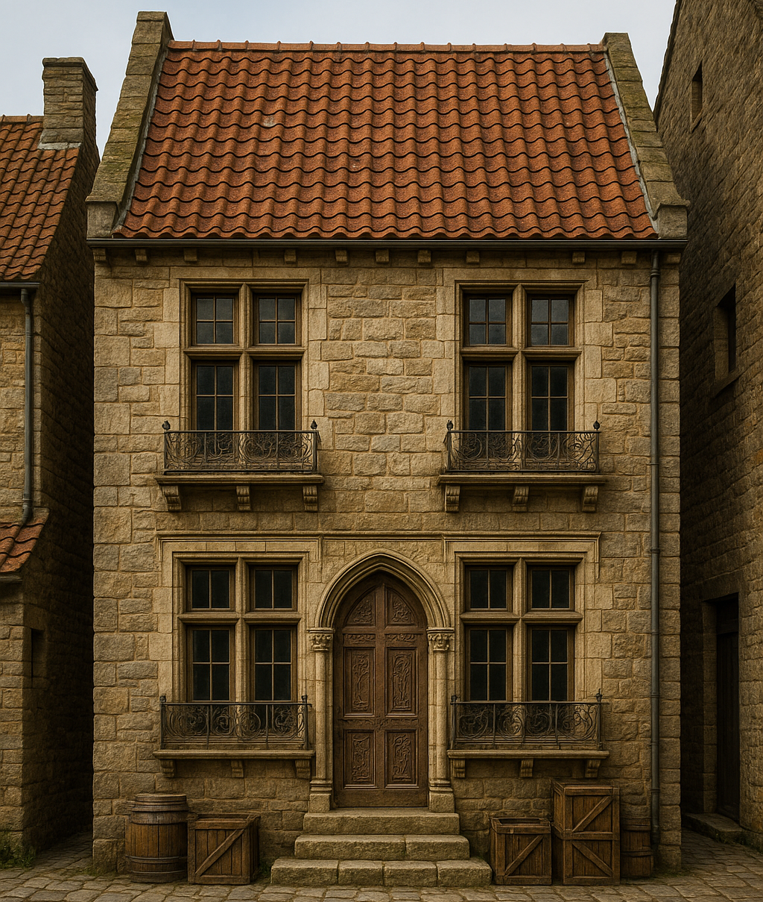 {style="width:320px;height:340px;" class="framed-image"}

::: page

# Abandoned District

## District Description

_Number on the [map](#town-map)—**12**._

> In the northwest part of town, the old paving stones are still dusted with ash. Half-ruined houses slowly crumble
> under wind and rain. People once lived here; now only ruins remain. From time to time a creak carries—the wind rocking
> the last shutters to tap against the stone.

**The Old Well:**

> Amid the collapsed homes sits a choked-up well: its moss-covered stone curb barely shows beneath boards, dirt, and
> fallen rock.

::: column

## Information

**The district:**

- `@Survival 12`—it’s too quiet even for an abandoned place: no birds or small animals.
- `@Insight 10`—few come here at all; sometimes children play among the ruins, or drunkards wander in.

**The well:**

- `@Perception 10`—fresh tracks of a single person near the well; in the dust lies a moon-shaped amulet (_Maria’s_).
- `@Arcana 10`—the cave-in is recent. One of the stones carries a faint trace of **mold earth**: the uneven “hand” of a
  novice, likely working from a practice scroll.
- `@Investigation 14`—you can reconstruct the scene: someone was knocked down and dragged toward the well.
- Examining the stonework reveals a barely visible mark shaped like a medusa.

To dig out the blockage would take **at least a full day** (even with spell aid). If the party has missed other
entrances to the catacombs, you may reduce this to **1d4 hours** to keep the plot moving.

<!-- prettier-ignore -->
{class="mask mask--background-bottom-third-02" style="object-position: center bottom; object-fit: contain;"}

::: page

::: chapter Chapter 3 | Catacombs

Beneath the town lies a small network of catacombs, first cut when **San Soprigal** was founded and later expanded by
smugglers of **[Black Meduza](#appendix-states-and-organizations)**. Most townsfolk don’t know they exist—only rumors
persist, and local daredevils have failed to find them.

From town, you can reach the catacombs via the **old well** in the Abandoned District (the original route) or through
the **cellar of Abraham’s house** (the newer route).

From the sea side, a narrow entrance opens in a hidden cove: the passage is veiled by a powerful **illusion**. Spotting
the anomaly requires `@Investigation 15`; recognizing it specifically as an illusion requires `@Arcana 13`. The illusion
masks the view but does not block passage.

::: column

## Catacomb Map

The catacombs break into several zones:

1. [Passage from the Old Well](#passage-from-the-old-well) — the original tunnel from the town’s founding.
2. [Passage from Abraham’s House](#passage-from-abrahams-house) — a tunnel dug by smugglers about 50 years ago.
3. [Smugglers’ Cove](#smugglers-cove) — an inner cove with a small unloading pier.
4. [Great Hall](#great-hall) — the main storage chamber; now the spiders’ lair.

If the characters don’t have **darkvision**, they’ll need a light source. If they travel with light or aren’t attempting
to stay hidden, the spiders in the lair detect their approach and set an _ambush_.

::: wide

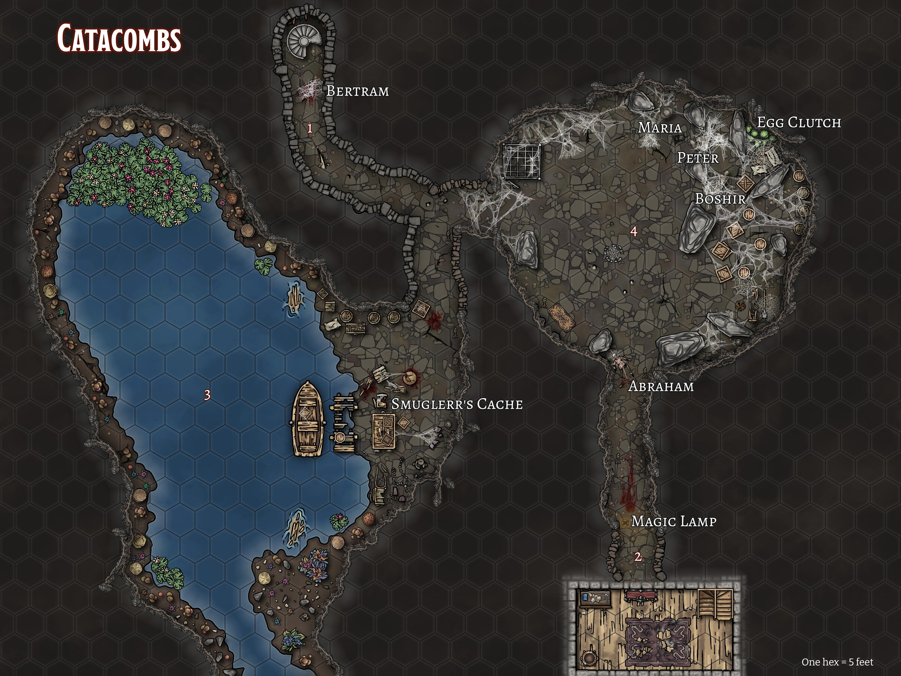{class="framed-map" style="height:100%"}

_The full map archive is available here:
[Download from Google Drive](https://drive.google.com/drive/folders/1kkLD4GegIr0Q5sSph8yz1zEEGgtrtRQs)._

::: page

# Passage from the Old Well

## Description

_Number on the [map](#catacomb-map)—**1**._

> A choking reek of damp and rot greets you. Only distant droplets break the silence. The tunnel walls are laid with
> ancient stone, furred with moss and webbing. Here and there you see worn runes and chiseled symbols.
>
> The wooden supports look frail—some have split. It seems a careless move could bring the ceiling down.

## Information

- **Bertram’s cocoon.** A large mass of web clings to the wall. Cutting it open reveals a desiccated body, face frozen
  in a rictus of terror.
- `@Investigation 10`—faded smuggler’s marks and the medusa symbol are visible on the walls.

::: column

## Cave-In Hazard

If the party doesn’t state they’re proceeding carefully (group check `@Survival 12`), the tunnel begins to collapse.

> You hear a dull crack—one of the wooden beams splits, dust trickles from above. A heartbeat later comes a crunch and a
> crash; stones thud to the floor, the air fills with grit, and part of the passage behind you starts to cave in.

Each character makes a `@Dexterity 12` saving throw. On a failure, they take `1d6` bludgeoning damage. The passage
behind is blocked.

<!-- prettier-ignore -->
{class="mask mask--background-bottom-half" style="object-position: center bottom; object-fit: contain;"}

::: page

# Passage from Abraham’s House

## Description

_Number on the [map](#catacomb-map)—**2**._

> The air is stale and unpleasant. The first several yards are neatly shored with stonework, but farther on the lining
> ends—the walls are roughly hewn in damp earth. Dust blankets the floor; in places it’s broken by footprints and
> shallow grooves, as if someone was dragged while bracing against the ground. Dark patches of dried blood are visible.

If a **lamp** is present:

> A bluish glow from a lamp on the floor flickers dimly along the walls. As you approach, the light grows noticeably
> brighter—as if the lamp responds to your presence.

**Exiting into the Great Hall:**

> The passage gradually widens and the ceiling lifts. Webbing hangs in heavy sheets. By the wall lies a body wrapped in
> dried silk, joints twisted—like someone who died in convulsions. You get the unsettling sense the skull is staring
> straight at you.

::: column

## Information

**Examining the tracks:**

- `@Investigation 10`—the tracks belong to a single person and are at least a month old. _If the party arrived here
  after Gaston, they also find a newer set of footprints._

**Examining Abraham’s remains:**

- The clothing resembles an old mage’s robe, embroidered with tarnished symbols.
- The hand bones are frozen in an unnatural pose. Fine, deep scoring lines mark the bones—as if something huge with
  sharp claws dragged him.
- `@Perception 10`—amid the webbing is a [broken amulet](#abrahams-amulet-broken) bearing a skull and spider.

## Items

- [Magic Lamp](#magic-lamp). _If the party came here after Gaston, he has the lamp._
- [Abraham’s Amulet](#abrahams-amulet-broken).

<!-- prettier-ignore -->
{class="mask mask--background-bottom-third-02" style="object-position: center bottom; object-fit: contain;"}

::: page

# Smugglers’ Cove

## Description

_Number on the [map](#catacomb-map)—**3**._

> A spacious stone cavern with a high vaulted ceiling. The air is damp, smelling of saltwater and rotting wood. Pale
> blue mushrooms cling to the walls, their faint phosphorescence bathing the chamber in a wavering half-light.
>
> Along one wall lie rotten crates. Closer to the water stands a crooked pier with a small boat moored to it.
>
> Near the boat are fragments of much newer crates and a barrel. Something gleams among the splinters.

## Items

- [Smugglers’ Cache](#smugglers-cache).

::: column

## Information

- **Boat & pier.** `@Investigation 12`—the boat hasn’t been hauled out in a long time; salt crust on the hull and
  seaweed on the lines suggest about a month. Boats are usually kept ashore, so something prevented it.
- **Old crates.** Contents have rotted away. What remains are rusty blades and a couple of usable daggers (2).
- **Barrel.** A medusa symbol is chalked on the side.
- **Crates by the boat.** One crate has a shattered bottom, its boards broken as if it fell from height. Two crates are
  torn open from both outside and within; claw marks mar the wood. Nearby are signs of a struggle and patches of dried
  blood.
- **Chitinous shell.** `@Nature 10`—among the debris and inside the large crate lie pieces of chitin: gray-green,
  glossy, with serrated edges. This is the shed exoskeleton of a large arachnid; the creature is likely even bigger now.
- **Smugglers’ list.** `@Perception 10`—a damp note lies near the barrel, a delivery ledger:
  - “Documents and live cargo—3 pcs. Deliver to Abraham.”
  - “Casket—1 pc. Deliver to the Head.”
  - “Glowing Dust—1 barrel.”
  - “Moonsilver—2 ingots.”
  - “Imperial cloaks—5 sets.”

<!-- prettier-ignore -->
{class="mask mask--background-bottom-third-01" style="object-position: center bottom; object-fit: contain;"}

::: page

# Great Hall

## Description

_Number on the [map](#catacomb-map)—**4**._

> The ceiling vanishes into darkness. Sticky webbing mats the walls, hangs in heavy swathes from above, and carpets the
> floor, clinging to your boots like taffy. The air is heavy and damp with a persistent stench of rot. Along the walls,
> boulders are heaped; from them thick strands hang in disorder, weaving into three grimy gray cocoons.

## Information

- **Peter & Boshir.** Two cocoons contain the desiccated bodies of men.
- **Maria.** The third cocoon holds **Maria**. If the party arrives on Day One, she’s at death’s door but still
  breathing. A careless cut can kill her; `@Medicine 10` is required to stabilize.
- **Spider clutch.** `@Perception 10`—a clutch of large spider eggs is visible along the walls. It must be destroyed to
  prevent the spiders’ return.

## Environment

- **Webs.** Count as [difficult terrain](https://www.dndbeyond.com/sources/dnd/br-2024/rules-glossary#DifficultTerrain):
  speed halved; to tear free requires an action and `@Athletics 12`. Fire burns a 5-foot section per action.
- **Boulders.** Large enough to provide [cover](https://www.dndbeyond.com/sources/dnd/br-2024/rules-glossary#Cover).
- **Fire.** Torches and a fire pit in the center. If lit, spiders won’t come within 10 feet.

## Gaston’s Part

If the party descended with **[Gaston](#black-meduza-bandit)**, on round one he slips into the shadows after the casket.
He won’t reappear unless his attitude toward the party is **positive**.

::: column

## Combat: Spider Lair

As soon as the party approaches the center of the hall or begins cutting open cocoons, the first
[Spellwarp Spider](#spellwarp-spider) lunges from the shadows. If the party didn’t move stealthily, it attacks from
[ambush](https://www.dndbeyond.com/sources/dnd/br-2024/rules-glossary#Surprise).

> You feel the webbing underfoot begin to tremble. Somewhere above, claws rasp menacingly on stone. Several bright green
> eyes flare in the dark.

::: definition

**Round 2.** A second [Spellwarp Spider](#spellwarp-spider) bursts from a side passage, trying to cut off the escape
route.

**Round 3+.** When one spider dies, the [Spellwarp Spider Matriarch](#spellwarp-spider-matriarch) drops from the
ceiling—a hulking creature that moves with unsettling intent.

**Additionally.** A [swarm of tiny spiders](#swarm-of-spiders) can pour from the ceiling or walls, harrying characters
and disrupting concentration/line of sight.

:::

<!-- prettier-ignore -->
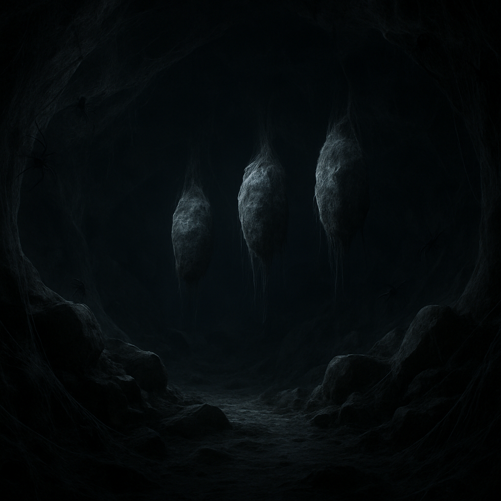 {style="width:320px;height:350px;" class="framed-image"}

::: page

::: chapter Chapter 4 | Aftermath

# The Catacombs

Before the [funeral scene](#the-funeral), the characters must decide: reveal the catacombs or keep them secret.

If the party agreed to accompany Gaston into the catacombs, he raises the question of hiding the passages from the
guard, the Church, and the townsfolk. He offers to double the fee—**100 gp each**—if the catacombs remain a secret.

The party needs a plan (and to carry it out). If the plan works, the catacombs remain unknown for a time. This can
provide a venue for covert meetings later and strengthen Gaston’s goodwill.

**If the spider eggs aren’t destroyed:** within **a month** the spiders crawl onto the streets searching for food and a
new wave of attacks begins.

When Hurgkhan learns about the spiders, he musters a squad and descends into the catacombs. The fight is brutal; the
spiders are destroyed. Hurgkhan is mortally wounded and dies below. Only Günter survives, returning to town injured and
in shock. The town mourns, but the immediate threat is gone.

::: column

# The Accusation

At any point the party can go to the garrison and bring charges against a character. This can serve as an ending.

**Insufficiently connected case (scattered clues):**

- Hurgkhan has doubts and agrees at most to house arrest/surveillance.

**Compelling case (clues logically connected):**

- Hurgkhan orders an arrest and the suspect is jailed.
- Hurgkhan lifts the lockdown and Rosa leaves town.

**A week** after the “case is closed,” the attacks resume: people disappear, spider tracks appear in the streets.

When Hurgkhan learns about the spiders, he musters a squad and descends into the catacombs. The fight is brutal; the
spiders are destroyed. Hurgkhan is mortally wounded and dies below. Only Günter survives, returning to town injured and
in shock. The town mourns, but the immediate threat is gone.

<!-- prettier-ignore -->
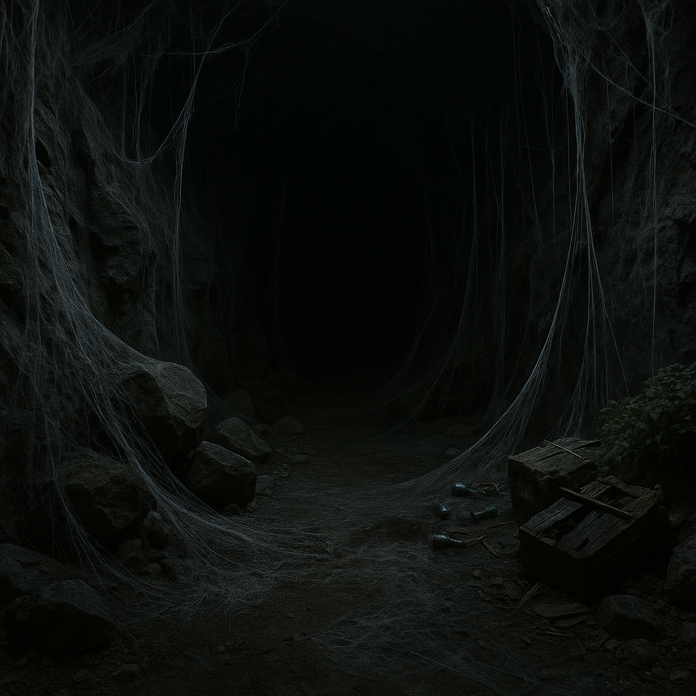{class="mask mask--background-bottom-third-01" style="object-position: center bottom; object-fit: contain;"}

::: page

# The Funeral

The adventure ends with a funeral scene. Who is laid to rest depends on the party’s actions.

## Description

> Wooden biers are set in the middle of the square. Upon them lie those who did not survive the night. Faces are hidden
> beneath white shrouds, but even through the cloth you can make out the shape of _(character name)_: the figure lies
> still among the fallen.
>
> Selina prays, anoints with oil, and the first tongue of flame licks at the dried boards. The scent of incense mingles
> with smoke; birds circle overhead. Some whisper farewells, some wipe away tears, but most simply stand in silence.

The party may speak a few words of farewell.

::: box

**For the DM.** Before the funeral—or in dialogue with NPCs—give the players a short scene to articulate what happened.
It helps them feel they truly solved the case.

:::

::: column

## After the Adventure

Afterwards, the characters may receive new leads:

- **Rumors:** _“It’s not right to burn them in the middle of town—and we can’t do it out at the old cemetery either, not
  with the undead crawling out of the ground there.”_
- **Duncan:** _“If you’re looking for a real challenge—there’s work in the mountains.”_
- If **Rosa’s** attitude isn’t hostile: _“The attacks on merchants continue; your help would be welcome.”_
- If the party aided **Gaston**, he offers “other delicate jobs.”

Or foreshadowing for a continuation:

- **The Empire (if there was an attack on Rosa):** _“If the Church already knows—expect visitors…”_
- **Black Meduza smugglers (if Gaston doesn’t have the casket):** _“Someone’s hunting for the casket—they’ll be coming
  soon…”_

<!-- prettier-ignore -->
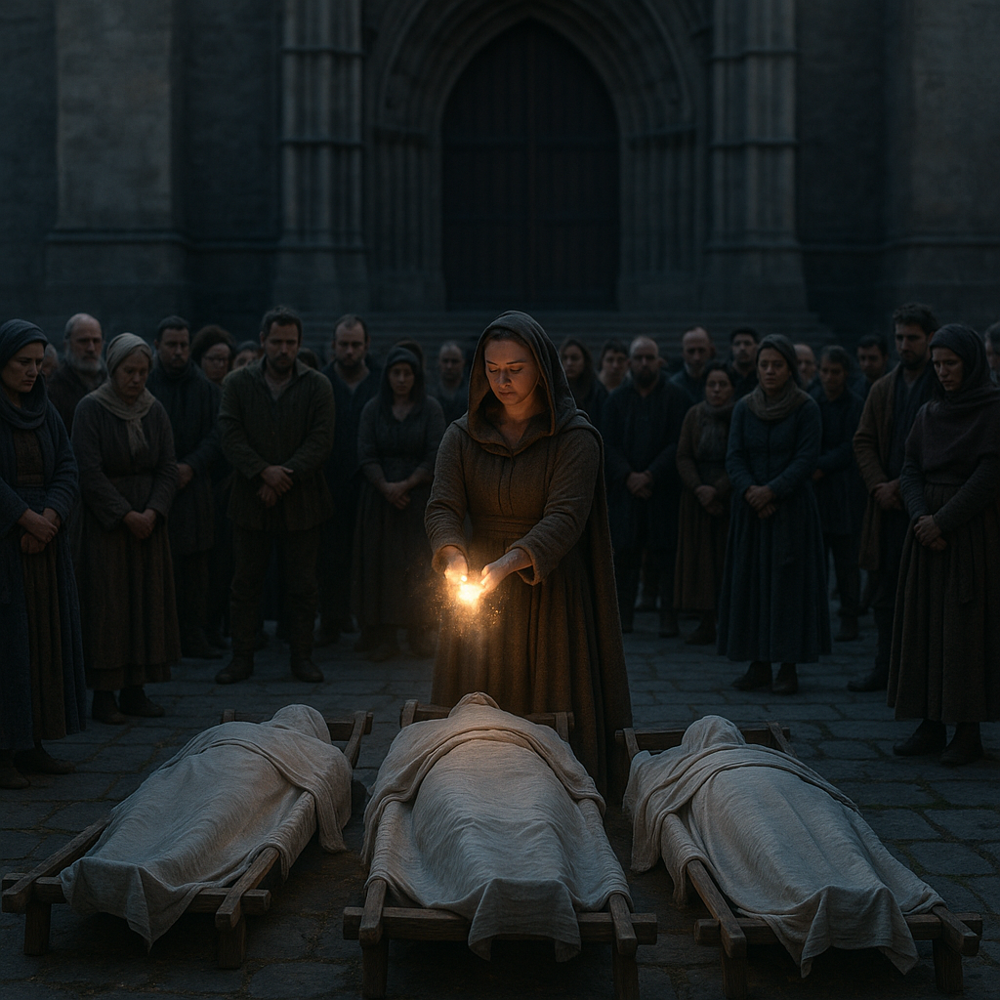{class="mask mask--background-bottom-third-01" style="object-position: center 140%; object-fit: contain; bottom: 0;"}

::: page {type="inside-cover" chapter="Appendix | Characters"}

 {class="cover"}

# Characters

::: subtitle

NPCs Profiles

:::

::: page {layout="wide"}

# Appendix: Characters

#### Quick NPC Index

| Name                        | Role                           | Location                                                         | Motivation & Table Use                                                                           |
| :-------------------------- | :----------------------------- | :--------------------------------------------------------------- | :----------------------------------------------------------------------------------------------- |
| **[Duncan](#duncan)**       | Former adventurer              | [Tavern](#tavern-by-the-sea), [Docks](#the-dock)                 | Recruiting a team for a dragon hunt. Orients the party to the town; hook for a future adventure. |
| **[Hurgkhan](#hurgkhan)**   | Garrison commander             | [Maria’s House](#marias-house), [Garrison](#garrison)            | Leads the investigation. Provides initial info; can issue a Garrison Permit.                     |
| **[Günter](#günter)**       | Guard; Maria’s lover           | [Maria’s House](#marias-house), [Garrison](#garrison)            | Searching for Maria; suspects Rosa. Source on other disappearances.                              |
| **[Helmut](#helmut)**       | Tavern owner                   | [Tavern](#tavern-by-the-sea)                                     | Offers the “rat farm” quest. Source on Peter & Boshir.                                           |
| **[Kenki](#kenki)**         | Tavern server                  | [Tavern](#tavern-by-the-sea)                                     | Loves gossip. Source on Peter & Boshir.                                                          |
| **[Gaston](#gaston)**       | Smuggler                       | [Tavern](#tavern-by-the-sea), [Abraham’s House](#abrahams-house) | Hunting a missing shipment (the casket). Source on smuggling.                                    |
| **[Rosa](#rosa)**           | Paladin of the Church of Light | [Temple of Light](#temple-of-light)                              | Seeks a relic (not the casket); avoids meddling in town affairs.                                 |
| **[Selina](#selina)**       | Priest of the Temple of Light  | [Temple of Light](#temple-of-light)                              | Defends the Church. Provides info on Rosa and spider dreams.                                     |
| **[Karra](#karra)**         | Trinket seller                 | [Market Square](#market-square)                                  | Craves attention. Info on Maria & Günter; points toward the Watchtower.                          |
| **[Jonas](#jonas)**         | Coachman; owns Abraham’s house | [Abraham’s House](#abrahams-house)                               | Wants coin without trouble. Grants access to Abraham’s house.                                    |
| **[Guards](#guards)**       | City watch                     | [Garrison](#garrison), [Watchtower](#watchtower), city streets   | Keep order. Source of official information.                                                      |
| **[Merchants](#city-folk)** | Market vendors, artisans       | [Market Square](#market-square)                                  | Commerce; rumors.                                                                                |
| **[Drunkards](#city-folk)** | Regulars & vagrants            | City streets                                                     | Can point to the Abandoned District to look for Bertram.                                         |
| **[Kids](#city-folk)**      | Local teens                    | Craft District                                                   | Saw Maria turn into the Abandoned District.                                                      |

::: page {type="class" icon="./assets/symbols/city.svg"}

# Duncan

A former adventurer. His last expedition was about 15 years ago—his entire party died in the northern mountains of the
peninsula. He tells no one what happened there. Those who knew him before say he’s changed: now he lives quietly,
keeping his distance from his old life. Rumors of a dragon seem to have rekindled his resolve—he’s considering
assembling a new group.

He arrived a week ago and took rooms at the tavern. He hates the Church and the angels.

**Objective:** gather information.

## Locations

- [Docks](#the-dock).
- [Tavern](#tavern-by-the-sea).

::: column

<!-- prettier-ignore -->
 {class="framed-image"}

_human, former adventurer_ {align="center"}

::: column-reset

## Description

> A tall man in his forties with sharp, almost noble features, a short dark beard, and eyes with a violet cast. Grey
> touches his temples; his posture is straight, his movements assured. He wears a dark travel cloak over well-made but
> worn armor. At his belt hangs an old-pattern sword, carefully maintained though long past its prime.

## Roleplaying

- Calm, deliberate, restrained; a touch of melancholy.
- Deliberately polite, keeps his distance.
- Speaks briefly and to the point, with dry irony at times.

**Attitude:** Friendly.

::: column

## Information

Can give a brief **history of the town** (as in [“Chronicles of San Soprigal”](#chronicles-of-san-soprigal) book), speak
about the [daemon incursion](#the-demon-incursion), Hurgkhan’s role, and why he became the de facto leader.

Calls the town “not a bad place to grow old”—quiet and calm.

Hints about the mountains: _“This place… Something woke in the peaks. The only question is what we’re going to do about
it.”_

On the Church: _“Angels meddle where they’re not wanted. Like a guard with a shiny buckle—plenty of noise, little
help.”_

After the adventure, he may propose heading **into the mountains to hunt a dragon**.

::: page {type="class" layout="rtl" icon="./assets/symbols/holy-empire.svg"}

# Hurgkhan

He has served in San Soprigal’s garrison for ten years; during the demon incursion he led the town’s defense and lost
nearly all his guards, and now works with raw recruits. He isn’t an Imperial zealot, but order matters to him above all.
As garrison chief he effectively acts as mayor. He’s irritated that since Rosa arrived, some townsfolk treat her as the
“real authority.”

**Objective:** Maintain order in the town at any cost.

## Locations

- [Maria’s House](#marias-house) on the morning of Day One.
- [Garrison](#garrison).
- [Town Gates](#town-gates).

::: column

<!-- prettier-ignore -->
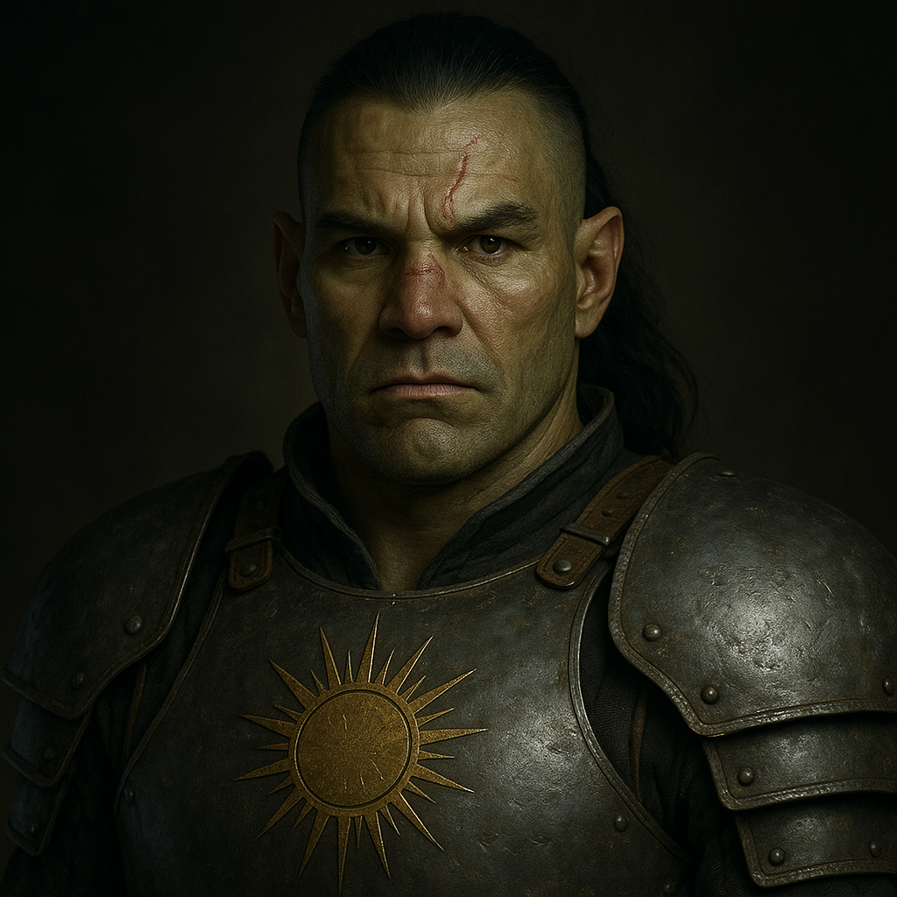 {class="framed-image"}

_half-orc, garrison commander_ {align="center"}

::: column-reset

## Description

> A tall, broad-shouldered half-orc with gray-green skin and dark hair tied back. A scar through the left brow hardens
> his stare. His armor is worn but sturdy, bearing the Empire’s sigil. He carries himself with confidence; his voice is
> clipped and free of embellishment.

## Roleplaying

- Speaks in crisp, short sentences, as if issuing orders.
- Dislikes idle talk but respects competence and directness.
- Calm under pressure; irritable with dithering or freelance heroics.

**Attitude:** Indifferent.

::: column

## Information

Short on bodies, he’s willing to enlist the party’s help and issue a [Garrison Permit](#garrison-permit). He can promise
**30–50 gp** for finding Maria or a key lead.

**Going to sea** to inspect the cove is allowed only at **Friendly** attitude; otherwise, it’s forbidden.

If the party brings evidence against someone, see **[The Accusation](#the-accusation)**.

**About Maria:** _“Good kid. Kept to herself. I see no reason to start a witch-hunt in town.”_

**About Günter:** Notes he’s shaken—there may have been something personal though he won’t say it. No complaints about
his duty, but he’s been more nervous than usual.

**About the disappearances:** Hurgkhan is tired of Günter’s theory; Günter insists people have gone missing before,
though plenty leave town without warning.

::: page {type="class" icon="./assets/symbols/holy-empire.svg"}

# Günter

During the demon incursion, Günter lost his entire family and survived by chance. Afterward he joined the guard—if
angels wouldn’t help as the Church promised, he’d make the town safer himself. Since then he’s come to hate the Church
and grown suspicious and conspiratorial, seeing the “hand of the Church” in every odd event. He met with Maria in
secret, dreamed of marriage, and planned to leave town with her. After her disappearance he’s certain it wasn’t random
and suspects Rosa.

**Objective:** Find Maria and prove the Church’s involvement.

## Locations

- [Maria’s House](#marias-house) on the morning of Day One.
- [Garrison](#garrison).

::: column

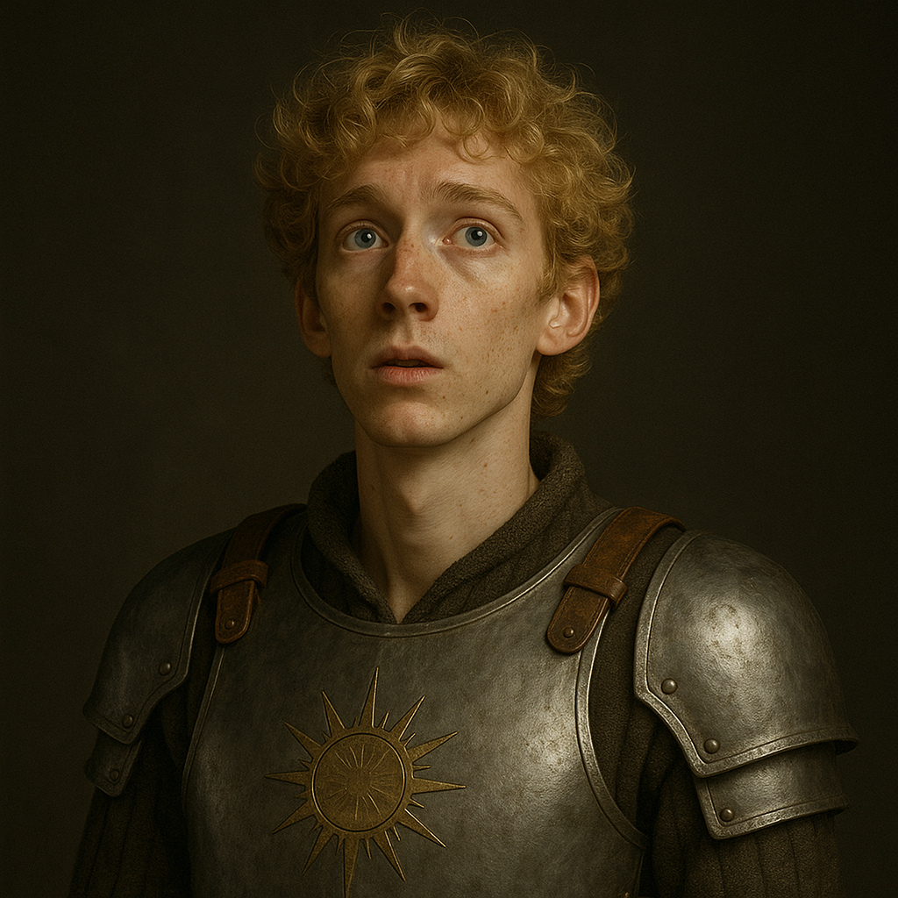 {class="framed-image"}

_human, rookie guard_ {align="center"}

::: column-reset

## Description

> A young man in his early twenties with wavy blond hair and blue eyes. Solidly built, but his movements still lack a
> veteran’s confidence. He wears a cheap, polished cuirass that’s slightly too big. His gaze flickers; his voice
> trembles.

## Roleplaying

- Speaks sharply, sometimes stammering—especially under pressure.
- Often clenches his fists or folds his arms, trying to look confident.
- Short-tempered; his tone hardens quickly when he senses threat or injustice.
- If accused of murder/violence, if Maria is insulted, or if he’s pressed too hard, he shuts down and refuses to
  talk—his attitude becomes **Hostile**.

**Attitude:** Indifferent (distrustful).

::: column

## Information

**About Maria.** Says they were “just acquaintances.” Last saw her at the market around six in the evening on his way to
duty. Maria had a friend at the market—[Karra](#karra)—but he doesn’t trust her.

**If pressed about Maria.** Admits they were seeing each other and asks to keep it secret. They agreed to meet at sunset
at the Watchtower—he planned to propose, but the meeting never happened. Remembers Maria seemed troubled: she wanted to
tell him “something important.” At sunset he saw Maria crossing the square toward the tower but lost track of her—Rosa
returned to town just then and he was distracted. Offers **100 gp** for help finding her (same as the reward on the
[notice board](#garrison)).

**If attitude is Friendly** or the party is openly anti-Church/anti-Rosa. Shares that others are missing—two merchants
and Abraham—and complains Hurgkhan brushed it off. Launches into conspiracy theories: openly accuses Rosa, believes
she’s an inquisitor under cover; her arrival coincided with the disappearances, “people who got in her way vanished”,
and he doesn’t believe in coincidences. Says he and Maria argued about this often.

::: page {type="class" layout="rtl" icon="./assets/symbols/city.svg"}

# Helmut

He’s convinced there’s room for everyone within his tavern’s walls. He hired the goblin server [Kenki](#kenki): people
whispered at first, but now many come specifically for him.

Helmut keeps a tidy rat farm in the cellar—fat river rats, fried crisp, are a dwarven delicacy. There aren’t many
dwarves in town, but he wants them to feel welcome.

He’s used to handling problems himself; if anyone threatens his staff or reputation, he won’t hesitate to ask anyone for
help.

## Locations

- [Tavern "By the Sea"](#tavern-by-the-sea).

::: column

<!-- prettier-ignore -->
 {class="framed-image"}

_human, tavern owner_ {align="center"}

::: column-reset

## Description

> A stocky man in his fifties with a receding hairline, heavy brows, and a magnificent mustache; his beard is cropped
> short. His gaze is unreadable, and weariness sits on his face.

## Roleplaying

- Gruff but welcoming.
- Likes to talk about tolerance.
- Doesn’t ask unnecessary questions.

**Attitude:** Friendly.

::: column

## Information

Asks for help with the rat farm (see [Tavern Cellar](#tavern-cellar)) for **10 gp**.

**About the lodgers who vanished a month ago:**

- _“Happens here… People come and go. I wouldn’t call that ‘missing.’ Month back, two lads booked a room and kept saying
  they wanted to see the Temple spire. Next morning they were gone—left their things. So what, they ‘disappeared’ too?
  Just travelers.”_
- _“Why’s everyone so keen on them anyway? First the kid came asking, then that shady fellow (nods toward Gaston), and
  now you.”_
- For details, he’ll point you to [Kenki](#kenki).

**About Abraham:** saw him a couple of times; jokes that the man must have been “living on air.”

**About Maria:** matter-of-fact—an ordinary girl with a sharp nose; she could smell sour beer in the cellar. Her stall
was nearby, so she’d drop in now and then.

**If attitude is Friendly**, he’ll share a [true rumor](#appendix-rumors).

::: page {type="class" icon="./assets/symbols/city.svg"}

# Kenki

A goblin from a local mountain tribe that lived here before humans. When the town was founded, the goblins accepted
civic law, paid their dues, and entered workshop crews—yet they’re still pushed into low-paid work and get side-eyed.
Kenki knows dockside gossip and the tongues of travelers. He tolerates prejudice, but if someone insults him or the
tavern, he answers coolly and precisely—by the book, with a few barbed words.

**Objective:** Make coin selling information and keep his place at the tavern.

## Locations

- [Tavern "By the Sea"](#tavern-by-the-sea).

::: column

 {class="framed-image"}

_goblin, tavern server_ {align="center"}

::: column-reset

## Description

> A green-skinned goblin with bright yellow eyes. Short and wiry, big ears, and a perpetual smirk.

## Roleplaying

- High-pitched, proud, fidgety.
- Often grumbles that the work is hard and the patrons are rude.
- Loves to gossip—but only for coin or a favor.

**Attitude:** Indifferent.

::: column

## Information

**About the merchants** who vanished a month ago: _“Weird pair. First they whispered about some medusas. Then they
booked one room for two and tried to hit on Rosa—oh, she put them in their place; you should’ve seen it.”_ He can
describe them:

- Stocky man, 35–40: short dark hair, thinning at the front, stubble, roundish features.
- Gaunt man, 35–40, downcast look, a goatee “ring” around the mouth.

Kenki says he didn’t see them again after evening. He took their things—[the merchants’ clothes](#merchants-clothes)—to
the cellar and will allow an inspection if Helmut agrees.

**If attitude is Friendly**, he mentions he found two **vials** of green liquid among their things. He drank one—sobered
up immediately and felt “way too much energy,” even after a couple of mugs (_a hint it’s an antitoxin_). He’ll sell the
second for **5 gp**. With an **alchemist’s kit**, 10 minutes of work identifies it as **antitoxin**.

For **1 gp** he’ll share a random [true rumor](#appendix-rumors); pay less and you’ll get a
[shady rumor](#appendix-rumors) instead.

::: page {type="class" layout="rtl" icon="./assets/symbols/black-meduza.svg"}

# Gaston

Arrived in San Soprigal yesterday on a **Black Meduza** assignment: locate the missing [casket](#smugglers-cache) that
Peter and Boshir were supposed to deliver. Learned they rented a room at the tavern and then vanished. Tried to reach
the cove from the sea at night but was spooked off by fishermen. Knows about the secret passage to the catacombs from
Abraham’s house. Watches the house by day; plans to slip inside at night.

**Objective:** Find the casket and keep the catacombs secret.

## Locations

- [Tavern "By the Sea"](#tavern-by-the-sea) — sits at the counter, pretending to drink.
- [Abraham’s House](#abrahams-house) — observes from nearby.

::: column

<!-- prettier-ignore -->
 {class="framed-image"}

_human, smuggler_ {align="center"}

::: column-reset

## Description

> A lean, compact man in middle age with sharp features and a foxlike squint. Dressed simply but for ease of movement; a
> battered flask hangs at his belt. His movements are quick; his eyes, watchful.

## Roleplaying

- Talks fast; deftly steers conversations off-track.
- Answers in hints, avoids direct admissions; frames favors as “mutual business.”
- Sips from his flask often to maintain the appearance of being drunk.

**Attitude:** Indifferent (wary).

::: column

## Information

At the tavern, on first contact he **pretends to be drunk** and disinterested. He’ll say he’s looking for the missing
merchants’ cargo while omitting the smuggling angle.

If someone in the party knows **Thieves’ Cant**, he checks if they’re “in the life.” Question: _“Tell me, what’s louder:
the ring of coin or the rustle of hay?”_ — Answer: _“The rustle, if the coin isn’t yours.”_

If the party heads for Abraham’s house, he tails them discreetly.

If he sees the party enter Abraham’s house, he offers a deal: **50 gp each** to help retrieve an item in the catacombs,
on the condition of absolute secrecy.

If he’s already been inside and found Abraham’s body, he asks for an escort into the catacombs “under guard” (he doesn’t
know what’s down there) and offers **100 gp each** for silence and assistance.

In any case, he eventually reveals his real mission and warns: _Black Meduza doesn’t forgive traitors._

If the party tries to cheat him—by hiding the casket or turning the catacombs over to Hurgkhan—he vanishes from town.

::: page {type="class" icon="./assets/symbols/church-light.svg"}

# Rosa

Arrived in San Soprigal a month and a half ago on a covert Church assignment: recover a relic and investigate assaults
on merchants. Works alone and shares nothing even with local clergy. Puts her mission above town business and won’t let
anyone stand in her way. Looks down on Hurgkhan and the guard. Yesterday at sunset she returned with a new lead and,
after resting, intends to leave town to continue the investigation.

**Objective:** Complete the assignment and leave without getting entangled in town affairs.

## Locations

- [Temple of Light](#temple-of-light) — in her cell.
- [Town Gates](#town-gates) — when attempting to depart.

::: column

<!-- prettier-ignore -->
 {class="framed-image"}

_human, paladin of the Church of Light_ {align="center"}

::: column-reset

## Description

> A tall, muscular woman around thirty with short dark hair and a cold, assessing gaze. She wears plate with the
> Church’s sigil. Composed, always on guard, as if sizing up every room.

## Roleplaying

- Speaks briefly and without emotion; avoids unnecessary words. Addresses people by trade or species.
- Keeps distance, continually testing whom she can trust.
- Won’t escalate unless there is purpose.

**Attitude:** Hostile. Toward paladins and clerics — Indifferent.

::: column

## Information

**At Hostile/Indifferent attitude:**

- Dodges direct questions; gives general answers.
- Avoids open conflict, but if accused or threatened with arrest, she **starts a fight** and then attempts to slip out
  of town.
- Acknowledges she acts on Church orders but does not reveal the specifics.

**If attitude is Friendly** or the characters belong to the Church:

- **About the assignment:** _“I’m investigating assaults on merchants between Portgate and the coast. Your troubles are
  not my doing.”_
- **About Maria:** _“I saw her at the Temple once or twice. She wasn’t seeking the Light—she was afraid of something.
  Yesterday I spotted her hurrying toward the Abandoned District, looking over her shoulder. As if hiding…”_

::: page {type="class" layout="rtl" icon="./assets/symbols/church-light.svg"}

# Selina

Born in San Soprigal to a family of clergy; raised in the Temple. Rose to abbess and is fanatically devoted to the
Church.

Believes that if the Angels didn’t intervene during the incursion, it was by their design.

Regards other peoples warily (including half-orcs like Hurgkhan).

**Objective:** Preserve the Church’s authority and keep the “proper” faith in town.

## Locations

- [Temple of Light](#temple-of-light).

::: column

 {class="framed-image"}

_human, priest of the Temple of Light_ {align="center"}

::: column-reset

## Description

> A woman around forty with fair hair and a calm, attentive gaze. Her clothing is modest but impeccably kept.

## Roleplaying

- Serene and devout; speaks gently but firmly.
- Inclined to see events as expressions of angelic design, not chance.
- Keeps polite distance; unyielding on matters of doctrine.

**Attitude:** Indifferent; **Friendly** toward paladins and clerics; **Hostile** toward mages.

::: column

## Information

- Will speak about the ten Commandments of the Light and try to proselytize.
- About **Maria**: _“Maria came often and listened to the services. Then she suddenly stopped. We last spoke a month
  ago: she asked about magic and why it’s forbidden. I explained: magic is pride given the shape of knowledge. Where it
  thrives, faith dies in silence.”_
- About **Rosa**: _“She is a paladin, and I trust her. But the people did not accept her. On her very first day some
  drunks in the tavern picked a fight.”_
- About the **man in the cellar**: _“It is the choice of the soul, not the body. There is no atonement without pain.”_
- About **the dreams**: _“Some parishioners say they cannot sleep. They dream they have become spiders. Do you think
  that happens for no reason?”_

::: page {type="class" icon="./assets/symbols/city.svg"}

# Karra

Neighbor and friend of Maria. Sells trinkets, jewelry, and “useful little things.” She chats with customers and knows
half the town’s gossip. Since Maria’s disappearance she’s anxious and more willing to share what she’s seen and
heard—especially if shown a bit of attention.

Shows particular interest in people of other species.

**Objective:** Stay at the center of attention and avoid being “left out” of others’ stories.

## Locations

- [Market Square](#market-square) — her stall stands next to Maria’s counter.

::: column

 {class="framed-image"}

_human, trinket seller_ {align="center"}

::: column-reset

## Description

> A short woman around forty with a sly smile, olive skin, and lively green eyes. Dark curly hair tucked under a
> headscarf; gold hoop earrings. She wears a simple light blouse and a brown wrap. There’s mischief and frank curiosity
> in her bearing.

## Roleplaying

- Warm voice with a slight rasp; speaks quickly, with a teasing lilt.
- Flirts readily; often adjusts her scarf or earrings.
- Loves rare and odd things; brightens when talking about jewelry and curios.

**Attitude:** Friendly.

::: column

## Information

**About Maria and Günter:**

- _“I don’t like gossip, but Maria herself said there was a thing with a guardsman. Right up on the
  [Watchtower](#watchtower), yep. Then he got ideas—scenes, complaints, ‘not enough attention’… and then, would you
  believe, he slapped her. Just like that—raised a hand! I told her to toss him out so hard he’d leave a stain.”_
- She “doesn’t remember” the guard’s name.

**About Maria (personal observations):**

- Lately Maria grew quieter and avoided conversation. Karra blames **Rosa**: more than once she saw Maria pale at Rosa’s
  appearance and turn away to avoid crossing paths.
- Gave Maria a **moon-shaped amulet** “for luck” to calm her down. It’s a simple bauble, not magical.

**If attitude is Friendly**, Karra becomes noticeably more candid and may share [rumors](#appendix-rumors).

On a successful flirt she might suggest meeting at the tavern that night—but **she won’t show up**. In the morning her
stall is empty. If the party finds her at home, she admits she wants the same attention and “fame” Maria had.

::: page {type="class" layout="rtl" icon="./assets/symbols/city.svg"}

# Jonas

Grew up on his grandfather’s tales—an old coachman who often hauled curiosities from the
[United States of Magic Art](#appendix-states-and-organizations). He doesn’t know about his grandfather’s smuggling ties
or the cellar beneath the house.

Jonas’s grandfather died during the demon incursion, and the house has stood empty since. When Abraham offered to rent
it and pay a year up front, Jonas was thrilled and agreed.

After some kids broke a window, he realized Abraham wasn’t living there and is thinking about renting the old house out
again—but he’s afraid of getting into trouble.

**Objective:** Feel important.

## Locations

- The stables in the Craft District.
- [Abraham’s House](#abrahams-house) — may be nearby.

::: column

<!-- prettier-ignore -->
 {class="framed-image"}

_human, coachman_ {align="center"}

::: column-reset

## Description

> A 23-year-old, lanky young man with tousled fair hair and a restless gaze. Simply but neatly dressed. His fingers rub
> together constantly—as if he’s nervous or excited by his own chatter.

## Roleplaying

- Speaks quickly, jumps between topics, and gets lost in unnecessary details.
- Startles easily; with a bit of support, he puffs up and puts on airs.
- Loves telling tall tales about his grandfather, often embellishing.

**Attitude:** Friendly.

::: column

## Information

He eagerly pitches his grandfather’s “spacious, sturdy” house: the dust is nothing, the window’s already boarded; he
offers to rent it to the characters while pretending it’s “unoccupied.”

**House key.** He carries a ring of keys. He’ll hand one over with `@Persuasion 12` or for a **2 gp** deposit.

He’s noticed **kids** hanging around the stables and the house lately—and he doesn’t like it.

He proudly talks about **his grandfather**; details slip that can be read as smuggling connections (`@Insight 10`).

If asked **about Abraham**: _“Yeah, I figure he left… Did you know him? He paid a year in advance, but he’s gone now.
The house just sits there, gathering dust—who does that help? So I don’t see a problem. If you want to rent it—we can
talk!”_ A moment later he wavers: _“You’re sure? It’s just… what if he comes back? Or… someone comes for him? I don’t
want trouble—with mages or with you, honestly.”_

If you bring up **smuggling**, he waves it off, irritated: he’s just a coachman; adds that if anyone had said that to
his grandfather, the old man would have set them straight—if he were still alive.

::: page {type="class" icon="./assets/symbols/holy-empire.svg"}

# Guards

Rank-and-file guards in plain armor with the Imperial sun on the shoulder. Some keep a stone-faced post, some smoke
around a corner, some grumble about the next order. You’ll find both recruits and veterans among them. With tensions
running high, the guard feels like the only steady force in town.

## Locations

- [Garrison](#garrison).
- [Town Gates](#town-gates).
- [Watchtower](#watchtower).
- City streets.

::: column

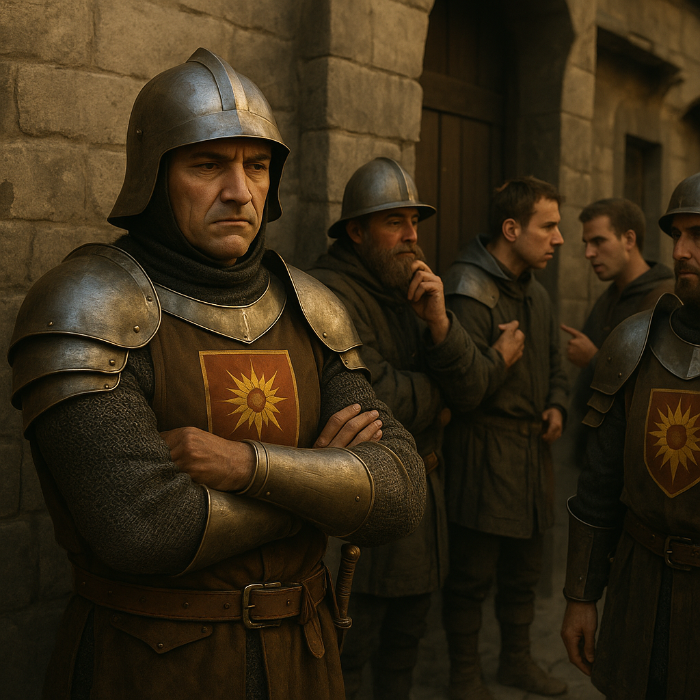 {class="framed-image"}

_humans, rank-and-file city guards under Hurgkhan_ {align="center"}

::: column-reset

## Roleplaying

- Discipline and hierarchy first; a bit plodding, follow orders to the letter.
- They keep order, but coordination varies by shift and who’s in charge.
- Polite but curt; open up with trust—or a drink.

**Attitude:** Indifferent; **Friendly** when the party cooperates; **Hostile** if the party breaks the peace or looks
suspicious.

::: column

## Information

- **Disappearances.** Most shrug it off as people “just traveling for business.” The one who’s truly worried is
  **Günter**.
- **About Günter.** _“Odd lately: polished his armor like it was parade day. On edge for days—like he’s bracing for
  something.”_
- **About Maria.** Seen on the market until about **6:00 pm** yesterday. She did not leave town.
- **About Rosa.** Often leaves town for several days; returned at sunset yesterday.
- **About Hurgkhan.** They respect the captain: _“Doesn’t let chaos raise its head; our real chief—and he works from the
  garrison, not the old hall.”_ Some gripe that he demands a lot; others are proud to serve under him.
- **Nights.** It’s gotten suspiciously quiet after dark. Over the last month or so there are fewer drunken
  revelers—seems not only people avoid the streets after dusk, but animals too.
- **Helmut’s complaint.** Helmut reported trouble with his rat farm; the guard found nothing. _(You can also place this
  as a written report on Hurgkhan’s desk in the [Garrison](#гарнизон).)_

::: page {type="class" layout="rtl" icon="./assets/symbols/city.svg"}

# City Folk

A motley crowd—craftspeople, vendors, fishers, children, drunks. Some fear what’s happening; others wave it off as
“another tall tale.” In most eyes you see weariness and a habit of living with a background hum of worry.

## Locations

- [Docks](#the-dock) — fishers.
- [Market Square](#market-square) — vendors, beggars, children.
- Steps of the [Temple of Light](#temple-of-light) — beggars.
- City streets — children, beggars, random onlookers.

::: column

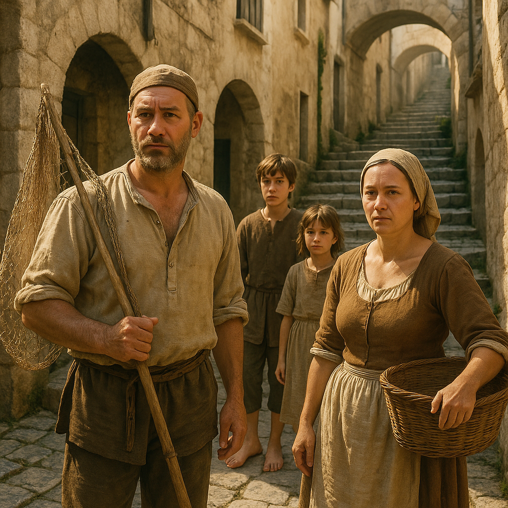 {class="framed-image"}

_background NPCs reflecting the town’s atmosphere_ {align="center"}

::: column-reset

## Roleplaying

- Vendors chat readily but won’t cross any lines.
- Fishers are laconic and wary of outsiders.
- Drunks are loud and abrasive but may know what they shouldn’t.
- Children notice odd things first, but rarely grasp their meaning.

**Attitude:** Indifferent.

::: column

## Information

They can share rumors from **[Appendix: Rumors](#appendix-rumors)**.

**Vendors:**

- Maria was at the market yesterday, then headed home.
- Noticed Maria avoiding Rosa. They’re uneasy around Rosa too.

**Fishers:**

- _“Saw someone in a hood walking the pier at night. Then a splash, and that was it.”_
- _“The dog howled that night. He doesn’t howl for storms.”_

**Drunks:**

- Claims to hear voices demanding “food.”
- Gripes that Bertram and Oswald (_the man in the Temple cellar_) are gone—_“no one left to drink with.”_

**Children:**

- Used to play in the Abandoned District, but now it’s “really scary.”
- Saw a young woman walking toward the Abandoned District at sunset, looking over her shoulder. It struck them as odd—no
  one goes there now, not even they do.

::: page

# Missing Persons

## Maria

A woman around 30, slender, with chestnut hair braided back and brown eyes. She often accents her clothes with small
silver beads. Wears a silver moon-shaped pendant.

**Last seen:** 13 Lothviel, ~6:00 pm

::: column

<!-- prettier-ignore -->
 {class="framed-image" style="height:220px; margin-bottom: 5mm"}

::: column-reset

## Abraham

A tall, gaunt older man with sharp features and deep-set dark eyes. His gray hair is always a bit unkempt, as if he
doesn’t care much about appearances.

**Last seen:** 2 Bethalasse, asking about the merchants.

::: column

<!-- prettier-ignore -->
 {class="framed-image" style="height:220px; margin-bottom: 5mm"}

::: column-reset

## Peter and Boshir

A stocky man, 35–40: short dark hair, thinning at the crown; stubble; roundish features.

A lean man, 35–40, downcast gaze; a “ring” beard around the mouth.

**Last seen:** 1 Bethalasse, at the tavern.

::: column

<!-- prettier-ignore -->
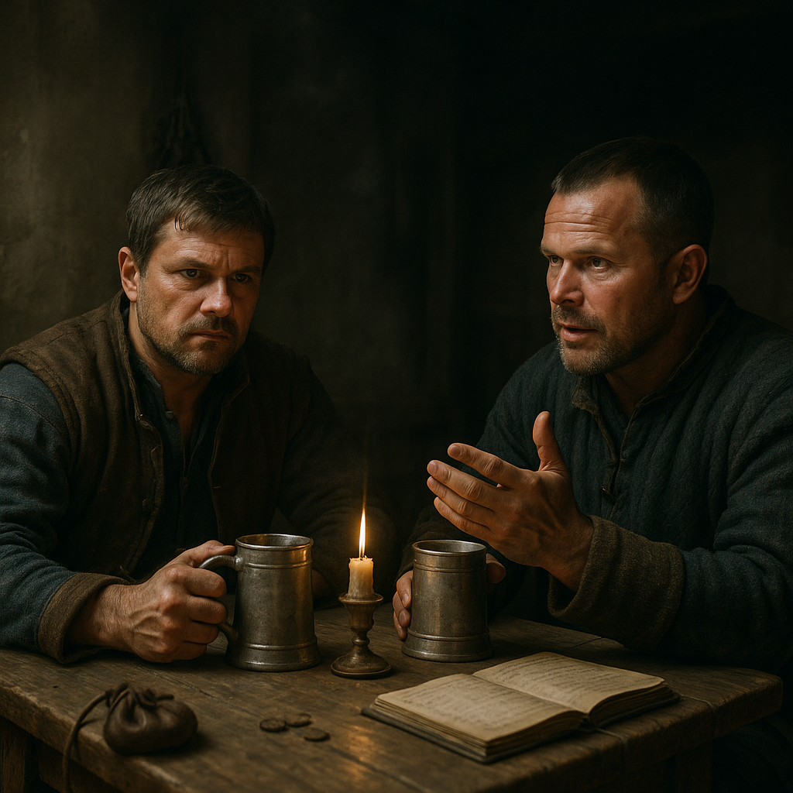 {class="framed-image" style="height:220px; margin-bottom:5mm"}

::: column-reset

## Bertram

A middle-aged man with a narrow face, short stubble, and a mustache.

**Last seen:** 2 Lothviel, in town.

::: column

<!-- prettier-ignore -->
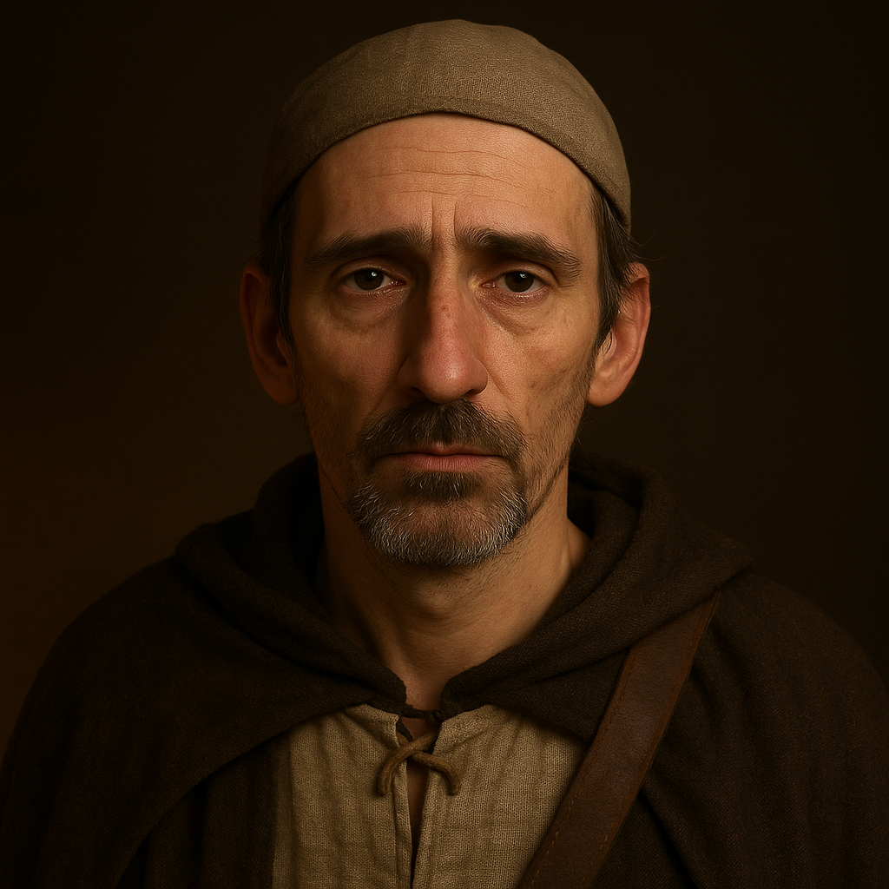 {class="framed-image" style="height:220px"}

::: page {layout="wide" chapter="Appendix | Rumors"}

# Appendix: Rumors

#### True Rumors

| d8  | Rumor                                                                                                                  |
| :-: | :--------------------------------------------------------------------------------------------------------------------- |
|  1  | Folks argue that someone smashed a window at Jonas’s grandfather’s house; no one’s sure who’s living there.            |
|  2  | People say Maria was secretly meeting one of the guards at night.                                                      |
|  3  | Whispers that Maria stopped going to the Temple and had a loud quarrel with Selina—“that’s where the trouble started.” |
|  4  | Rosa was seen returning to town at sunset: “she gives me the creeps—wish she hadn’t come back.”                        |
|  5  | Maria was on the square yesterday evening; she looked worried.                                                         |
|  6  | A dog snapped its chain at night and bolted into the dark—never returned.                                              |
|  7  | An old man swears he heard footsteps at night—not the guard, more like claws on cobblestone.                           |
|  8  | Matthias looks grim—his drinking buddies have gone missing.                                                            |

#### Shady Rumors

| d10 | Rumor                                                                                                                          |
| --: | :----------------------------------------------------------------------------------------------------------------------------- |
|   1 | People whisper Rosa is an Inquisitor… though her cloak’s ordinary, “not black.”                                                |
|   2 | Hurgkhan’s angry the Empire won’t send soldiers—some say they fear he’d keep order better than the dukes.                      |
|   3 | Gossip says German’s a warlock: hides books, won’t let people in, mutters to himself.                                          |
|   4 | Passing around that Moander’s books shouldn’t have gone to the library: “he had a license, but he was still a mage.”           |
|   5 | Claims that Karthal hasn’t filed reports to the capital for two months.                                                        |
|   6 | Whisper that someone’s kept in the Temple basement; some say “a drunk,” but no one really saw.                                 |
|   7 | Word is Karthal’s council ignores the governor and “free city” is said more often—magi or those forest folk must be behind it. |
|   8 | A tale about scales “as big as a door” up in the hills: some say dragon, others a magically hidden armadillo.                  |
|   9 | Scare stories about northern elves: “they eat anyone entering their woods,” and their language is “just clicks and smells.”    |
|  10 | They say on the old cemetery the dead “pick out their own coffins,” and the Temple knows but keeps quiet.                      |

::: page {type="inside-cover" chapter="Appendix | Items"}

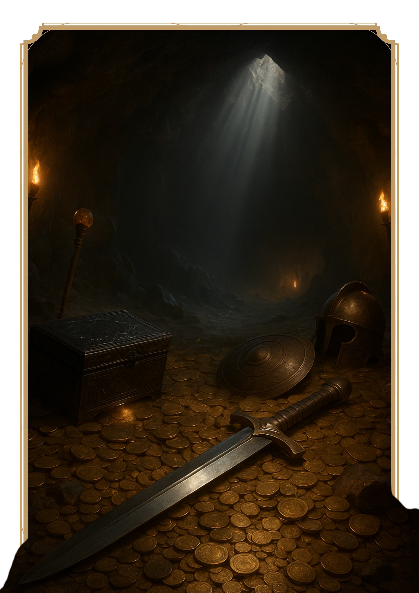 {class="cover"}

# Items

::: subtitle

Magic and Quest Items

:::

::: page {layout="wide"}

# Appendix: Items

Links in the tables lead to full item cards with descriptions, checks, and information.

#### Quest Items

| Name                                      | Location                                                                               | Description                                                                                 |
| :---------------------------------------- | :------------------------------------------------------------------------------------- | :------------------------------------------------------------------------------------------ |
| [Ashes Urn](#ashes-urn)                   | With one of the characters at the start of the adventure                               | A sentimental item                                                                          |
| [Garrison Permit](#garrison-permit)       | With [Hurgkhan](#hurgkhan) near [Maria’s House](#marias-house) / [Garrison](#garrison) | Grants guard goodwill                                                                       |
| [Maria’s Diary](#marias-diary)            | [Maria’s House](#marias-house)                                                         | Mentions Karra, an evening meeting, and a mysterious order                                  |
| [Merchants’ Clothes](#merchants-clothes)  | [Tavern Cellar](#tavern-cellar) / with [Kenki](#kenki)                                 | Fake papers and cover clothing                                                              |
| [Abraham’s Diary](#abrahams-diary)        | [Cellar of Abraham’s House](#abrahams-cellar)                                          | Ties to Meduza, venom experiments, link to the mysterious order, code for the catacomb door |
| [Strange Item (“Plun’gr”)](#strange-item) | [Cellar of Abraham’s House](#abrahams-cellar)                                          | Opens the passage to the catacombs                                                          |
| [Smugglers’ Cache](#smugglers-cache)      | [Smugglers’ Cove](#smugglers-cove)                                                     | Adventure reward and the casket Gaston is looking for                                       |

#### Magic Items

| Name                                        | Location                                                                                          | Description         |
| :------------------------------------------ | :------------------------------------------------------------------------------------------------ | :------------------ |
| [Magic Lamp](#magic-lamp)                   | [Catacombs (passage from Abraham’s House)](#passage-from-abrahams-house) / with [Gaston](#gaston) | Wondrous item, rare |
| [Abraham’s Amulet](#abrahams-amulet-broken) | [Catacombs (passage from Abraham’s House)](#passage-from-abrahams-house)                          | Wondrous item, rare |

::: page

::: panel {style="height:20%"}

:::: title

# Ashes Urn

_Quest Item_

::::

 {class="cover"}

:::: credit

<!-- prettier-ignore -->
Online version on [D&D Beyond](https://www.dndbeyond.com/magic-items/9986926-ashes-urn)

::::

:::

## Description

> A small, modest ceramic urn about 6 inches tall, sealed with wax and tied with a faded linen ribbon. It has no magical
> properties, but it carries deep sentimental value—especially to those who knew Jared.
>
> The lid bears an engraving: “May his light guide us still.”

::: column

## Locations

- In the possession of one of the characters at the start of the adventure.

::: panel {style="height:20%"}

:::: title

# Garrison Permit

_Quest Item_

::::

 {class="cover"}

:::: credit

<!-- prettier-ignore -->
Online version on [D&D Beyond](https://www.dndbeyond.com/magic-items/10160053-garrison-permit-of-san-soprigal)

::::

:::

## Description

> Sturdy paper worn by use and smudged with fingerprints. The text is issued in the name of the San Soprigal garrison.
> At the bottom is a red wax seal with the Empire’s emblem and the personal mark of **Hurgkhan**. The document looks
> plain, but it carries real weight in town.

## Locations

- With [Hurgkhan](#hurgkhan) near [Maria’s House](#marias-house).
- In Hurgkhan’s desk at the [Garrison](#garrison).

::: column

## Information

**Game Effect:**

- The town guard is **friendly**, willing to escort you and answer basic questions.
- Openly carrying weapons in town is permitted, and using them for self-defense is allowed.
- You may detain a suspect. Resistance is uncommon.
- The permit does **not** grant the right to search without a guard present as a witness.
- The permit does **not** grant the right to leave town.

**Without the permit:**

- NPCs more often respond, _“Did you clear that with Hurgkhan?”_ and disengage from the conversation.

::: page

::: panel {style="height:40%"}

:::: title

# Maria’s Diary

_Quest Item_

::::

 {class="cover"}

:::: credit

<!-- prettier-ignore -->
Online version on [D&D Beyond](https://www.dndbeyond.com/magic-items/10160022-mariias-diary)

::::

:::

## Description

> A small leather-bound book with worn edges. Its pages are filled in a neat hand, though the ink has slightly faded.
> Pressed between leaves are several dried flowers.

## Locations

- In [Maria’s House](#marias-house), hidden in a drawer beneath the bed.

## Information

Maria keeps the diary irregularly: reflections on life, the town, and people; occasional notes about goods and
deliveries.

The name **[Karra](#karra)** appears often in the “life” entries—context suggests a close friend.

::: column

Fragments from the last month:

> “I thought our meetings meant something, but now I’m not sure. He’s good, but naive. We need to end this.”

> “I have to tell him, but I’m afraid how he’ll react, especially after what happened…”

The final entry was written **yesterday**, apparently in haste:

> “Meeting tonight. I’ll settle it. If he won’t understand—so be it.”

**If extra time is spent studying:**

You can spot mentions of an unusual order paid in advance: rare ingredients and a discreet method of delivery. No name
is given; in the margin, the letter “A” was written once and immediately crossed out. The entry is dated to
[mid-Narvail](#appendix-month-names).

::: page

::: panel {style="height:40%"}

:::: title

# Merchants’ Clothes

_Quest Item_

::::

 {class="cover"}

:::: credit

<!-- prettier-ignore -->
Online version on [D&D Beyond](https://www.dndbeyond.com/magic-items/10160115-merchants-clothes)

::::

:::

## Description

> A bag neatly packed with clothing. Inside are the travel garb traders commonly wear: a pair of good hooded cloaks,
> sturdy shirts, roughspun trousers, and light leather gloves.
>
> Everything looks relatively new—the fabric holds its shape, and the seams show little wear.

## Locations

- In the [tavern cellar](#tavern-cellar), in one of the crates.
- May be brought by [Kenki](#kenki).

::: column

## Information

**On inspection:**

- A trade license signed by the “Guild Council of Ventorn.”
- A goods ledger.

**On study:**

- The trade license is valuable in its own right and grants the holder the right to trade with minimal duties and
  inspections; losing it is a serious matter for any merchant.
- `@Investigation 10` The clothes are barely worn and smell of salt, not road dust. One cloak carries a distinct briny
  damp, like garments stored long in a ship’s hold or on a dock. Everything feels “too new,” as if used only a couple of
  times specifically for this trip.
- `@History 15` The trade license signed by the “Guild Council of Ventorn” is a forgery—no such city exists.
- `@Deception 12` The goods ledger is a plant. All entries were written by the same hand while imitating different
  styles.

::: page

::: panel {style="height:40%"}

:::: title

# Abraham’s Diary

_Quest Item_

::::

 {class="cover"}

:::: credit

<!-- prettier-ignore -->
Online version on [D&D Beyond](https://www.dndbeyond.com/magic-items/10163775-abrahams-diary)

::::

:::

## Description

> An old leather-bound book, scuffed and ink-stained. The pages are filled with dense notes that mix academic prose with
> personal asides. In places the ink is smeared, as if written in a fever.

## Locations

- In the [cellar of Abraham’s house](#abrahams-cellar), on the worktable.

## Information

> _5 Narvail, 567 AF._ “...it isn’t easy to start over in this far-off land. Thankfully, there is none of the fanaticism
> found in other parts of the Empire. A mage’s arrival won’t raise eyebrows. Perhaps here I will finally find the peace
> I need for my research.”

**Last entry in the diary:**

> _2 Bethalasse, 567 AF._ “The ship will arrive at sunset. At last I’ll be reunited with my children. My heart broke
> when I had to leave them behind. Good thing I have friends in Meduza. I hope they are careful.”

::: column

**Further gleaned from the diary:**

- `@Arcana 10` A significant portion of the notes is devoted to necromancy. The phrase “a second life without pain”
  recurs—no formal explanation, but a clear obsession.
- `@Nature 15` Amid the magical terminology are formulas and remarks on venoms. The author is an experienced practical
  alchemist working with poisons and antidotes.
- `@Investigation 15` A sketch of a [strange object](#strange-item); in the margin, a cipher blotted with ink. Beneath
  the drawing: _“This is where it begins. Meduza vouched for it.”_

**If extra time is spent studying:**

Starting from mid-[Narvail](#appendix-month-names), the entries shift toward alchemy: Abraham attempts to substitute
familiar reagents with herbs from the local flora, logging possible equivalents and catalysts.

Ruminations on immortality are constant: _“Life is a chain of rot. Shed the flesh—and you are free of time.”_ He isn’t
seeking “eternal life” in the usual sense; he intends to let the body die while preserving will and mind. The line
_“What is dead may never die”_ is circled several times.

::: page

::: panel {style="height:40%"}

:::: title

# Strange Item

_Quest Item_

::::

 {class="cover"}

:::: credit

<!-- prettier-ignore -->
Online version on [D&D Beyond](https://www.dndbeyond.com/magic-items/10163791-strange-item)

::::

:::

## Description

> A curious device: a wooden rod tipped with a broad, rounded “cap.” At first glance it looks like a small pot, but the
> material is unusual—black, dense, and slightly flexible. Pressing it makes the surface spring back to shape, as if
> made from something both living and not.

## Locations

- In the [cellar of Abraham’s house](#abrahams-cellar).

::: column

## Information

**On study:**

- `@Investigation 10` + [Abraham’s Diary](#abrahams-diary) — the item is named **“Plun’gr”**. A sketch appears in the
  diary; a margin cipher is blotted with ink. Caption beneath the drawing: _“This is where it begins. Meduza vouched for
  it.”_
- `@Investigation 15` The cap’s material is meant to seal tightly against a smooth surface and generate pull when
  compressed.
- `@History 15` A faint mark on the rim shows a crossed wrench and hammer—the work of gnomish artificers of
  [Kaltenwald](#appendix-states-and-organizations). The piece is rare and expensive.

**Usage:**

A trigger for the secret mechanism of the hidden passage in the [cellar of Abraham’s house](#abrahams-cellar): press it
firmly to the round port and push **three times**—Plun’gr draws out a concealed handle-bar.

::: page

::: panel {style="height:40%"}

:::: title

# Smugglers’ Cache

_Quest items in the smugglers’ cove_

::::

 {class="cover"}

:::

## Trophies

- A barrel of **glowing dust**. `@Arcana 14`—a shimmering powder that begins to glow for several minutes on contact with
  air. Used in rituals or as temporary illumination.
- **Moonsilver**—2 ingots. `@Nature 10`—a valuable metal often used in enchantment.
- Five sets of **cloaks** bearing the Imperial Sun.

::: box

**For DM.** These are items the party can find in the smugglers’ cove. Feel free to expand the list—the cache is a final
reward and can include any fitting loot.

:::

## Imperial Documents

A document sealed with the Imperial coat of arms.

> “License for Free Magical Practice within the Holy Empire.”
>
> Holder: “Magister Arcan Abraham, by right of apprenticeship, is permitted to perform magic, including for research,
> medical, and protective purposes.”

`@Investigation 10`—the papers are forged.

::: column

## The Black Casket

> A heavy palm-sized casket of dark, nearly black wood polished to a matte sheen. The corners are braced with metal
> fittings etched with fine lines. The lid bears a stamp resembling a medusa.

**On study:**

- The body material blocks magical auras.
- `@Investigation 10`—the centerpiece is a complex lock with a rotating mechanism and a thin slot for a nonstandard key.
  The mechanism is old but serviceable; opening it requires understanding its logic.
- `@History 15`—the symbol on the lid is recognized as the sign of the smugglers of
  [Black Meduza](#appendix-states-and-organizations).

**Opening (intentionally difficult):**

- Magical means do not work.
- Requires **Thieves’ Tools** and a `@Sleight-of-Hand 30` check. On a failure, the lock “snaps back,” increasing the DC
  of the next attempt by **+2**.

_The casket’s contents are a plug for the future: you can place any legendary artifact inside if you decide to spin the
campaign forward._

::: page

::: panel {style="height:40%"}

:::: title

# Magic Lamp

_Wondrous Item, Rare_

::::

 {class="cover"}

:::: credit

<!-- prettier-ignore -->
Online version on [D&D Beyond](https://www.dndbeyond.com/magic-items/10163825-magic-lamp)

::::

:::

## Description

> An old brass lamp with an oval glass dome. Inside is no flame, but a cold bluish light that flickers without warmth.
> The lamp has no switch and no wick—yet it burns.

If you draw near:

> The light seems to wake: it shifts and pulses as if reacting to your presence.

## Locations

- In the catacombs, along the passage from [Abraham’s house](#abrahams-house).
- If the characters travel this way **after** **[Gaston](#gaston)**, he has the lamp.

## Properties

- **Dim Light 10 ft.** The lamp constantly sheds dim light in a 10-foot radius.
- **Cannot Be Extinguished.** It can’t be blown out, covered, shaded, or otherwise extinguished by nonmagical or magical
  means (_darkness_ doesn’t suppress its glow).
- **Durability.** AC 30, HP 10; resistance to nonmagical bludgeoning, piercing, and slashing; immunity to fire and
  poison. At 0 HP the lamp shatters, the fey dies, and the light goes out.

::: column

## Information

On study:

> The lamp is clearly magical. If you stare at the “flame” for long enough, it changes shape. At times faint outlines
> surface—wings, outstretched arms, a slender silhouette. The moment you focus, they vanish, as if hiding from your
> gaze.

`@Arcana 12` / `@Investigation 15` (the players realize it’s an illusion):

> Behind the dim glass appears a tiny figure—a glowing creature with fine wings and sharp features. It hovers with arms
> crossed, looking displeased.

## The Fey

About two years ago, a small rift pulled the fey into this world. Later, an unknown mage **caught and sealed** her
inside the lamp with a binding spell. Abraham stole the lamp and promised to free her, but he was attacked a little over
a month ago, and she hasn’t seen him since. Now she waits for that mage to die so the spell will end.

**Traits & Demeanor.** Not evil, but caustic and tired of being treated like an object. Can “pretend to be light” and
refuse to respond if addressed rudely.

**Attitude**. Neutral.

::: page

::: panel {style="height:30%"}

:::: title

# Abraham’s Amulet (Broken)

_Wondrous Item, Rare_

::::

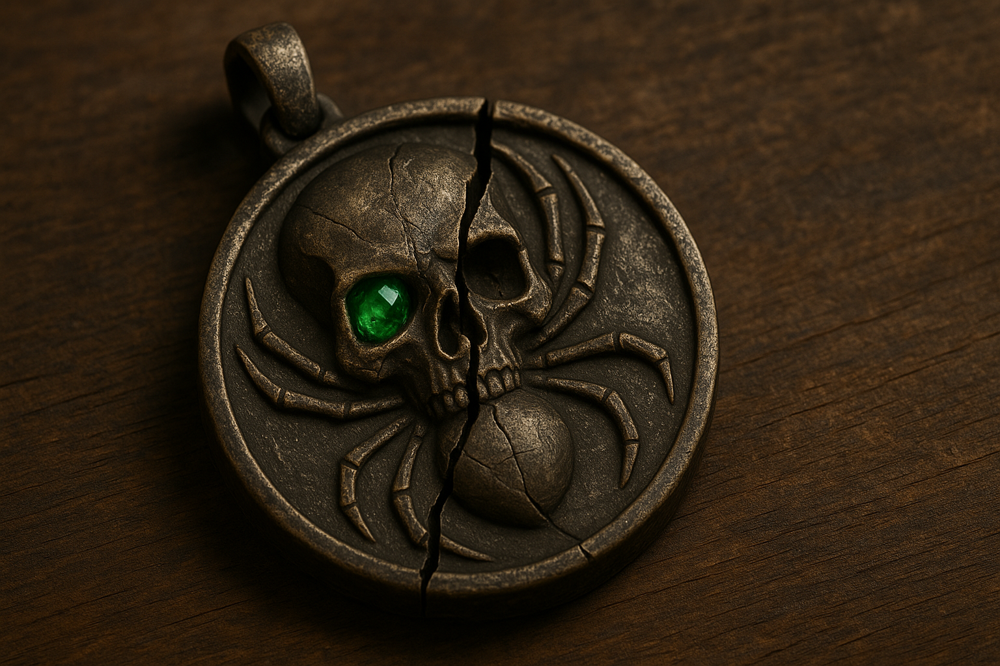 {class="cover"}

:::: credit

<!-- prettier-ignore -->
Online version on [D&D Beyond](https://www.dndbeyond.com/magic-items/10232719-abrahams-amulet-broken)

::::

:::

## Description

> A tarnished amulet of dark metal. The face bears an engraving of a skull with a spider crawling into its jaw. A long
> crack runs across the amulet, and one of the magic stones once set as the “eyes” is missing.

## Locations

- In the catacombs, on Abraham’s body, along the passage from [Abraham’s house](#проход-из-дома-абрахама).

## Information

- **Repair.** Mundane means (magic or smithing) can restore its structure, but its magic does not return.
- `@Arcana 10` The amulet radiates a faint necromancy aura, but the currents are unstable—its magical lattice is
  damaged. If the amulet is restored and a sacrifice is made, its magic can return.
- `@History 18` or `@Arcana 18` Such amulets are worn by a [necromancers’ cult](#приложение-государства-и-организации)
  in one of the magical states as a badge of belonging. They are said to study how to attain eternal life without
  becoming undead. The amulet also appears to let a body survive internal damage caused by a ritual.

**Restoring the Magic.** A rare component plus a 1-hour ritual/sacrifice (at the DM’s discretion) awakens the amulet and
unlocks the magic properties.

::: column

## Properties

- **Requires attunement** by a creature proficient in Arcana.
- **Order’s Sign.** Anyone familiar with the cult recognizes the amulet at a glance. This can draw either loyalty or
  hostility.
- **Unnatural Grit (1/long rest).**  
  When you are reduced to 0 hit points but not killed outright, you instead remain standing with 1 hit point. Your
  pupils blacken, your veins darken, and a webbed pattern crawls across your skin. **Note:** if you have a trait/effect
  such as _Relentless Endurance_ or a similar feature, only one such effect triggers—your choice.
- **Negative Stabilization.**  
  When you drop to 0 hit points but aren’t killed outright, you immediately become stable and fall unconscious. At that
  moment the amulet releases a pulse of necrotic energy: each creature within 10 feet must make a Constitution saving
  throw **DC = 8 + your proficiency bonus + your Constitution modifier**, taking **1d4 necrotic damage** on a failure
  (half as much on a success). This triggers every time you drop to 0.

::: image-credit {style="right: 70px; height: 230px;"}

<!-- prettier-ignore -->
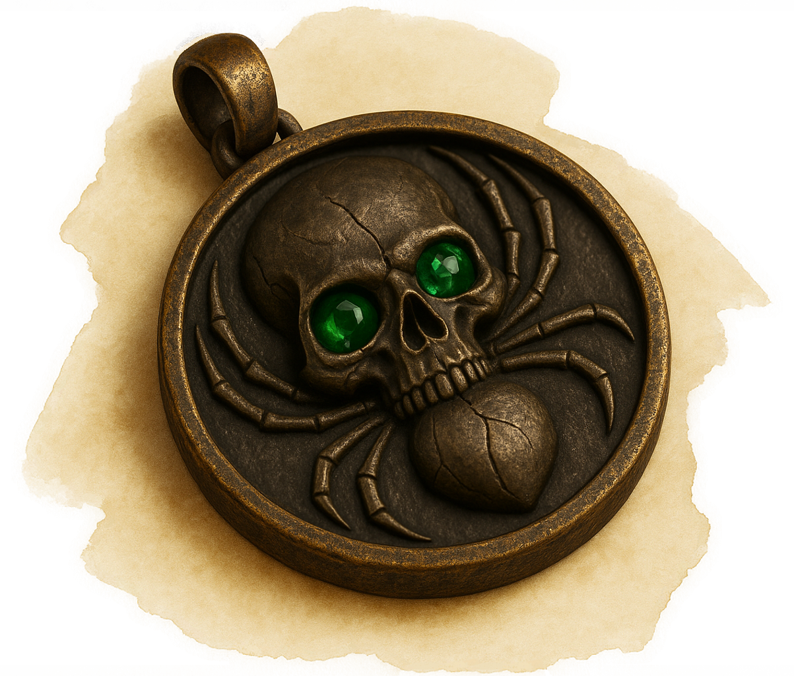 {class="image"}

<!-- prettier-ignore -->
Online version on [D&D Beyond](https://www.dndbeyond.com/magic-items/10232700-abrahams-amulet) {class="credit"}

:::

::: page {type="inside-cover"}

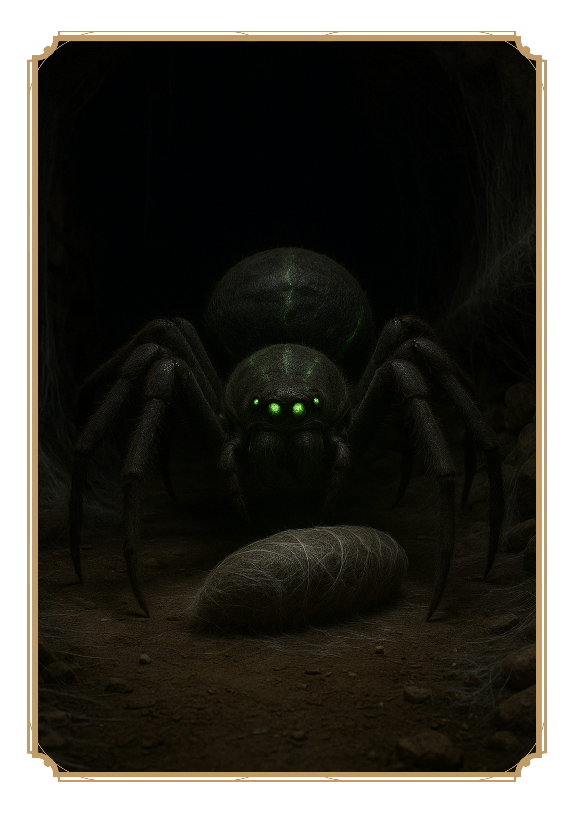 {class="cover"}

# Monsters

::: subtitle

Creature Stat Blocks

:::

::: page {layout="wide" chapter="Appendix | Monsters"}

# Appendix: Monsters

::: stat-block {layout="wide" style="margin-top:4mm !important;"}

## Tiny Spider

<!-- prettier-ignore -->
name="Spider" size="Tiny" type="Beast" alignment="Unaligned"
ac="12" hp="1 (1к4 - 1)" speed="20 ft., climb 20 ft." initiative="12" pb="2" cr="0"
skills="Stealth +4" senses="Darkvision 30 ft."
languages="--"

:::: abilityscores str=2 dex=14 con=8 int=1 wis=10 cha=2 ::::

:::: traits

**_Spider Climb._** The spider can climb difficult surfaces, including along ceilings, without needing to make an
ability check.

**_Web Walker._** The spider ignores movement restrictions caused by webs, and the spider knows the location of any
other creature in contact with the same web.

::::

:::: actions

**_Bite._** _Melee Attack Roll_: +4, reach 5 ft. _Hit:_ 1 Piercing damage plus 2 (1d4) Poison damage.

::::

:::

<!-- prettier-ignore -->
_Standard [Spider](https://www.dndbeyond.com/monsters/4775844-spider)_ {style="text-align:right;margin:0;font-size:.9em"}

::: stat-block {layout="wide" style="margin-top:5mm;"}

## Swarm of Spiders

<!-- prettier-ignore -->
size="Medium" type="swarm of Tiny beasts" alignment="Unaligned"
ac="12" hp="11 (2d8 + 2)" speed="20 ft., Climb 20 ft." initiative="11" pb="2" cr="1/2"
skills="Stealth +2" senses="Darkvision 30 ft."
resistances="Poison" vulnerabilities="Fire" immunities="Poisoned"
languages="--"

:::: abilityscores str=3 dex=13 con=14 int=1 wis=7 cha=1 ::::

:::: traits

**_Spider Climb._** The spider can climb difficult surfaces, including along ceilings, without needing to make an
ability check.

**_Web Walker._** The spider ignores movement restrictions caused by webs.

**_Swarm._** The swarm can occupy another creature’s space and vice versa, and the swarm can move through any opening
large enough for a Tiny insect. The swarm can’t regain Hit Points or gain Temporary Hit Points.

::::

:::: actions

**_Bites._** _Melee Attack Roll:_ +3, reach 5 ft. _Hit:_ 6 (2d4 + 1) Poison damage, or 3 (1d4 + 1) Poison damage if the
swarm is Bloodied.

::::

:::

<!-- prettier-ignore -->
_Modified from the [Swarm of Insects](https://www.dndbeyond.com/monsters/5195224-swarm-of-insects)_ {style="text-align:right;margin:0;font-size:.9em"}

::: page {chapter="Appendix | Monsters"}

# Spellwarp Spider

Spellwarp Spiders are cavern-dwelling predators twisted by years of exposure to discarded magical runoff. Their nests
cluster in the coastal fissures and caves of the Southern continent, where mages once dumped alchemical effluents and
unstable arcane objects.

Feeding on these substances, the spiders developed a knack for warping magic. They aren’t truly sapient, but their
behavior is more purposeful. They often lair near ancient artifacts, and their venom causes a painful unraveling of a
creature’s arcane structure.

::: column

<!-- prettier-ignore -->
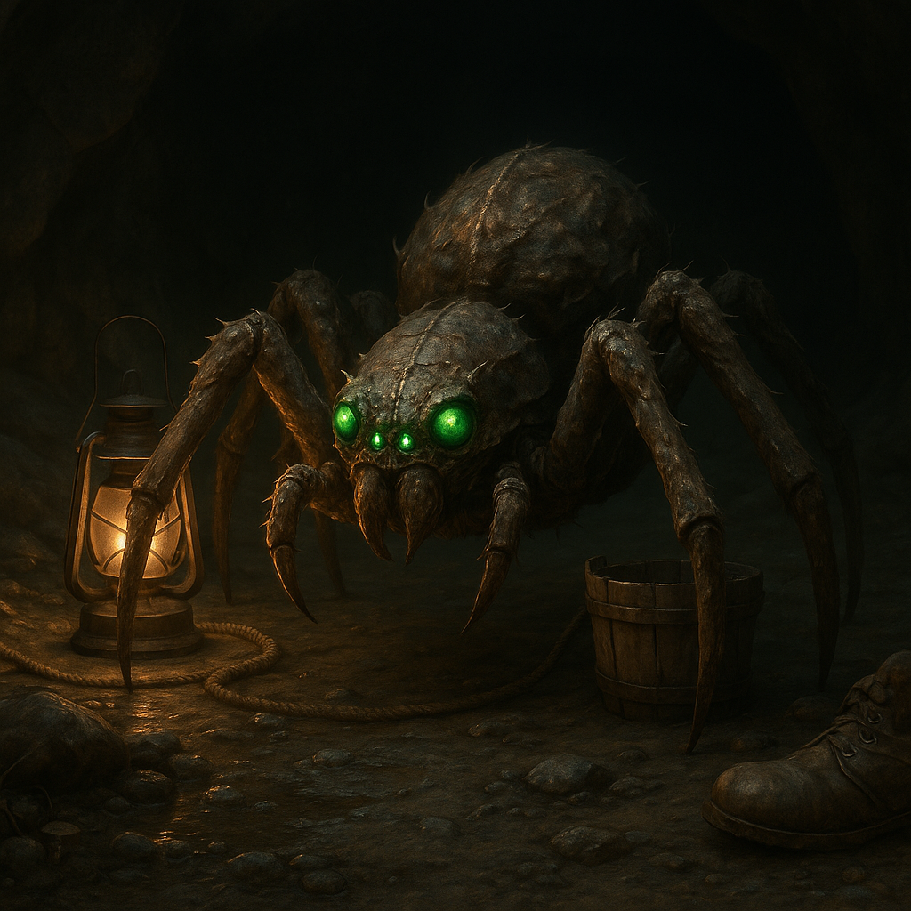{style="height:280px;width:100%;object-fit:cover;border-radius:2mm"} {align="right"}

<!-- prettier-ignore -->
Online version on [D&D Beyond](https://www.dndbeyond.com/monsters/5421517-spellwarp-spider) {class="credit" align="right"}

::: column-reset

::: stat-block {layout="wide" style="margin-top:5mm;"}

<!-- prettier-ignore -->
name="Spellwarp Spider" size="Medium" type="Beast" alignment="Unaligned"
ac="13" hp="16 (3d8 + 2)" speed="30 ft., climb 30 ft." initiative="13" pb=2 cr="1/2"
perceptionBonus="3" skills="Stealth +7" senses="Darkvision 60 ft., Blindsight 10 ft."
resistances="Poison" vulnerabilities="Fire" immunities="Poisoned" languages="—"

:::: abilityscores str=12 dex=16 con=11 int=4 wis=12 cha=3 ::::

:::: traits

**_Spider Climb._** The spider can climb difficult surfaces, including along ceilings, without needing to make an
ability check.

**_Web Walker._** The spider ignores movement restrictions caused by webs, and it knows the location of any other
creature in contact with the same web.

**_Spellwarp Aura._** Whenever a spell is cast within 10 feet of the spider or targets it, roll a 1d8. On a 1, the
spell’s effect is redirected to a random valid target within range.

::::

:::: actions

**_Bite._** _Melee Attack Roll:_ +4, reach 5 ft. _Hit:_ 4 (1d6 + 1) piercing damage plus 3 (1d4) poison damage.

**_Web (Recharge 5–6)._** _Dexterity Saving Throw:_ DC 13, one creature the spider can see within 60 ft. _Failure:_ The
target has the Restrained condition until the web is destroyed (AC 10; 5 hit points; vulnerability to fire damage;
immunity to poison and psychic damage). A restrained creature can use its action to make a DC 12 Strength check,
bursting the web on a success.

::::

:::

::: wide

<!-- prettier-ignore -->
_Modified from the [Giant Wolf Spider](https://www.dndbeyond.com/monsters/5195033-giant-wolf-spider)_ {style="text-align:right;margin:0;font-size:.9em"}

:::

::: page {chapter="Appendix | Monsters"}

# Spellwarp Spider Matriarch

The Matriarch is a rare, colossal form of the Spellwarp Spider, endowed with primitive intelligence and a will of its
own. Born of generations of mutation and the consumption of volatile arcane refuse, she does more than survive—she
rules. Her awareness can brush against thoughts, sense the tremor of magic, and press into the minds of the weak.

The Matriarch binds every spider in her reach through a primal telepathy. They don’t understand her dominion, yet obey
without question: weaving, hunting, bearing offerings. She rarely moves herself—her lair becomes her body, its strands
an extension of her will.

::: column

<!-- prettier-ignore -->
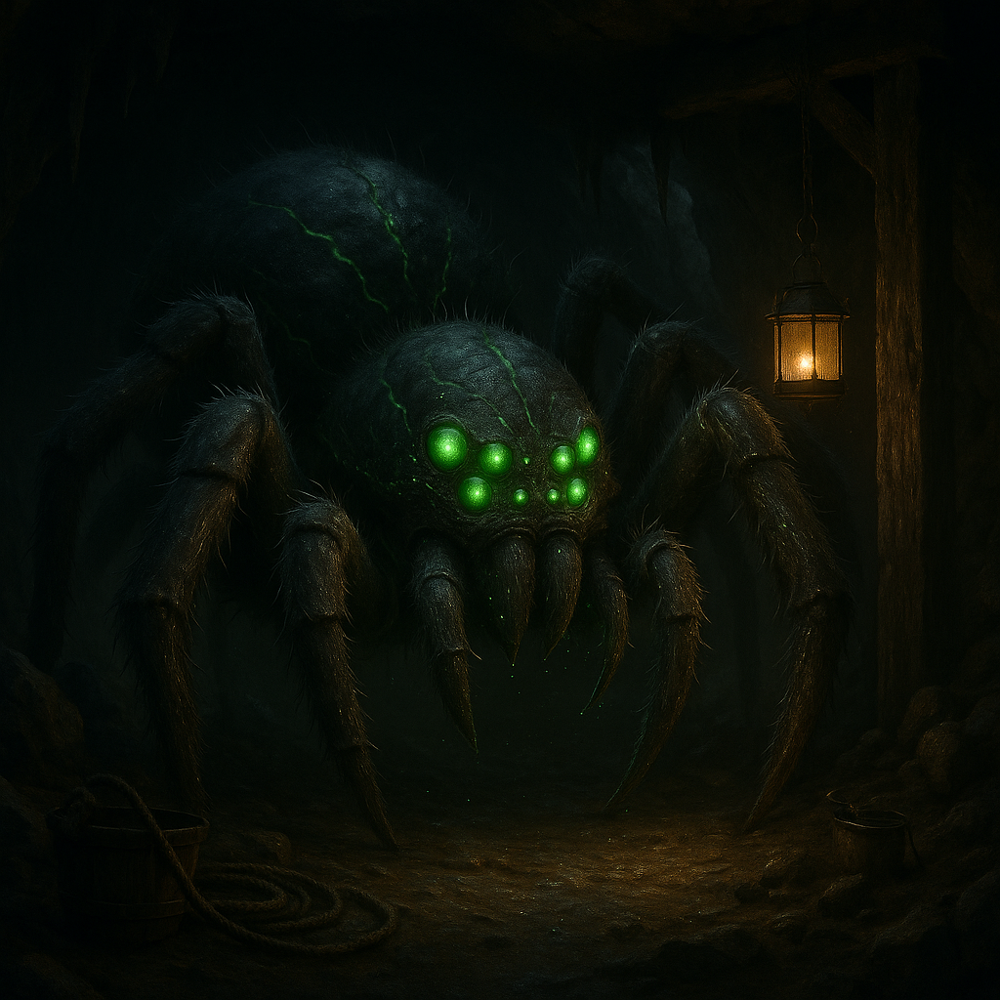{style="height:280px;width:100%;object-fit:cover;border-radius:2mm"} {align="right"}

<!-- prettier-ignore -->
Online version on [D&D Beyond](https://www.dndbeyond.com/monsters/5421537-spellwarp-spider-matriarch) {class="credit" align="right"}

::: column-reset

::: stat-block {layout="wide" style="margin-top:5mm;"}

<!-- prettier-ignore -->
name="Spellwarp Spider Matriarch" size="Large" type="Beast" alignment="Unaligned"
ac="14" hp="26 (4d10 + 4)" speed="40 ft., climb 40 ft." initiative="13" pb=2 cr="1"
perceptionBonus="4" skills="Stealth +7" senses="Darkvision 60 ft., Blindsight 10 ft."
resistances="Poison, Psychic, Damage from Spells" vulnerabilities="Fire" immunities="Poisoned, Charmed" languages="Telepathy"

:::: abilityscores str=14 dex=16 con=14 int=8 wis=12 cha=3 ::::

:::: traits

**_Spider Climb._** The spider can climb difficult surfaces, including along ceilings, without needing to make an
ability check.

**_Web Walker._** The spider ignores movement restrictions caused by webs, and it knows the location of any other
creature in contact with the same web.

**_Spellwarp Aura._** Whenever a spell is cast within 30 feet of the spider or targets it, roll a 1d6. On a **1**, the
spell’s effect is redirected to a random valid target within range.

::::

:::: actions

**_Multiattack._** The matriarch makes one **Claw** attack and one of the following: **Bite** or **Web**.

**_Claw._** _Melee Attack Roll:_ +5, reach 5 ft. _Hit:_ 9 (1d10 + 3) bludgeoning damage.

**_Bite._** _Melee Attack Roll:_ +5, reach 5 ft. _Hit:_ 6 (1d6 + 2) piercing damage plus 3 (1d4) poison damage.

**_Web (Recharge 4–6)._** _Dexterity Saving Throw:_ DC 13, one creature the spider can see within 60 ft. _Failure:_ The
target has the Restrained condition until the web is destroyed (AC 10; 5 hit points; vulnerability to fire damage;
immunity to poison and psychic damage). A restrained creature can use its action to make a DC 12 Strength check,
bursting the web on a success.

::::

:::

::: wide

<!-- prettier-ignore -->
_Modified from the [Giant Spider](https://www.dndbeyond.com/monsters/4775821-giant-spider)_ {style="text-align:right;margin:0;font-size:.9em"}

:::

::: page {chapter="Appendix | Monsters"}

# Imperial Guard

Imperial Guards form a civil security force reporting to the dukes, responsible for maintaining order in the cities and
surrounding lands.

They aren’t heroes, saints, or paragons of honor. They’re the people at the crossroads pretending to jot notes in a
battered ledger—quietly hoping today won’t require chasing anyone down, especially not someone armed, angry, or casting
spells.

**Tactics in Combat:**

- Stays behind the Captain, covering allies.
- May break and retreat if the fight turns against them.

::: column

<!-- prettier-ignore -->
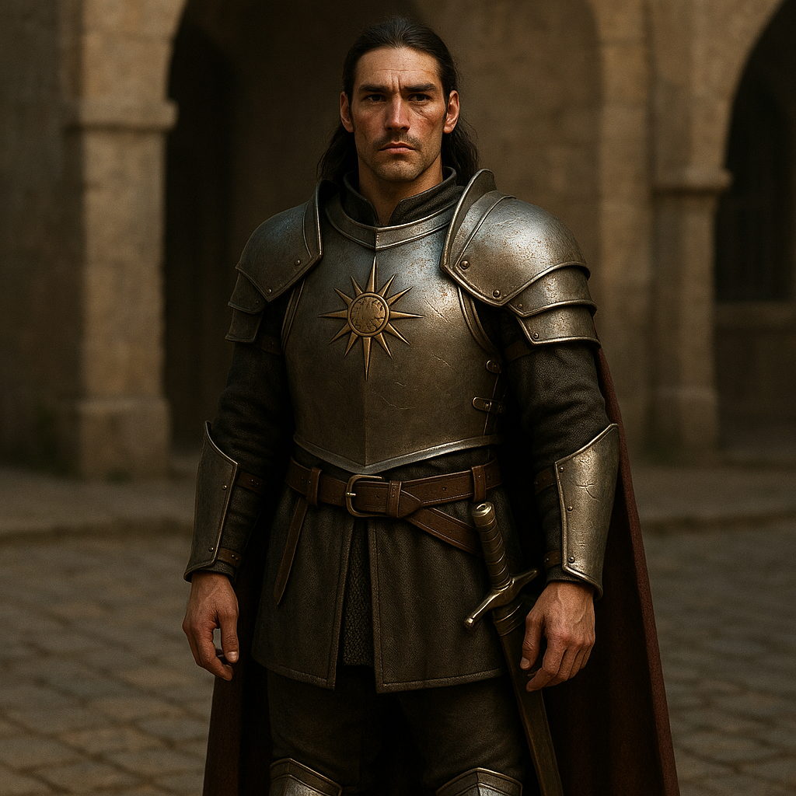{style="height:280px;width:100%;object-fit:cover;object-position:top;border-radius:2mm"} {align="right"}

<!-- prettier-ignore -->
Online version on [D&D Beyond](https://www.dndbeyond.com/monsters/5566979-imperial-guard) {class="credit" align="right"}

::: column-reset

::: stat-block {layout="wide" style="margin-top:5mm;"}

<!-- prettier-ignore -->
name="Imperial Guard" size="Medium" type="Humanoid" alignment="Lawful Neutral"
ac="16" hp="25 (4d8 + 4)" speed="30 ft." initiative="10" pb=2 cr="1/4"
perceptionBonus="5" languages="Common" gear="Half Plate, Crossbow, Longsword"

:::: abilityscores str=13 dex=13 con=12 int=10 wis=11 cha=10 ::::

:::: traits

**_Pack Tactics._** The guard has Advantage on an attack roll against a creature if at least one of the other Guards is
within 5 feet of the creature and doesn’t have the Incapacitated condition.

::::

:::: actions

**_Longsword._** _Melee Attack Roll:_ +4, reach 5 ft. _Hit:_ 7 (1d8 + 2) Slashing damage.

**_Light Crossbow._** _Ranged Attack Roll:_ +3, range 80/320 ft. _Hit:_ 7 (1d8 + 2) Piercing damage. _Mastery property:_
[Slow](https://www.dndbeyond.com/sources/dnd/br-2024/equipment#Slow).

::::

:::

::: wide

<!-- prettier-ignore -->
_Modified from the [Guard](https://www.dndbeyond.com/monsters/5195065-guard)._ {style="text-align:right;margin:0;font-size:.9em"}

:::

::: page {chapter="Appendix | Monsters"}

# Guard Captain Hurgkhan

Hurgkhan has served in San Soprigal’s garrison for ten years and led the town’s defense during the demon incursion. He
lost most of his guard then and now must rely on recruits he doesn’t always trust. He’s no Imperial zealot, but he
believes order matters above all. His duty is to protect San Soprigal—whatever it is, and whatever it takes. He never
leaves people in danger, even when it’s reckless.

**Tactics in Combat:**

- Charges the most dangerous foes first.
- Uses a battle cry when allies are frightened or badly hurt.
- Fights to the end.

::: column

<!-- prettier-ignore -->
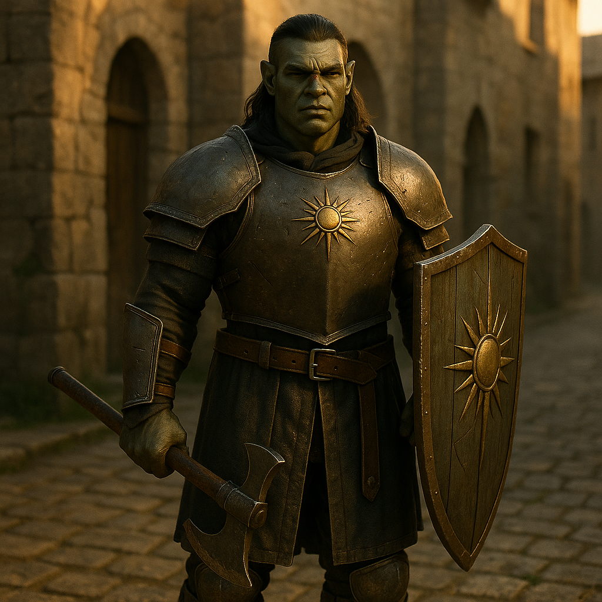{style="height:280px;width:100%;object-fit:cover;object-position:top;border-radius:2mm"} {align="right"}

<!-- prettier-ignore -->
Online version on [D&D Beyond](https://www.dndbeyond.com/monsters/5311650-hurgkhan) {class="credit" align="right"}

::: column-reset

::: stat-block {layout="wide" style="margin-top:5mm;"}

<!-- prettier-ignore -->
name="Guard Captain Hurgkhan" size="Medium" type="Humanoid" alignment="Lawful Neutral"
ac="18 (shield)" hp="52 (8d8 + 16)" speed="30 ft." initiative="14" pb=2 cr="3"
perceptionBonus="5" languages="Common, Orc" gear="Half Plate, Battleaxe, Shield"
skills="Athletics +6"

:::: abilityscores str=16 dex=12 con=16 int=12 wis=14 cha=12 saves="con" ::::

:::: traits

**_Relentless Endurance (1/day)._** If damage reduces Hurgkhan to 0 hit points, he drops to 1 hit point instead.

**_Savage Strike._** Hurgkhan deals an extra 5 (1d8) damage on a critical hit.

::::

:::: actions

**_Multiattack._** Hurgkhan makes two Battleaxe attacks. It can replace one attack with a use of Shield Bash.

**_Battleaxe._** _Melee Attack Roll:_ +7, reach 5 ft. _Hit:_ 12 (2d8 + 4) Slashing damage.

**_Shield Bash._** _Strength Saving Throw:_ DC 15, one creature within 5 feet that the gladiator can see. _Failure:_ 7
(1d6 + 3) Bludgeoning damage. If the target is a Medium or smaller creature, it has the Prone condition.

**_Battle Cry (1/day)._** All allies within 30 feet who can hear Hurgkhan gain 10 (3d4 + 2) Temporary Hit Points and are
immune to the Frightened condition for 1 minute.

::::

:::

::: wide

<!-- prettier-ignore -->
_Modified from the [Guard Captain](https://www.dndbeyond.com/monsters/5195064-guard-captain)._ {style="text-align:right;margin:0;font-size:.9em"}

:::

::: page {chapter="Appendix | Monsters"}

# Paladin of the Church of Light

Paladins are wardens of order and servants of an ideal. They live by a code, not by impulse.

They are not judges—they are executors of decrees. Every motion is measured, every command reflects the hierarchy. They
care less for “truth” than for conformity to the norm: law is their weapon; light, their instrument. They spare when
permitted; they destroy when prescribed.

Paladins remind us that the Empire endures not on mercy but on order. To them, doubt is more dangerous than heresy—doubt
leads to chaos.

::: column

<!-- prettier-ignore -->
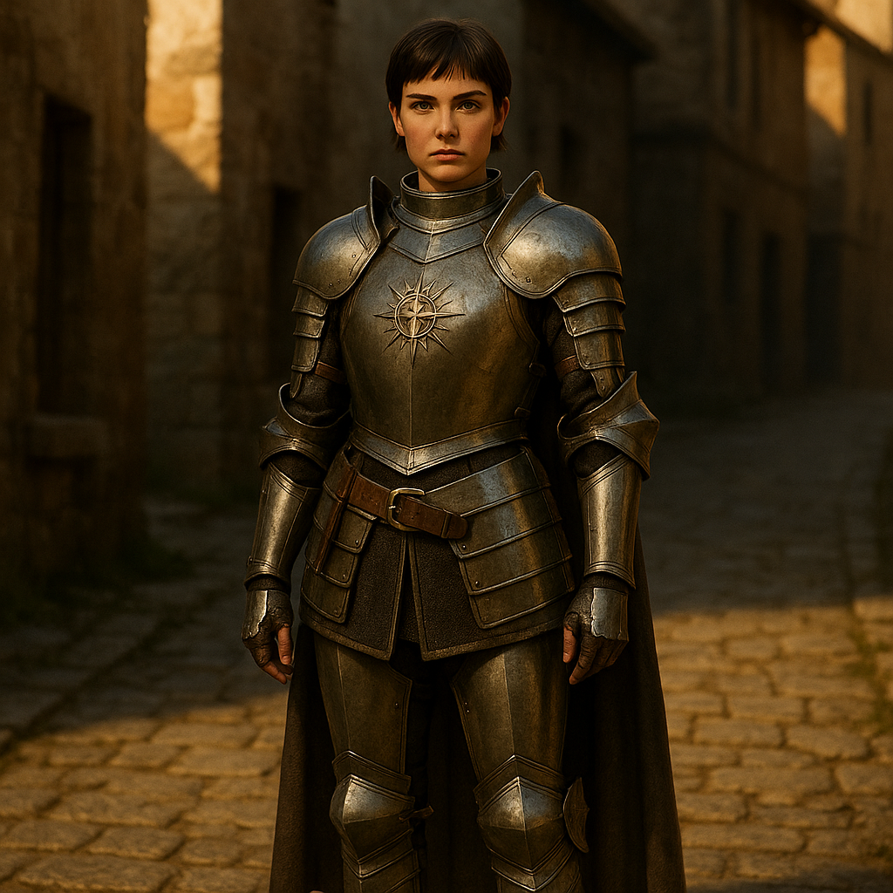{style="height:280px;width:100%;object-fit:cover;object-position:top;border-radius:2mm"} {align="right"}

<!-- prettier-ignore -->
Online version on [D&D Beyond](https://www.dndbeyond.com/monsters/5559472-paladin-of-the-church-of-light) {class="credit" align="right"}

::: column-reset

::: stat-block {layout="wide" style="margin-top:5mm;"}

<!-- prettier-ignore -->
name="Paladin of the Church of Light" size="Medium" type="Humanoid" alignment="Lawful Neutral"
ac="18" hp="65 (10d8 + 20)" speed="30 ft." initiative="13" pb=2 cr="3"
perceptionBonus="3" languages="Common and one of choice" gear="Plate, Greatsword"
skills="Intimidation +5" immunities="Frightened, Radiant damage"

:::: abilityscores str=16 dex=10 con=14 int=11 wis=11 cha=15 ::::

:::: traits

**_Oath of Auriel._** When the paladin witnesses the use of forbidden magic, they gain inspiration and may immediately
make one attack.

**Aura of Protection.** Each ally within 10 feet radius gains a +2 bonus to saving throws.

::::

:::: actions

**_Multiattack._** The paladin makes one Greatsword attack, and can cast one Spell.

**_Greatsword._** _Melee Attack Roll::_ +6, reach 5 ft. _Hit:_ 10 (2d6 + 3) slashing damage. _Mastery property:_
[Graze](https://www.dndbeyond.com/sources/dnd/br-2024/equipment#Graze).

**_Spellcasting._** The paladin casts one of the following spells, requiring no spell components and using Charisma as
the spellcasting ability (spell save DC 12, +2 to hit with spell attacks):

**At will:** [_Hunter’s Mark_](https://www.dndbeyond.com/spells/2619166-hunters-mark),
[_Sacred Flame_](https://www.dndbeyond.com/spells/2618967-sacred-flame),
[_Sanctuary_](https://www.dndbeyond.com/spells/2619003-sanctuary)

**2/day:** [_Cure Wounds_](https://www.dndbeyond.com/spells/2619079-cure-wounds) (3rd level)

**1/day:** _Cleansing Flame._ Each creature in a 15-foot-radius, 40-foot-high Cylinder centered on the paladin makes a
Dexterity saving throw, taking 18 (5d6) Radiant damage on a failed save or half as much damage on a successful one.

::::

:::: reactions

**_Parry._** _Trigger:_ The paladin is hit by a melee attack roll while holding a weapon. _Response:_ The paladin adds 2
to its AC against that attack, possibly causing it to miss.

::::

:::

::: page {chapter="Appendix | Monsters"}

# Black Meduza Bandit

Black Meduza is a **transregional smuggling syndicate** of smugglers and thieves’ crews operating primarily in the
Empire’s cities. They aren’t loud cutthroats but a carefully structured web of traffickers, mercenaries, and artifact
couriers. Their core specialties: “grey routes,” illicit logistics, extortion, bespoke thefts, and financial services
for criminals and the nobility.

**Tactics in Combat**

- Avoids melee if ranged options are available.
- If things go poorly, attempts to flee.
- Strikes from behind when possible (sneaky, opportunistic attacks).

::: column

<!-- prettier-ignore -->
{style="height:280px;width:100%;object-fit:cover;object-position:top;border-radius:2mm"} {align="right"}

<!-- prettier-ignore -->
Online version on [D&D Beyond](https://www.dndbeyond.com/monsters/5567107-black-meduza-bandit) {class="credit" align="right"}

::: column-reset

::: stat-block {layout="wide" style="margin-top:5mm;"}

<!-- prettier-ignore -->
name="Black Meduza Bandit" size="Medium" type="Humanoid" alignment="Chaotic Neutral"
ac="15" hp="35 (5d8 + 10)" speed="30 ft." initiative="16" pb=2 cr="1"
perceptionBonus="6" languages="Common, Thieves’ Cant" gear="Smoke Grenade (3), Dagger (6)"
skills="Acrobatics +5, Stealth +7"

:::: abilityscores str=10 dex=16 con=12 int=14 wis=11 cha=10 saves="dex" ::::

:::: traits

**_Evasion._** If the Black Meduza bandit is subjected to an effect that allows it to make a Dexterity saving throw to
take only half damage, the Black Meduza bandit instead takes no damage if it succeeds on the save and only half damage
if it fails. It can’t use this trait if it has the Incapacitated condition.

::::

:::: actions

**_Multiattack._** The Black Meduza bandit makes two Dagger attacks.

**_Dagger._** _Melee or Ranged Attack Roll:_ +6, reach 5 ft. or range 20/60 ft. _Hit:_ 8 (2d4 + 3) Piercing damage plus
7 (2d6) Poison damage. _Mastery property:_ [Nick](https://www.dndbeyond.com/sources/dnd/br-2024/equipment#Nick).

**_Smoke Grenade._** The Black Meduza bandit throws a grenade to a point within 60 ft. _Effect:_ the grenade explodes,
creating a particular effect in a 20-foot-radius Sphere. The area of the Sphere is Heavily Obscured by smoke for 1
minute. A strong wind (such as the Gust of Wind spell) disperses the smoke.

::::

:::: bonus-actions

**_Cunning Action._** The Black Meduza bandit takes the **Dash**, **Disengage**, or **Hide** action.

::::

:::

::: wide

<!-- prettier-ignore -->
_Modified from the [Bandit](https://www.dndbeyond.com/monsters/5194915-bandit)._ {style="text-align:right;margin:0;font-size:.9em"}

:::

::: page {chapter="Appendix | States and Organizations"}

# Appendix: States and Organizations

## States

Brief dossiers on key powers—their governance, priorities, and limits of influence.

### The Great Empire

Only myths and ruins remain of the once-mighty realm now called the **Great Empire**. Nothing is known of its nature,
its rulers, or why it fell; in the memory of nations it is something unreachable, almost mythic. All peoples date their
years from this collapse: the calendar counts **AF—After the Fall**.

### The Holy Empire

The **Holy Empire** is a major human power that unites several principalities. It maintains a common market, a single
currency, standardized measures, and imperial law. An elected **Emperor** stands at its head as arbiter and guarantor of
unity. In matters of faith, magic, and state security, the **Church of Light** has the final say.

### The United States of Magic Art

**The United States of Magic Art** (a federation of mages)—a union of states on a new continent founded by gifted
settlers. The right to freely practice magic is enshrined in the **Second Amendment** to the **USMA Constitution**.

### Kaltenwald

**Kaltenwald** (a dwarven-and-gnomish kingdom) is a closed, under-mountain state ruled by the
**King-Under-the-Mountain** under the Stone Laws. The outside world knows only scraps: the names of delvings, the
occasional diplomatic mission to the surface, and legends of mechanisms and bottomless vaults.

## Organizations

Supranational and covert groups with their own interests and methods.

### Church of Light

The **Church of Light** (cult of angels) is the only sanctioned religion. Only the upper hierarchy communes directly
with angels; everyone else blindly believes that angels exist and guide them.

The Church combines spiritual and secular power and also serves as an inquisition. Heresy, necromancy, and demonology
are punished by death or exile.

After the demon incursion, the Empire lives in fear and tightens control over magic and faith. Any magic outside the
Church’s oversight is treated as a threat.

The Ten Commandments of the Church of Light:

1. Thou shalt honor the Light and the Angels; for by them is Truth made manifest.
2. Thou shalt covet no power save that which the Angels bestow and the Church doth bless.
3. Thou shalt not defile thy soul with the sorceries of death or of darkness.
4. Thou shalt not seek knowledge beyond the Light; for the darkness enticeth the mind.
5. Thou shalt not betray thy neighbor with lying or with guile.
6. Thou shalt not utter doubt nor blasphemy; for in the tongue lieth the fall.
7. Thou shalt not yield thy body, soul, or mind to vice, idleness, or pride.
8. Thou shalt not pass over evil in silence; for silence is complicity.
9. Thou shalt not shed blood save at an Angel’s bidding; for life is holy.
10. Thou shalt keep thy faith pure and unwavering, and the Angels shall come in thine hour of need.

### Spider Cult

The secret **necromancers’ cult** within one of the states in USMA. It is said they study ways to attain eternal life
without becoming undead.

### Black Meduza

The **Black Meduza** is a transregional network of smugglers and thieves’ guilds. Specialties: “gray routes,” illicit
logistics, extortion, bespoke thefts, and financial services for the underworld and the nobility alike.

::: page {chapter="Appendix | Pantheon"}

# Appendix: Pantheon

Since there are no gods in this world, angels fulfill their functions. Cleric domains remain in use, with each overseen
by one or more angels.

A character may honor any angel—or several. This choice grants no additional mechanical benefits to any class. For
druids and paladins, it may be part of their concept. For clerics, mechanics are determined by the chosen domain, not by
the specific angel. If the domain you want isn’t listed, choose the closest angel by aspect from the table.

::: wide

#### Pantheon

| Angel        | Description                            | Primary Followers                         | Cleric Domain(s)  |
| :----------- | :------------------------------------- | :---------------------------------------- | :---------------- |
| **Azarael**  | Keeper of magic and secrets            | Mages, archivists, archaeologists         | Arcana, Knowledge |
| **Auriel**   | Embodiment of law and justice          | Judges, knights, guards                   | Order             |
| **Gabriel**  | Embodiment of war and might            | Warriors, soldiers, mercenaries           | War               |
| **Eldarael** | Patron of life and the harvest         | Farmers, healers, druids, midwives        | Life              |
| **Lunoriel** | Warden of the wilds and the life-cycle | Foresters, shamans, rangers               | Nature            |
| **Selariel** | Guide of light and the night roads     | Pilgrims, guides, bards                   | Light, Twilight   |
| **Mavriel**  | Patron of craft and creation           | Smiths, engineers, artificers             | Forge, Arcana     |
| **Tanariel** | Warden of repose and death             | Keepers of necropolises, funerary masters | Death, Grave      |
| **Samael**   | Embodiment of calm and balance         | Sages, diplomats, monks                   | Peace             |
| **Lokiel**   | Trickster of shadows and masks         | Thieves, spies, con artists, adventurers  | Trickery          |
| **Torviel**  | Embodiment of the destructive tempest  | Sailors, devotees of destruction          | Tempest           |

:::

<!-- prettier-ignore -->
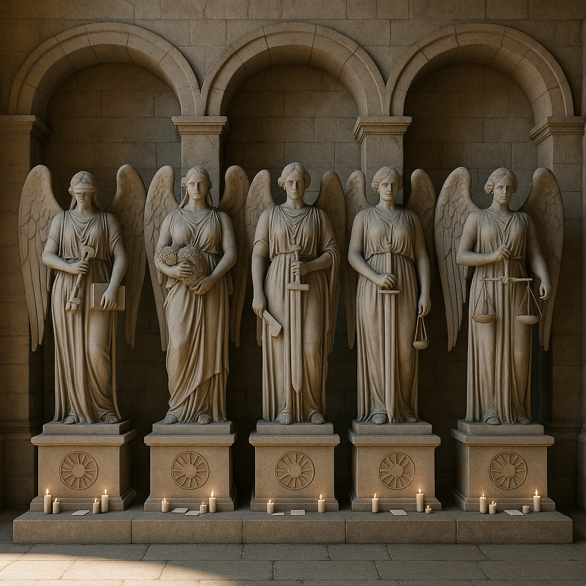{class="mask mask--background-bottom-third-01" style="object-position:center 170%; object-fit: contain;"}

::: page {layout="left" chapter="Appendix | Month Names"}

# Appendix: Month Names

Month names and their translations from the ancient tongue into Common.

1. Sicthor – The Hewing/Chopping One
2. Narvail – Cruel Fire
3. Bethalasse – Birch-Month
4. Lothviel – Blooming
5. Syrvelis – Herb-Month
6. Caranthir – Red
7. Lindalas – Linden-Month
8. Serpeon – Harvest-Month
9. Brethilien – Heather-Month
10. Maltheris – Golden
11. Lassandir – Falling Leaf
12. Losserion – Snow-Month

<!-- prettier-ignore -->
{class="mask mask--background-right-half" style="object-position: 200px center;"}

::: page {chapter="Appendix | Books"}

# Appendix: Books

::: wide

The books are lore and atmospheric excerpts from the town’s volumes—chronicles, treatises, tall tales. Nothing critical
to the investigation; they’re optional material to flesh out the world.

:::

::: panel {style="height:25%"}

:::: title

## “On Forbidden Doctrines and Heresies”

Imperial Edition (censored)

::::

 {class="cover"}

:::

Any magic not sanctified by law and not devoted to the service of the Empire and the Angels is heresy. A mage who dares
to work without leave is subject to purification.

“Particularly dangerous are practices that warp the soul: necromancy, summoning, augury upon the body. These deeds are
not only blasphemous but perilous to the world, for they open the way to outside influence.”

_A note in ink at the margin: “These lines ought to be read aloud in Council. Especially in light of the recent rumors
about the magister.”_

::: panel {style="height:25%"}

:::: title

## “Days in Hell”

Draft by German Elkvin

::::

 {class="cover"}

:::

“It began suddenly. One witness said the sky ‘split.’ I saw that light too—it was a rift, not lightning. From it burst
creatures—true demons—with eyes of fire and batlike wings.”

“They struck at the main gate. Hurgkhan held the defense as best he could, but it could all have ended…”

“...and the dead rose. They did not attack. Who called them? Why did they protect us? I don’t know. But I saw them fight
for us until the portal began to contract.”

“...I tried to record the landmarks of the place where the rift first opened, but…” _(the ink is smeared; the entry
breaks off, as if the hand faltered or the page was drenched)._

::: page

::: panel {style="height:25%"}

:::: title

## “Chronicles of San Soprigal”

Volume I

::::

 {class="cover"}

:::

The town of San Soprigal was founded in the second century during the war for the Dragonwing Peninsula. Its name comes
from a corruption of the knight Sorpigal’s name—the first to raise a tower here, which allowed the besiegers to blockade
the free city of Karthal.

A statue of Sir Sorpigal still stands in the town center, though over time it has lost its helmet and part of its sword.
They say the knight himself lies buried beneath the stone plinth, and that the heart of a lion rests in his sarcophagus.

During the siege of Karthal, the town played a key role in supplying the besieging forces. Using his knowledge of the
shoreline, Sorpigal organized a secret transfer point in one of the coves.

Cargo was delivered by night, under cover of fog, and stored in chambers hollowed from the rock. From there—so the
chronicle says—a hidden passage led straight into the town’s lower warehouses, known only to the chosen few.

The cove’s location is not recorded—perhaps intentionally. Some believe the store still exists and that artifacts of the
old war remain within. Others say it was through this passage that Sorpigal once tried to flee the town, never to
return.

::: panel {style="height:25%"}

:::: title

## “On Certain Properties of Souls and Their Tolerances”

Anonymous Treatise

::::

 {class="cover"}

:::

The soul is not only a spark but an anchor. It is bound to the world, for it is itself a part of the Seal that holds the
world’s shape. When a soul departs, its path must be closed: either a return to the fabric of the world or a slow
dissolution. Yet sometimes a soul refuses to go—especially when death was violent or unjust.

Necromancers do not create a soul—they delay it, breaking the natural order. The vessel that holds a soul must be either
living or sacred. In all other cases distortion occurs.

What follows is a description of several methods by which a soul **must not, under any circumstances,** be kept in this
world after death.

::: page {chapter="Appendix | Maps for Players"}

# Appendix: Maps for Players

::: wide

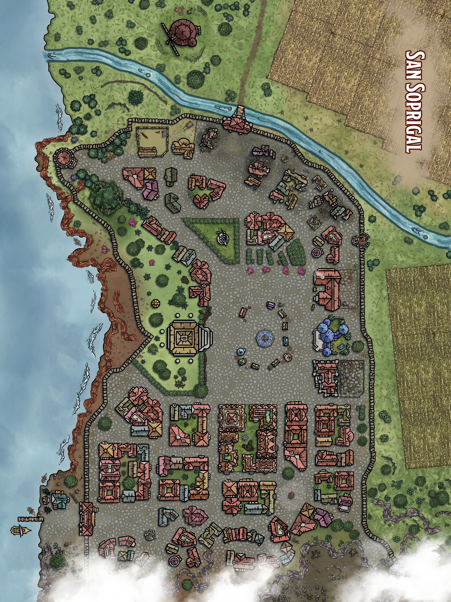{class="framed-map"}

_Unlabeled player map of San Soprigal._

The full map archive is available here:
[Download from Google Drive](https://drive.google.com/drive/folders/1kkLD4GegIr0Q5sSph8yz1zEEGgtrtRQs).

:::

::: page {chapter="Appendix | Music and Generators"}

# Appendix: Music and Generators

## Random Names

#### Male Names

| d8  | Name      |
| :-: | :-------- |
|  1  | Matthias  |
|  2  | Oswald    |
|  3  | Joseph    |
|  4  | Max       |
|  5  | Wilhelm   |
|  6  | Emilio    |
|  7  | Alejandro |
|  8  | Ilidir    |

#### Female Names

| d8  | Name      |
| :-: | :-------- |
|  1  | Selma     |
|  2  | Lucia     |
|  3  | Antonia   |
|  4  | Albertina |
|  5  | Emily     |
|  6  | Dalia     |
|  7  | Kristen   |
|  8  | Joa       |

#### Dwarven Names

| d4  | Name   |
| :-: | :----- |
|  1  | G’Hirk |
|  2  | G’Holm |
|  3  | G’Far  |
|  4  | G’Fast |

#### Elven Names

| d4  | Name      |
| :-: | :-------- |
|  1  | Irolan    |
|  2  | Alunalor  |
|  3  | Arianissa |
|  4  | Faelianna |

::: column

## Music

Town:

- [YouTube: DnD Calm Fantasy Music for Adventure and Exploration](https://www.youtube.com/watch?v=sHA_4wfQhE8)
- [YouTube: Heroes of Might and Magic IV — The Most Relaxing Music & Natural Ambience](https://www.youtube.com/watch?v=mMU-o4hKDyo)
- [YouTube: Heroes of Might and Magic — The Most Relaxing Ambient Music](https://www.youtube.com/watch?v=GX9J9AvoDYI)

Catacombs:

- [YouTube: Tense Path | D&D/TTRPG Music | 1 Hour](https://www.youtube.com/watch?v=fv_7EurNAss)
- [YouTube: Ambient Horror Music — Red Space](https://www.youtube.com/watch?v=AlDivIaiuMU)
- [YouTube: HoMM III Soundtrack — Dungeon](https://www.youtube.com/watch?v=zFitV1c4wR0)
- [YouTube: Epic Fight | D&D/TTRPG Battle/Combat/Fight Music | 1 Hour](https://www.youtube.com/watch?v=BWoGeXrNs_g)

## Generators

- [Traders & Goods (location Village)](https://www.rolegenerator.com/en/module/shop-generator) (Role Generator)
- [Names](https://www.kassoon.com/dnd/name-generator/) (Kasoon)
- [Dungeon Loot](https://www.kassoon.com/dnd/2024/treasure-generator/) (Kasoon)

::: page {type="back-cover"}

::: cover {style="background-image:url('/content/the-missing-merchant/assets/covers/back-cover.png')"}

# Thank You

:::

Thank you for choosing this adventure and spending time in San Soprigal.

If you have ideas, suggestions, notes, or simply want to share how the adventure went at your table, I’d love to hear
from you. Write to <s.kupletsky@gmail.com>.

Special thanks to my players—for their curiosity, sharp questions, and inventive choices that helped improve this
adventure and make it feel more alive.

May your dice always roll in your favor!

::: wide {style="text-align: center; margin-top: 5mm;"}

{class="diamond-line"}

[www.patreon.com/c/zavoloklom](https://www.patreon.com/c/zavoloklom)

:::
