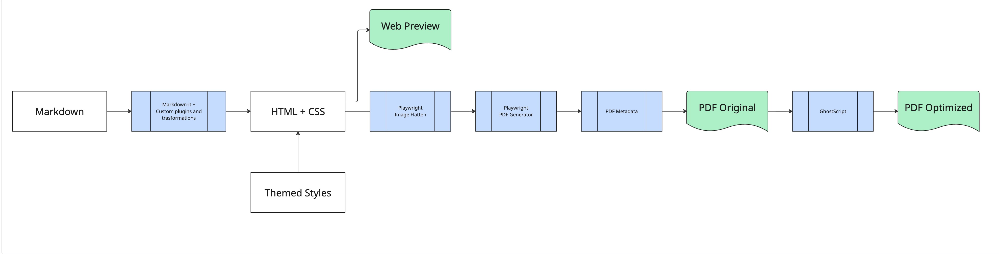

# PDF Generation Notes

There are several known problems with pdf-generation.

## CSS Filter

- Using css-filter makes text unselectable, workaround - create different layer with shadow like in
    - stat-block
- Elements that are not fixed yet:
    - banner
    - box

TODO: Possible way to fix - for each container add 
 with opportunity to add shadow

## Mask in Preview/Ghostscript

For some reason after optimizing PDF with Ghostscript some images with masks started displayed incorrectly in Preview in
macOS, while it's still fine when using Google Chrome to open this PDF.

Beside that in Preview in macOS there could be problems with slice-borders.

To address both issues - images with masks and these types of borders are flatten before generating PDF in first place.

It obviously takes time and can be switched off by env `OPTIMIZE_FLATTEN_IMAGES`

## Flow

